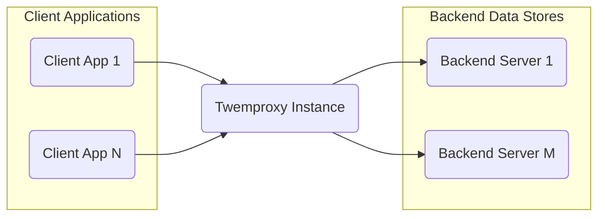
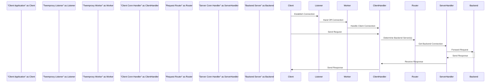

# Project Design Document: Twemproxy

**Version:** 1.1
**Date:** October 26, 2023
**Author:** AI Cloud & Security Architect

## 1. Introduction

This document provides a detailed design overview of Twemproxy (also known as nutcracker), a fast and lightweight proxy for memcached and redis. This document aims to provide a comprehensive understanding of its architecture, components, and data flow, which will serve as the foundation for subsequent threat modeling activities. This version includes more detailed explanations and refinements based on initial review.

## 2. Goals

The primary goals of this design document are to:

*   Clearly and comprehensively describe the architecture and components of Twemproxy, including their specific responsibilities.
*   Illustrate the data flow within the system with a focus on the sequence of operations.
*   Identify key functionalities and interactions between components, highlighting potential points of interest for security analysis.
*   Provide a solid basis for understanding potential security vulnerabilities, attack vectors, and areas requiring further scrutiny.
*   Serve as a reliable reference point for future development, maintenance, and security assessments.

## 3. Overview

Twemproxy acts as an intermediary layer positioned between client applications and backend memcached or redis servers. It efficiently multiplexes and distributes client requests across a pool of backend servers, offering several key advantages:

*   **Connection Pooling:**  Maintains persistent connections to backend servers, significantly reducing the latency and resource consumption associated with establishing new connections for each client request.
*   **Request Routing and Distribution:**  Intelligently directs incoming client requests to the appropriate backend server based on configurable distribution strategies, such as consistent hashing, modulo hashing, or random distribution.
*   **Load Balancing:**  Distributes the workload evenly across the available backend servers, enhancing overall performance, scalability, and resilience.
*   **Protocol Handling:**  Understands and correctly interprets the communication protocols for both memcached and redis, ensuring seamless interaction between clients and backend servers.

The following diagram provides a high-level overview of the Twemproxy architecture and its position within a typical deployment:



## 4. Components

Twemproxy is composed of several interconnected components, each with a specific role in processing client requests:

*   **Main Process:** The parent process responsible for the overall lifecycle management of Twemproxy. Its key responsibilities include:
    *   Initialization: Setting up the environment, parsing command-line arguments, and loading the configuration.
    *   Configuration Management:  Monitoring and potentially reloading the configuration file upon changes.
    *   Signal Handling:  Responding to system signals (e.g., SIGTERM, SIGHUP) for graceful shutdown or configuration reload.
    *   Worker Process Management:  Spawning and managing worker processes to handle client connections.
*   **Worker Processes:**  These are the core processing units within Twemproxy. Each worker process operates independently and is responsible for:
    *   Accepting Client Connections:  Handling new connections established by clients.
    *   Processing Client Requests:  Receiving, parsing, and routing client requests.
    *   Managing Backend Connections:  Interacting with the pool of connections to backend servers.
    *   Sending Responses:  Returning processed responses to the originating clients.
*   **Listener:**  A dedicated component within each worker process that:
    *   Listens on Configured Ports:  Binds to the specified IP addresses and ports to accept incoming client connections.
    *   Accepts New Connections:  Handles the initial handshake for new client connections.
    *   Assigns Connections to Handlers:  Passes accepted connections to the client connection handler for further processing.
*   **Client Connection Handler:**  Manages the lifecycle of individual client connections within a worker process:
    *   Receives Client Requests:  Reads data sent by the client.
    *   Parses Protocol:  Interprets the incoming data according to the memcached or redis protocol.
    *   Manages Request Queue:  Potentially queues requests if the backend is temporarily unavailable or overloaded.
    *   Sends Responses to Client:  Transmits the processed response back to the connected client.
*   **Server Connection Handler:**  Responsible for managing connections to the backend memcached or redis servers:
    *   Maintains Connection Pool:  Keeps a pool of persistent connections to each configured backend server.
    *   Establishes New Connections:  Creates new connections to backend servers when needed.
    *   Handles Connection Errors:  Detects and manages connection failures to backend servers, potentially attempting reconnection.
    *   Selects Backend Connection:  Chooses an appropriate connection from the pool for forwarding a request.
*   **Request Router:**  The decision-making component that determines the destination backend server(s) for a given client request:
    *   Implements Distribution Algorithms:  Utilizes configured algorithms like consistent hashing, modulo, or random distribution.
    *   Maps Keys to Servers:  Calculates the target server based on the request key and the chosen algorithm.
    *   Handles Multi-Key Operations:  Determines the set of backend servers involved in multi-key requests.
*   **Protocol Parser (Memcached/Redis):**  Responsible for understanding the syntax and semantics of the client requests:
    *   Parses Request Commands:  Identifies the specific operation being requested (e.g., `get`, `set`, `incr`).
    *   Extracts Keys and Values:  Retrieves the relevant data from the request payload.
    *   Validates Request Format:  Ensures the request conforms to the protocol specification.
*   **Response Aggregator:**  Used in scenarios where a single client request might involve multiple backend servers (e.g., for certain multi-key operations or when using scatter-gather approaches):
    *   Collects Responses:  Gathers responses from all relevant backend servers.
    *   Merges or Combines Responses:  Processes the individual responses into a single coherent response for the client.
*   **Configuration Manager:**  Handles the loading and management of Twemproxy's configuration:
    *   Loads Configuration File:  Reads the configuration from a YAML file.
    *   Parses Configuration Directives:  Interprets the various configuration options (e.g., server pools, ports, distribution).
    *   Provides Configuration Data:  Makes the configuration data available to other components.
*   **Statistics Collector:**  Gathers and exposes runtime metrics about Twemproxy's operation:
    *   Tracks Connection Counts:  Monitors the number of active client and server connections.
    *   Measures Request Rates:  Records the rate at which requests are being processed.
    *   Collects Error Statistics:  Tracks errors encountered during request processing or backend communication.
    *   Exposes Metrics:  Provides an interface (e.g., via a stats port) to access the collected metrics.

## 5. Data Flow

The journey of a client request through Twemproxy involves a series of steps and interactions between its components:

1. **Client Connection Establishment:** A client application initiates a TCP connection to Twemproxy on its configured listening port.
2. **Listener Acceptance:** The Listener component in a worker process accepts the incoming connection.
3. **Connection Handover:** The Listener hands off the newly accepted connection to the Client Connection Handler within the same worker process.
4. **Request Reception:** The Client Connection Handler receives the request data sent by the client.
5. **Protocol Parsing:** The Protocol Parser analyzes the received data to understand the requested operation and extract relevant information (e.g., command, key).
6. **Backend Server Selection:** The Request Router, based on the extracted key and the configured distribution algorithm, determines the target backend server(s) for the request.
7. **Backend Connection Retrieval:** The Server Connection Handler retrieves an available, healthy connection to the selected backend server from its connection pool. If no suitable connection exists, a new connection is established.
8. **Request Forwarding:** The Client Connection Handler forwards the client's request to the chosen backend server via the established connection.
9. **Response Reception (Backend):** The Server Connection Handler receives the response from the backend server.
10. **Response Aggregation (If Necessary):** If the request involved multiple backend servers, the Response Aggregator collects and potentially combines the individual responses.
11. **Response Forwarding (Client):** The Client Connection Handler sends the processed response back to the originating client application.
12. **Connection Maintenance:** The connections between the client and Twemproxy, and between Twemproxy and the backend server, are typically kept alive for subsequent requests, leveraging connection pooling.

The following sequence diagram illustrates this data flow in more detail:



## 6. Deployment Scenarios

Twemproxy's flexibility allows for deployment in various architectures:

*   **Sharding (Data Partitioning):**  Distributing data across multiple backend servers (shards). Twemproxy uses consistent hashing or other algorithms to route requests to the correct shard based on the key. This improves scalability by allowing horizontal scaling of the data tier.

    ```mermaid
    graph LR
        C("Client") --> TP("Twemproxy");
        TP --> BS1("Backend Server 1 (Shard A)");
        TP --> BS2("Backend Server 2 (Shard B)");
        TP --> BSN("Backend Server N (Shard ...)");
        subgraph "Sharded Backend Cluster"
            BS1
            BS2
            BSN
        end
    ```

*   **Replication (High Availability):** While Twemproxy doesn't inherently manage replication, it can be deployed in front of replicated backend clusters. It can be configured to direct writes to primary nodes and reads to replicas, enhancing read scalability and providing redundancy.

    ```mermaid
    graph LR
        C("Client") --> TP("Twemproxy");
        TP --> BP("Backend Primary Node");
        subgraph "Replicated Backend Set"
            BP
            BR1("Backend Replica 1")
            BR2("Backend Replica 2")
        end
        BP -- "Data Replication" --> BR1
        BP -- "Data Replication" --> BR2
    ```

*   **Standalone Proxy with Connection Pooling:**  Acting as a single entry point to a cluster of identical backend servers, primarily providing connection pooling to reduce connection overhead from client applications. This simplifies client configuration and improves efficiency.

    ```mermaid
    graph LR
        C("Client") --> TP("Twemproxy");
        TP --> BS1("Backend Server 1");
        TP --> BS2("Backend Server 2");
        subgraph "Backend Server Pool"
            BS1
            BS2
        end
    ```

## 7. Security Considerations (Detailed)

This section expands on the initial security considerations, providing more specific examples and potential attack vectors.

*   **Configuration Security:** The `nutcracker.yml` configuration file is critical and contains sensitive information such as backend server addresses, ports, and potentially authentication details for backend servers (if configured within Twemproxy).
    *   **Threat:** Unauthorized access to this file could allow an attacker to gain knowledge of the backend infrastructure, potentially leading to direct attacks on those servers.
    *   **Mitigation:** Implement strict access control on the configuration file, ensuring only authorized users and processes can read it. Consider encrypting sensitive information within the configuration.
*   **Lack of Native Client Authentication/Authorization:** Twemproxy itself does not provide built-in mechanisms to authenticate client connections or authorize their requests. It relies on the security measures implemented by the backend servers and network-level controls.
    *   **Threat:**  Any client capable of establishing a network connection to Twemproxy can send requests, potentially overloading the backend or accessing sensitive data if the backend doesn't have sufficient authorization controls.
    *   **Mitigation:** Implement network segmentation and firewall rules to restrict access to Twemproxy. Rely on strong authentication and authorization mechanisms within the backend memcached or redis servers. Consider using a separate authentication proxy in front of Twemproxy.
*   **Denial of Service (DoS) Attacks:** Twemproxy is vulnerable to various DoS attacks:
    *   **Connection Exhaustion:** Malicious clients could open a large number of connections, exhausting Twemproxy's resources (file descriptors, memory) and preventing legitimate clients from connecting.
    *   **Request Flooding:**  Sending a high volume of valid or invalid requests can overwhelm Twemproxy's processing capacity and potentially the backend servers.
    *   **Mitigation:** Implement connection limits, request rate limiting (if possible through external mechanisms), and deploy Twemproxy behind load balancers with DoS protection capabilities.
*   **Protocol Vulnerabilities:** While Twemproxy aims to be protocol-agnostic, vulnerabilities in the underlying memcached or redis protocols could be exploited through Twemproxy.
    *   **Threat:** An attacker could craft malicious requests that exploit known vulnerabilities in the backend protocols, potentially leading to data breaches or service disruption.
    *   **Mitigation:** Keep the backend memcached and redis servers updated with the latest security patches. Implement input validation and sanitization where possible (though this is primarily the responsibility of the backend).
*   **Man-in-the-Middle (MitM) Attacks:** Communication between clients and Twemproxy, and between Twemproxy and backend servers, is typically unencrypted.
    *   **Threat:** An attacker intercepting network traffic could eavesdrop on sensitive data being transmitted or even modify requests and responses.
    *   **Mitigation:**  Utilize network-level encryption mechanisms like VPNs or TLS/SSL tunnels to secure communication channels. Future versions of Twemproxy could benefit from native TLS support.
*   **Code Vulnerabilities:**  Bugs or security flaws in the Twemproxy codebase itself could be exploited by attackers.
    *   **Threat:**  Exploiting code vulnerabilities could lead to arbitrary code execution, denial of service, or information disclosure.
    *   **Mitigation:**  Regularly update Twemproxy to the latest stable version with security patches. Conduct security audits and penetration testing to identify potential vulnerabilities.
*   **Logging and Monitoring Gaps:** Insufficient logging and monitoring can hinder the detection and response to security incidents.
    *   **Threat:**  Security breaches or attacks might go unnoticed, delaying incident response and potentially increasing the damage.
    *   **Mitigation:** Configure comprehensive logging to capture relevant events (e.g., connection attempts, errors, request details). Implement monitoring systems to track key metrics and alert on suspicious activity.

## 8. Technologies Used

*   **Core Programming Language:** C
*   **Supported Protocols:** Memcached (text and binary), Redis (RESP)
*   **Networking:** TCP
*   **Configuration Format:** YAML
*   **Build System:** Autotools

## 9. Future Considerations

*   **Native TLS/SSL Support:** Implementing native support for TLS/SSL encryption for both client-facing and backend connections would significantly enhance the security posture.
*   **Pluggable Authentication Modules:**  Allowing integration with external authentication systems or the development of custom authentication modules would address the current lack of client authentication.
*   **Advanced Rate Limiting Capabilities:**  Implementing more sophisticated rate limiting mechanisms within Twemproxy itself could provide better protection against DoS attacks.
*   **Enhanced Monitoring and Metrics Export:**  Providing more granular metrics and standardized export formats (e.g., Prometheus) would improve observability and integration with monitoring infrastructure.
*   **Support for Additional Protocols:** Expanding support to other NoSQL databases or caching technologies could broaden Twemproxy's applicability.

This document provides a detailed and improved design overview of Twemproxy, offering a solid foundation for understanding its architecture and identifying potential security threats during the threat modeling process. The enhanced details and expanded security considerations aim to provide a more comprehensive understanding for security analysis.