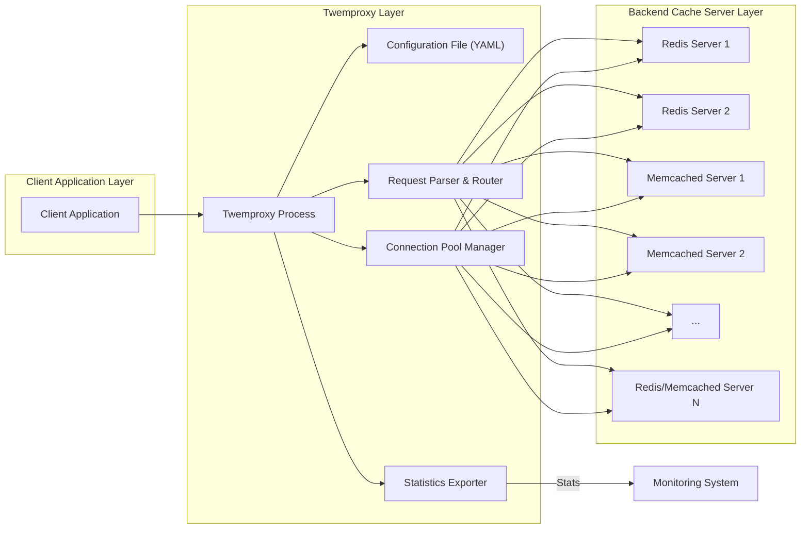
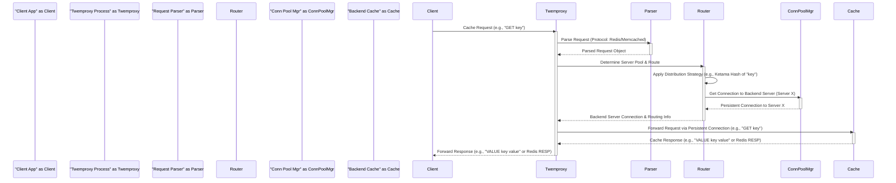

# Project Design Document: Twemproxy (Nutcracker) - Version 1.1

**Project Repository:** [https://github.com/twitter/twemproxy](https://github.com/twitter/twemproxy)

**Document Version:** 1.1
**Date:** 2023-10-27
**Author:** AI Expert

## 1. Introduction

This document provides an enhanced and detailed design overview of Twemproxy (also known as Nutcracker), a fast and lightweight proxy for memcached and redis protocols. This document is specifically designed to be used as a foundation for threat modeling and security analysis of systems incorporating Twemproxy. It comprehensively outlines the architecture, components, data flow, operational considerations, and key security aspects of Twemproxy to facilitate a thorough security assessment.

## 2. Project Overview

Twemproxy acts as a crucial intermediary layer, efficiently managing and routing requests between client applications and backend cache servers (memcached or redis). Its single-threaded, event-driven architecture is optimized for performance and resource efficiency. Key features include:

*   **Dual Protocol Proxying:** Seamlessly proxies both memcached (text and binary) and redis (RESP) protocols, presenting a unified interface to clients regardless of the backend cache type.
*   **Persistent Connection Pooling:** Maintains pools of persistent connections to backend servers, drastically reducing connection establishment overhead and improving request latency and throughput.
*   **Intelligent Request Sharding:** Distributes client requests across a pool of backend servers using configurable sharding strategies, including consistent hashing (Ketama), modulo, and random distribution, ensuring scalability and even load distribution.
*   **Flexible Server Pool Management:** Allows administrators to define and manage multiple independent pools of backend servers, enabling logical grouping and isolation of cache instances for different applications or purposes.
*   **High Performance & Low Latency:** Engineered for minimal latency and high throughput due to its non-blocking, event-driven nature and efficient C implementation.
*   **YAML-Based Configuration:** Configuration is entirely driven by a human-readable YAML file, providing flexibility and ease of deployment, customization, and management.
*   **Runtime Statistics & Monitoring:** Exposes comprehensive runtime statistics, including connection counts, request rates, latency metrics, and error counts, facilitating performance monitoring and operational insights.

## 3. System Architecture

Twemproxy sits as a transparent proxy layer between client applications and the backend cache infrastructure. The following diagram illustrates the system's architecture:

**Components (Detailed):**

*   **Client Application:** Any software application requiring access to a cache system. It communicates with Twemproxy using either the memcached or redis protocol as if it were directly interacting with a backend cache server.
*   **Twemproxy Process (Core Proxy):** The central component, responsible for all proxying logic. It encompasses several sub-components:
    *   **Configuration File (YAML):**  A YAML file (`nutcracker.yaml`) that dictates Twemproxy's behavior. It defines server pools, listen addresses, distribution strategies, timeouts, logging, and statistics export settings. This file is loaded at startup and can be reloaded with a signal (SIGHUP).
    *   **Connection Pool Manager:** Manages persistent connections to backend cache servers. It establishes and maintains a pool of connections for each server in each defined pool, reusing connections for subsequent requests to minimize connection overhead. It also handles connection health checks and reconnection logic.
    *   **Request Parser & Router:**  Parses incoming client requests based on the configured protocol (memcached or redis). It then determines the target server pool and applies the configured distribution strategy (e.g., Ketama hashing) to route the request to a specific backend server within the pool.
    *   **Statistics Exporter:** Collects and aggregates runtime statistics such as connection counts, request rates, latency distributions, and error metrics. It can export these statistics in various formats (e.g., JSON) via HTTP for monitoring and analysis by external systems like Prometheus or Grafana.
*   **Backend Cache Servers (Redis/Memcached):**  The actual data storage layer. These are independent instances of Redis or Memcached servers that store and serve cached data. Twemproxy acts as a proxy in front of these servers, abstracting the backend infrastructure from client applications.
*   **Monitoring System (Optional):** An external system (e.g., Prometheus, Grafana, Graphite) that can collect and visualize statistics exported by Twemproxy, providing operational insights and alerting capabilities.

## 4. Data Flow (Detailed)

The following sequence diagram illustrates a more detailed data flow for a typical cache request through Twemproxy, highlighting internal component interactions:

**Detailed Data Flow Steps (Expanded):**

1.  **Client Request Initiation:** A client application initiates a cache operation (e.g., `GET key`, `SET key value`) and sends the request to Twemproxy's listening address and port.
2.  **Request Reception and Protocol Parsing:** Twemproxy receives the incoming request. The "Request Parser" component analyzes the request stream to identify the protocol (memcached or redis) and parse the request into a structured object representing the operation and its arguments (e.g., command, key, value).
3.  **Server Pool and Backend Server Determination:** The "Router" component receives the parsed request. It determines the appropriate backend server pool based on the request type and configuration rules (if any). Then, it applies the configured distribution strategy (e.g., consistent hashing) to select a specific backend server within the chosen pool that should handle the request based on the key.
4.  **Connection Retrieval from Pool:** The "Router" interacts with the "Connection Pool Manager" to obtain a persistent connection to the selected backend server. The Connection Pool Manager checks if an existing idle connection to that server is available in its pool. If so, it returns an existing connection. If not, it may establish a new connection (up to the configured connection limit) or wait for a connection to become available.
5.  **Request Forwarding to Backend:** Twemproxy forwards the parsed request to the selected backend cache server using the retrieved persistent connection. The request is serialized according to the backend server's protocol (memcached or redis) and sent over the established TCP connection.
6.  **Backend Server Processing and Response Generation:** The backend cache server receives and processes the request. It performs the requested cache operation (e.g., retrieves the value for the key, sets the key-value pair). Once processed, the backend server generates a response according to its protocol (memcached or redis).
7.  **Response Reception and Forwarding to Client:** Twemproxy receives the response from the backend cache server over the persistent connection. It then forwards this response back to the originating client application, completing the request-response cycle.
8.  **Statistics Update:** Throughout the request processing flow, Twemproxy's internal components update runtime statistics counters and metrics. These statistics are periodically collected and made available by the "Statistics Exporter" for monitoring purposes.

## 5. Technology Stack

*   **Core Language:** C (for performance and low-level control)
*   **Event-Driven Framework:** `libevent` (for non-blocking I/O and efficient event loop management)
*   **Protocol Support:**
    *   Memcached Protocol: Text and Binary protocols, including support for common memcached commands.
    *   Redis Protocol: Redis Serialization Protocol (RESP), supporting a wide range of Redis commands.
*   **Networking:** TCP/IP (for network communication)
*   **Configuration Format:** YAML (for human-readable and structured configuration)
*   **Statistics Export:** HTTP (for exporting statistics in JSON format)

## 6. Deployment Model & Operational Considerations

Twemproxy is versatile in its deployment and can be adapted to various infrastructure setups.

*   **Deployment Scenarios:**
    *   **Sidecar Proxy (Containerized Environments):** Deployed as a sidecar container alongside each client application container (e.g., in Kubernetes). This provides localized proxying, simplifies application configuration, and can improve isolation.
    *   **Dedicated Proxy Tier (Centralized Proxy):** Deployed as a dedicated tier of proxy servers, positioned between client application clusters and the backend cache cluster. This centralizes proxy management, allows for independent scaling of the proxy layer, and can simplify network topology. Load balancers are typically used in front of the proxy tier for high availability and traffic distribution.
    *   **Virtual Machines/Bare Metal Deployments:** Deployed directly on virtual machines or bare metal servers, suitable for traditional infrastructure environments.

*   **Operational Considerations:**
    *   **Configuration Management:**  Centralized and version-controlled management of the `nutcracker.yaml` configuration file is crucial. Changes should be deployed consistently across all Twemproxy instances. Tools like Ansible, Chef, or Puppet can be used for automated configuration management.
    *   **Resource Provisioning:**  Adequate allocation of CPU, memory, and network bandwidth to Twemproxy processes is essential for optimal performance. Resource requirements depend on request volume, connection concurrency, and configured server pools.
    *   **Monitoring and Alerting:**  Comprehensive monitoring of Twemproxy's runtime statistics is vital for performance analysis, capacity planning, and early detection of issues. Setting up alerts based on key metrics (e.g., error rates, latency spikes, connection pool exhaustion) enables proactive issue resolution.
    *   **Logging:**  Enable detailed logging of events, errors, and potentially request/response details (with caution for sensitive data). Logs are essential for troubleshooting, security auditing, and incident investigation. Securely store and manage logs.
    *   **High Availability (HA):** For production environments, deploy multiple Twemproxy instances behind a load balancer to ensure high availability and fault tolerance. Implement health checks for Twemproxy instances in the load balancer to automatically remove unhealthy proxies from service.
    *   **Rolling Updates:** Implement a strategy for rolling updates of Twemproxy instances to minimize service disruption during upgrades or configuration changes.
    *   **Security Updates & Patching:** Regularly monitor for security vulnerabilities in Twemproxy and its dependencies (`libevent`). Apply security patches promptly to mitigate risks.

## 7. Security Considerations (Enhanced)

Twemproxy's security posture is critical as it sits in the data path. While it doesn't implement complex security features itself, secure deployment and configuration are paramount.

*   **Network Security & Segmentation:**
    *   **Network Isolation:** Deploy Twemproxy within a well-defined and segmented network zone, isolated from untrusted networks (e.g., the public internet). Use firewalls to restrict network access to Twemproxy only from authorized client application networks.
    *   **Mutual TLS (mTLS) - Not Directly Supported by Twemproxy:** Twemproxy itself does not directly support TLS termination or mTLS for client or backend connections.  If encryption is required for client-to-proxy or proxy-to-backend communication, consider using network-level encryption (e.g., VPNs, IPsec) or deploying a TLS-terminating load balancer in front of Twemproxy. For backend Redis servers, Redis TLS can be configured independently.
*   **Backend Server Security is Paramount:** Twemproxy's security is inherently tied to the security of the backend cache servers it proxies.
    *   **Backend Access Control:** Implement strong access controls on backend Redis and Memcached servers. Use authentication mechanisms provided by Redis (e.g., `requirepass`) and Memcached (SASL if enabled) if appropriate for your security requirements.
    *   **Least Privilege:** Grant Twemproxy processes only the minimum necessary network permissions to communicate with backend servers.
    *   **Regular Security Audits & Updates:** Regularly audit the security configurations of backend servers and apply security updates and patches promptly.
*   **Configuration Security:**
    *   **Secure Storage:** Store the `nutcracker.yaml` configuration file securely with restricted access permissions. Avoid storing sensitive information directly in the configuration if possible (though Twemproxy config primarily contains server addresses and ports, not credentials in typical setups).
    *   **Configuration Validation:** Implement validation checks for the configuration file to prevent misconfigurations that could introduce security vulnerabilities.
*   **Denial of Service (DoS) Mitigation:**
    *   **Rate Limiting (External):** Implement rate limiting at the network level (e.g., using firewalls or load balancers) or within client applications to prevent excessive request rates that could overwhelm Twemproxy.
    *   **Connection Limits:** Configure appropriate connection limits in Twemproxy to prevent connection exhaustion attacks.
    *   **Timeout Configuration:** Set reasonable timeout values for client connections, server connections, and request operations to prevent indefinite resource consumption in case of slow clients or backend server issues.
*   **Input Validation & Protocol Compliance:**
    *   **Protocol Adherence:** Twemproxy relies on correct protocol implementations in clients and backend servers. While it parses requests, it primarily forwards them. Ensure clients and backend servers adhere to the memcached and redis protocol specifications to prevent unexpected behavior or potential exploits.
    *   **Limited Input Validation:** Twemproxy's primary function is proxying, not deep input validation.  Rely on backend servers for robust data validation and sanitization.
*   **Logging and Monitoring for Security:**
    *   **Security Logging:** Log security-relevant events, such as connection attempts, errors, and potential anomalies.
    *   **Audit Logging:** Consider enabling audit logging of configuration changes and administrative actions related to Twemproxy.
    *   **Intrusion Detection/Prevention Systems (IDS/IPS):** Deploy network-based IDS/IPS to monitor traffic to and from Twemproxy for suspicious patterns and potential attacks.
*   **Lack of Built-in Authentication/Authorization in Twemproxy (Important):**
    *   **External Authentication/Authorization:** Twemproxy itself **does not** provide built-in authentication or authorization mechanisms for client requests. Access control must be enforced at other layers:
        *   **Network Level Access Control Lists (ACLs):** Restrict network access to Twemproxy based on source IP addresses or network ranges.
        *   **Backend Server Authentication (Redis `requirepass`, Memcached SASL):** If backend servers support authentication, configure and enable it. However, Twemproxy will transparently proxy requests, and authentication handling would need to be managed by the client application if required by the backend. In typical setups, Twemproxy operates in trusted networks where client applications are assumed to be authorized.
        *   **Application-Level Authorization:** Implement authorization logic within client applications to control access to specific data or operations in the cache.
*   **Update Management:**
    *   **Regular Updates:** Stay informed about security updates and bug fixes for Twemproxy and its dependencies. Apply updates and patches in a timely manner to address known vulnerabilities.

## 8. Threat Modeling Focus Areas (Actionable)

When threat modeling systems using Twemproxy, prioritize these areas:

*   **Configuration Vulnerabilities & Mismanagement:**
    *   **Threat:** Misconfigured server pools leading to unintended access to backend servers or data leakage between pools.
    *   **Threat:** Exposure of internal network topology or backend server addresses if the configuration file is compromised.
    *   **Threat:** Lack of access control to the configuration file allowing unauthorized modifications.
    *   **Mitigation:** Implement strict access control for the configuration file, use version control, and automate configuration deployment. Regularly audit configuration for correctness and security.

*   **Denial of Service (DoS) Attacks Targeting Twemproxy:**
    *   **Threat:** Client request flooding overwhelming Twemproxy's single-threaded process, causing performance degradation or service outage.
    *   **Threat:** Connection exhaustion attacks by malicious clients consuming all available connections.
    *   **Threat:** Exploiting potential parsing inefficiencies or routing logic to cause resource exhaustion.
    *   **Mitigation:** Implement network-level rate limiting, configure connection limits in Twemproxy, set appropriate timeouts, and monitor resource utilization.

*   **Backend Cache Server Security Dependencies & Exploitation:**
    *   **Threat:** Vulnerabilities in backend Redis or Memcached servers being indirectly exploitable through Twemproxy.
    *   **Threat:** Insufficient access controls on backend servers allowing unauthorized access if Twemproxy is compromised or misconfigured.
    *   **Threat:** Data breaches in backend servers impacting the overall system's data confidentiality.
    *   **Mitigation:** Harden backend servers, implement strong access controls, apply security updates promptly, and regularly audit backend server security configurations.

*   **Data Exposure & Confidentiality Breaches:**
    *   **Threat:** Unauthorized access to cached data if network segmentation is insufficient or backend server access controls are weak.
    *   **Threat:** Data leakage through insecure logging practices if sensitive data is inadvertently logged.
    *   **Threat:** Man-in-the-middle attacks if communication channels are not encrypted (though Twemproxy itself doesn't handle TLS directly).
    *   **Mitigation:** Implement strong network segmentation, enforce backend server access controls, sanitize logs to prevent sensitive data exposure, and consider network-level encryption if data confidentiality is critical in transit to/from Twemproxy and backend servers.

*   **Protocol Exploits & Injection Attacks (Indirect):**
    *   **Threat:** Indirect exploitation of vulnerabilities in memcached or redis protocols through Twemproxy's proxying functionality if backend servers are vulnerable.
    *   **Threat:** Protocol injection attacks if clients can craft malicious requests that bypass Twemproxy's parsing and are interpreted maliciously by backend servers (less likely due to Twemproxy's basic proxying nature, but still a consideration).
    *   **Mitigation:** Keep backend servers updated with security patches, ensure clients adhere to protocol specifications, and consider input validation on backend servers.

*   **Operational Security Gaps & Monitoring Deficiencies:**
    *   **Threat:** Insufficient logging hindering security incident detection, response, and forensic analysis.
    *   **Threat:** Lack of monitoring preventing timely detection of attacks, performance degradation, or misconfigurations.
    *   **Threat:** Inadequate incident response procedures delaying mitigation of security incidents.
    *   **Mitigation:** Implement comprehensive logging and monitoring, establish security incident response plans, and regularly review logs and monitoring data for anomalies.

This enhanced design document provides a more robust foundation for understanding Twemproxy and its security implications. It should be used as a starting point for detailed threat modeling exercises and security assessments to ensure the secure and reliable operation of systems utilizing Twemproxy. Remember to tailor the threat model to your specific deployment environment and security requirements.