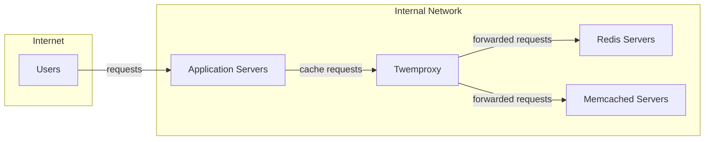
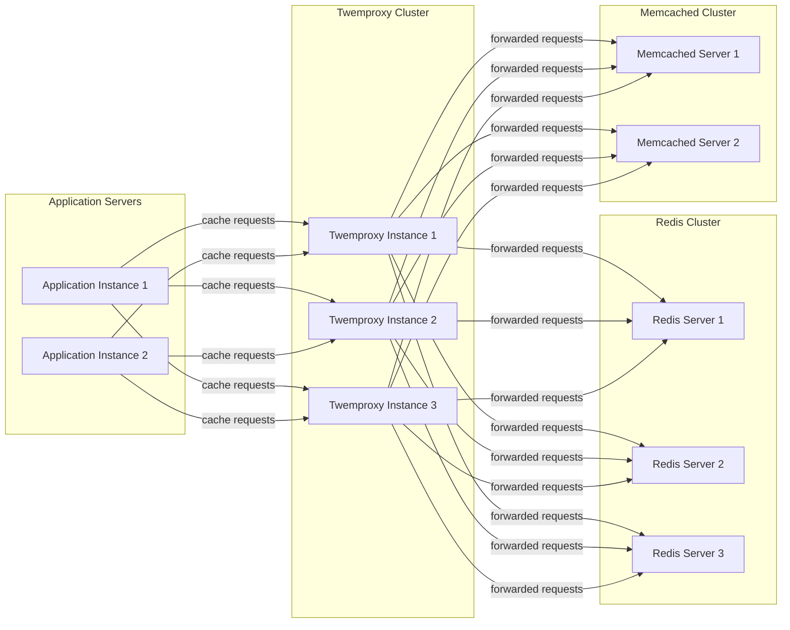
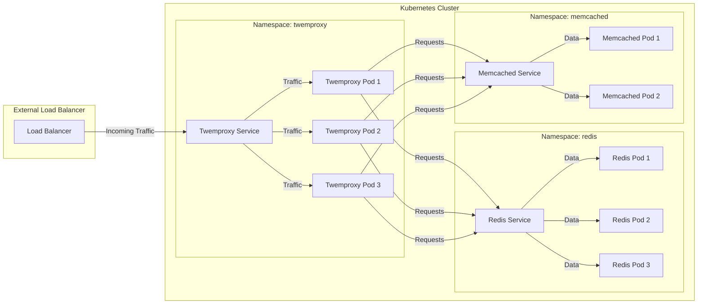
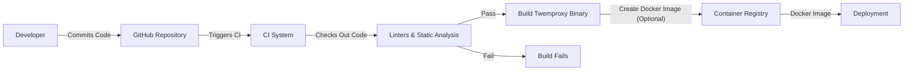

Okay, let's create a design document for Twemproxy (nutcracker) based on the provided GitHub repository.

# BUSINESS POSTURE

Twemproxy is a fast, lightweight proxy for memcached and Redis.  It's designed to reduce the number of connections to backend caching servers, and to shard data across multiple servers.  It was created and is maintained by Twitter, and is now a community-supported project.  Given its origin and purpose, the following business priorities and goals are likely:

*   Priorities:
    *   High Availability: Minimize downtime for caching infrastructure.  Caching is often critical for application performance and availability.
    *   Performance: Maintain low latency and high throughput for caching operations.  The proxy should not be a bottleneck.
    *   Scalability: Easily scale the caching layer horizontally to handle increasing load.
    *   Operational Simplicity:  Be easy to deploy, configure, and manage.
    *   Resource Efficiency: Minimize resource consumption (CPU, memory) of the proxy itself.
    *   Cost Effectiveness: Reduce operational costs by efficiently using caching resources.

*   Goals:
    *   Provide a stable and reliable caching proxy solution.
    *   Reduce connection overhead on backend cache servers.
    *   Enable horizontal scaling of the caching layer.
    *   Support various sharding and distribution strategies.
    *   Be compatible with existing memcached and Redis clients.

*   Business Risks:
    *   Single Point of Failure: If Twemproxy itself fails, it can disrupt access to the entire caching layer, impacting application performance and availability.
    *   Performance Bottleneck: If not configured or deployed correctly, Twemproxy can become a bottleneck, negating its benefits.
    *   Configuration Errors: Incorrect configuration can lead to data loss, inconsistency, or security vulnerabilities.
    *   Lack of Observability: Insufficient monitoring and logging can make it difficult to diagnose issues and ensure optimal performance.
    *   Security Vulnerabilities:  Vulnerabilities in Twemproxy could be exploited to gain access to sensitive data stored in the cache.
    *   Incompatibility: Changes in backend servers (Redis/Memcached) or client libraries could lead to compatibility issues.

# SECURITY POSTURE

*   Existing Security Controls:
    *   security control: Configuration-based access control: Twemproxy can be configured to listen on specific interfaces and ports, limiting network exposure. Described in configuration file.
    *   security control: Support for various hashing algorithms: This allows for consistent hashing and data distribution, which can indirectly improve security by preventing hot spots. Described in configuration file.
    *   security control: Open Source: The code is publicly available for review and auditing, allowing for community identification of vulnerabilities. Described in GitHub repository.
    *   security control: Limited feature set: By focusing on proxying, Twemproxy reduces its attack surface compared to a full-featured caching server. Described in GitHub repository.

*   Accepted Risks:
    *   accepted risk: No built-in authentication or encryption: Twemproxy itself does not provide authentication or encryption for client-proxy or proxy-server communication. It relies on the underlying caching servers or network-level security for these features.
    *   accepted risk: Limited input validation: Twemproxy primarily forwards requests and responses, performing minimal input validation. This places the responsibility for input validation on the clients and backend servers.
    *   accepted risk: Potential for configuration errors: The flexibility of Twemproxy's configuration can lead to security misconfigurations if not carefully managed.
    *   accepted risk: No built-in protection against DoS attacks: Twemproxy does not have specific mechanisms to mitigate Denial-of-Service attacks.

*   Recommended Security Controls:
    *   Network Segmentation: Deploy Twemproxy in a dedicated network segment with restricted access.
    *   Firewall Rules: Implement strict firewall rules to control traffic to and from Twemproxy instances.
    *   Intrusion Detection/Prevention Systems: Deploy IDS/IPS to monitor for malicious activity targeting Twemproxy.
    *   Regular Security Audits: Conduct regular security audits of the Twemproxy configuration and deployment.
    *   Vulnerability Scanning: Regularly scan Twemproxy instances for known vulnerabilities.
    *   Consider using a sidecar container for TLS termination: If encryption is required, use a sidecar container (like Envoy or Nginx) to handle TLS termination before traffic reaches Twemproxy.

*   Security Requirements:

    *   Authentication: Twemproxy itself does not handle authentication. Authentication, if required, should be implemented at the network level (e.g., VPN, firewall rules) or by the backend caching servers (Redis AUTH).
    *   Authorization: Twemproxy does not provide fine-grained authorization. Access control is primarily managed through network configuration and backend server settings.
    *   Input Validation: Twemproxy performs minimal input validation. Clients and backend servers are responsible for validating data.
    *   Cryptography: Twemproxy does not natively support encryption. If encryption is needed, it should be implemented at the network level (e.g., TLS using a sidecar) or by the backend caching servers.

# DESIGN

## C4 CONTEXT

*   Elements Description:

    *   Element:
        *   Name: Users
        *   Type: External Users
        *   Description: Users of the applications that utilize the caching infrastructure.
        *   Responsibilities: Accessing applications that rely on caching.
        *   Security Controls: Authentication and authorization are handled by the application servers.

    *   Element:
        *   Name: Application Servers
        *   Type: Internal System
        *   Description: Servers hosting the applications that use Twemproxy to access the caching layer.
        *   Responsibilities: Handling user requests, interacting with the caching layer, and performing business logic.
        *   Security Controls: Authentication, authorization, input validation, session management, and other application-level security controls.

    *   Element:
        *   Name: Twemproxy
        *   Type: Internal System
        *   Description: The Twemproxy (nutcracker) instance acting as a proxy for the caching servers.
        *   Responsibilities: Forwarding requests to backend caching servers, sharding data, and reducing connection overhead.
        *   Security Controls: Configuration-based access control, network segmentation, and firewall rules.

    *   Element:
        *   Name: Redis Servers
        *   Type: Internal System
        *   Description: Backend Redis servers storing cached data.
        *   Responsibilities: Storing and retrieving cached data.
        *   Security Controls: Authentication (Redis AUTH), network access control, and data persistence configuration.

    *   Element:
        *   Name: Memcached Servers
        *   Type: Internal System
        *   Description: Backend Memcached servers storing cached data.
        *   Responsibilities: Storing and retrieving cached data.
        *   Security Controls: Network access control.

## C4 CONTAINER

*   Elements Description:

    *   Element:
        *   Name: Application Instance 1, 2
        *   Type: Container
        *   Description: Instances of the application running on application servers.
        *   Responsibilities: Handling user requests, interacting with the caching layer.
        *   Security Controls: Application-level security controls.

    *   Element:
        *   Name: Twemproxy Instance 1, 2, 3
        *   Type: Container
        *   Description: Individual instances of Twemproxy running within the Twemproxy cluster.
        *   Responsibilities: Proxying requests, sharding data, connection management.
        *   Security Controls: Configuration-based access control, network segmentation.

    *   Element:
        *   Name: Redis Server 1, 2, 3
        *   Type: Container
        *   Description: Individual Redis servers within the Redis cluster.
        *   Responsibilities: Storing and retrieving cached data.
        *   Security Controls: Redis AUTH, network access control.

    *   Element:
        *   Name: Memcached Server 1, 2
        *   Type: Container
        *   Description: Individual Memcached servers within the Memcached cluster.
        *   Responsibilities: Storing and retrieving cached data.
        *   Security Controls: Network access control.

## DEPLOYMENT

*   Possible Deployment Solutions:
    *   Bare Metal Servers: Twemproxy can be deployed directly on bare metal servers.
    *   Virtual Machines: Twemproxy can be deployed on virtual machines (e.g., AWS EC2, Google Compute Engine, Azure VMs).
    *   Containers: Twemproxy can be deployed as containers within a container orchestration platform (e.g., Kubernetes, Docker Swarm). This is the recommended approach.

*   Chosen Solution: Containerized Deployment using Kubernetes

*   Elements Description:

    *   Element:
        *   Name: Twemproxy Pod 1, 2, 3
        *   Type: Kubernetes Pod
        *   Description: Pods running Twemproxy containers.
        *   Responsibilities: Handling incoming cache requests and forwarding them to backend servers.
        *   Security Controls: Network policies, resource limits, security contexts.

    *   Element:
        *   Name: Twemproxy Service
        *   Type: Kubernetes Service
        *   Description: A Kubernetes Service that exposes the Twemproxy pods.
        *   Responsibilities: Providing a stable endpoint for accessing the Twemproxy cluster.
        *   Security Controls: Network policies.

    *   Element:
        *   Name: Redis Pod 1, 2, 3
        *   Type: Kubernetes Pod
        *   Description: Pods running Redis containers.
        *   Responsibilities: Storing and retrieving cached data.
        *   Security Controls: Network policies, resource limits, security contexts, Redis AUTH.

    *   Element:
        *   Name: Redis Service
        *   Type: Kubernetes Service
        *   Description: A Kubernetes Service that exposes the Redis pods.
        *   Responsibilities: Providing a stable endpoint for accessing the Redis cluster.
        *   Security Controls: Network policies.
    *   Element:
        *   Name: Memcached Pod 1, 2
        *   Type: Kubernetes Pod
        *   Description: Pods running Memcached containers.
        *   Responsibilities: Storing and retrieving cached data.
        *   Security Controls: Network policies, resource limits, security contexts.

    *   Element:
        *   Name: Memcached Service
        *   Type: Kubernetes Service
        *   Description: A Kubernetes Service that exposes the Memcached pods.
        *   Responsibilities: Providing a stable endpoint for accessing the Memcached cluster.
        *   Security Controls: Network policies.

    *   Element:
        *   Name: Load Balancer
        *   Type: External Load Balancer
        *   Description: An external load balancer that distributes traffic to the Twemproxy Service.
        *   Responsibilities: Distributing incoming traffic across the Twemproxy instances.
        *   Security Controls: Firewall rules, DDoS protection.

## BUILD

*   Build Process:

    1.  Developer commits code changes to the GitHub repository.
    2.  A Continuous Integration (CI) system (e.g., GitHub Actions, Travis CI, Jenkins) is triggered.
    3.  The CI system checks out the code.
    4.  The CI system runs linters and static analysis tools (e.g., `make check`, `make test`).
    5.  If the tests pass, the CI system builds the Twemproxy binary.
    6.  The CI system may optionally create a Docker image containing the Twemproxy binary.
    7.  The Docker image is pushed to a container registry (e.g., Docker Hub, GitHub Container Registry).

*   Security Controls:

    *   security control: Code Review: All code changes should be reviewed by at least one other developer before being merged.
    *   security control: Static Analysis: Use static analysis tools to identify potential security vulnerabilities in the code.
    *   security control: Dependency Management: Regularly update dependencies to address known vulnerabilities. Use tools like `dep` or `go mod` to manage dependencies.
    *   security control: Container Image Scanning: Scan the Docker image for vulnerabilities before pushing it to the registry.
    *   security control: Signed Commits: Developers should sign their commits to ensure the integrity of the codebase.
    *   security control: Least Privilege: The CI system should run with the least privileges necessary.

# RISK ASSESSMENT

*   Critical Business Processes:
    *   Application Performance: Twemproxy is critical for maintaining the performance of applications that rely on caching.
    *   Application Availability: Outages in the caching layer can impact application availability.
    *   Data Consistency: Incorrect configuration or behavior of Twemproxy can lead to data inconsistency.

*   Data Sensitivity:
    *   The data stored in the cache may contain sensitive information, such as user session data, personal information, or proprietary business data. The sensitivity of the data depends on the specific applications using Twemproxy.
    *   Twemproxy itself does not store data persistently, but it handles the flow of data to and from the caching servers. Therefore, it is a critical component in protecting the confidentiality and integrity of cached data.

# QUESTIONS & ASSUMPTIONS

*   Questions:
    *   What specific types of data will be stored in the cache? This will help determine the appropriate security controls for the backend caching servers.
    *   What are the expected traffic patterns and load requirements? This will inform the deployment configuration and scaling strategy.
    *   Are there any existing security policies or compliance requirements that need to be considered?
    *   What is the level of access control required for managing Twemproxy configurations?
    *   What monitoring and logging infrastructure is in place?

*   Assumptions:
    *   BUSINESS POSTURE: The primary goal is to improve application performance and scalability by using a caching proxy. Cost optimization is a secondary concern.
    *   SECURITY POSTURE: Network-level security controls (firewalls, network segmentation) are in place. Backend caching servers (Redis, Memcached) are configured securely.
    *   DESIGN: A containerized deployment using Kubernetes is the preferred approach. A CI/CD pipeline is used for building and deploying Twemproxy.