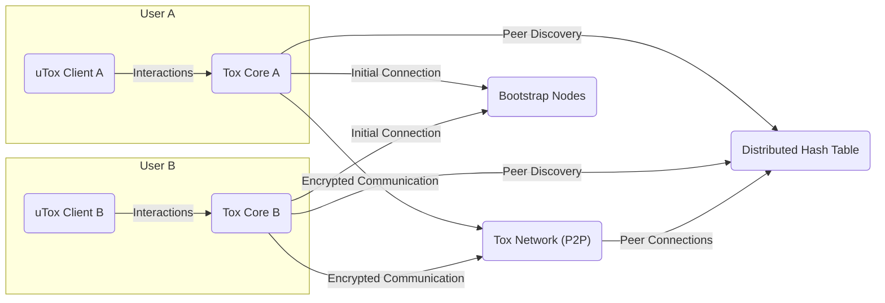
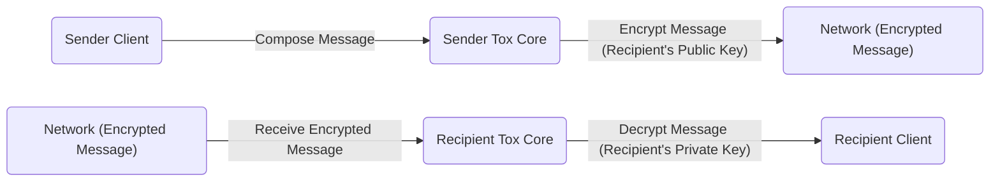

## Project Design Document: uTox

**Document Version:** 1.1
**Date:** October 26, 2023
**Author:** Gemini (AI Language Model)
**Project:** uTox - Secure, Distributed, Peer-to-Peer Instant Messenger

### 1. Introduction

This document provides a detailed design overview of the uTox project, a free and open-source, secure, distributed, peer-to-peer instant messenger. This document is intended to serve as a foundation for subsequent threat modeling activities. It outlines the key components, architecture, data flows, and technologies involved in uTox. This revision aims to clarify certain aspects and ensure consistent formatting.

### 2. Goals and Objectives

*   Provide a secure and private communication platform.
*   Enable decentralized communication without reliance on central servers.
*   Offer end-to-end encryption for all communication.
*   Support various communication features like text messaging, audio/video calls, and file transfers.
*   Maintain a lightweight and efficient design.
*   Be cross-platform compatible through various client implementations.

### 3. System Architecture

uTox is built upon the Tox protocol, a peer-to-peer network protocol designed for secure communication. The architecture can be broadly divided into the following components:

*   **Tox Core:** This is the underlying C library that implements the core Tox protocol. It handles:
    *   Key generation and management.
    *   Encryption and decryption of messages.
    *   Peer discovery and connection management.
    *   Audio and video encoding/decoding.
    *   File transfer mechanisms.
    *   Group chat management.
*   **Tox Clients:** These are the user-facing applications that interact with the Tox Core. Multiple client implementations exist (e.g., qTox, uTox (GTK+), Toxic (CLI)). They provide the user interface for:
    *   Sending and receiving messages.
    *   Initiating and receiving calls.
    *   Managing contacts.
    *   Configuring settings.
*   **Tox Network:** This is the decentralized peer-to-peer network formed by all active Tox clients. It relies on:
    *   **DHT (Distributed Hash Table):** Used for peer discovery. Clients register their public keys and network addresses in the DHT.
    *   **Bootstrap Nodes:** Well-known Tox nodes that new clients initially connect to in order to discover other peers and join the network.
    *   **Direct Peer Connections:** Once peers discover each other, they establish direct, encrypted connections for communication.

### 4. Data Flow

The following describes the typical data flow for common operations within uTox:

*   **Sending a Text Message:**
    1. The sender composes the message in their Tox client.
    2. The client passes the message to the Tox Core.
    3. The Tox Core encrypts the message using the recipient's public key.
    4. The Tox Core establishes a connection (or reuses an existing one) to the recipient's peer.
    5. The encrypted message is sent directly to the recipient's Tox Core.
    6. The recipient's Tox Core decrypts the message using their private key.
    7. The decrypted message is passed to the recipient's Tox client for display.
*   **Initiating an Audio/Video Call:**
    1. The initiating client signals the recipient through the Tox network.
    2. The signal includes information about supported codecs and network details.
    3. Once the recipient accepts, a direct peer-to-peer connection is established for the media stream.
    4. Audio and video data is encoded, encrypted, and streamed directly between the peers.
*   **File Transfer:**
    1. The sender initiates a file transfer request.
    2. The Tox Core negotiates the transfer method and establishes a direct connection for the transfer.
    3. The file is divided into chunks, encrypted, and sent directly to the recipient.
    4. The recipient's Tox Core receives and decrypts the chunks, reassembling the file.
*   **Peer Discovery:**
    1. A new client connects to one or more bootstrap nodes.
    2. The client queries the DHT for the network address of a specific peer (using their Tox ID/public key).
    3. The DHT returns the network address of the target peer (if found).
    4. The client attempts to establish a direct connection with the target peer.

### 5. Key Technologies and Components

*   **Programming Languages:** C (Tox Core), various languages for client implementations (e.g., C++, GTK+, Qt).
*   **Cryptography:**
    *   **Curve25519:** Elliptic-curve Diffie-Hellman key exchange.
    *   **XSalsa20:** Stream cipher for encryption.
    *   **Poly1305:** Message authentication code.
    *   **SHA-512:** Hashing algorithm.
*   **Networking:** UDP for transport, potentially TCP for relaying in certain scenarios.
*   **DHT Implementation:** Kademlia-based Distributed Hash Table.
*   **Build Systems:** CMake, Autotools (depending on the component).
*   **User Interface Frameworks:** GTK+, Qt (for desktop clients).

### 6. Security Considerations (High-Level)

*   **End-to-End Encryption:** All communication between peers is encrypted, ensuring only the intended recipients can decrypt the messages.
*   **Perfect Forward Secrecy (PFS):** Session keys are ephemeral, meaning past communication remains secure even if long-term keys are compromised.
*   **Decentralization:** The absence of central servers reduces the risk of a single point of failure or control.
*   **Open Source:** The codebase is publicly available for scrutiny, allowing for community audits and identification of potential vulnerabilities.
*   **Peer-to-Peer Architecture:** Direct communication between peers minimizes reliance on intermediaries.
*   **No Centralized Logging:** Communication is not logged on central servers.
*   **User Control of Keys:** Users manage their own private keys, providing greater control over their security.

### 7. Diagrams

#### 7.1. System Architecture Diagram

#### 7.2. Data Flow Diagram (Sending a Text Message)

### 8. Future Considerations

*   Integration with other privacy-focused technologies.
*   Improvements to network resilience and scalability.
*   Further development of client features and user experience.
*   Ongoing security audits and vulnerability assessments.

This document provides a comprehensive overview of the uTox project's design. It serves as a crucial input for subsequent threat modeling exercises, allowing for a systematic identification and analysis of potential security risks.
