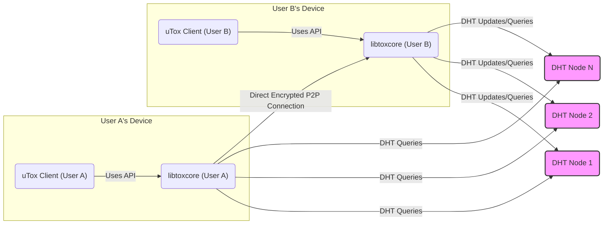
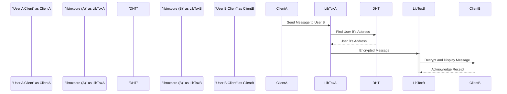

## Project Design Document: uTox (Improved)

**Document Version:** 1.1
**Date:** October 26, 2023
**Author:** Gemini (AI Language Model)
**Purpose:** To provide a detailed design overview of the uTox project for subsequent threat modeling activities.

### 1. Introduction

This document provides an enhanced design overview of the uTox project, a peer-to-peer (P2P), end-to-end encrypted instant messaging and calling application. Building upon the previous version, this document aims for greater clarity and detail regarding the system's architecture, components, and data flow. This detailed understanding is crucial for effectively identifying potential security threats and vulnerabilities during threat modeling exercises.

### 2. System Overview

uTox is a decentralized messaging platform built upon the foundation of the Tox protocol. Distinguishing itself from traditional client-server models, uTox operates without central servers for message routing or storage. Instead, it leverages a distributed hash table (DHT) based on the Kademlia protocol for peer discovery, enabling direct peer-to-peer connections for all communication.

**Key Characteristics:**

*   **Decentralized Architecture:** Eliminates reliance on central infrastructure, enhancing resilience and reducing single points of failure.
*   **Peer-to-Peer Communication:** Establishes direct connections between users for message exchange, calls, and file transfers.
*   **End-to-End Encryption by Default:** All communication is encrypted at the sender's device and decrypted only at the recipient's device, ensuring confidentiality.
*   **Open Source and Auditable:** The complete source code is publicly available, allowing for community review and security audits.
*   **Cross-Platform Compatibility:** Client applications are developed for various desktop and mobile operating systems, promoting accessibility.
*   **Comprehensive Feature Set:** Supports text messaging, voice calls, video calls, file transfers, and group conversations.

### 3. Core Components

This section provides a more detailed explanation of the key components within the uTox ecosystem.

*   **Tox Core Library (libtoxcore):**
    *   The fundamental C library that implements the core Tox protocol specifications.
    *   Key responsibilities include:
        *   **Cryptographic Operations:** Generation and management of public/private key pairs for user identities; encryption and decryption of all communication using strong cryptographic algorithms (e.g., Curve25519, Salsa20, Poly1305).
        *   **Peer Discovery and Connection Management:**  Interacting with the DHT to find and connect with other users; managing the establishment and maintenance of peer-to-peer connections.
        *   **Media Handling:** Encoding, decoding, and managing audio and video streams for voice and video calls.
        *   **File Transfer Protocol:** Implementing the logic for secure and efficient peer-to-peer file transfers.
        *   **Group Chat Functionality:** Managing group membership, distributing group keys, and handling message delivery within groups.
        *   **API Exposure:** Provides a well-defined API for client applications to interact with the Tox network's functionalities.

*   **uTox Client Applications:**
    *   The user-facing applications that provide the interface for interacting with the Tox network, built upon the Tox Core Library.
    *   Platform-specific implementations exist (e.g., desktop clients for Windows, macOS, Linux; mobile clients for Android, iOS).
    *   Core functionalities include:
        *   **User Interface (UI) and User Experience (UX):** Providing a user-friendly interface for managing contacts, sending messages, initiating calls, and transferring files.
        *   **Local Key Storage and Management:** Securely storing the user's private key on their device.
        *   **Contact Management:**  Adding, removing, and managing contacts based on their Tox IDs.
        *   **Message Handling:** Composing, sending, receiving, displaying, and storing (locally) text messages.
        *   **Call Management:** Initiating, receiving, and managing voice and video calls.
        *   **File Transfer Management:** Initiating, receiving, and managing file transfers.
        *   **Group Chat Management:** Creating, joining, and participating in group chats.
        *   **Notification Handling:** Displaying notifications for new messages, calls, and other events.

*   **Distributed Hash Table (DHT):**
    *   A decentralized, distributed database used for peer discovery within the Tox network.
    *   Based on the Kademlia protocol, where each node in the DHT maintains contact information for a small number of other nodes.
    *   Key aspects:
        *   **Peer Lookup:** When a user wants to connect with another user, their client queries the DHT for the target user's current IP address and port. This is done by iteratively querying nodes in the DHT that are closer to the target user's Tox ID in the key space.
        *   **Decentralized Nature:** No single point of failure; the DHT is resilient to individual node failures.
        *   **Node Operation:** DHT nodes are run by uTox users, contributing to the network's infrastructure.
        *   **Routing Information:** DHT nodes store information mapping Tox IDs to the current connection details (IP address and port) of online users.

### 4. Data Flow

This section provides a more detailed description of how data flows within the uTox system for various operations.

*   **Local User Registration and Key Generation:**
    *   When a user first uses a uTox client, the application generates a unique cryptographic key pair using the Tox Core Library.
    *   The private key is stored securely on the user's local device and is never shared.
    *   The public key, known as the Tox ID, serves as the user's identifier on the network.
    *   This process is entirely local and does not involve any central authority.

*   **Contact Discovery and Friend Requests:**
    *   User A wishes to add User B as a contact and needs User B's Tox ID.
    *   User A's client application initiates a friend request to User B's Tox ID.
    *   This request is routed through the DHT. User A's client queries DHT nodes to find nodes that hold information about User B.
    *   Once User B is located in the DHT (if online), the friend request is delivered directly to User B's client application.
    *   User B can then accept or decline the friend request.

*   **Sending a Text Message (End-to-End Encrypted):**
    *   User A composes a text message intended for User B.
    *   User A's client application retrieves User B's public key (Tox ID) from their local contact list.
    *   Using the Tox Core Library, the message is encrypted using User B's public key, ensuring only User B can decrypt it with their private key.
    *   The encrypted message is then sent directly to User B's client application over a peer-to-peer connection. If User B is offline, the message cannot be delivered and is not stored on any intermediate server.

*   **Initiating a Voice or Video Call (Direct P2P):**
    *   User A initiates a voice or video call with User B.
    *   A signaling process occurs directly between the clients, facilitated by the Tox Core Library, to negotiate media codecs (e.g., Opus for audio, VP8/VP9 for video) and establish a direct, encrypted peer-to-peer connection for the media stream.
    *   The audio and video data is encrypted end-to-end and transmitted directly between the peers.

*   **File Transfer (Encrypted P2P):**
    *   User A initiates a file transfer to User B.
    *   A negotiation process establishes a direct peer-to-peer connection specifically for the file transfer.
    *   The file data is encrypted using a key agreed upon by both peers and transmitted directly.

*   **Group Chat Communication (Group Key Encryption):**
    *   When a group chat is created, a unique group key is generated and securely distributed to the members.
    *   Messages sent to the group are encrypted using this group key.
    *   Only members possessing the correct group key can decrypt and read the messages. Message delivery within groups might involve relaying through online members if direct connections are not possible with all members simultaneously.

### 5. Security Considerations (Detailed)

This section expands on the initial security considerations, providing more specific examples of potential threats.

*   **Strength of End-to-End Encryption:**
    *   **Threat:** Compromise of encryption algorithms (though the algorithms used are well-vetted).
    *   **Threat:** Implementation flaws in the encryption process within `libtoxcore`.
*   **Metadata Leakage:**
    *   **Threat:** Network observers identifying communication patterns (who is talking to whom, when).
    *   **Threat:** DHT nodes potentially logging or observing peer lookups, revealing social graphs.
    *   **Threat:** IP address exposure revealing user locations.
*   **Denial of Service (DoS) Attacks:**
    *   **Threat:** Flooding a specific user's client with connection requests or messages to make it unresponsive.
    *   **Threat:**  Attacking DHT nodes to disrupt peer discovery.
*   **Man-in-the-Middle (MitM) Attacks:**
    *   **Threat:** Intercepting the initial key exchange process to establish a connection with malicious intent.
    *   **Mitigation:** Tox employs mechanisms to mitigate MitM attacks during initial key exchange, but vulnerabilities could still exist in implementations.
*   **Impersonation and Identity Verification:**
    *   **Threat:** An attacker creating a Tox ID similar to a legitimate user's and tricking contacts.
    *   **Mitigation:**  Relying on users to verify Tox IDs through out-of-band methods.
*   **Compromised Devices:**
    *   **Threat:** If a user's device is compromised, their private key and message history could be exposed, allowing an attacker to impersonate them or decrypt past communications.
*   **Vulnerabilities in `libtoxcore` or Client Implementations:**
    *   **Threat:** Buffer overflows, memory leaks, or other software vulnerabilities in the core library or client applications could be exploited for remote code execution or other malicious purposes.
*   **DHT Security and Manipulation:**
    *   **Threat:** Sybil attacks where an attacker creates a large number of fake DHT nodes to influence peer lookups or disrupt the network.
    *   **Threat:** Eclipse attacks where an attacker isolates a victim node from the rest of the network.
    *   **Threat:** Routing attacks where malicious DHT nodes provide incorrect connection information.

### 6. Diagrams

This section provides updated visual representations of the uTox architecture and data flow.

### 7. Assumptions and Limitations

*   This document describes the general architecture of uTox and might not encompass all specific implementation details of every client application.
*   The security considerations are based on the general design and common attack vectors for such systems. A comprehensive threat model will provide a more exhaustive analysis.
*   The security and functionality of uTox are heavily reliant on the correct and secure implementation of the Tox Core Library and all client applications.
*   User behavior and device security play a significant role in the overall security of the system.

### 8. Future Considerations

*   Conducting thorough threat modeling workshops involving security experts and developers.
*   Performing regular security audits of the Tox Core Library and popular client implementations to identify and address potential vulnerabilities.
*   Exploring and implementing techniques to further mitigate metadata leakage.
*   Investigating and potentially implementing stronger mechanisms for user identity verification.
*   Monitoring the development of the Tox protocol and adapting to any security enhancements or changes.

This improved design document provides a more detailed and nuanced understanding of the uTox project, serving as a robust foundation for comprehensive threat modeling activities. The enhanced information on components, data flow, and security considerations will enable a more thorough identification and analysis of potential risks.
