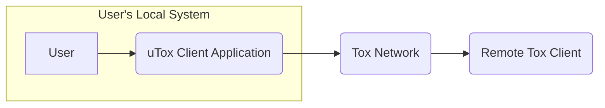
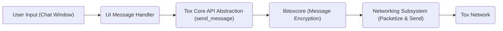
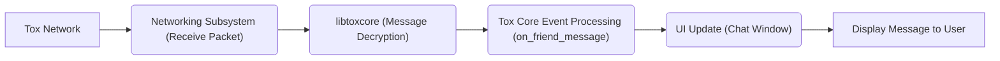
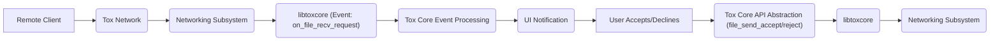

## Project Design Document: uTox Client (Improved)

**1. Introduction**

This document provides an enhanced design overview of the uTox client, a graphical Tox client built using the GTK+ toolkit. The primary purpose of this document is to serve as a foundation for a comprehensive threat modeling exercise. It details the architecture, key components, and data flows within the application, emphasizing aspects relevant to security analysis.

**2. Goals and Objectives**

*   Deliver a user-friendly and intuitive graphical interface for interacting with the decentralized Tox protocol.
*   Facilitate secure and private communication, leveraging the end-to-end encryption provided by the Tox protocol.
*   Implement core Tox functionalities, including text messaging, audio and video calls, and secure file transfers.
*   Maintain a resource-efficient application suitable for various desktop environments.
*   Offer a degree of customization and extensibility to cater to diverse user preferences.

**3. High-Level Architecture**

The uTox client operates as a desktop application residing on a user's machine. It interacts with the decentralized Tox network to facilitate communication with other Tox users. The major architectural components are:

*   **User Interface (UI):** The visual interface, constructed using GTK+, through which users interact with the application's features.
*   **Tox Core Integration Layer:** This layer acts as an intermediary, translating actions from the UI into commands for the underlying libtoxcore library and relaying events from libtoxcore back to the UI.
*   **Networking Subsystem:** Responsible for managing network connections, sending and receiving data packets according to the Tox protocol specifications.
*   **Local Data Management:** Handles the persistent storage and retrieval of user-specific data, such as contacts, settings, and message history.

**4. Detailed Component Design**

This section provides a more granular description of the key components within the uTox client.

*   **4.1. User Interface (UI) Components (GTK+ based):**
    *   **Main Application Window:** The central window housing the contact list and individual chat windows.
    *   **Contact List View:** Displays the user's contacts, their online status, and provides options for initiating chats or calls.
    *   **Chat Window View:**  The interface for exchanging text messages with a specific contact, displaying message history, and providing controls for calls and file transfers.
    *   **Application Settings Dialog:** Allows users to configure various application settings, including Tox profile details, UI preferences, and security-related options.
    *   **Audio/Video Call Window:**  A dedicated window for managing active audio and video calls, displaying video feeds and call controls.
    *   **System Notification Handler:**  Manages the display of system-level notifications for events like new messages or incoming calls.

*   **4.2. Tox Core Integration Layer:**
    *   **libtoxcore Instance Manager:**  Responsible for initializing, managing the lifecycle, and interacting with the libtoxcore library.
    *   **Event Processing Module:**  Handles events emitted by libtoxcore (e.g., new messages, friend requests, connection status changes), translating them into actions within the uTox application.
    *   **Tox API Abstraction:** Provides a set of functions and methods that simplify interaction with the raw libtoxcore API, making it easier for other components to utilize Tox functionalities. This includes functions for sending messages, adding friends, initiating calls, and managing file transfers.

*   **4.3. Networking Subsystem:**
    *   **Connection Management:**  Handles establishing and maintaining connections to the Tox network, including the initial bootstrapping process and ongoing interaction with the Distributed Hash Table (DHT).
    *   **Packet Handling (Send):**  Responsible for encapsulating data into Tox protocol packets, including encryption as handled by libtoxcore, and sending them over the network (typically UDP).
    *   **Packet Handling (Receive):**  Receives data packets from the network, decrypts them (as handled by libtoxcore), and routes the data to the appropriate components within the application.
    *   **UDP Socket Management:** Manages the underlying UDP sockets used for communication with the Tox network.

*   **4.4. Local Data Management:**
    *   **Configuration Storage:**  Handles reading and writing application configuration settings to persistent storage (e.g., a configuration file).
    *   **Contact Database Interface:** Provides an interface for storing, retrieving, and managing the user's contact list, including contact names and Tox IDs.
    *   **Message History Storage:**  Manages the persistent storage of chat messages, potentially including encryption at rest, for later retrieval and display.
    *   **Tox Profile Data Storage:** Stores the user's local Tox profile information, such as their name and status message.

*   **4.5. Media Handling Components:**
    *   **Audio Capture Module:**  Handles capturing audio input from the user's microphone.
    *   **Audio Playback Module:**  Manages the playback of audio through the user's speakers or headphones.
    *   **Video Capture Module:**  Handles capturing video input from the user's webcam.
    *   **Video Rendering Module:**  Manages the display of video streams on the user's screen.
    *   **Codec Integration (Audio & Video):** Integrates with audio and video codecs (e.g., Opus, VP8/VP9) for encoding and decoding media streams during calls.

*   **4.6. File Transfer Component:**
    *   **File Transfer Initiation:** Handles the process of initiating file transfers with remote contacts.
    *   **Data Segmentation and Assembly:**  Breaks down files into smaller chunks for transmission and reassembles them upon reception.
    *   **Transfer Progress Management:**  Tracks the progress of ongoing file transfers and provides feedback to the user.
    *   **File Storage (Temporary):**  Manages the temporary storage of incoming file chunks before they are fully assembled.

**5. Data Flow Diagrams**

These diagrams illustrate the flow of data for key functionalities, highlighting security-relevant aspects.

*   **5.1. Sending an Encrypted Text Message:**

*   **5.2. Receiving and Decrypting a Text Message:**

*   **5.3. Initiating an Encrypted Audio/Video Call:**

```mermaid
graph LR
    A["User Initiates Call (UI)"] --> B("UI Call Handler");
    B --> C("Tox Core API Abstraction (add_friend, call)");
    C --> D("libtoxcore (Call Setup & Key Exchange)");
    D --> E("Networking Subsystem (Call Setup Signaling)");
    E --> F("Remote Client");
    F --> G("Networking Subsystem (Call Accept)");
    G --> H("libtoxcore");
    H --> I("Tox Core Event Processing");
    I --> J("UI Update (Call Window)");
    J --> K["Establish Encrypted Media Streams"];
```

*   **5.4. Receiving an Encrypted File Transfer Request:**

**6. Security Considerations (Detailed for Threat Modeling)**

This section expands on the initial security considerations, providing more specific areas for threat modeling.

*   **Tox Protocol Vulnerabilities:**  Potential weaknesses in the underlying Tox protocol itself, such as cryptographic flaws or vulnerabilities in the DHT implementation. uTox's security is fundamentally tied to the robustness of Tox.
*   **Private Key Security:**  The security of the user's Tox private key is paramount. Threats include unauthorized access to the key file, weak password protection (if used for encryption at rest), and potential memory leaks exposing the key.
*   **Memory Safety Issues:**  As uTox is written in C/C++, it is susceptible to memory safety vulnerabilities like buffer overflows, use-after-free errors, and dangling pointers. These could be exploited for code execution.
*   **Input Validation Failures:**  Insufficient validation of user inputs (e.g., contact names, messages) or data received from the network could lead to injection attacks (e.g., command injection, cross-site scripting if rendering HTML).
*   **Dependency Vulnerabilities:**  Security vulnerabilities in libtoxcore or other third-party libraries used by uTox could be exploited. Regular updates and security audits of dependencies are crucial.
*   **UI Rendering Vulnerabilities:**  If the UI renders untrusted content (e.g., from messages), vulnerabilities like cross-site scripting (XSS) could be present.
*   **File Transfer Security Risks:**  Malicious actors could attempt to send malware through file transfers. Lack of proper file type validation or sandboxing could pose a risk.
*   **Local Data Security (Encryption at Rest):**  Sensitive data stored locally (message history, contacts) should be encrypted at rest to protect against unauthorized access if the system is compromised. The strength of the encryption and key management for this are critical.
*   **Build and Distribution Security:**  Compromise of the build environment or distribution channels could lead to the distribution of malicious versions of uTox. Secure build processes and code signing are important.
*   **Denial of Service (DoS):**  Potential vulnerabilities that could allow an attacker to cause the uTox client to crash or become unresponsive, either through malformed network packets or resource exhaustion.
*   **Side-Channel Attacks:**  Consideration of potential side-channel attacks, although less likely for a desktop application, such as timing attacks or information leakage through resource usage.

**7. Deployment Model**

uTox is typically deployed as a native desktop application for various operating systems (e.g., Linux, macOS, Windows). Users download pre-compiled binaries or build the application from source and install it directly on their local machines.

**8. Assumptions and Constraints**

*   It is assumed that the underlying Tox network provides a baseline level of security for communication.
*   The application relies on the correct and secure implementation of the libtoxcore library.
*   The UI is built using GTK+ and its associated libraries, and any vulnerabilities within these libraries could impact uTox.
*   Security depends on users keeping their systems and uTox client updated with the latest security patches.

**9. Future Considerations**

*   Exploring integration with more advanced Tox features as they are developed.
*   Continuous improvement of the user interface and user experience based on user feedback.
*   Development of a plugin or extension architecture to enhance functionality.
*   Ongoing security audits and code reviews to identify and address potential vulnerabilities.
*   Consideration of sandboxing or other security hardening techniques.

This improved design document provides a more detailed and security-focused overview of the uTox client. The enhanced component descriptions, clarified data flows, and expanded security considerations offer a stronger foundation for conducting a thorough and effective threat modeling exercise.