# Project Design Document: uTox - Decentralized Secure Messaging and File Transfer

**Version:** 1.1
**Date:** 2023-10-27
**Author:** Gemini AI (Expert in Software, Cloud and Cybersecurity Architecture)

## 1. Introduction

This document provides a detailed design overview of the uTox project, a decentralized, peer-to-peer (P2P), secure messaging and file transfer application. This document is intended to serve as a foundation for subsequent threat modeling activities. It outlines the system architecture, components, data flows, and key technologies employed by uTox.

uTox aims to provide a censorship-resistant and privacy-focused communication platform by leveraging a distributed hash table (DHT) for peer discovery and end-to-end encryption for secure communication.  It avoids reliance on central servers, enhancing resilience, user privacy, and censorship resistance.

This document is based on the publicly available information from the uTox GitHub repository: [https://github.com/utox/utox](https://github.com/utox/utox) and general knowledge of P2P networking and secure messaging principles. This version improves upon the initial design document by clarifying certain aspects and adding more detail to security considerations.

## 2. Project Goals and Objectives

*   **Decentralization:** Operate without central servers for user data, message routing, or control, enhancing resilience and reducing single points of failure.
*   **Security:** Ensure confidentiality, integrity, and authenticity of communications through robust end-to-end encryption for all messages and file transfers.
*   **Privacy:** Minimize metadata exposure, protect user identities, and resist surveillance through P2P architecture, encryption, and minimal data retention.
*   **Censorship Resistance:** Design a system inherently resistant to censorship attempts due to its decentralized and distributed nature, making it difficult to block or control.
*   **User-Friendliness:** Provide a usable and accessible messaging and file transfer experience for a broad range of users, despite the underlying technical complexity.
*   **Open Source and Auditability:** Maintain full transparency and encourage community scrutiny, contributions, and security audits through open-source development under a permissive license.
*   **Performance and Efficiency:** Achieve acceptable performance in terms of message delivery speed, file transfer rates, and resource utilization, even in potentially constrained network environments.

## 3. System Architecture Overview

uTox employs a peer-to-peer architecture where each uTox client functions as both a client and a server.  This eliminates the need for central servers and distributes responsibilities across all participating nodes. The core components of the uTox system are:

*   **uTox Core Library:** The foundational layer containing the core logic for networking, encryption, DHT interaction, message/file handling, and protocol implementation.
*   **uTox Client (GUI/CLI):** User-facing applications (e.g., qTox, uTox CLI, Toxic) that provide the user interface and interact with the uTox Core Library to offer messaging and file transfer functionalities.
*   **Distributed Hash Table (DHT):** A decentralized database used for peer discovery, allowing clients to locate each other's network addresses without relying on central servers.  Likely based on a Kademlia variant.
*   **Networking Layer:** Manages network communication, primarily using UDP for efficiency in P2P environments, with potential fallback to TCP for reliability where needed. Includes NAT traversal mechanisms.
*   **Cryptographic Library:** Provides the necessary cryptographic algorithms and functions for encryption, decryption, digital signatures, key exchange, and hashing.  Libsodium is the likely choice.

```mermaid
graph LR
    subgraph "User A's System"
    "User A Client (GUI/CLI)" --> "User A Core Library"
    end

    subgraph "uTox Network (P2P)"
    "User A Core Library" --> "User A Networking Layer";
    "User A Networking Layer" --> "DHT Network";
    "DHT Network" --> "User B Networking Layer";
    end

    subgraph "User B's System"
    "User B Networking Layer" --> "User B Core Library";
    "User B Core Library" --> "User B Client (GUI/CLI)";
    end

    style "DHT Network" fill:#f9f,stroke:#333,stroke-width:2px
    linkStyle 2,3,4 stroke:#ccf,stroke-width:2px;
```

**Diagram Description:**

*   Users interact with uTox through a Client application (GUI or CLI).
*   The Client communicates with the uTox Core Library, which encapsulates the core application logic.
*   The Core Library utilizes the Networking Layer for all network-related operations.
*   The DHT Network facilitates peer discovery and rendezvous.
*   Communication between uTox peers is direct, end-to-end encrypted, and traverses the P2P network.

## 4. Detailed Component Design

### 4.1. uTox Core Library

*   **Purpose:** The central, non-UI component of uTox, responsible for all core functionalities and protocol logic.
*   **Functionality:**
    *   **Networking Management:** Handles P2P connection establishment, maintenance, and teardown; manages UDP and potentially TCP sockets; implements NAT traversal techniques (e.g., STUN, TURN).
    *   **DHT Client:** Implements the DHT protocol client-side logic for querying, publishing, and maintaining DHT routing tables. Interacts with the DHT network for peer discovery and presence announcement.
    *   **Encryption and Decryption Engine:** Provides end-to-end encryption and decryption of messages and files using robust cryptographic algorithms. Manages session keys and long-term key storage.
    *   **Message Protocol Handling:** Defines and implements the uTox message protocol, including message formatting, sequencing, reliability mechanisms (if any), and handling different message types (text, audio, video, control messages).
    *   **File Transfer Protocol:** Manages file transfer initiation, negotiation, chunking, transmission, reassembly, error handling, and progress reporting.
    *   **Key Management System:** Generates, securely stores (likely in memory or encrypted storage), and manages cryptographic keys (both long-term identity keys and ephemeral session keys).
    *   **Contact Management and Presence:** Stores contact information (names, Tox IDs, public keys), manages friend lists, and handles presence information (online/offline status, potentially rich presence).
    *   **Audio/Video Call Handling (if implemented):** Manages audio and video call setup, signaling, media encoding/decoding, and real-time streaming.  (Note: Feature completeness may vary across uTox clients).
*   **Technology Stack:** Primarily written in C for performance, efficiency, and cross-platform compatibility. Leverages system libraries for networking and relies heavily on a dedicated cryptographic library like libsodium.
*   **Interfaces:**
    *   **Client API:** A well-defined, likely C-based API for uTox Client applications to access core functionalities. This API provides functions for sending messages, initiating file transfers, managing contacts, handling events (new messages, connection status changes), etc.
    *   **Networking Protocol Interface:** Implements the uTox P2P protocol, defining the message formats, communication sequences, and error handling mechanisms for peer-to-peer communication over UDP (and potentially TCP).

### 4.2. uTox Client (GUI/CLI)

*   **Purpose:** Provides the user interface for interacting with the uTox Core Library and presenting uTox functionalities to the user.
*   **Functionality:**
    *   **User Interface Presentation:** Renders a graphical user interface (GUI) or command-line interface (CLI) for user interaction. Displays contact lists, chat windows, file transfer progress, settings, etc.
    *   **User Input Processing:** Captures user input (text messages, file selections, commands, UI interactions) and translates them into API calls to the Core Library.
    *   **Output Rendering and Display:** Receives data and events from the Core Library (messages, contact updates, status changes) and presents them to the user in a user-friendly format.
    *   **Configuration Management (Client-Side):** Allows users to configure client-specific settings such as UI preferences, notifications, and potentially some network-related settings exposed by the Core Library.
*   **Technology Stack:**  Client implementations vary in technology:
    *   **qTox (GUI):** C++ with Qt framework, known for cross-platform GUI development.
    *   **uTox (CLI):** C, providing a lightweight command-line interface.
    *   **Toxic (CLI):** Another C-based CLI client.
    *   Other clients may exist, potentially using different languages and frameworks (e.g., web-based clients interacting with a Core Library backend).
*   **Interfaces:**
    *   **Core Library API Client:**  Utilizes the API exposed by the uTox Core Library to access and control uTox functionalities.
    *   **Operating System Interface:** Interacts with the underlying operating system for UI rendering, input handling (keyboard, mouse), file system access, and system resource management.

### 4.3. Distributed Hash Table (DHT)

*   **Purpose:**  To provide a decentralized and scalable mechanism for peer discovery and rendezvous in the uTox network.
*   **Functionality:**
    *   **Peer ID to Address Mapping:** Stores mappings between user identifiers (Tox IDs, derived from public keys) and network addresses (IP address and port) of uTox peers.
    *   **Peer Lookup Service:** Enables peers to query the DHT to find the network address of another peer given their Tox ID.  This is the primary mechanism for initiating direct connections.
    *   **Peer Presence Publication:** Allows peers to announce their presence and network address to the DHT, making themselves discoverable to other users.
    *   **DHT Network Participation:** Implements DHT protocol logic to participate in the DHT network, including routing, data replication, and maintenance operations.
    *   **Bootstrap Mechanism:**  Utilizes a list of known bootstrap nodes to allow new nodes to join the DHT network initially.
*   **Technology Stack:**  Likely based on a Kademlia-inspired DHT algorithm, chosen for its efficiency, scalability, and robustness in P2P networks. Specific implementation details (routing table size, replication factor, etc.) would be defined by the uTox protocol.
*   **Interfaces:**
    *   **DHT Protocol Interface:** Implements the DHT protocol (e.g., Kademlia) for communication with other DHT nodes in the network. This protocol defines message formats for queries, responses, node joining, leaving, etc.
    *   **Core Library DHT API:** Provides an API for the uTox Core Library to interact with the DHT, offering functions for querying peer addresses, publishing presence information, and potentially other DHT-related operations.

### 4.4. Networking Layer

*   **Purpose:**  To handle low-level network communication for uTox, abstracting away the complexities of network protocols and providing a consistent interface for the Core Library.
*   **Functionality:**
    *   **Connection Management (P2P):** Establishes, maintains, and closes P2P connections between uTox peers. Handles connection state and error conditions.
    *   **Data Transmission and Reception:** Sends and receives data packets over the network using UDP as the primary protocol, potentially with TCP fallback for specific scenarios.
    *   **uTox P2P Protocol Implementation:** Implements the custom uTox P2P protocol, including message framing, sequencing (if required), error detection, and potentially flow control mechanisms.
    *   **UDP and TCP Socket Handling:** Manages UDP and TCP sockets, handling socket creation, binding, listening, sending, and receiving operations.
    *   **NAT Traversal Implementation:** Incorporates NAT traversal techniques (e.g., STUN, TURN, hole punching) to enable communication between peers behind NATs, which is crucial for P2P functionality in typical network environments.
*   **Technology Stack:**  Relies on standard networking libraries provided by the operating system (e.g., sockets API).  Likely uses raw sockets for UDP to optimize performance and control over packet transmission.
*   **Interfaces:**
    *   **Core Library Networking API:** Provides an API for the uTox Core Library to send and receive data over the network, abstracting away the underlying network protocol details. This API would likely offer functions for sending and receiving messages/data to specific peers.
    *   **Operating System Network Interface:** Interacts directly with the operating system's network interfaces to send and receive network packets at the IP layer.

### 4.5. Cryptographic Library

*   **Purpose:**  To provide a robust and secure set of cryptographic primitives for securing all aspects of uTox communication.
*   **Functionality:**
    *   **Symmetric Encryption/Decryption:** Provides algorithms for encrypting and decrypting messages and file data using symmetric keys (e.g., AES-256, ChaCha20).
    *   **Asymmetric Encryption/Decryption:** Provides algorithms for key exchange and potentially for encrypting small amounts of data with public keys (e.g., Curve25519 for key exchange, RSA or similar for public-key encryption if used).
    *   **Digital Signatures:** Provides algorithms for creating and verifying digital signatures to ensure message authenticity and integrity (e.g., EdDSA, ECDSA).
    *   **Cryptographic Hashing:** Provides cryptographic hash functions for data integrity checks, key derivation, and other security-related purposes (e.g., SHA-256, BLAKE2b).
    *   **Key Generation and Derivation:** Provides functions for generating cryptographic keys (symmetric and asymmetric) and deriving session keys from key exchange protocols.
    *   **Random Number Generation:** Provides a cryptographically secure random number generator (CSPRNG) for key generation and other security-sensitive operations.
*   **Technology Stack:**  Strongly relies on a well-vetted and widely used cryptographic library like **libsodium**. Libsodium is a popular choice for its security, performance, and ease of use, providing a comprehensive set of modern cryptographic primitives.
*   **Interfaces:**
    *   **Core Library Crypto API:** Provides an API for the uTox Core Library to access all cryptographic functions. This API would include functions for encryption, decryption, signing, verification, hashing, key generation, key exchange, etc.

## 5. Data Flow Diagrams

### 5.1. Message Sending Data Flow (Detailed)


**Description (Detailed):**

1.  User A initiates sending a message through their uTox Client.
2.  The Client calls the 'Send Message' API in User A's Core Library.
3.  The Core Library formats the message into the uTox message protocol structure.
4.  The Core Library retrieves User B's public key (or session key if a secure channel is already established).
5.  The message content is encrypted using User B's public key (for initial key exchange or session key for ongoing communication).
6.  The encrypted message is passed to the Networking Layer to be sent to User B's network address (obtained from the DHT).
7.  The message travels across the network.
8.  User B's Networking Layer receives the encrypted message.
9.  The message is passed to User B's Core Library, triggering a 'Receive Message' event.
10. User B's Core Library decrypts the message using their private key (or the established session key).
11. The Core Library processes the decrypted message, verifying integrity and handling the message type.
12. The decrypted message is then passed to User B's Client for display.

### 5.2. File Transfer Data Flow (Detailed)

```mermaid
graph LR
    A["User A Client"] --> B["User A Core Library: 'Send File' API Call"];
    B --> C["File Metadata: Prepare file metadata (name, size, etc.)"];
    C --> D["Session Key Generation: Generate session key for file transfer"];
    D --> E["File Chunking: Divide file into chunks"];
    E --> F["Encryption: Encrypt each chunk using session key"];
    F --> G["Networking Layer: Send encrypted chunks with metadata (chunk index, etc.)"];
    G --> H["Network"];
    H --> I["Recipient Networking Layer: Receive encrypted chunks and metadata"];
    I --> J["Recipient Core Library: 'Receive File Chunk' Event"];
    J --> K["Decryption: Decrypt each chunk using session key"];
    K --> L["Chunk Verification: Verify chunk integrity (e.g., hash)"];
    L --> M["File Reassembly: Reassemble chunks into original file"];
    M --> N["Recipient Client: Indicate file transfer completion to User B"];

    style F fill:#ccf,stroke:#333,stroke-width:1px
    style K fill:#ccf,stroke:#333,stroke-width:1px
    linkStyle 5,10 stroke:#ccf,stroke-width:2px;
```



**Description (Detailed):**

1.  User A initiates a file transfer through their uTox Client.
2.  The Client calls the 'Send File' API in User A's Core Library.
3.  The Core Library prepares file metadata, including filename, size, and other relevant information.
4.  A session key is generated specifically for this file transfer to encrypt the file data.
5.  The file is divided into smaller, manageable chunks.
6.  Each chunk is encrypted using the generated session key.
7.  Encrypted chunks, along with metadata (chunk index, file information), are sent through the Networking Layer.
8.  The chunks travel over the network.
9.  User B's Networking Layer receives the encrypted chunks and metadata.
10. The chunks are passed to User B's Core Library, triggering 'Receive File Chunk' events.
11. Each chunk is decrypted using the session key.
12. The integrity of each decrypted chunk is verified (e.g., using a hash included in the metadata).
13. The Core Library reassembles the decrypted and verified chunks to reconstruct the original file.
14. The Recipient Client is notified of the file transfer completion and makes the file available to User B.

### 5.3. Peer Discovery and Secure Connection Establishment (Detailed)

```mermaid
graph LR
    A["User A Client (New User)"] --> B["User A Core Library: 'Start uTox' "];
    B --> C["DHT Bootstrap: Connect to known DHT bootstrap nodes"];
    C --> D["DHT Network: Join DHT network"];
    D --> E["Key Pair Generation: Generate User A's public and private keys"];
    E --> F["Tox ID Generation: Derive Tox ID from public key"];
    F --> G["Publish Tox ID & Network Address to DHT"];
    G --> H["User B Client (Existing User)"];
    H --> I["User B Core Library: 'Add Friend' - User A's Tox ID"];
    I --> J["DHT Lookup: Query DHT for User A's network address using Tox ID"];
    J --> K["Networking Layer: Initiate P2P connection to User A's address"];
    K --> L["User A Networking Layer: Accept P2P connection from User B"];
    L --> M["Key Exchange: Perform key exchange (e.g., Noise protocol, Curve25519 DH)"];
    M --> N["Session Key Derivation: Derive session keys from exchanged secrets"];
    N --> O["Secure Communication Channel Established"];

    style E fill:#ccf,stroke:#333,stroke-width:1px
    style M fill:#ccf,stroke:#333,stroke-width:1px
    linkStyle 4,12 stroke:#ccf,stroke-width:2px;
```



**Description (Detailed):**

1.  User A starts their uTox Client for the first time.
2.  The Client initiates the 'Start uTox' process in User A's Core Library.
3.  The Core Library connects to a list of pre-configured DHT bootstrap nodes to initiate joining the DHT network.
4.  User A's node joins the DHT network, becoming part of the distributed peer discovery system.
5.  User A's Core Library generates a new cryptographic key pair (public and private keys) for identity and encryption.
6.  A unique Tox ID is derived from User A's public key, serving as their user identifier.
7.  User A's Tox ID and current network address are published to the DHT, making User A discoverable by other uTox users.
8.  User B, an existing uTox user, wants to add User A as a friend and initiate communication.
9.  User B's Client initiates the 'Add Friend' process, providing User A's Tox ID.
10. User B's Core Library queries the DHT to lookup User A's network address associated with the given Tox ID.
11. User B's Networking Layer initiates a P2P connection to User A's retrieved network address.
12. User A's Networking Layer accepts the incoming P2P connection request from User B.
13. A secure key exchange protocol (e.g., Noise protocol framework with Curve25519 Diffie-Hellman) is performed between User A and User B to establish shared secrets.
14. Session keys for symmetric encryption of subsequent messages and file transfers are derived from the exchanged secrets.
15. A secure, end-to-end encrypted communication channel is now established between User A and User B, ready for messaging and file transfer.

## 6. Security Considerations (Expanded Overview)

uTox is designed with a strong emphasis on security and privacy. Key security features and considerations include:

*   **End-to-End Encryption (E2EE):** All communication (messages, file transfers, and potentially voice/video calls) is encrypted end-to-end, ensuring confidentiality and integrity.  This prevents eavesdropping by intermediaries, including network providers and potentially malicious DHT nodes.
    *   **Algorithms:** Likely uses strong symmetric encryption algorithms like AES-256 or ChaCha20 for bulk data encryption and asymmetric cryptography (Curve25519) for key exchange and potentially digital signatures (EdDSA).
*   **Decentralization and DHT:**  The decentralized architecture and use of a DHT enhance censorship resistance and reduce single points of failure. However, DHT itself can be a target for attacks (e.g., Sybil attacks, eclipse attacks) that could disrupt peer discovery.
    *   **Mitigation:** DHT robustness depends on the specific DHT implementation and potential countermeasures against DHT-specific attacks.
*   **Peer-to-Peer Architecture:** Direct P2P communication minimizes reliance on intermediaries, improving privacy and reducing potential attack surfaces compared to client-server systems.
*   **Open Source and Auditability:** The open-source nature allows for public scrutiny of the code, facilitating security audits and community-driven identification and patching of vulnerabilities.
*   **Use of Libsodium:**  Leveraging a reputable cryptographic library like libsodium is crucial for ensuring the use of secure and well-implemented cryptographic primitives, reducing the risk of implementation flaws.
*   **Forward Secrecy:** Key exchange mechanisms should ideally incorporate forward secrecy (e.g., using ephemeral Diffie-Hellman keys) to ensure that past communications remain secure even if long-term private keys are compromised in the future.
*   **Metadata Minimization:**  Efforts should be made to minimize metadata leakage. While end-to-end encryption protects message content, metadata such as sender/receiver identities (Tox IDs), timestamps, and connection patterns might still be exposed.
    *   **Considerations:**  Further analysis is needed to understand what metadata is exposed and potential mitigation strategies (e.g., padding, traffic shaping, onion routing integration in the future).
*   **Denial of Service (DoS) Resistance:** P2P systems can be vulnerable to DoS attacks.  uTox needs to incorporate mechanisms to mitigate DoS attacks at the network and application layers.
    *   **Considerations:** Rate limiting, connection limits, and robust DHT handling are important.
*   **Identity and Authentication:**  Tox IDs and public keys are used for identity.  The security of the key generation and storage processes is critical.  User authentication is implicit through possession of the private key.
*   **NAT Traversal Security:** NAT traversal techniques can introduce security considerations.  It's important to ensure that NAT traversal mechanisms do not create vulnerabilities or weaken security.
*   **Code Security:**  The security of uTox ultimately depends on the security of the codebase.  Secure coding practices, regular security audits, and vulnerability patching are essential.

**Detailed threat modeling, based on this design document, is the next crucial step to systematically identify, analyze, and mitigate potential security threats and vulnerabilities in uTox.**

## 7. Deployment Model

uTox is designed for client-side deployment. Users download and install a uTox Client application on their devices.

*   **Client-Side Application:** Users run uTox client software on their personal devices (desktops, laptops, potentially mobile devices).
*   **Decentralized Operation:** No central server infrastructure is required for users to communicate. Each client acts as a peer in the P2P network.
*   **Bootstrap Node Dependency (Initial):** New uTox clients initially rely on a list of known bootstrap nodes to discover and join the DHT network. These bootstrap nodes are publicly known and facilitate initial network entry but do not handle user data or messages directly.
*   **P2P Network for Communication:** Once connected to the DHT, uTox clients communicate directly with each other in a peer-to-peer manner for messaging and file transfers.

## 8. Technology Stack Summary

*   **Core Programming Language:** C (for Core Library and some CLI clients).
*   **GUI Client Programming Language:** C++ (qTox), C (uTox CLI, Toxic).
*   **Cryptographic Library:** Libsodium (likely).
*   **Networking Protocols:** UDP (primary), TCP (potentially for fallback/reliability). Custom P2P protocol.
*   **Distributed Hash Table (DHT):** Kademlia-like DHT.
*   **GUI Framework (for qTox):** Qt Framework (cross-platform).
*   **Operating System Compatibility:** Cross-platform (Linux, Windows, macOS, potentially *BSD, Android, iOS depending on client).

## 9. Assumptions and Constraints

*   **Reliable Network Connectivity:** Assumes users have access to a reasonably reliable and functional internet connection with sufficient bandwidth for messaging and file transfers.
*   **Peer Availability for Communication:**  Relies on the availability of intended recipient peers being online and connected to the uTox network. DHT facilitates discovery, but offline peers are unreachable for direct communication.
*   **Security of Underlying Cryptography:**  Assumes the chosen cryptographic library (libsodium) is secure, correctly implemented, and free from critical vulnerabilities.
*   **User Device Security Posture:**  The overall security of uTox communication is also dependent on the security of the user's device, including the operating system's security, absence of malware, and user security practices.
*   **DHT Network Resilience:** Assumes the DHT network is reasonably resilient to attacks and disruptions that could significantly impair peer discovery and network connectivity.  DHT robustness is a key factor in uTox's overall resilience.
*   **No Centralized Infrastructure:**  The design explicitly avoids reliance on central servers, which introduces constraints on certain functionalities that are typically easier to implement with centralized systems (e.g., message history synchronization across devices without peer support).

This improved design document provides a more detailed and refined overview of the uTox project architecture, incorporating greater clarity and expanded security considerations. It serves as a robust foundation for conducting comprehensive threat modeling and security analysis to further strengthen the security and resilience of the uTox platform.