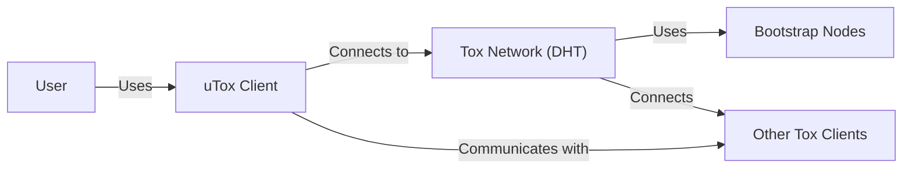
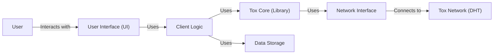
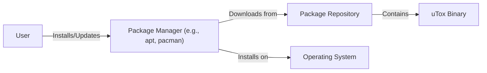
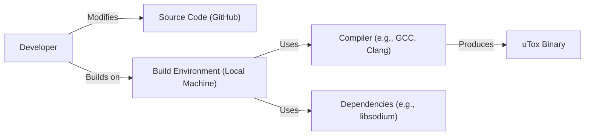

Okay, let's create a design document for the uTox project.

# BUSINESS POSTURE

uTox is an open-source Tox client aiming to provide secure and private communication.  The project's primary goal is to offer a user-friendly alternative to mainstream messaging applications, emphasizing privacy and security through end-to-end encryption.  Given its nature as a free and open-source project, the business model likely revolves around community contributions and potentially grants or donations, rather than direct revenue generation.  The project's success hinges on user adoption driven by trust in its security and privacy features.

Business Priorities:

*   Provide a secure and private communication platform.
*   Maintain user trust through transparency and open-source development.
*   Ensure ease of use and accessibility for a broad user base.
*   Foster a strong community around the project.
*   Maintain a lightweight and performant application.

Business Goals:

*   Increase user adoption.
*   Maintain a positive reputation for security and privacy.
*   Ensure the long-term sustainability of the project.

Most Important Business Risks:

*   Compromise of the encryption implementation, leading to exposure of user communications.
*   Discovery of vulnerabilities that could be exploited to compromise user devices or data.
*   Loss of user trust due to security incidents or perceived lack of privacy.
*   Lack of sufficient development resources to maintain and improve the software.
*   Competition from other secure messaging applications.
*   Legal or regulatory challenges related to the use of strong encryption.

# SECURITY POSTURE

Existing Security Controls:

*   security control: End-to-end encryption using the Tox protocol (libsodium, NaCl): This is the core security feature, ensuring that only the communicating parties can read the messages. Implemented in the Tox core library.
*   security control: Open-source codebase: Allows for public scrutiny and independent audits of the code. Described in the GitHub repository.
*   security control: Sandboxing (efforts vary by platform): Attempts to limit the impact of potential vulnerabilities. Implemented in the uTox client, platform-dependent.
*   security control: Regular updates: Addresses known vulnerabilities and improves security. Managed through the project's release process.

Accepted Risks:

*   accepted risk: Reliance on the security of the underlying Tox protocol and libraries (libsodium): While generally considered secure, vulnerabilities could be discovered in these components.
*   accepted risk: Potential for user error: Users could be tricked into revealing their private keys or installing malicious software.
*   accepted risk: Platform-specific vulnerabilities: The security of uTox depends on the security of the operating system and other software on the user's device.
*   accepted risk: Limited formal security audits: While the code is open source, comprehensive, formal security audits may be infrequent due to resource constraints.
*   accepted risk: No build verification. Build process is not secured.

Recommended Security Controls:

*   security control: Implement a reproducible build process: This would allow users to verify that the distributed binaries match the source code.
*   security control: Conduct regular, independent security audits: This would help identify and address vulnerabilities before they can be exploited.
*   security control: Implement a vulnerability disclosure program: This would encourage responsible reporting of security issues.
*   security control: Integrate static and dynamic code analysis tools into the development process: This would help identify potential vulnerabilities early on.
*   security control: Provide security hardening guides for users: This would help users configure their systems and use uTox securely.
*   security control: Implement certificate pinning for connections to bootstrap nodes: This would mitigate the risk of man-in-the-middle attacks.
*   security control: Sign releases and binaries.

Security Requirements:

*   Authentication:
    *   Users are authenticated to each other using their Tox IDs (public keys).
    *   No central authentication server is involved.
    *   The system must protect against replay attacks.
*   Authorization:
    *   Only authorized users (those added as contacts) can communicate with each other.
    *   Access control lists (ACLs) are implicit, based on the contact list.
*   Input Validation:
    *   All input from the network and user interface must be validated to prevent injection attacks and buffer overflows.
    *   Sanitize input to prevent cross-site scripting (XSS) or other injection vulnerabilities, although XSS is less relevant in a desktop application.
*   Cryptography:
    *   Use strong, well-vetted cryptographic algorithms (libsodium/NaCl).
    *   Protect private keys from unauthorized access.
    *   Ensure proper key management, including generation, storage, and destruction.
    *   Use authenticated encryption to ensure both confidentiality and integrity of messages.
    *   Implement perfect forward secrecy (PFS) to protect past communications if a key is compromised.

# DESIGN

## C4 CONTEXT

Element Descriptions:

*   Element:
    *   Name: User
    *   Type: Person
    *   Description: A person who wants to communicate securely and privately.
    *   Responsibilities: Initiates and receives communications, manages contacts, configures client settings.
    *   Security controls: Strong password (if used for local client encryption), awareness of phishing and social engineering attacks.

*   Element:
    *   Name: uTox Client
    *   Type: Software System
    *   Description: The uTox application running on the user's device.
    *   Responsibilities: Provides user interface, manages encryption/decryption, handles network communication, stores user data.
    *   Security controls: End-to-end encryption, sandboxing (platform-dependent), input validation.

*   Element:
    *   Name: Tox Network (DHT)
    *   Type: External System
    *   Description: The distributed hash table used by Tox clients to discover and connect to each other.
    *   Responsibilities: Stores and retrieves peer information, facilitates peer-to-peer connections.
    *   Security controls: Cryptographic hashing, distributed architecture (no single point of failure).

*   Element:
    *   Name: Bootstrap Nodes
    *   Type: External System
    *   Description: Initial nodes used to join the Tox network.
    *   Responsibilities: Provide initial contact points for new clients joining the network.
    *   Security controls: Should be operated by trusted entities, certificate pinning (recommended).

*   Element:
    *   Name: Other Tox Clients
    *   Type: External System
    *   Description: Other instances of Tox clients (uTox or other implementations).
    *   Responsibilities: Communicate with the user's uTox client.
    *   Security controls: End-to-end encryption, adherence to the Tox protocol.

## C4 CONTAINER

Element Descriptions:

*   Element:
    *   Name: User
    *   Type: Person
    *   Description: A person who wants to communicate securely and privately.
    *   Responsibilities: Initiates and receives communications, manages contacts, configures client settings.
    *   Security controls: Strong password (if used for local client encryption), awareness of phishing and social engineering attacks.

*   Element:
    *   Name: User Interface (UI)
    *   Type: Container
    *   Description: The graphical user interface of the uTox client.
    *   Responsibilities: Displays information to the user, receives user input.
    *   Security controls: Input validation, output encoding (to prevent XSS-like issues, though less relevant in a desktop app).

*   Element:
    *   Name: Client Logic
    *   Type: Container
    *   Description: The core logic of the uTox client.
    *   Responsibilities: Manages contacts, handles user settings, interacts with the Tox Core library.
    *   Security controls: Input validation, access control.

*   Element:
    *   Name: Tox Core (Library)
    *   Type: Container
    *   Description: The underlying Tox library that provides encryption and networking functionality.
    *   Responsibilities: Handles encryption/decryption, manages peer-to-peer connections, implements the Tox protocol.
    *   Security controls: End-to-end encryption, cryptographic protocols, secure key management.

*   Element:
    *   Name: Network Interface
    *   Type: Container
    *   Description: Handles network communication.
    *   Responsibilities: Sends and receives data over the network, interacts with the operating system's network stack.
    *   Security controls: TLS/SSL (for connections to bootstrap nodes), firewall rules (platform-dependent).

*   Element:
    *   Name: Data Storage
    *   Type: Container
    *   Description: Stores user data, such as contacts, settings, and message history (if enabled).
    *   Responsibilities: Persistently stores and retrieves data.
    *   Security controls: Encryption at rest (optional, user-configurable), file system permissions.

*   Element:
    *   Name: Tox Network (DHT)
    *   Type: External System
    *   Description: The distributed hash table used by Tox clients to discover and connect to each other.
    *   Responsibilities: Stores and retrieves peer information, facilitates peer-to-peer connections.
    *   Security controls: Cryptographic hashing, distributed architecture (no single point of failure).

## DEPLOYMENT

Possible Deployment Solutions:

1.  Manual Installation: Users download pre-built binaries or compile from source and install them manually.
2.  Package Managers: Distribution through package managers like apt (Debian/Ubuntu), pacman (Arch Linux), Homebrew (macOS), or Chocolatey (Windows).
3.  App Stores: Distribution through app stores like the Microsoft Store or the Snap Store.

Chosen Solution (Detailed Description): Package Managers

uTox can be deployed using various package managers, simplifying installation and updates for users. This approach leverages the existing infrastructure and trust mechanisms of these package managers.

Element Descriptions:

*   Element:
    *   Name: User
    *   Type: Person
    *   Description: A person who wants to install and use uTox.
    *   Responsibilities: Initiates the installation process.
    *   Security controls: Verifies the authenticity of the package manager and repository.

*   Element:
    *   Name: Package Manager (e.g., apt, pacman)
    *   Type: Software System
    *   Description: A system for managing software packages on the user's operating system.
    *   Responsibilities: Downloads, installs, updates, and removes software packages.
    *   Security controls: Package signing, repository verification, dependency checking.

*   Element:
    *   Name: Package Repository
    *   Type: Infrastructure
    *   Description: A server that hosts software packages.
    *   Responsibilities: Stores and serves software packages to package managers.
    *   Security controls: Access control, HTTPS, regular security updates.

*   Element:
    *   Name: uTox Binary
    *   Type: Software Component
    *   Description: The compiled uTox application.
    *   Responsibilities: Runs the uTox client.
    *   Security controls: Code signing (recommended), regular updates.

*   Element:
    *   Name: Operating System
    *   Type: Infrastructure
    *   Description: The user's operating system (e.g., Windows, macOS, Linux).
    *   Responsibilities: Provides the environment for running uTox.
    *   Security controls: OS security updates, firewall, sandboxing.

## BUILD

The uTox build process is not fully automated and lacks robust security controls. Currently, developers likely build the software manually on their own machines. There's no mention of a centralized CI/CD system.

Security Controls in Build Process:

*   security control: Compiler warnings and errors: Developers should address compiler warnings and errors to prevent potential vulnerabilities.
*   security control: Dependency management: Dependencies should be carefully managed and updated to address known vulnerabilities.  This is currently a manual process.

Missing Security Controls (Recommended):

*   security control: Implement a centralized CI/CD system (e.g., GitHub Actions, Travis CI, Jenkins): This would automate the build process and ensure consistency.
*   security control: Integrate static analysis tools (e.g., linters, SAST scanners) into the CI/CD pipeline: This would help identify potential vulnerabilities early on.
*   security control: Implement software composition analysis (SCA) to identify known vulnerabilities in dependencies.
*   security control: Implement reproducible builds: This would allow users to verify that the distributed binaries match the source code.
*   security control: Sign the built binaries: This would allow users to verify the authenticity of the software.
*   security control: Use hardened build environments: This would reduce the risk of compromise during the build process.

# RISK ASSESSMENT

Critical Business Processes to Protect:

*   Secure communication: Ensuring the confidentiality, integrity, and availability of user communications.
*   User privacy: Protecting user data and metadata from unauthorized access.
*   Software integrity: Maintaining the integrity of the uTox software and preventing malicious modifications.

Data to Protect and Sensitivity:

*   Message content: Highly sensitive. Must be protected with end-to-end encryption.
*   Contact lists: Sensitive. Should be protected from unauthorized access.
*   User metadata (e.g., IP addresses, connection times): Moderately sensitive. Should be minimized and protected.
*   User settings: Less sensitive, but should still be protected from unauthorized modification.
*   Private keys: Extremely sensitive. Must be protected with strong security measures.

# QUESTIONS & ASSUMPTIONS

Questions:

*   What is the specific threat model used by the Tox project?
*   Are there any plans to implement a formal vulnerability disclosure program?
*   What are the specific sandboxing mechanisms used on different platforms?
*   How are dependencies managed and updated?
*   Are there any plans to implement reproducible builds?
*   What is the process for handling security vulnerabilities?
*   Are there any plans for regular, independent security audits?
*   What is the long-term sustainability plan for the project?
*   How often is testing performed? What kind of testing?

Assumptions:

*   BUSINESS POSTURE: The project prioritizes security and privacy above all else. The project relies on community contributions and donations for sustainability.
*   SECURITY POSTURE: The Tox protocol and libsodium are considered secure. Users are responsible for securing their own devices.
*   DESIGN: The design is relatively simple and straightforward. The Tox Core library handles most of the complex security functionality. The deployment relies on existing package management systems. The build process is currently manual and lacks robust security controls.