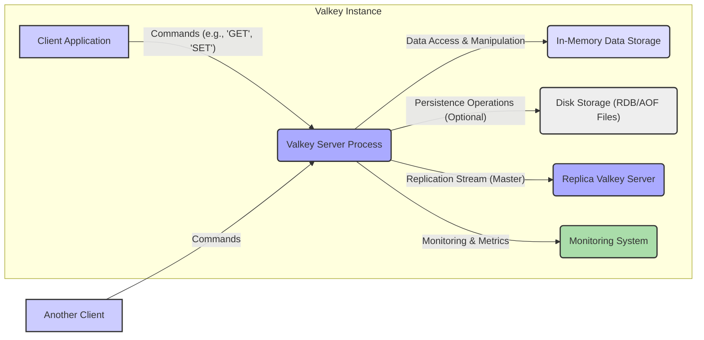
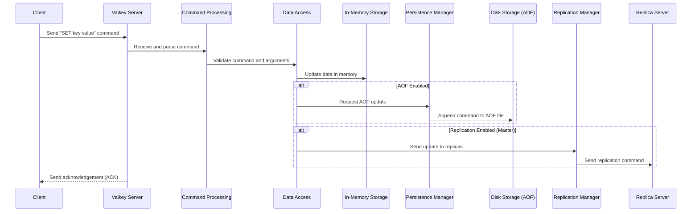
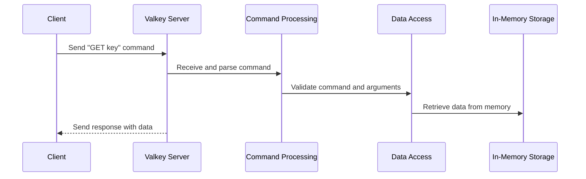

# Valkey Project Design Document

**Version:** 1.1
**Date:** October 26, 2023
**Author:** AI Software Architect

## 1. Project Overview

Valkey is envisioned as a high-performance, open-source, in-memory data structure store, functioning as a versatile database, cache, and message broker. As a fork of Redis, Valkey aims to provide a community-driven and actively maintained alternative while ensuring compatibility with the widely adopted Redis protocol. This document details the architectural design of Valkey, providing a comprehensive understanding of its components and interactions. This understanding is crucial for subsequent threat modeling activities to identify and mitigate potential security risks.

## 2. Goals and Objectives

*   Deliver a highly performant key-value store capable of handling demanding workloads.
*   Maintain a high degree of compatibility with the Redis protocol, enabling seamless migration for existing Redis users.
*   Foster a vibrant and active community around the project, ensuring long-term sustainability and innovation.
*   Provide a reliable and stable platform for storing and accessing data with low latency.
*   Support a wide range of use cases, including but not limited to caching, session management, real-time analytics, and message queuing.
*   Offer clear and comprehensive documentation for developers and operators.

## 3. Target Audience

This document is primarily intended for:

*   Software developers integrating Valkey into their applications.
*   System administrators responsible for the deployment, configuration, and maintenance of Valkey instances.
*   Security engineers tasked with performing threat modeling, security audits, and vulnerability assessments.
*   Project stakeholders seeking a detailed understanding of Valkey's technical architecture and capabilities.
*   Potential contributors to the Valkey project.

## 4. Scope

This document comprehensively covers the core architectural elements and data flow within a Valkey instance. It focuses on the logical design, interactions between components, and key functionalities. While implementation details are not the primary focus, significant architectural choices influencing security and performance are discussed.

The following aspects are within the scope:

*   Detailed description of the core server architecture and its modules.
*   Mechanisms for client interaction and command processing.
*   In-depth explanation of data storage mechanisms, both in-memory and persistent.
*   Replication strategies and their implications for data consistency and availability.
*   Overview of supported data structures and their manipulation.
*   Preliminary security considerations relevant to the architecture.

The following aspects are explicitly excluded from the scope of this document:

*   Specific deployment configurations on particular platforms (e.g., detailed Kubernetes manifests).
*   Comprehensive performance benchmarking data and tuning recommendations.
*   Detailed specifications of individual client library implementations.
*   Step-by-step operational procedures for backup, recovery, and routine maintenance.
*   Detailed code-level implementation specifics.

## 5. Architecture Overview

Valkey employs a client-server architecture where multiple clients can connect to a single Valkey server instance to execute commands and retrieve data. The server manages data in memory and optionally persists it to disk. Replication allows for data redundancy and read scalability.

### 5.1. Core Architectural Components

*   **Client Application:** Any application or service that interacts with the Valkey server by sending commands and receiving responses over a network connection.
*   **Valkey Server Process:** The central component responsible for listening for client connections, processing commands, managing data, and ensuring data consistency.
*   **In-Memory Data Storage:** The primary storage layer where data is held in RAM for rapid access. This includes various data structures like strings, lists, sets, sorted sets, and hashes.
*   **Disk Storage (RDB/AOF Files):** Optional mechanisms for persisting data to disk, allowing for data recovery after server restarts.
    *   **RDB (Redis Database) Files:** Represent point-in-time snapshots of the in-memory data.
    *   **AOF (Append Only File):** Records every write operation received by the server.
*   **Replica Valkey Server:** A secondary Valkey instance that receives and applies updates from a master server, providing data redundancy and read scalability.
*   **Monitoring System:** External systems that collect metrics and logs from the Valkey server for performance monitoring and alerting.

## 6. Component Details

### 6.1. Valkey Server Process

*   **Networking Layer:**  Handles incoming client connections, typically over TCP on a configurable port (default 6379). Manages connection state and multiplexing.
*   **Command Processing Engine:** Receives commands from clients, parses them according to the Valkey protocol, and dispatches them to the appropriate handlers. Includes validation and error handling.
*   **Data Access Layer:** Provides an interface for the command processing engine to interact with the in-memory data storage. Manages data structure operations (read, write, delete, etc.).
*   **Persistence Manager:**  Orchestrates the creation of RDB snapshots and the writing of commands to the AOF file, based on configured persistence policies.
*   **Replication Manager:**  In a master role, it manages the replication stream to replica servers, sending updates. In a replica role, it receives and applies updates from the master. Handles initial synchronization and ongoing updates.
*   **Event Loop:** Employs an event-driven, single-threaded architecture (with optional threading for certain tasks) to efficiently handle multiple client connections and background operations.
*   **Authentication and Authorization Module:**  Handles client authentication (e.g., using passwords) and authorization (e.g., using Access Control Lists - ACLs) to control access to commands and data.
*   **Pub/Sub Engine:**  Implements the publish/subscribe messaging paradigm, allowing clients to subscribe to channels and receive messages published to those channels.
*   **Lua Scripting Engine:**  Allows execution of Lua scripts within the server for complex operations and atomicity.

### 6.2. In-Memory Data Storage

*   **Data Structures:**  Implements core data structures optimized for performance:
    *   **Strings:**  Basic key-value pairs where the value is a sequence of bytes.
    *   **Lists:** Ordered collections of string elements, supporting push and pop operations from both ends.
    *   **Sets:** Unordered collections of unique string elements, supporting set operations like union, intersection, and difference.
    *   **Sorted Sets:**  Sets where each member is associated with a score, allowing for ordered retrieval and ranking.
    *   **Hashes:** Collections of field-value pairs associated with a single key.
*   **Memory Allocation:** Manages the allocation and deallocation of memory for storing data. Employs techniques like `jemalloc` for efficient memory management and fragmentation reduction.
*   **Expiration and Eviction:**  Supports setting time-to-live (TTL) for keys, allowing for automatic expiration. Implements various eviction policies (e.g., LRU, LFU) when memory limits are reached.

### 6.3. Disk Storage (RDB)

*   **Snapshotting Process:**  When triggered (either periodically or manually), the server forks a child process to write the current state of the in-memory data to an RDB file on disk. This avoids blocking the main server process.
*   **RDB File Format:**  A binary format representing the data at a specific point in time. Includes metadata and checksums for integrity verification.
*   **Recovery from RDB:** On server startup, if an RDB file is present, the server can load the data from the snapshot into memory.

### 6.4. Disk Storage (AOF)

*   **Command Appending:**  As write operations are processed, the corresponding commands are appended to the AOF file. Different fsync policies can be configured to control the frequency of writing to disk.
*   **AOF File Format:**  A text-based file containing a sequence of commands in the Valkey protocol format.
*   **Recovery from AOF:** On server startup, if an AOF file is present, the server can replay the commands from the file to reconstruct the data.
*   **AOF Rewriting:**  To reduce the size of the AOF file, a background process can rewrite it by creating a new, smaller AOF file containing the minimal set of commands to recreate the current data state.

### 6.5. Replication

*   **Master-Replica Topology:**  Data is primarily written to the master server, and changes are propagated to one or more replica servers.
*   **Asynchronous Replication:**  Replication is typically asynchronous, meaning the master does not wait for confirmation from replicas before acknowledging the write to the client. This provides better performance but can lead to potential data loss in case of a master failure before replication.
*   **Full Synchronization:** When a replica connects to a master for the first time or after a disconnection, a full synchronization occurs. The master creates an RDB snapshot and sends it to the replica.
*   **Incremental Synchronization:** After the initial full synchronization, the master sends a stream of commands to the replica to keep it up-to-date with the changes.
*   **Replication Lag:**  The delay between a write operation on the master and its application on the replica. Monitoring replication lag is crucial for understanding data consistency.

## 7. Data Flow

### 7.1. Write Operation Flow (e.g., SET key value)

### 7.2. Read Operation Flow (e.g., GET key)

## 8. Security Considerations

This section outlines key security considerations for Valkey, providing a foundation for detailed threat modeling.

*   **Authentication and Authorization:**
    *   **Password Authentication:** Valkey supports password-based authentication using the `AUTH` command. Weak or default passwords pose a significant risk.
    *   **Access Control Lists (ACLs):**  ACLs provide granular control over user permissions, allowing restrictions on commands and keys. Misconfigured ACLs can lead to unauthorized access.
*   **Network Security:**
    *   **Unencrypted Communication:** By default, communication between clients and the Valkey server is unencrypted, making it vulnerable to eavesdropping and man-in-the-middle attacks. Implementing TLS/SSL encryption is crucial for protecting sensitive data in transit. This can be achieved through a reverse proxy or potentially native TLS support in future versions.
    *   **Port Exposure:**  Exposing the Valkey port (default 6379) directly to the public internet without proper firewall rules is a significant security risk.
*   **Data Security:**
    *   **Data Confidentiality in Memory:** Data stored in memory is not encrypted by default. For sensitive data, consider using encryption at the application level or exploring potential future encryption features.
    *   **Data Confidentiality at Rest:** RDB and AOF files on disk are not encrypted by default. Encrypting the filesystem or using encryption features if available is recommended.
*   **Command Injection:**  Care must be taken when constructing Valkey commands based on external input to prevent command injection vulnerabilities.
*   **Denial of Service (DoS):**
    *   **Connection Exhaustion:** Attackers can exhaust server resources by opening a large number of connections. Configuring `maxclients` and implementing connection rate limiting can mitigate this.
    *   **Command Abuse:** Certain commands, if abused, can consume significant server resources. Monitoring and potentially restricting access to resource-intensive commands is important.
*   **Replication Security:**  Communication between master and replica servers should also be secured to prevent unauthorized data access or modification.
*   **Lua Scripting Security:**  If Lua scripting is enabled, ensure that scripts are carefully reviewed and validated to prevent malicious code execution.
*   **Vulnerability Management:**  Staying up-to-date with security patches and updates is crucial for addressing known vulnerabilities.

## 9. Deployment Model

Valkey offers several deployment options, each with its own implications for scalability, availability, and complexity:

*   **Standalone Instance:** A single Valkey server instance. Simplest to deploy but offers no redundancy or high availability. Suitable for development or non-critical applications.
*   **Master-Replica Setup:**  One master server accepting writes and one or more replica servers for read scalability and data redundancy. Requires manual failover in case of master failure.
*   **Sentinel for High Availability:**  Employs a cluster of Sentinel processes to monitor master and replica instances. Sentinels automatically perform failover to a replica if the master becomes unavailable. Provides automated high availability.
*   **Cluster Mode:**  Data is sharded across multiple Valkey nodes. Provides horizontal scalability for both read and write operations. More complex to set up and manage but offers the highest scalability and availability.

## 10. Assumptions and Constraints

*   The underlying network infrastructure is assumed to be reasonably reliable, although security measures should still be implemented to protect against network-based attacks.
*   Performance characteristics are highly dependent on the underlying hardware, network latency, and Valkey configuration.
*   This design document describes the core Valkey functionality. Extensions and modules may introduce additional architectural considerations.
*   Security best practices for the operating system and underlying infrastructure are assumed to be in place.

## 11. Future Considerations

*   **Native TLS/SSL Support:** Implementing native TLS/SSL encryption directly within the Valkey server to secure client connections without relying on external proxies.
*   **Enhanced Security Features:** Exploring options for data encryption at rest (for RDB and AOF files) and potentially in-memory encryption. Investigating more advanced authentication and authorization mechanisms.
*   **Improved Monitoring and Observability:**  Developing richer metrics and logging capabilities for better performance monitoring, troubleshooting, and security auditing.
*   **Quorum-Based Replication:**  Exploring options for more robust replication with quorum-based acknowledgements to improve data consistency guarantees.
*   **Community-Driven Development:**  The future direction of Valkey will be significantly influenced by community contributions, feedback, and the evolving needs of its users.
