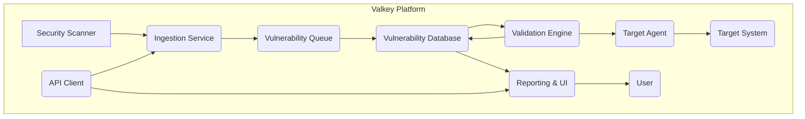
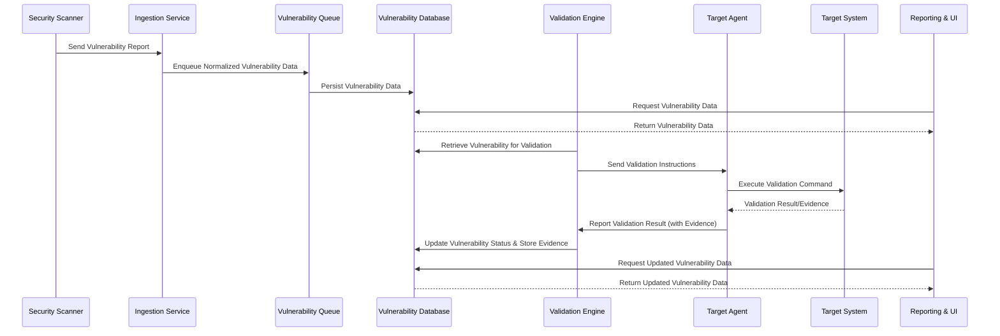

## Project Design Document: Valkey - Vulnerability Validation Platform (Improved)

**1. Introduction**

This document details the architecture and design of Valkey, an open-source platform designed to automate the verification of vulnerabilities identified by security scanners. Valkey aims to significantly reduce the burden of manual verification, minimize false positives, and provide security teams with actionable intelligence for efficient remediation. This document serves as a comprehensive blueprint for the system, outlining its components, interactions, and data flow. It is specifically intended to be used as the foundation for subsequent threat modeling activities.

**2. Goals**

* **Enhanced Automated Vulnerability Validation:**  Go beyond basic verification by incorporating multiple validation techniques and providing detailed evidence.
* **Comprehensive Security Scanner Integration:** Support a wide range of security scanners through a flexible plugin architecture.
* **Centralized and Auditable Validation Workflow:** Offer a transparent and auditable platform for managing and tracking the entire vulnerability validation lifecycle.
* **Significant Reduction of False Positives:** Implement robust validation mechanisms to accurately confirm the exploitability and impact of reported vulnerabilities.
* **Contextual and Actionable Remediation Guidance:** Provide enriched vulnerability data, including exploit details and recommended remediation steps.
* **Scalable and Resilient Architecture:** Design a system capable of handling a large volume of targets and vulnerability reports with high availability.
* **Extensible and Adaptable Platform:**  Enable the easy addition of new validation methods, integrations, and features through a modular design.

**3. High-Level Architecture**

**4. Component Details**

* **Ingestion Service:**
    * **Purpose:**  The entry point for vulnerability reports, responsible for receiving and processing data from various sources.
    * **Functionality:**
        * Accepts vulnerability reports in diverse formats (e.g., JSON, XML, CSV) through dedicated parsers.
        * Normalizes and standardizes vulnerability data into a consistent internal representation.
        * Performs initial validation of the report structure and data integrity.
        * Enriches vulnerability data with metadata (e.g., source scanner, ingestion timestamp).
        * Pushes normalized vulnerability data onto the "Vulnerability Queue".
        * Provides a secure API endpoint for programmatic submission of vulnerability reports.
    * **Technology Considerations:**  Likely implemented as a microservice utilizing a lightweight framework (e.g., Flask, FastAPI). Employs a message queue (e.g., Kafka, RabbitMQ) for asynchronous processing and decoupling.

* **Vulnerability Queue:**
    * **Purpose:**  A temporary holding area for ingested vulnerabilities before they are processed and stored.
    * **Functionality:**
        * Provides asynchronous decoupling between the Ingestion Service and the Vulnerability Database.
        * Ensures message durability and fault tolerance.
        * Enables scaling of the Ingestion Service independently of the database.
    * **Technology Considerations:**  A robust message broker such as Kafka or RabbitMQ.

* **Vulnerability Database:**
    * **Purpose:**  The central repository for storing and managing all vulnerability-related data.
    * **Functionality:**
        * Persistently stores normalized vulnerability details, including CVE ID, description, severity scores (e.g., CVSS), affected target information, and scanner-specific details.
        * Tracks the complete validation lifecycle of each vulnerability, including status (e.g., pending, validating, confirmed, rejected), validation attempts, and results.
        * Stores detailed validation results, including logs, screenshots, and other evidence.
        * Supports efficient querying, filtering, and sorting of vulnerability data based on various criteria.
        * Provides data integrity and consistency through appropriate database constraints and transactions.
    * **Technology Considerations:**  A relational database like PostgreSQL or MySQL, chosen for its strong data consistency and querying capabilities. Consider database clustering for high availability.

* **Validation Engine:**
    * **Purpose:**  The core component responsible for orchestrating the vulnerability validation process.
    * **Functionality:**
        * Consumes vulnerabilities from the Vulnerability Database based on priority, validation method availability, and target status.
        * Selects and executes appropriate validation techniques based on vulnerability type, target system characteristics, and configured validation policies.
        * Manages a pool of validation workers or containers for parallel execution of validation tasks.
        * Communicates with Target Agents to initiate validation attempts, providing specific commands and parameters.
        * Receives and processes validation results and evidence from Target Agents.
        * Updates the vulnerability status and stores validation evidence in the Vulnerability Database.
        * Implements retry mechanisms with backoff strategies for failed validations.
        * Supports different validation methods (e.g., automated exploitation frameworks, custom scripts).
    * **Technology Considerations:**  A service capable of managing asynchronous tasks and workflows. Potentially leverages container orchestration (e.g., Kubernetes) for scalability and resource management. Might utilize workflow engines for complex validation scenarios.

* **Target Agent:**
    * **Purpose:**  A lightweight agent deployed on target systems to execute validation commands securely and report results.
    * **Functionality:**
        * Registers with the Validation Engine and reports its capabilities and target system information.
        * Securely receives validation instructions from the Validation Engine, ensuring authenticity and integrity.
        * Executes specific validation commands or scripts within a controlled environment on the target system.
        * Collects evidence of successful or failed exploitation, such as command output, screenshots, and network traffic captures.
        * Securely reports validation results and evidence back to the Validation Engine.
        * Implements security measures to prevent misuse, unauthorized access, and resource exhaustion.
        * Supports secure communication protocols (e.g., TLS with mutual authentication).
    * **Technology Considerations:**  Designed to be lightweight and compatible with various operating systems (Linux, Windows). Implemented in languages like Python, Go, or Rust for performance and security. Employs secure communication libraries.

* **Reporting & UI:**
    * **Purpose:**  Provides a user-friendly interface and API for interacting with Valkey, visualizing vulnerability data, and generating reports.
    * **Functionality:**
        * Presents a clear and interactive dashboard summarizing vulnerability status and validation progress.
        * Allows users to view, filter, and search vulnerabilities based on various criteria.
        * Displays detailed information for each vulnerability, including validation history, evidence, and remediation recommendations.
        * Enables users to manually trigger validation attempts or re-validate vulnerabilities.
        * Generates customizable reports on validation outcomes, trends, and statistics.
        * Provides a RESTful API for external systems to access vulnerability data and integrate with Valkey.
        * Implements robust user authentication and authorization mechanisms.
        * Supports role-based access control (RBAC) to manage user permissions.
    * **Technology Considerations:**  A modern web application framework (e.g., React, Angular, Vue.js) for the front-end UI, communicating with a back-end API built with frameworks like Spring Boot or Node.js.

* **API Client:**
    * **Purpose:**  Facilitates programmatic interaction with Valkey for external systems and automation scripts.
    * **Functionality:**
        * Allows secure submission of vulnerability reports.
        * Enables retrieval of vulnerability data, validation status, and reports.
        * Provides endpoints for triggering validation processes and managing configurations.
        * Supports authentication and authorization to ensure secure access.
    * **Technology Considerations:**  Standard HTTP-based RESTful API, well-documented and adhering to API design best practices.

**5. Data Flow**

**6. Security Considerations**

* **Authentication and Authorization:**
    * **User Authentication:** Implement strong authentication mechanisms for user access to the UI and API, such as multi-factor authentication (MFA) or integration with existing identity providers (e.g., OAuth 2.0, SAML).
    * **API Authentication:** Secure API access using API keys, JWTs (JSON Web Tokens), or mutual TLS. Implement rate limiting and request throttling to prevent abuse.
    * **Role-Based Access Control (RBAC):** Enforce granular access control based on user roles, restricting access to sensitive data and functionalities (e.g., only authorized users can trigger validations or view sensitive evidence).

* **Data Security:**
    * **Encryption at Rest:** Encrypt sensitive data stored in the Vulnerability Database and other persistent storage using industry-standard encryption algorithms.
    * **Encryption in Transit:** Enforce TLS/SSL encryption for all communication between components, including API calls and communication with Target Agents. Consider using mutual TLS for enhanced security.
    * **Secure Secrets Management:** Utilize a dedicated secrets management solution (e.g., HashiCorp Vault, AWS Secrets Manager) to securely store and manage API keys, database credentials, and other sensitive information. Avoid hardcoding secrets.

* **Network Security:**
    * **Network Segmentation:** Segment the network to isolate Valkey components and limit the blast radius of potential security breaches. Use firewalls and network policies to restrict communication between segments.
    * **Least Privilege Networking:** Configure firewall rules to allow only necessary network traffic between components. Restrict access to management interfaces.
    * **Secure Communication Protocols:** Enforce the use of secure communication protocols (e.g., HTTPS, SSH) for all interactions.

* **Input Validation and Sanitization:**
    * **Strict Input Validation:** Implement rigorous input validation in the Ingestion Service and API endpoints to prevent injection attacks (e.g., SQL injection, command injection, cross-site scripting).
    * **Output Sanitization:** Sanitize user-provided data before rendering it in the Reporting & UI to prevent XSS vulnerabilities.

* **Target Agent Security:**
    * **Secure Agent Deployment:** Implement secure methods for deploying and managing Target Agents, ensuring their authenticity and integrity.
    * **Agent Authentication and Authorization:**  Implement mechanisms for the Validation Engine to securely authenticate and authorize Target Agents.
    * **Least Privilege Execution:** Run Target Agents with the minimum necessary privileges required to perform validation tasks.
    * **Secure Communication Channel:** Establish a secure and authenticated communication channel between the Validation Engine and Target Agents (e.g., TLS with client certificates).
    * **Agent Isolation:** Implement measures to isolate the Target Agent's execution environment to prevent it from being compromised or used to attack other systems.

* **Logging and Auditing:**
    * **Comprehensive Logging:** Log all significant events, including user actions, API requests, validation attempts, and system errors. Include timestamps, user identifiers, and relevant details.
    * **Secure Audit Logging:** Store audit logs securely and protect them from unauthorized access or modification.
    * **Centralized Logging:** Utilize a centralized logging system for efficient analysis and monitoring.

* **Dependency Management:**
    * **Vulnerability Scanning of Dependencies:** Regularly scan Valkey's dependencies for known vulnerabilities and promptly update to patched versions.
    * **Software Bill of Materials (SBOM):** Maintain an SBOM to track all dependencies used in the project.

**7. Deployment Considerations**

* **Infrastructure as Code (IaC):** Utilize IaC tools (e.g., Terraform, CloudFormation) to automate the deployment and management of Valkey infrastructure.
* **Containerization (Docker):** Package Valkey components as Docker containers for consistent deployment and portability across different environments.
* **Orchestration (Kubernetes):** Leverage Kubernetes for managing the deployment, scaling, and health of containerized Valkey components.
* **Scalability:** Design components to be horizontally scalable to handle increasing workloads. Implement auto-scaling based on resource utilization.
* **High Availability (HA):** Implement redundancy and failover mechanisms for critical components (e.g., database, message queue, validation engine) to ensure continuous operation.
* **Monitoring and Alerting:** Implement comprehensive monitoring and alerting to track system performance, identify issues, and ensure availability.

**8. Future Enhancements**

* **Integration with Remediation Workflow Tools:**  Develop integrations with ticketing systems (e.g., Jira, ServiceNow) and automation platforms (e.g., Ansible, Chef) to streamline the remediation process.
* **Advanced and Dynamic Validation Techniques:**  Incorporate more sophisticated validation methods, such as dynamic application security testing (DAST) techniques and exploit generation frameworks.
* **Machine Learning for Enhanced False Positive Detection:**  Integrate machine learning models to analyze vulnerability data and validation results to improve the accuracy of false positive identification.
* **Intelligent Vulnerability Prioritization:**  Implement algorithms to prioritize vulnerabilities based on factors such as exploitability, impact, asset criticality, and threat intelligence.
* **Community-Driven Validation Methods:**  Enable the community to contribute and extend the platform with new validation methods and integrations through a plugin architecture.
* **Enhanced Reporting and Analytics:**  Provide more advanced reporting and analytics capabilities, including trend analysis, vulnerability aging, and remediation effectiveness metrics.

This improved design document provides a more detailed and comprehensive overview of the Valkey project, specifically focusing on aspects relevant to threat modeling. The added details on security considerations, component functionalities, and data flow will facilitate a more thorough and effective threat modeling process.