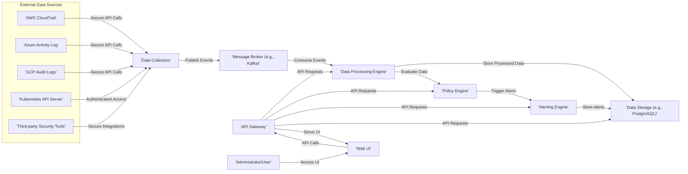
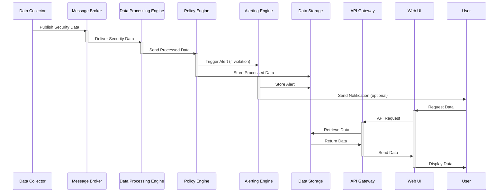
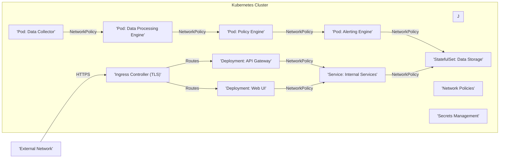

## Project Design Document: Valkey - Security and Compliance Platform (Improved)

**1. Introduction**

This document provides an enhanced design overview of the Valkey project, an open-source security and compliance platform, specifically tailored for threat modeling. It details the system's architecture, key components with their security implications, data flow with potential vulnerabilities, and deployment considerations with security best practices. This document is intended for security engineers, developers, and architects involved in the development, deployment, and security assessment of Valkey. The goal is to provide a clear and comprehensive understanding of the system's inner workings to facilitate effective threat identification and mitigation strategies.

**2. System Overview**

Valkey is designed as a modular platform to centralize security and compliance management across diverse cloud environments and infrastructure. It achieves this by systematically collecting security-relevant data, rigorously analyzing it against configurable policies, and delivering actionable insights through alerts and reports.

Key functionalities of Valkey include:

*   **Data Acquisition:** Securely gathering security telemetry from various sources, including cloud providers (AWS, Azure, GCP), Kubernetes clusters, and other security-relevant systems.
*   **Policy Management:** Defining, storing, and managing security and compliance policies using a flexible rule engine.
*   **Threat and Anomaly Detection:** Analyzing collected data against defined policies and known threat patterns to identify violations, anomalies, and potential security risks.
*   **Notification and Reporting:** Generating timely alerts for policy breaches and providing comprehensive reports on the overall security and compliance posture.
*   **Automated Response (Planned):** Future capability to automate or guide remediation workflows for identified security issues.
*   **User Interface (Web-Based):** A user-friendly web interface for configuration, policy management, alert visualization, and report generation.

**3. System Architecture**

The Valkey architecture is composed of several interconnected components, each with specific responsibilities:

*   **Data Collectors:** Securely retrieve data from external sources.
*   **Message Broker:** Enables asynchronous communication between components.
*   **Data Processing Engine:** Transforms and enriches collected data.
*   **Policy Engine:** Evaluates data against defined security policies.
*   **Alerting Engine:** Generates and manages security alerts.
*   **Data Storage:** Persists collected data, policies, alerts, and configurations.
*   **API Gateway:** Provides a secure and unified entry point for API access.
*   **Web UI:** Offers a graphical interface for user interaction.

**4. Component Details with Security Considerations**

*   **Data Collectors:**
    *   **Functionality:** Establish secure connections to external data sources using APIs, SDKs, or other secure protocols to retrieve security-relevant logs and events.
    *   **Examples:** AWS CloudTrail collector, Azure Activity Log collector, GCP Audit Logs collector, Kubernetes Audit Log collector.
    *   **Technology:**  Utilizes cloud provider SDKs, REST APIs, and potentially secure credential management systems.
    *   **Key Responsibilities:** Secure authentication and authorization with data sources, data retrieval, error handling, and initial data transformation.
    *   **Security Considerations:**
        *   **Credential Management:** Secure storage and rotation of API keys, access tokens, and other credentials.
        *   **API Security:** Protection against API abuse, rate limiting, and injection attacks.
        *   **Data Integrity:** Ensuring the integrity and authenticity of collected data.
        *   **Secure Communication:** Using TLS/SSL for all communication with external sources.

*   **Message Broker:**
    *   **Functionality:** Provides a reliable and asynchronous communication channel between Valkey components, decoupling data producers (Data Collectors) from consumers (Data Processing Engine).
    *   **Examples:** Apache Kafka, RabbitMQ (configured with security features).
    *   **Technology:**  A distributed message streaming or queuing platform with built-in security features.
    *   **Key Responsibilities:** Message routing, persistence (optional), delivery guarantees, and secure message transport.
    *   **Security Considerations:**
        *   **Authentication and Authorization:** Controlling access to topics and queues.
        *   **Encryption in Transit:** Encrypting messages during transmission between components.
        *   **Access Control:** Restricting access to the message broker infrastructure.

*   **Data Processing Engine:**
    *   **Functionality:** Consumes raw data from the Message Broker, normalizes it into a consistent format, enriches it with contextual information, and prepares it for policy evaluation.
    *   **Technology:**  Stream processing frameworks (e.g., Apache Flink, Apache Spark Streaming) or message processing libraries.
    *   **Key Responsibilities:** Data ingestion, parsing, normalization, enrichment, error handling, and data validation.
    *   **Security Considerations:**
        *   **Data Sanitization:** Preventing injection attacks by sanitizing and validating input data.
        *   **Secure Data Handling:** Ensuring sensitive data is handled securely during processing.
        *   **Dependency Management:** Keeping dependencies up-to-date to mitigate known vulnerabilities.

*   **Policy Engine:**
    *   **Functionality:** Stores, manages, and evaluates security and compliance policies against the processed data.
    *   **Technology:**  Rule-based engines or policy evaluation frameworks.
    *   **Key Responsibilities:** Policy definition, storage, evaluation, and management, ensuring policy integrity.
    *   **Security Considerations:**
        *   **Policy Integrity:** Protecting policies from unauthorized modification.
        *   **Secure Policy Evaluation:** Ensuring the policy engine itself is secure and resistant to manipulation.
        *   **Access Control:** Restricting access to policy creation and modification.

*   **Alerting Engine:**
    *   **Functionality:** Generates and manages alerts when policy violations or suspicious activities are detected by the Policy Engine. Manages the alert lifecycle and facilitates notifications.
    *   **Technology:**  A dedicated alerting framework or integration with notification services (e.g., email, Slack, PagerDuty).
    *   **Key Responsibilities:** Alert generation, prioritization, notification, and management, ensuring reliable alert delivery.
    *   **Security Considerations:**
        *   **Secure Alert Delivery:** Protecting alert notifications from interception or tampering.
        *   **Rate Limiting:** Preventing alert flooding.
        *   **Access Control:** Restricting access to alert management functions.

*   **Data Storage:**
    *   **Functionality:** Persistently stores collected data, policies, alerts, user configurations, and other critical information.
    *   **Examples:** PostgreSQL, MySQL (with encryption at rest), or a NoSQL database depending on data volume and structure.
    *   **Technology:**  Relational or NoSQL database management system with robust security features.
    *   **Key Responsibilities:** Data persistence, retrieval, indexing, backup, recovery, and data security.
    *   **Security Considerations:**
        *   **Encryption at Rest:** Encrypting sensitive data stored in the database.
        *   **Access Control:** Implementing strict access controls to the database.
        *   **Regular Backups:** Ensuring data can be recovered in case of failure or attack.
        *   **Data Integrity:** Protecting against data corruption or unauthorized modification.

*   **API Gateway:**
    *   **Functionality:** Provides a single, secure entry point for all API requests to Valkey. Handles authentication, authorization, rate limiting, and routing of requests to the appropriate backend services.
    *   **Technology:**  API gateway solutions like Kong, Tyk, or cloud provider managed API Gateways.
    *   **Key Responsibilities:** Request routing, authentication, authorization, rate limiting, security, and API management.
    *   **Security Considerations:**
        *   **Authentication and Authorization:** Implementing robust authentication (e.g., OAuth 2.0, JWT) and authorization mechanisms.
        *   **Rate Limiting and Throttling:** Protecting against denial-of-service attacks.
        *   **Input Validation:** Preventing injection attacks.
        *   **TLS/SSL Termination:** Ensuring secure communication over HTTPS.

*   **Web UI:**
    *   **Functionality:** Provides a user-friendly graphical interface for interacting with Valkey, allowing users to view alerts, configure policies, generate reports, and manage the system.
    *   **Technology:**  Modern web framework (e.g., React, Angular, Vue.js) with a secure backend API client.
    *   **Key Responsibilities:** User authentication, authorization, data visualization, and secure user interaction.
    *   **Security Considerations:**
        *   **Authentication and Authorization:** Secure user login and session management.
        *   **Protection against Web Application Vulnerabilities:** Addressing OWASP Top 10 vulnerabilities (e.g., XSS, CSRF).
        *   **Secure Communication:** Using HTTPS for all communication.
        *   **Content Security Policy (CSP):** Implementing CSP to mitigate XSS attacks.

**5. Data Flow with Potential Vulnerabilities**

The data flow within Valkey involves several stages, each with potential security vulnerabilities:

1. **Data Collection:** Data Collectors retrieve security logs. *Potential Vulnerabilities: Compromised credentials, insecure API communication, data injection during retrieval.*
2. **Message Publishing:** Collected data is published to the Message Broker. *Potential Vulnerabilities: Unauthorized access to the message broker, eavesdropping on message traffic.*
3. **Data Processing:** The Data Processing Engine normalizes and enriches data. *Potential Vulnerabilities: Data injection during processing, vulnerabilities in processing libraries.*
4. **Policy Evaluation:** Processed data is evaluated against policies. *Potential Vulnerabilities: Policy manipulation, vulnerabilities in the policy engine.*
5. **Alert Generation:** Policy violations trigger the Alerting Engine. *Potential Vulnerabilities: Alert suppression, unauthorized modification of alert rules.*
6. **Alert Notification:** Notifications are sent to configured channels. *Potential Vulnerabilities: Insecure notification channels, spoofed notifications.*
7. **Data Storage:** Processed data and alerts are stored. *Potential Vulnerabilities: Unauthorized access to the database, data breaches, data integrity issues.*
8. **API Access:** The Web UI and other clients interact via the API Gateway. *Potential Vulnerabilities: Authentication and authorization bypass, API abuse, injection attacks.*
9. **Data Retrieval and Presentation:** Data is retrieved and displayed in the Web UI. *Potential Vulnerabilities: XSS, CSRF, insecure data handling in the UI.*

**6. Deployment Architecture with Security Best Practices**

Valkey is ideally suited for a cloud-native deployment on Kubernetes, leveraging its security features.

*   **Containerization:** All components are packaged as Docker containers, enabling consistent and secure deployments.
*   **Kubernetes Orchestration:** Kubernetes manages the deployment, scaling, and health of Valkey components.
*   **Network Segmentation:** Utilize Kubernetes Network Policies to restrict network traffic between components, minimizing the impact of potential breaches.
*   **Secrets Management:** Employ Kubernetes Secrets or dedicated secrets management solutions (e.g., HashiCorp Vault) to securely store and manage sensitive credentials.
*   **Role-Based Access Control (RBAC):** Implement RBAC within Kubernetes to control access to Valkey resources and APIs.
*   ** নিয়মিত Security Updates:** Regularly update container images and Kubernetes components to patch vulnerabilities.
*   **Secure Ingress:** Use a secure Ingress controller with TLS termination to protect external access to the Web UI and API Gateway.
*   **Resource Limits and Quotas:** Configure resource limits and quotas to prevent resource exhaustion attacks.
*   **Monitoring and Logging:** Implement comprehensive monitoring and logging of Valkey components and the underlying infrastructure.

**7. Security Considerations (Detailed)**

*   **Authentication and Authorization:**
    *   Implement multi-factor authentication (MFA) for user logins.
    *   Enforce strong password policies.
    *   Utilize OAuth 2.0 or OpenID Connect for API authentication.
    *   Implement granular RBAC for both UI and API access.
    *   Securely manage API keys and service accounts.

*   **Data Security:**
    *   Encrypt sensitive data at rest using database encryption features.
    *   Enforce TLS 1.3 or higher for all communication channels.
    *   Implement data masking or anonymization where appropriate.
    *   Regularly audit data access and modifications.

*   **Infrastructure Security:**
    *   Harden the underlying operating systems and container images.
    *   Implement intrusion detection and prevention systems (IDPS).
    *   Regularly scan for vulnerabilities in dependencies and infrastructure.
    *   Follow the principle of least privilege for all service accounts and permissions.

*   **Logging and Auditing:**
    *   Centralize logs for all Valkey components.
    *   Implement audit trails for user actions and system events.
    *   Securely store and protect log data.

*   **Supply Chain Security:**
    *   Use trusted base images for containers.
    *   Scan container images for vulnerabilities.
    *   Secure the build and deployment pipeline.

**8. Future Considerations**

*   **Automated Remediation:** Implement automated workflows to address identified security and compliance issues.
*   **SIEM/SOAR Integration:** Enhance integration with existing security tools for centralized monitoring and response.
*   **Advanced Threat Intelligence:** Incorporate threat intelligence feeds for proactive threat detection.
*   **Compliance Reporting:** Automate the generation of compliance reports for various standards (e.g., SOC 2, PCI DSS).

This improved design document provides a more detailed and security-focused overview of the Valkey project, serving as a robust foundation for comprehensive threat modeling activities. It highlights potential vulnerabilities and security considerations at each stage of the system, enabling proactive security measures and risk mitigation.