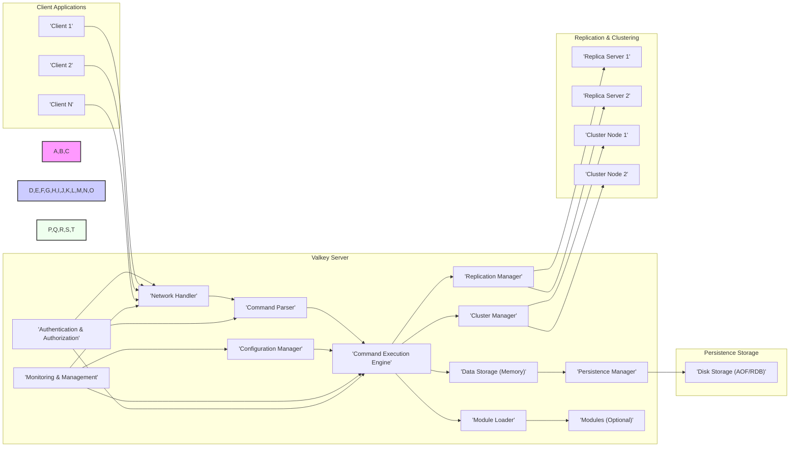
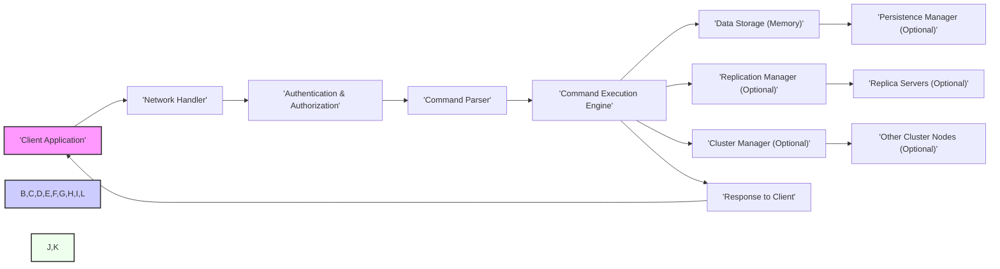
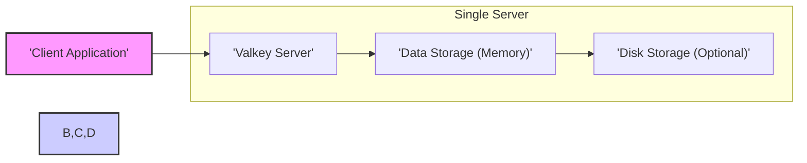
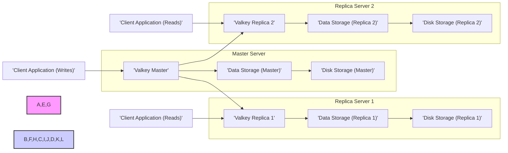
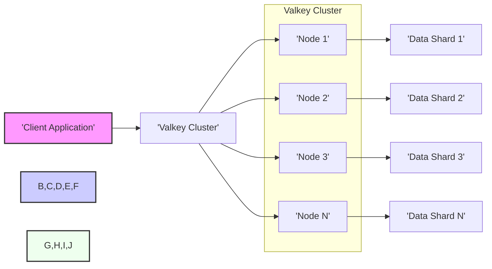

## Valkey Project Design Document

**Version:** 1.1
**Date:** October 27, 2023
**Author:** AI Software Architecture Expert

---

### 1. Project Overview

**Project Name:** Valkey

**Project Repository:** [https://github.com/valkey-io/valkey](https://github.com/valkey-io/valkey)

**Project Description:** Valkey is an open-source, high-performance key-value store, forked from Redis. It is designed to be a drop-in replacement for Redis, offering enhanced performance, stability, and features while maintaining compatibility with the Redis protocol. Valkey aims to provide a robust and scalable solution for various use cases requiring fast data access and manipulation, such as caching, session management, real-time analytics, and message queuing. Valkey is designed with security in mind, incorporating best practices to protect data and infrastructure.

**Key Features:**

*   **High Performance:** Optimized for speed and low latency through efficient memory management and optimized algorithms.
*   **Redis Protocol Compatibility:**  Supports the Redis client protocol, ensuring seamless migration and interoperability with existing Redis clients and tools.
*   **Persistence:** Offers flexible persistence options including RDB (Redis Database) snapshots and AOF (Append-Only File) to ensure data durability and recovery.
*   **Replication:** Supports robust master-replica replication with asynchronous and semi-synchronous options for high availability, read scalability, and disaster recovery.
*   **Clustering:** Enables horizontal scaling and data sharding across multiple nodes, providing scalability and fault tolerance for large datasets and high traffic loads.
*   **Modules:** Extensible architecture allowing for custom functionality through loadable modules, enabling users to tailor Valkey to specific needs.
*   **Data Structures:** Supports a rich set of data structures including strings, hashes, lists, sets, sorted sets, bitmaps, and hyperloglogs, catering to diverse application requirements.
*   **Transactions:** Provides ACID transactions for reliable execution of multiple commands as a single atomic unit, ensuring data consistency.
*   **Pub/Sub:** Supports publish/subscribe messaging patterns for real-time communication and event-driven architectures.
*   **Lua Scripting:** Allows server-side scripting using Lua for complex operations and custom logic execution directly within the server.
*   **Security Features:** Includes password authentication, ACLs (Access Control Lists), and TLS/SSL encryption for secure access and data protection.

### 2. Goals and Objectives

*   **Primary Goal:** To create a robust, high-performance, secure, and open-source key-value store that is a superior alternative to Redis.
*   **Objectives:**
    *   Maintain full compatibility with the Redis protocol and strive for complete feature parity with relevant Redis versions.
    *   Significantly improve performance and resource efficiency compared to upstream Redis, especially under heavy load.
    *   Enhance stability and reliability to meet the demands of mission-critical production deployments.
    *   Build a strong emphasis on security, proactively addressing potential vulnerabilities and providing robust security features.
    *   Foster an open, transparent, and collaborative community around the project, encouraging contributions and feedback.
    *   Provide comprehensive, well-maintained documentation and responsive community support for users of all levels.
    *   Enable flexible extensibility through a well-defined and secure module API.
    *   Offer a range of robust security features to protect data confidentiality, integrity, and availability, and to secure the system against various threats.

### 3. Target Audience

*   **Developers:** Software engineers building applications that require a fast, reliable, and secure key-value store for caching, session management, real-time data processing, and more.
*   **DevOps Engineers:** System administrators and operations teams responsible for deploying, managing, and securing data infrastructure in various environments (on-premise, cloud, hybrid).
*   **Security Engineers:** Professionals focused on securing infrastructure and applications, who need to understand Valkey's security features and potential vulnerabilities for threat modeling and risk mitigation.
*   **Organizations:** Businesses of all sizes seeking a high-performance, scalable, and secure key-value store solution to improve application performance, enhance user experience, and manage critical data.
*   **Open Source Community:** Individuals and organizations interested in contributing to and leveraging open-source data infrastructure projects, and who value performance, security, and community collaboration.

### 4. System Architecture

Valkey employs a client-server architecture, consistent with Redis. Clients communicate with the Valkey server using the standard Redis protocol. The server processes requests, manages data primarily in memory, persists data to disk as configured, and coordinates with other Valkey instances in replication or clustering setups.

**Component Description:** (Components descriptions are enhanced from previous version)

*   **Client Applications:** Applications written in various programming languages using Redis-compatible client libraries. These applications initiate requests to store, retrieve, and manipulate data within Valkey.
*   **Network Handler:**  The entry point for client connections. It listens on configured ports (default 6379), accepts incoming TCP connections, and manages network I/O using asynchronous mechanisms for high concurrency. It is responsible for initial protocol handling and passing connection data to the Command Parser.
*   **Command Parser:**  Analyzes incoming client requests based on the Redis protocol. It decodes commands and their arguments, validating syntax and ensuring protocol compliance. It translates the raw byte stream into structured command objects for the Command Execution Engine.
*   **Command Execution Engine:** The central processing unit of Valkey. It receives parsed commands and orchestrates their execution. This involves interacting with Data Storage for data access, Persistence Manager for durability, Replication Manager for data propagation, Cluster Manager for distributed operations, Module Loader for extensions, and Authentication & Authorization for security checks.
*   **Data Storage (Memory):**  The primary data store, holding key-value pairs and complex data structures in memory for optimal performance. Valkey utilizes efficient data structures optimized for speed and memory usage. Memory management is critical here, including allocation, deallocation, and potential eviction policies.
*   **Persistence Manager:**  Responsible for persisting data to disk to ensure durability. It implements both RDB snapshotting (periodic point-in-time backups) and AOF (append-only file) logging (recording every write operation). Configuration options allow users to choose the persistence strategy that best suits their needs.
*   **Replication Manager:**  Handles master-replica replication to provide high availability and read scalability. It manages synchronization of data from the master to replicas, monitors replica health, and facilitates failover procedures in case of master failure. It supports asynchronous and semi-synchronous replication modes.
*   **Cluster Manager:**  Implements Valkey's clustering capabilities, enabling data sharding and distributed operations across multiple nodes. It manages cluster topology, handles data distribution and redistribution, and ensures fault tolerance in a distributed environment. It uses a gossip protocol for cluster communication and consensus mechanisms for data consistency.
*   **Module Loader:**  Provides a mechanism to dynamically load external modules, extending Valkey's functionality with custom commands and features. It manages module loading, initialization, and interaction with the core server. Security considerations are paramount in module loading to prevent malicious or unstable modules from compromising the system.
*   **Modules (Optional):**  Dynamically loadable libraries that provide custom commands, data types, or functionalities. Modules can extend Valkey for specific use cases, but must be carefully vetted for security and stability.
*   **Configuration Manager:**  Loads and manages Valkey's configuration from configuration files (typically `valkey.conf`) and command-line arguments. It handles parsing configuration directives, validating settings, and making configuration parameters available to other components.
*   **Monitoring & Management:**  Provides interfaces for monitoring Valkey's performance, resource usage, and overall health. This includes metrics export (e.g., for Prometheus), logging, and command-line tools for administration and diagnostics.
*   **Authentication & Authorization:** Enforces security policies by verifying client credentials and controlling access to commands and data. It implements password-based authentication and ACLs (Access Control Lists) to define granular permissions for users and clients.
*   **Disk Storage (AOF/RDB):**  Physical storage on disk where persistent data is stored by the Persistence Manager. This can be local disk, network-attached storage (NAS), or cloud-based storage depending on the deployment environment.
*   **Replica Servers:** Valkey instances configured as replicas of a master server. They receive data updates from the master and serve read requests, enhancing read scalability and providing redundancy.
*   **Cluster Nodes:** Individual Valkey server instances that collectively form a cluster. Each node is responsible for a subset of the data and participates in cluster management and distributed operations.

### 5. Data Flow

A typical client request, such as `GET key`, illustrates the data flow within Valkey:

**Data Flow Description:** (Data flow description is enhanced from previous version)

1.  **Client Request:** The client application sends a command (e.g., `GET key`) to the Valkey server.
2.  **Network Handling:** The Network Handler receives the request over the network connection, establishing a connection if necessary.
3.  **Authentication & Authorization:** Before parsing the command, the Authentication & Authorization component verifies the client's identity and permissions. This step ensures that only authorized clients can access Valkey and perform requested operations. If authentication or authorization fails, an error response is immediately sent back to the client.
4.  **Command Parsing:** If authentication and authorization are successful, the Command Parser analyzes the request to identify the command and its arguments, ensuring they conform to the Redis protocol.
5.  **Command Execution:** The Command Execution Engine takes the parsed command and executes it. This may involve:
    *   **Data Storage Interaction:** Accessing the in-memory Data Storage to retrieve or modify data based on the command.
    *   **Persistence (Optional):**  If the command is a write operation and persistence is enabled, the Persistence Manager is invoked to update the AOF or RDB files.
    *   **Replication (Optional):**  For write operations in a master-replica setup, the Replication Manager propagates the command to replica servers.
    *   **Clustering (Optional):** In a clustered environment, the Cluster Manager routes the command to the appropriate cluster node based on the key and coordinates distributed operations if necessary.
6.  **Data Storage Access:** The Data Storage component performs the actual read or write operation in memory.
7.  **Persistence Update (Optional):** If persistence is enabled and the command is a write operation, the Persistence Manager updates the persistent storage on disk.
8.  **Replication Propagation (Optional):** If replication is enabled and the command is a write operation on a master, the Replication Manager sends the command to replica servers for asynchronous or semi-synchronous execution.
9.  **Cluster Coordination (Optional):** In a cluster, the Cluster Manager ensures data consistency and command execution across the relevant nodes, handling data sharding and node communication.
10. **Response to Client:** The Command Execution Engine constructs a response based on the command execution result and sends it back to the client application through the Network Handler.

### 6. Key Components in Detail (Security Focused)

*   **Network Handler:**
    *   **Functionality:** Manages network connections, listens for client requests, and sends responses.
    *   **Technology:** Asynchronous I/O (epoll, kqueue), TCP sockets, Redis protocol implementation.
    *   **Security Aspects & Potential Threats:**
        *   **DDoS Attacks:** Vulnerable to SYN floods, connection floods, and application-level DoS attacks. **Mitigation:** Connection limits, rate limiting, firewalls, intrusion detection/prevention systems (IDS/IPS).
        *   **Protocol Exploits:** Vulnerabilities in Redis protocol parsing could lead to buffer overflows or other exploits. **Mitigation:** Secure coding practices, rigorous input validation, fuzzing, regular security audits.
        *   **Man-in-the-Middle (MitM) Attacks:** Unencrypted communication can be intercepted. **Mitigation:** TLS/SSL encryption for client-server communication.
    *   **Threat Modeling Focus:** Network boundary, entry point for external threats, protocol parsing logic.

*   **Authentication & Authorization:**
    *   **Functionality:** Verifies client identity and controls access to commands and data based on configured policies (ACLs).
    *   **Technology:** Password hashing algorithms, ACL implementation, user and permission management.
    *   **Security Aspects & Potential Threats:**
        *   **Brute-Force Attacks:** Password-based authentication is susceptible to brute-force attacks. **Mitigation:** Strong password policies, rate limiting on authentication attempts, account lockout mechanisms, multi-factor authentication (MFA) if feasible.
        *   **ACL Bypass:** Vulnerabilities in ACL implementation could allow unauthorized access. **Mitigation:** Thorough testing of ACL logic, regular security audits, principle of least privilege in ACL configuration.
        *   **Credential Theft:** Stolen or compromised credentials can lead to unauthorized access. **Mitigation:** Secure credential storage, TLS/SSL to protect credentials in transit, regular password rotation, monitoring for suspicious login attempts.
    *   **Threat Modeling Focus:** Access control boundary, authentication mechanism, authorization policies, credential management.

*   **Command Parser:**
    *   **Functionality:** Interprets Redis protocol commands and extracts arguments.
    *   **Technology:** Parsing logic for Redis command syntax, input validation routines.
    *   **Security Aspects & Potential Threats:**
        *   **Command Injection:** Improper parsing or validation could allow injection of malicious commands. **Mitigation:** Strict input validation, sanitization of command arguments, secure parsing libraries.
        *   **Buffer Overflows:** Parsing errors or insufficient buffer handling could lead to buffer overflows. **Mitigation:** Safe memory management practices, bounds checking, using secure parsing libraries.
        *   **Denial of Service:** Malformed commands could crash the server or consume excessive resources. **Mitigation:** Robust error handling, input validation, resource limits.
    *   **Threat Modeling Focus:** Input validation point, command processing logic, potential for injection attacks.

*   **Command Execution Engine:**
    *   **Functionality:** Executes parsed commands, interacts with data storage and other managers.
    *   **Technology:** Core Valkey logic, command implementations, transaction management, Lua scripting engine, module API interaction.
    *   **Security Aspects & Potential Threats:**
        *   **Logic Flaws in Command Implementations:** Bugs in command logic could lead to data corruption, information disclosure, or privilege escalation. **Mitigation:** Rigorous testing, code reviews, static analysis, fuzzing.
        *   **Vulnerabilities in Transaction Handling:** Issues in transaction management could lead to data inconsistencies or security breaches. **Mitigation:** Thorough testing of transaction logic, ACID property enforcement.
        *   **Lua Scripting Security:** Unsafe Lua scripts could compromise the server. **Mitigation:** Sandboxing Lua environment, limiting script capabilities, input validation within scripts, security audits of Lua scripts.
        *   **Module Vulnerabilities:** Malicious or vulnerable modules can compromise the entire Valkey instance. **Mitigation:** Secure module loading mechanisms, module signing and verification, sandboxing modules, security audits of modules.
    *   **Threat Modeling Focus:** Core logic, command processing, transaction boundaries, scripting environment, module integration point.

*   **Data Storage (Memory):**
    *   **Functionality:** Stores key-value data in memory.
    *   **Technology:** Hash tables, skip lists, memory allocation and management.
    *   **Security Aspects & Potential Threats:**
        *   **Memory Exhaustion:** Attackers could fill up memory leading to DoS. **Mitigation:** Memory limits, eviction policies (LRU, LFU), resource monitoring.
        *   **Data Leakage through Memory Dumps:** Sensitive data in memory could be exposed through memory dumps if the server process is compromised. **Mitigation:** Secure memory management, encryption of sensitive data in memory (if feasible and performance-acceptable), access control to server memory.
        *   **Data Structure Vulnerabilities:** Bugs in data structure implementations could lead to crashes or data corruption. **Mitigation:** Thorough testing of data structure implementations, secure coding practices.
    *   **Threat Modeling Focus:** Data storage boundary, memory management, potential for data leakage.

*   **Persistence Manager:**
    *   **Functionality:** Persists data to disk using AOF and RDB.
    *   **Technology:** File I/O, serialization/deserialization for RDB, command logging for AOF.
    *   **Security Aspects & Potential Threats:**
        *   **Data Corruption during Persistence:** Errors during persistence could lead to data loss or corruption. **Mitigation:** Checksums, data integrity checks, robust error handling.
        *   **Vulnerabilities in AOF/RDB Parsing:** Parsing vulnerabilities in AOF/RDB files could be exploited during recovery. **Mitigation:** Secure parsing logic, input validation, fuzzing of AOF/RDB parsers.
        *   **Unauthorized Access to Persistent Data:** If disk storage is compromised, persistent data could be accessed. **Mitigation:** Encryption at rest for RDB and AOF files, access control to storage media, secure storage configurations.
    *   **Threat Modeling Focus:** Data persistence boundary, file I/O operations, data serialization/deserialization, storage security.

*   **Replication Manager:**
    *   **Functionality:** Manages master-replica replication.
    *   **Technology:** Network communication between master and replicas, replication protocol.
    *   **Security Aspects & Potential Threats:**
        *   **Replication Data Stream Interception:** Unencrypted replication traffic can be intercepted. **Mitigation:** TLS/SSL encryption for replication traffic.
        *   **Man-in-the-Middle Attacks on Replication:** Attackers could intercept or modify replication data. **Mitigation:** Mutual authentication between master and replicas, encryption of replication traffic.
        *   **Replication Protocol Vulnerabilities:** Bugs in the replication protocol could be exploited. **Mitigation:** Secure protocol design, thorough testing, security audits.
        *   **Data Inconsistency during Failover:** Failover procedures might introduce data inconsistencies if not handled correctly. **Mitigation:** Robust failover mechanisms, consensus algorithms, data validation after failover.
    *   **Threat Modeling Focus:** Replication boundary, network communication between nodes, data synchronization, failover process.

*   **Cluster Manager:**
    *   **Functionality:** Manages cluster topology and distributed operations.
    *   **Technology:** Gossip protocol, cluster management protocol, distributed consensus mechanisms.
    *   **Security Aspects & Potential Threats:**
        *   **Cluster Communication Interception:** Unencrypted cluster communication can be intercepted. **Mitigation:** Encryption for inter-node communication within the cluster.
        *   **Node Impersonation:** Attackers could impersonate cluster nodes to gain unauthorized access or disrupt the cluster. **Mitigation:** Mutual authentication between cluster nodes, secure node bootstrapping process.
        *   **Vulnerabilities in Cluster Management Protocol:** Bugs in the cluster management protocol could be exploited to disrupt the cluster or gain control. **Mitigation:** Secure protocol design, thorough testing, security audits.
        *   **Data Loss or Inconsistencies in Distributed Operations:** Errors in distributed operations could lead to data loss or inconsistencies across the cluster. **Mitigation:** Robust distributed algorithms, consensus mechanisms, data validation in distributed operations.
    *   **Threat Modeling Focus:** Cluster boundary, inter-node communication, distributed data management, cluster management protocol.

*   **Module Loader & Modules:**
    *   **Functionality:** Loads and executes external modules.
    *   **Technology:** Dynamic linking, module API.
    *   **Security Aspects & Potential Threats:**
        *   **Malicious Modules:** Loading untrusted modules can introduce arbitrary code execution vulnerabilities. **Mitigation:** Module signing and verification, sandboxing modules, restricted module API, code reviews of modules.
        *   **Module Vulnerabilities:** Vulnerabilities in modules can compromise the Valkey instance. **Mitigation:** Security audits of modules, vulnerability scanning, secure module development guidelines.
        *   **Insecure Module Loading Mechanisms:** Vulnerabilities in the module loading process itself. **Mitigation:** Secure loading mechanisms, access control to module loading functionality.
    *   **Threat Modeling Focus:** Module integration point, external code execution, module API security.

*   **Configuration Manager:**
    *   **Functionality:** Loads and manages Valkey's configuration.
    *   **Technology:** Configuration file parsing, command-line argument parsing.
    *   **Security Aspects & Potential Threats:**
        *   **Insecure Default Configurations:** Weak default settings could expose vulnerabilities. **Mitigation:** Secure default configurations, security hardening guides, configuration validation.
        *   **Vulnerabilities in Configuration Parsing:** Parsing vulnerabilities could be exploited to inject malicious configurations. **Mitigation:** Secure parsing logic, input validation for configuration parameters.
        *   **Unauthorized Modification of Configuration:** Unauthorized changes to configuration can weaken security. **Mitigation:** Access control to configuration files, audit logging of configuration changes.
    *   **Threat Modeling Focus:** Configuration management boundary, configuration file access, configuration parsing logic.

*   **Monitoring & Management:**
    *   **Functionality:** Provides tools for monitoring and managing Valkey.
    *   **Technology:** Metrics export, logging, CLI, management APIs.
    *   **Security Aspects & Potential Threats:**
        *   **Exposure of Sensitive Information:** Monitoring interfaces could expose sensitive data (e.g., keys, performance metrics). **Mitigation:** Access control to monitoring interfaces, sanitization of monitoring data, secure monitoring protocols.
        *   **Vulnerabilities in Management Interfaces:** Management interfaces (CLI, APIs) could have vulnerabilities. **Mitigation:** Secure coding practices for management tools, input validation, authentication and authorization for management access.
        *   **Unauthorized Access to Monitoring Data:** Unauthorized access to monitoring data could reveal sensitive information or be used for reconnaissance. **Mitigation:** Access control to monitoring systems, secure monitoring channels.
    *   **Threat Modeling Focus:** Management interface boundary, monitoring data access, potential for information disclosure.

### 7. Deployment Architecture (Enhanced)

**Example 1: Single Instance Deployment (Development/Testing)**

*   **Network Configuration:** Valkey server listens on a specified port (default 6379) on a single network interface. Firewall rules should restrict access to this port to only authorized development/testing networks.
*   **Security:** Password authentication should be enabled even for development. Persistence (RDB or AOF) is optional for testing but recommended for data durability even in development environments.
*   **Monitoring:** Basic monitoring can be done using `valkey-cli` and server logs.

**Example 2: Master-Replica Deployment (High Availability/Read Scalability)**

*   **Network Configuration:** Master and replicas should be on the same trusted network. Clients writing data connect to the master, while read-heavy applications can distribute reads across replicas. Firewall rules should restrict access to Valkey ports to only application servers and monitoring systems. Consider using a dedicated network for replication traffic.
*   **Load Balancing:** Read load balancing can be implemented at the application level or using a dedicated load balancer (e.g., HAProxy, Nginx) to distribute read requests across replicas.
*   **Security:** Enable password authentication and ACLs on both master and replicas. Use TLS/SSL for client-server communication and for replication traffic. Monitor replication lag and health of master and replicas. Implement automated failover mechanisms for high availability.
*   **Monitoring:** Comprehensive monitoring of master and replicas is crucial, including replication status, resource usage, and error logs. Use monitoring tools like Prometheus and Grafana.

**Example 3: Clustered Deployment (Horizontal Scalability)**

*   **Network Configuration:** Cluster nodes should be deployed on a low-latency, high-bandwidth network. Clients connect to any cluster node, and the cluster handles request routing and data sharding. Firewall rules should restrict access to cluster ports to only application servers and other cluster nodes. Use a dedicated network for inter-node cluster communication.
*   **Load Balancing:** Client libraries typically handle connection to the cluster and request routing. Smart client libraries are recommended for optimal performance and cluster awareness.
*   **Security:** Enable password authentication and ACLs on all cluster nodes. Use TLS/SSL for client-server communication and for inter-node cluster communication. Secure the cluster bootstrapping process and node joining procedures. Implement robust monitoring of cluster health, node status, and data distribution.
*   **Monitoring:** Advanced monitoring is essential for clusters, including cluster topology, shard distribution, node health, and performance metrics for each node. Use cluster-aware monitoring tools.

### 8. Technology Stack (Detailed)

*   **Core Language:** C (for performance, memory efficiency, and low-level system access)
    *   **Standard Libraries:** POSIX standard library, glibc (or musl libc depending on target OS).
*   **Networking:**
    *   **TCP/IP Sockets:** Standard BSD sockets API for network communication.
    *   **Asynchronous I/O:** `epoll` (Linux), `kqueue` (macOS, BSD), `event ports` (Solaris) for efficient handling of concurrent connections.
    *   **TLS/SSL:** OpenSSL or similar library for implementing TLS/SSL encryption for secure communication.
*   **Data Structures:**
    *   **Hash Tables:** Likely custom-optimized hash table implementation in C for key-value storage.
    *   **Skip Lists:** For sorted sets, potentially a custom skip list implementation.
    *   **SDS (Simple Dynamic Strings):**  Likely using SDS library (similar to Redis) for efficient string management in C.
    *   **Intsets and ZipLists:** Optimized data structures for small sets and lists to save memory.
*   **Persistence:**
    *   **File I/O:** Standard C file I/O functions (`fopen`, `fwrite`, `fread`, `fclose`, etc.).
    *   **RDB Serialization:** Custom binary serialization format for RDB snapshots, likely implemented in C for performance.
    *   **AOF Logging:**  Appending commands to a file in Redis protocol format.
*   **Scripting:**
    *   **Lua:** Lua 5.1 or later, embedded Lua interpreter.
    *   **Lua C API:** For interaction between Valkey core and Lua scripts.
*   **Configuration:**
    *   **Configuration File Parsing:** Custom parser for `.conf` style configuration files, likely implemented in C.
    *   **Command-line Argument Parsing:** Standard C argument parsing mechanisms.
*   **Build System:**
    *   `make` or `cmake` for build automation and dependency management.
*   **Operating System:**
    *   **Linux:** Primary target platform, utilizing Linux-specific features like `epoll`.
    *   **macOS:** Support for macOS using `kqueue`.
    *   **BSD variants:** Potential support for other BSD-based systems.
    *   **Windows:**  Likely less prioritized, but potential for Windows support using Windows-specific APIs.
*   **Monitoring & Management:**
    *   **Metrics Export:** Prometheus format for metrics exposition.
    *   **Logging:** Standard system logging mechanisms (syslog) or file-based logging.
    *   **CLI:** `valkey-cli` command-line interface (likely implemented in C).

### 9. Future Considerations (Security Focused)

*   **Enhanced Authentication and Authorization:**
    *   **Role-Based Access Control (RBAC):** Implement RBAC for more granular permission management.
    *   **Multi-Factor Authentication (MFA):** Explore options for integrating MFA for enhanced authentication security.
    *   **Integration with External Authentication Providers:** Support integration with LDAP, Active Directory, OAuth 2.0, and other enterprise authentication systems.
*   **Advanced Security Features:**
    *   **Data Masking and Redaction:** Implement mechanisms to mask or redact sensitive data in logs and monitoring outputs.
    *   **Data Encryption in Memory:** Investigate performance-efficient methods for encrypting sensitive data while in memory.
    *   **Security Information and Event Management (SIEM) Integration:** Enhance logging and auditing to facilitate integration with SIEM systems for security monitoring and incident response.
    *   **Anomaly Detection:** Explore integrating anomaly detection capabilities to identify and respond to suspicious activities.
*   **Module Security Enhancements:**
    *   **Stricter Module Sandboxing:** Enhance module sandboxing to further limit module capabilities and prevent module escape.
    *   **Formal Module Security Audits:** Establish a process for formal security audits of popular and community-contributed modules.
    *   **Module Signing and Verification:** Implement mandatory module signing and verification to ensure module integrity and authenticity.
*   **Proactive Security Practices:**
    *   **Regular Security Audits and Penetration Testing:** Conduct regular security audits and penetration testing by external security experts.
    *   **Vulnerability Disclosure Program:** Establish a clear vulnerability disclosure program to encourage responsible reporting of security issues.
    *   **Security Focused Development Practices:** Integrate security considerations into all phases of the development lifecycle (Security by Design).
    *   **Dependency Scanning and Management:** Implement automated dependency scanning and management to identify and address vulnerabilities in third-party libraries.

### 10. Threat Modeling Readiness Checklist

This document is designed to be used for threat modeling. To ensure its effectiveness, consider the following checklist:

*   [x] **Clear System Boundary Definition:** The document clearly defines the boundaries of the Valkey system and its interactions with external entities (clients, other nodes, storage).
*   [x] **Component Identification:** Key components of the system are identified and described in detail (Network Handler, Command Parser, etc.).
*   [x] **Data Flow Diagrams:** Data flow diagrams illustrate the movement of data through the system for typical operations.
*   [x] **Security Considerations per Component:** Security aspects and potential threats are discussed for each key component.
*   [x] **Deployment Scenarios:** Different deployment architectures are outlined, highlighting variations in security considerations.
*   [x] **Technology Stack Details:** The technology stack provides context for potential technology-specific vulnerabilities.
*   [x] **Security Feature Inventory:** Existing and planned security features are listed.
*   [x] **Threat Modeling Focus Areas:** Each component description includes a "Threat Modeling Focus" section to guide threat modeling efforts.

This improved design document provides a more detailed and security-focused overview of the Valkey project, making it more suitable for threat modeling and security analysis. It includes enhanced descriptions, more specific security considerations, and expanded deployment and technology stack details. The addition of a threat modeling readiness checklist further ensures its utility for security assessments.