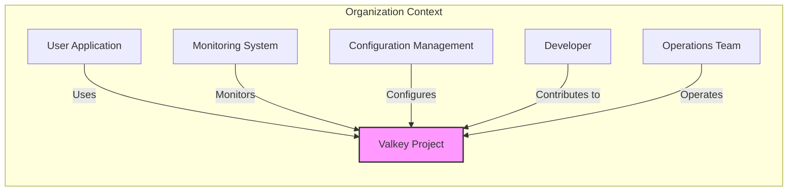
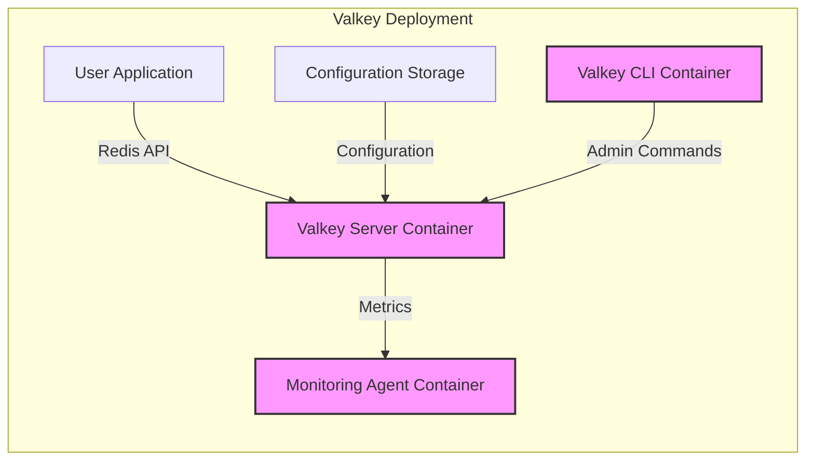
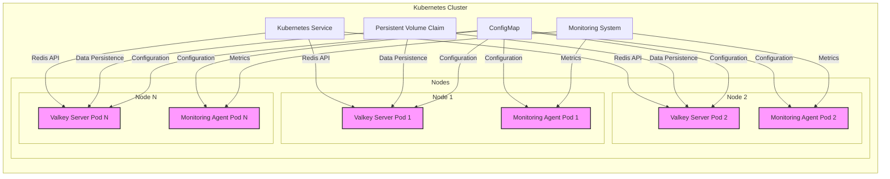
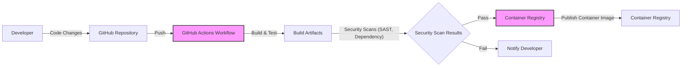

# BUSINESS POSTURE

* Business Priorities
 - High Performance: Valkey is designed to offer superior performance compared to traditional key-value stores, enabling faster data access and processing.
 - Scalability: The project aims to provide a scalable solution that can handle increasing data volumes and user traffic efficiently.
 - Redis Compatibility: Maintaining compatibility with the Redis API allows users to migrate easily from Redis and leverage existing client libraries and tools.
 - Open Source: Being open source fosters community contribution, transparency, and wider adoption.

* Business Goals
 - Provide a high-performance, scalable, and Redis-compatible key-value store solution.
 - Attract users seeking improved performance and scalability for their data-intensive applications.
 - Build a strong open-source community around the Valkey project.
 - Establish Valkey as a leading alternative to Redis in specific use cases.

* Business Risks
 - Data Loss: Potential data loss due to software bugs, hardware failures, or operational errors.
 - Unauthorized Access: Risk of unauthorized access to sensitive data stored in Valkey, leading to data breaches and confidentiality violations.
 - Performance Degradation: Performance issues due to misconfiguration, resource constraints, or denial-of-service attacks, impacting application availability and user experience.
 - Compatibility Issues: Incompatibilities with the Redis API could hinder migration and adoption, limiting the project's reach.
 - Security Vulnerabilities: Security flaws in the Valkey codebase or its dependencies could be exploited by attackers, compromising data integrity and system availability.
 - Operational Complexity: Managing and operating a distributed key-value store like Valkey can be complex, requiring specialized skills and tools.

# SECURITY POSTURE

* Existing Security Controls
 - security control: Password Authentication - Valkey, being Redis compatible, likely supports password-based authentication to control access to the server. (Implemented in Valkey server configuration)
 - security control: Access Control Lists (ACLs) - Redis ACLs for fine-grained access control based on users and permissions are likely supported. (Implemented in Valkey server configuration)
 - security control: TLS Encryption - Support for TLS encryption to secure communication between clients and the Valkey server. (Implemented in Valkey server configuration)
 - security control: Security Audits - Open-source nature allows for community security reviews and audits. (Described in open-source project practices)

* Accepted Risks
 - accepted risk: Reliance on Community Security Contributions - Security improvements and vulnerability patching depend on the active open-source community.
 - accepted risk: Potential Vulnerabilities in Dependencies - Valkey relies on external libraries and dependencies, which may contain security vulnerabilities.
 - accepted risk: Default Configurations - Default configurations might not be optimally secure and require manual hardening.

* Recommended Security Controls
 - security control: Secure Software Development Lifecycle (SSDLC) - Implement a formal SSDLC process including security requirements, secure design, code reviews, security testing, and vulnerability management.
 - security control: Automated Security Scanning - Integrate SAST and DAST tools into the CI/CD pipeline to automatically detect security vulnerabilities in the codebase.
 - security control: Dependency Scanning - Regularly scan dependencies for known vulnerabilities and update them promptly.
 - security control: Penetration Testing - Conduct periodic penetration testing by security experts to identify and address security weaknesses.
 - security control: Security Hardening Guides - Provide comprehensive security hardening guides for different deployment environments.
 - security control: Incident Response Plan - Develop and maintain an incident response plan to effectively handle security incidents.

* Security Requirements
 - Authentication:
  - Requirement: Valkey MUST support strong authentication mechanisms to verify the identity of clients connecting to the server.
  - Requirement: Authentication SHOULD be configurable and adaptable to different environments and security policies.
  - Requirement: Consider multi-factor authentication for enhanced security in sensitive deployments.
 - Authorization:
  - Requirement: Valkey MUST implement fine-grained authorization controls to restrict access to specific data and commands based on user roles and permissions.
  - Requirement: Authorization policies SHOULD be centrally managed and auditable.
  - Requirement: Support least privilege principle by default, granting only necessary permissions.
 - Input Validation:
  - Requirement: Valkey MUST validate all inputs from clients to prevent injection attacks (e.g., command injection).
  - Requirement: Input validation SHOULD be performed at multiple layers, including client-side and server-side.
  - Requirement: Implement robust error handling for invalid inputs without revealing sensitive information.
 - Cryptography:
  - Requirement: Valkey MUST support encryption in transit using TLS to protect data confidentiality and integrity during communication.
  - Requirement: Consider encryption at rest for sensitive data stored by Valkey to protect against unauthorized physical access.
  - Requirement: Use strong cryptographic algorithms and protocols throughout the system.
  - Requirement: Properly manage cryptographic keys, including secure generation, storage, and rotation.

# DESIGN

## C4 CONTEXT

* Context Diagram Elements
 - Element:
  - Name: User Application
  - Type: Software System
  - Description: Applications developed by users that require a high-performance key-value store for data caching, session management, or other purposes.
  - Responsibilities: Sending requests to Valkey to store and retrieve data. Handling data returned by Valkey.
  - Security controls: Application-level authentication and authorization for users. Input validation before sending data to Valkey. Secure storage of application secrets used to access Valkey.
 - Element:
  - Name: Valkey Project
  - Type: Software System
  - Description: The Valkey key-value store system itself, designed for high performance and scalability, compatible with the Redis API.
  - Responsibilities: Storing and retrieving data efficiently. Managing data persistence and replication. Enforcing security controls. Providing monitoring and management interfaces.
  - Security controls: Authentication, Authorization (ACLs), TLS encryption, Input validation, Security Audits, Secure configuration options.
 - Element:
  - Name: Monitoring System
  - Type: Software System
  - Description: A system used to monitor the health, performance, and security of the Valkey deployment. Examples include Prometheus, Grafana, or cloud provider monitoring services.
  - Responsibilities: Collecting metrics from Valkey. Alerting on anomalies and security events. Providing dashboards for visualization.
  - Security controls: Secure access to monitoring data. Authentication and authorization for accessing monitoring dashboards. Secure communication channels for collecting metrics.
 - Element:
  - Name: Configuration Management
  - Type: Software System
  - Description: Tools and systems used to manage the configuration of Valkey servers and infrastructure. Examples include Ansible, Chef, Puppet, or cloud provider configuration management services.
  - Responsibilities: Automating the deployment and configuration of Valkey. Ensuring consistent configurations across environments. Managing secrets and credentials.
  - Security controls: Secure storage and management of configuration data and secrets. Access control to configuration management systems. Audit logging of configuration changes.
 - Element:
  - Name: Developer
  - Type: Person
  - Description: Software developers who contribute to the Valkey project by writing code, fixing bugs, and adding new features.
  - Responsibilities: Developing and maintaining the Valkey codebase. Implementing security features and fixes. Participating in code reviews.
  - Security controls: Secure development practices. Code reviews for security vulnerabilities. Access control to code repositories and build systems.
 - Element:
  - Name: Operations Team
  - Type: Person
  - Description: Operations engineers or system administrators responsible for deploying, managing, and maintaining Valkey in production environments.
  - Responsibilities: Deploying and configuring Valkey. Monitoring performance and availability. Responding to incidents. Managing security updates and patches.
  - Security controls: Secure access to production environments. Following security procedures and guidelines. Incident response and security patching processes.

## C4 CONTAINER

* Container Diagram Elements
 - Element:
  - Name: Valkey Server Container
  - Type: Container
  - Description: The core Valkey server process running in a container. This container is responsible for handling client requests, storing data in memory and optionally on disk, managing replication, and enforcing security policies.
  - Responsibilities: Key-value data storage and retrieval. Command processing. Replication and persistence. Authentication and authorization. Monitoring and logging.
  - Security controls: Network policies to restrict access. Resource limits to prevent denial-of-service. Security hardening of the container image. Regular security updates of the base image and Valkey software. Configuration management to enforce security settings.
 - Element:
  - Name: Monitoring Agent Container
  - Type: Container
  - Description: A container running a monitoring agent (e.g., Prometheus exporter, Telegraf) that collects metrics from the Valkey server container and exposes them to the monitoring system.
  - Responsibilities: Collecting performance and health metrics from Valkey. Exposing metrics in a format consumable by monitoring systems.
  - Security controls: Secure configuration of the monitoring agent. Network policies to restrict access to metrics endpoint. Authentication and authorization for accessing metrics data if necessary.
 - Element:
  - Name: Configuration Storage
  - Type: Data Store
  - Description: A persistent storage system (e.g., file system, configuration server) used to store Valkey server configuration files.
  - Responsibilities: Storing configuration parameters for Valkey servers. Providing configuration data to Valkey server containers during startup.
  - Security controls: Access control to configuration storage. Encryption of sensitive configuration data (e.g., passwords). Version control and audit logging of configuration changes.
 - Element:
  - Name: Valkey CLI Container
  - Type: Container
  - Description: A container providing the Valkey command-line interface (CLI) tools for administrative tasks, such as server management, data inspection, and configuration.
  - Responsibilities: Providing administrative access to Valkey servers. Allowing operators to execute commands and manage the Valkey cluster.
  - Security controls: Authentication and authorization for CLI access. Audit logging of CLI commands. Restricting CLI access to authorized users and networks. Securely distributing and managing CLI credentials.

## DEPLOYMENT

Deployment Solution: Kubernetes Cluster in Cloud Environment

* Deployment Diagram Elements
 - Element:
  - Name: Kubernetes Cluster
  - Type: Infrastructure
  - Description: A Kubernetes cluster deployed in a cloud environment (e.g., AWS EKS, Google GKE, Azure AKS) providing container orchestration and management.
  - Responsibilities: Container orchestration, resource management, service discovery, load balancing, scaling, and high availability.
  - Security controls: Network policies, RBAC (Role-Based Access Control), Pod Security Policies/Admission Controllers, Secrets management, Security audits of Kubernetes configurations, Regular security updates of Kubernetes components.
 - Element:
  - Name: Nodes
  - Type: Infrastructure
  - Description: Worker nodes in the Kubernetes cluster, which are virtual machines or physical servers where Valkey pods are deployed.
  - Responsibilities: Running container workloads, providing compute and storage resources.
  - Security controls: Operating system hardening, security patching, access control, network segmentation, monitoring and logging.
 - Element:
  - Name: Valkey Server Pod
  - Type: Container Instance
  - Description: A Kubernetes pod running an instance of the Valkey server container. Multiple pods are deployed for redundancy and scalability.
  - Responsibilities: Running the Valkey server process. Handling client requests. Storing data.
  - Security controls: Container security controls (as described in Container Diagram). Kubernetes network policies to isolate pods. Resource limits and quotas. Security context configurations.
 - Element:
  - Name: Monitoring Agent Pod
  - Type: Container Instance
  - Description: A Kubernetes pod running a monitoring agent container, co-located with Valkey server pods to collect metrics.
  - Responsibilities: Collecting metrics from the Valkey server in the same pod.
  - Security controls: Container security controls (as described in Container Diagram). Network policies.
 - Element:
  - Name: Kubernetes Service
  - Type: Kubernetes Resource
  - Description: A Kubernetes service that exposes the Valkey server pods to user applications, providing a stable endpoint and load balancing.
  - Responsibilities: Service discovery, load balancing, exposing Valkey to external clients.
  - Security controls: Network policies to control access to the service. Service account configurations.
 - Element:
  - Name: Persistent Volume Claim (PVC)
  - Type: Kubernetes Resource
  - Description: Kubernetes Persistent Volume Claims used to request persistent storage for Valkey data, ensuring data persistence across pod restarts.
  - Responsibilities: Providing persistent storage for Valkey data.
  - Security controls: Access control to persistent volumes. Encryption of data at rest on persistent volumes (if supported by the cloud provider).
 - Element:
  - Name: ConfigMap
  - Type: Kubernetes Resource
  - Description: Kubernetes ConfigMaps used to inject configuration files and parameters into Valkey server and monitoring agent pods.
  - Responsibilities: Providing configuration data to containers.
  - Security controls: Access control to ConfigMaps. Secrets management for sensitive configuration data (using Kubernetes Secrets or external secret stores).
 - Element:
  - Name: Monitoring System
  - Type: External System
  - Description: An external monitoring system (e.g., Prometheus, Grafana) that collects metrics from Valkey pods and provides dashboards and alerts.
  - Responsibilities: Monitoring Valkey performance and health. Alerting on issues.
  - Security controls: Secure access to monitoring system. Authentication and authorization for accessing monitoring data. Secure communication channels.

## BUILD

* Build Process Elements
 - Element:
  - Name: Developer
  - Type: Person
  - Description: Software developers who write and modify the Valkey codebase.
  - Responsibilities: Writing code, committing changes, fixing bugs, and contributing to the project.
  - Security controls: Secure development environment. Code signing (optional). Authentication and authorization for accessing code repositories.
 - Element:
  - Name: GitHub Repository
  - Type: Code Repository
  - Description: The GitHub repository hosting the Valkey source code, issue tracking, and collaboration tools.
  - Responsibilities: Version control, code storage, collaboration platform, issue tracking.
  - Security controls: Access control to the repository. Branch protection rules. Audit logging of repository activities. Vulnerability scanning of repository dependencies.
 - Element:
  - Name: GitHub Actions Workflow
  - Type: CI/CD System
  - Description: GitHub Actions workflows configured to automate the build, test, and security scanning process for Valkey.
  - Responsibilities: Automated build process, running tests, performing security scans, and publishing build artifacts.
  - Security controls: Secure configuration of GitHub Actions workflows. Secrets management for build credentials. Access control to workflow configurations and execution logs.
 - Element:
  - Name: Build Artifacts
  - Type: Software Artifacts
  - Description: The output of the build process, including compiled binaries, container images, and other distributable files.
  - Responsibilities: Packaging and distributing the Valkey software.
  - Security controls: Integrity checks (e.g., checksums, signatures) for build artifacts. Secure storage of build artifacts before publishing.
 - Element:
  - Name: Security Scans (SAST, Dependency)
  - Type: Security Tool
  - Description: Automated security scanning tools integrated into the build process, including Static Application Security Testing (SAST) and dependency vulnerability scanning.
  - Responsibilities: Identifying potential security vulnerabilities in the codebase and dependencies.
  - Security controls: Configuration and management of security scanning tools. Secure storage of scan results. Integration with vulnerability management systems.
 - Element:
  - Name: Security Scan Results
  - Type: Data
  - Description: The output of the security scanning process, indicating whether vulnerabilities were found and their severity.
  - Responsibilities: Providing feedback on security posture of the codebase. Triggering actions based on scan results (e.g., failing the build).
  - Security controls: Access control to security scan results. Secure storage and transmission of scan data.
 - Element:
  - Name: Container Registry
  - Type: Artifact Repository
  - Description: A container registry (e.g., Docker Hub, GitHub Container Registry, cloud provider registry) used to store and distribute Valkey container images.
  - Responsibilities: Storing and serving container images. Managing image versions and tags.
  - Security controls: Access control to the container registry. Image signing and verification. Vulnerability scanning of container images in the registry. Audit logging of registry access.
 - Element:
  - Name: Notify Developer
  - Type: Notification System
  - Description: A notification system to inform developers about build failures or security vulnerabilities detected during the build process.
  - Responsibilities: Alerting developers to issues requiring attention.
  - Security controls: Secure communication channels for notifications. Access control to notification system configurations.

# RISK ASSESSMENT

* Critical Business Processes
 - Data Storage and Retrieval: The core function of Valkey is storing and retrieving data. Disruption or compromise of this process directly impacts applications relying on Valkey.
 - Application Performance: Many applications depend on Valkey for low-latency data access to maintain performance. Performance degradation or unavailability of Valkey can severely impact application performance and user experience.

* Data Sensitivity
 - Data Sensitivity Level: Data sensitivity depends heavily on the use case. Valkey can store highly sensitive data such as user credentials, personal information, financial data, or session data. In other cases, it might store less sensitive data like cached web pages or temporary counters.
 - Data Types: The types of data stored in Valkey can vary widely, including strings, numbers, lists, sets, and more complex data structures. The sensitivity of these data types depends on the application context.
 - Data Confidentiality: Maintaining the confidentiality of data stored in Valkey is crucial, especially for sensitive data. Unauthorized access could lead to data breaches and privacy violations.
 - Data Integrity: Ensuring data integrity is important to prevent data corruption or unauthorized modification, which could lead to application errors or security vulnerabilities.
 - Data Availability: High availability of Valkey is often critical for applications that rely on it. Downtime or data loss can disrupt business operations and impact user satisfaction.

# QUESTIONS & ASSUMPTIONS

* BUSINESS POSTURE
 - Question: What are the primary target use cases for Valkey? (e.g., caching, session management, real-time analytics).
 - Assumption: Valkey is intended for use cases requiring high performance and scalability, similar to Redis.
 - Question: What is the risk appetite of organizations adopting Valkey? (e.g., startups vs. Fortune 500 companies).
 - Assumption: Risk appetite will vary, but security is a concern for all organizations, especially those handling sensitive data.

* SECURITY POSTURE
 - Question: What existing security features from Redis are fully implemented and supported in Valkey?
 - Assumption: Valkey aims to maintain or enhance Redis security features, including authentication, authorization, and encryption.
 - Question: Are there any specific security certifications or compliance requirements that Valkey aims to achieve?
 - Assumption: While not explicitly stated, security best practices and common security standards are relevant to Valkey's development.
 - Question: What is the process for reporting and addressing security vulnerabilities in Valkey?
 - Assumption: Standard open-source vulnerability reporting and patching processes are in place.

* DESIGN
 - Question: What are the typical deployment environments for Valkey? (e.g., cloud, on-premise, hybrid).
 - Assumption: Valkey is designed to be deployable in various environments, including cloud and on-premise. Kubernetes is a common deployment platform.
 - Question: What are the data persistence options supported by Valkey? (e.g., disk persistence, snapshots).
 - Assumption: Valkey supports data persistence mechanisms similar to Redis to ensure data durability.
 - Question: What monitoring and logging capabilities are built into Valkey?
 - Assumption: Valkey provides standard monitoring metrics and logging for performance and security monitoring.