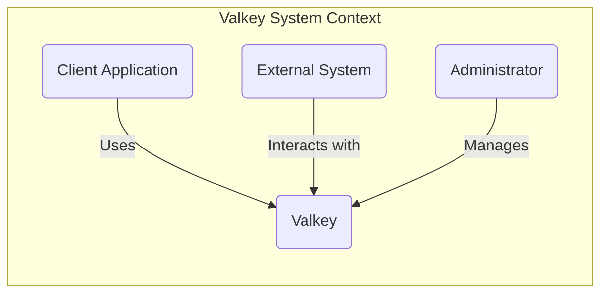
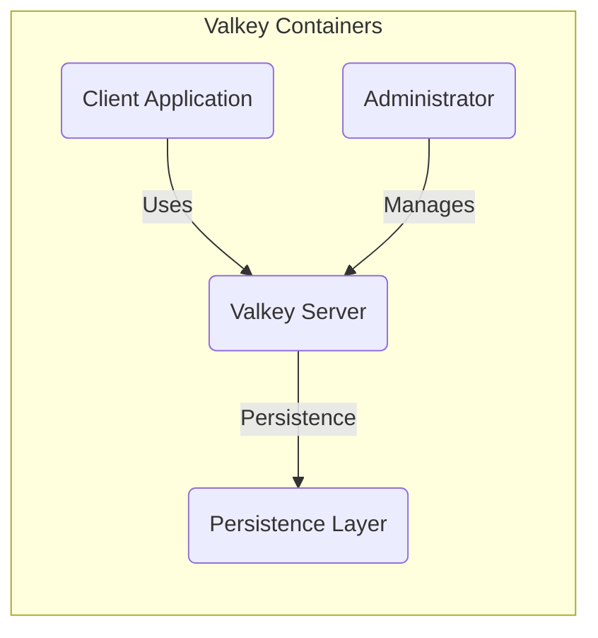
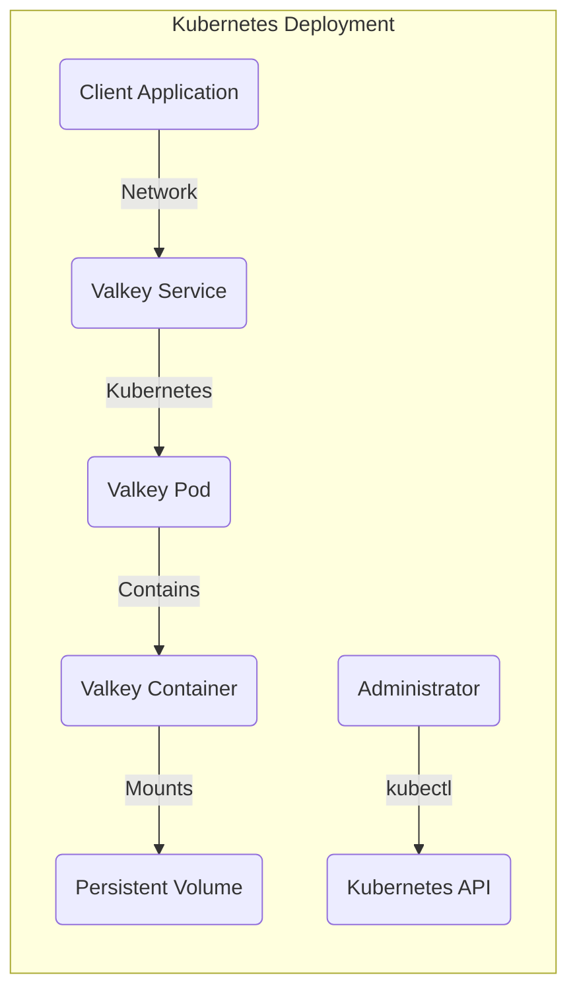
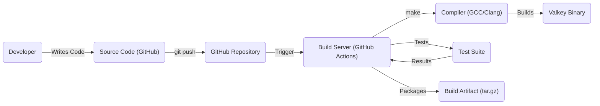

Okay, let's create a detailed design document for the Valkey project, focusing on aspects relevant for threat modeling.

# BUSINESS POSTURE

Valkey, being a fork of Redis, aims to provide a high-performance, in-memory data structure store, used as a database, cache, and message broker.  It appears to be positioning itself as a community-driven alternative to Redis, potentially with a more open governance model.  This suggests a focus on community adoption and long-term sustainability.

Business Priorities:

*   Maintain Performance:  Valkey's core value proposition is speed and efficiency.  Any design decision must prioritize maintaining or improving performance.
*   Ensure Data Integrity:  As a data store, data integrity and consistency are paramount.
*   Community Adoption:  Success depends on attracting and retaining a vibrant community of users and contributors.
*   Compatibility: Maintaining a high degree of compatibility with existing Redis clients and tools is crucial for easy migration and adoption.
*   Operational Simplicity:  Ease of deployment, configuration, and management are important for user adoption and operational efficiency.

Business Risks:

*   Data Loss/Corruption:  Loss or corruption of data stored in Valkey would be a critical failure.
*   Performance Degradation:  Significant performance drops would undermine its primary value.
*   Security Breaches:  Unauthorized access or data breaches could severely damage reputation and trust.
*   Community Fragmentation:  Failure to foster a strong, unified community could lead to project stagnation.
*   Incompatibility Issues:  Divergence from Redis compatibility could limit adoption and create user frustration.
*   Lack of Adoption: If the project fails to gain traction, it may become unsustainable.

# SECURITY POSTURE

Based on the provided GitHub repository and common practices for similar systems, here's an assessment of the security posture:

Existing Security Controls:

*   security control: Network Security: Valkey, like Redis, primarily relies on network-level security (firewalls, network segmentation) to restrict access. It's typically deployed within a trusted network environment. (Implicit in deployment model)
*   security control: Authentication: Valkey supports authentication via the `AUTH` command, requiring clients to provide a password before accessing data. (Mentioned in documentation and source code)
*   security control: TLS/SSL: Valkey supports TLS/SSL encryption for secure communication between clients and the server, protecting data in transit. (Mentioned in documentation and source code)
*   security control: Access Control Lists (ACLs): Valkey 6+ introduced ACLs, allowing for fine-grained control over user permissions, restricting access to specific commands and keys. (Mentioned in documentation and source code)
*   security control: Command Renaming/Disabling: Sensitive commands can be renamed or disabled to limit potential attack vectors. (Mentioned in documentation)
*   security control: Limited Exposure: By default, Valkey often binds to the localhost interface, reducing exposure to external networks. (Common deployment practice)
*   security control: Data at Rest Encryption: While not natively built-in, data at rest encryption can be achieved through external mechanisms like disk encryption. (Common deployment practice)

Accepted Risks:

*   accepted risk: Reliance on Network Security: The primary security model often relies heavily on network security, assuming a trusted internal network. This can be a risk if the network perimeter is breached.
*   accepted risk: Limited Input Validation: While Valkey does some basic input parsing, it's primarily designed for performance, and extensive input validation could impact that. This places a responsibility on clients to send well-formed commands.
*   accepted risk: Denial of Service (DoS): Valkey, like any network service, is susceptible to DoS attacks. Mitigation relies on external mechanisms (e.g., rate limiting, load balancing).
*   accepted risk: No built-in auditing: Valkey has limited built-in auditing capabilities.

Recommended Security Controls:

*   security control: Enhanced Auditing: Implement more comprehensive audit logging to track data access and configuration changes. This is crucial for security investigations and compliance.
*   security control: Regular Security Audits: Conduct regular security audits and penetration testing to identify vulnerabilities.
*   security control: Integrate with Security Information and Event Management (SIEM) systems: Forward logs to a SIEM for centralized monitoring and threat detection.
*   security control: Implement robust monitoring and alerting: Monitor key metrics (CPU usage, memory usage, network traffic, error rates) and set up alerts for anomalous behavior.
*   security control: Consider a Web Application Firewall (WAF): If Valkey is exposed to the public internet (not recommended), a WAF can provide an additional layer of protection.

Security Requirements:

*   Authentication:
    *   All clients MUST authenticate before accessing data.
    *   Strong password policies MUST be enforced.
    *   Support for multi-factor authentication (MFA) SHOULD be considered.

*   Authorization:
    *   ACLs MUST be used to restrict user permissions to the minimum necessary.
    *   Regularly review and update ACLs.

*   Input Validation:
    *   While extensive input validation might impact performance, basic checks for command syntax and data types SHOULD be performed.
    *   Clients SHOULD be responsible for sanitizing data before sending it to Valkey.

*   Cryptography:
    *   TLS/SSL MUST be used for all client-server communication.
    *   Use strong, up-to-date ciphers and protocols.
    *   Consider data-at-rest encryption using external mechanisms.

# DESIGN

## C4 CONTEXT

Element Descriptions:

*   Element:
    *   Name: Client Application
    *   Type: External System
    *   Description: Any application that uses Valkey as a data store, cache, or message broker.
    *   Responsibilities: Sending commands to Valkey, retrieving data from Valkey, handling responses from Valkey.
    *   Security controls: Authenticate to Valkey, use TLS/SSL for communication, implement appropriate input validation.

*   Element:
    *   Name: Valkey
    *   Type: System
    *   Description: The Valkey in-memory data structure store.
    *   Responsibilities: Storing data, processing commands, managing connections, enforcing ACLs.
    *   Security controls: Authentication, TLS/SSL support, ACLs, command renaming/disabling.

*   Element:
    *   Name: External System
    *   Type: External System
    *   Description: Any external system that interacts with Valkey, such as a monitoring system or a backup service.
    *   Responsibilities: Varies depending on the specific system.
    *   Security controls: Authenticate to Valkey, use TLS/SSL for communication.

*   Element:
    *   Name: Administrator
    *   Type: User
    *   Responsibilities: Configuring Valkey, managing users and ACLs, monitoring performance, performing backups.
    *   Security controls: Strong authentication, access controls, potentially using a separate management interface.

## C4 CONTAINER

Element Descriptions:

*   Element:
    *   Name: Client Application
    *   Type: External System
    *   Description: Any application that uses Valkey.
    *   Responsibilities: Sending commands, receiving data.
    *   Security controls: Authentication, TLS/SSL.

*   Element:
    *   Name: Valkey Server
    *   Type: Container
    *   Description: The main Valkey server process.
    *   Responsibilities: Handling client connections, processing commands, managing data in memory, enforcing ACLs.
    *   Security controls: Authentication, TLS/SSL, ACLs, command renaming/disabling.

*   Element:
    *   Name: Persistence Layer
    *   Type: Container
    *   Description: Handles data persistence (RDB snapshots and/or AOF logs). This might be part of the Valkey Server process or a separate process.
    *   Responsibilities: Writing data to disk, loading data from disk.
    *   Security controls: File system permissions, potentially encryption at rest.

*   Element:
    *   Name: Administrator
    *   Type: User
    *   Description: System administrator.
    *   Responsibilities: Configuring and managing Valkey.
    *   Security controls: Strong authentication, access controls.

## DEPLOYMENT

Possible Deployment Solutions:

1.  Bare Metal/Virtual Machine: Deploy Valkey directly on a physical or virtual server.
2.  Docker Container: Deploy Valkey within a Docker container.
3.  Kubernetes: Deploy Valkey as a pod within a Kubernetes cluster.
4.  Cloud Provider Managed Service: Utilize a managed Redis/Valkey service from a cloud provider (e.g., AWS ElastiCache, Azure Cache for Redis, Google Cloud Memorystore).

Chosen Solution (for detailed description): Kubernetes

Element Descriptions:

*   Element:
    *   Name: Client Application
    *   Type: External System
    *   Description: Application accessing Valkey.
    *   Responsibilities: Connecting to Valkey, sending commands.
    *   Security controls: Network security, TLS/SSL.

*   Element:
    *   Name: Valkey Service
    *   Type: Kubernetes Service
    *   Description: A Kubernetes Service provides a stable endpoint for accessing the Valkey Pod(s).
    *   Responsibilities: Load balancing traffic across multiple Valkey Pods (if applicable).
    *   Security controls: Network policies.

*   Element:
    *   Name: Valkey Pod
    *   Type: Kubernetes Pod
    *   Description: A Kubernetes Pod running the Valkey container.
    *   Responsibilities: Running the Valkey server process.
    *   Security controls: Kubernetes security context, network policies.

*   Element:
    *   Name: Valkey Container
    *   Type: Docker Container
    *   Description: The Docker container containing the Valkey server.
    *   Responsibilities: Running the Valkey server process.
    *   Security controls: Container image security, resource limits.

*   Element:
    *   Name: Persistent Volume
    *   Type: Kubernetes Persistent Volume
    *   Description: A persistent volume for storing Valkey data (if persistence is enabled).
    *   Responsibilities: Providing persistent storage.
    *   Security controls: Storage encryption, access controls.

*   Element:
    *   Name: Administrator
    *   Type: User
    *   Description: System administrator.
    *   Responsibilities: Managing the Kubernetes deployment.
    *   Security controls: Kubernetes RBAC.

*   Element:
    *   Name: Kubernetes API
    *   Type: Kubernetes API Server
    *   Description: The Kubernetes API server.
    *   Responsibilities: Managing the Kubernetes cluster.
    *   Security controls: Kubernetes RBAC, TLS/SSL.

## BUILD

The Valkey build process, based on the GitHub repository, appears to utilize a standard make-based system.

Build Process Description:

1.  Developers write code and push it to the GitHub repository.
2.  GitHub Actions (or a similar CI/CD system) is triggered by the push.
3.  The build server checks out the code.
4.  The `make` command is used to compile the Valkey source code using a compiler like GCC or Clang.
5.  A test suite is run to verify the build.
6.  If the tests pass, a build artifact (e.g., a tar.gz file) is created.

Security Controls in Build Process:

*   security control: Version Control: The use of Git and GitHub provides version control and allows for tracking changes and identifying potential security issues introduced in specific commits.
*   security control: Automated Build: GitHub Actions (or similar) automates the build process, ensuring consistency and reducing the risk of manual errors.
*   security control: Automated Testing: The test suite helps to identify bugs and regressions, including potential security vulnerabilities.
*   security control: Dependency Management: The project should use a clear dependency management system (even if it's just Makefiles) to track and update dependencies, mitigating supply chain risks.
*   security control: Static Analysis: Integrating static analysis tools (SAST) into the build process (e.g., linters, code analyzers) can help identify potential security vulnerabilities early in the development lifecycle.  This is *highly recommended*.
*   security control: Code Review:  All code changes should be reviewed by at least one other developer before being merged. This is a crucial step for identifying security flaws.

# RISK ASSESSMENT

Critical Business Processes:

*   Data Storage and Retrieval: Valkey's primary function is to store and retrieve data quickly and reliably.  Failure of this process would be critical.
*   Caching:  Valkey is often used as a cache to improve the performance of other applications.  Failure of the caching functionality could significantly impact the performance of those applications.
*   Message Brokering:  If used as a message broker, Valkey's ability to reliably deliver messages is critical.

Data Sensitivity:

The sensitivity of the data stored in Valkey depends entirely on how it's being used. It could range from:

*   Low Sensitivity:  Temporary caching data that can be easily regenerated.
*   Medium Sensitivity:  Session data, user preferences, non-critical application data.
*   High Sensitivity:  Personally Identifiable Information (PII), financial data, authentication tokens.  Storing highly sensitive data in Valkey *without additional security measures* (e.g., application-level encryption) is generally *not recommended*.

# QUESTIONS & ASSUMPTIONS

Questions:

*   What specific compliance requirements (e.g., GDPR, PCI DSS) apply to the use of Valkey? This will significantly impact the required security controls.
*   What is the expected scale of deployment (number of instances, data volume, request rate)? This will influence performance and security considerations.
*   Will Valkey be exposed to the public internet, or will it be deployed within a private network? This is a critical factor in determining the necessary network security measures.
*   What is the threat model for the applications using Valkey? Understanding the threats to the client applications will help to inform the security requirements for Valkey itself.
*   What level of data persistence is required?  Will RDB snapshots be sufficient, or is AOF logging necessary?
*   Are there any specific performance targets that must be met?
*   What is the process for managing and rotating secrets (passwords, TLS certificates)?
*   What are the plans for monitoring and incident response?

Assumptions:

*   BUSINESS POSTURE: The primary goal is to provide a high-performance, reliable, and community-driven alternative to Redis.
*   SECURITY POSTURE: The initial security posture relies heavily on network security and basic authentication.  It is assumed that Valkey will be deployed within a trusted network environment.
*   DESIGN: The design is based on the standard Redis architecture, with a focus on performance and compatibility. The deployment model is assumed to be Kubernetes-based, but other options are possible. The build process is assumed to be automated using GitHub Actions.