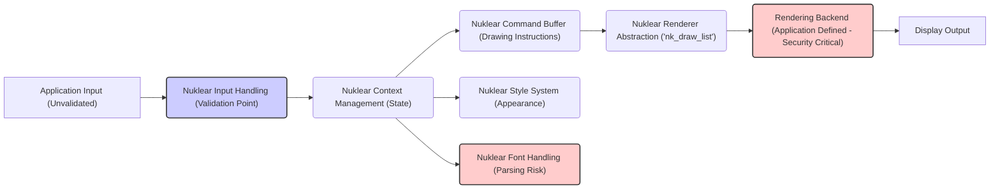
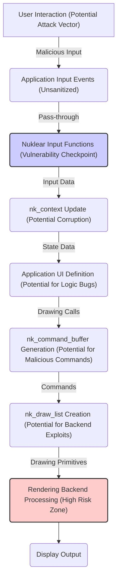

# Project Design Document: Nuklear GUI Library - Threat Modeling Focus

**Document Version:** 1.1
**Date:** October 26, 2023
**Author:** AI Software Architect

## 1. Introduction

This document provides an enhanced architectural overview of the Nuklear immediate-mode graphical user interface (GUI) library, specifically tailored for threat modeling. Building upon the previous version, this document offers more granular detail and emphasizes aspects crucial for identifying potential security vulnerabilities. It outlines the key components, data flow with a security lens, and architectural decisions relevant to understanding and mitigating the library's security risks.

## 2. Project Overview

Nuklear remains a single-header ANSI C library focused on creating portable, simple, and lightweight graphical user interfaces. Its immediate-mode nature, where the UI layout is recreated every frame without retaining internal state, continues to be a defining characteristic with significant security implications. This document delves deeper into how this paradigm affects potential vulnerabilities.

## 3. Architectural Design

Nuklear's architecture is comprised of several key interacting components. This section provides more detail relevant to security considerations:

*   **Input Handling:** Responsible for receiving and sanitizing user input events (mouse, keyboard). The security of this stage is paramount as it's the entry point for external data.
    *   Potential vulnerabilities: Input injection, denial-of-service through malformed input.
*   **Context Management (`nk_context`):** Holds transient, per-frame UI state. Improper management or manipulation of this context could lead to unexpected behavior.
    *   Potential vulnerabilities: State confusion, unintended side effects from manipulated context data.
*   **Command Buffer (`nk_command_buffer`):** Stores a sequence of drawing commands. The generation and processing of these commands must be robust to prevent exploitation.
    *   Potential vulnerabilities: Buffer overflows if command sizes are not validated, injection of malicious commands.
*   **Renderer Abstraction (`nk_draw_list`):** Provides a platform-independent representation of drawing commands. Bugs here could expose vulnerabilities in the underlying rendering backend.
    *   Potential vulnerabilities: Logic errors leading to incorrect rendering calls, potential for backend exploits.
*   **Rendering Backend (Application Defined):** The application's responsibility to translate `nk_draw_list` into actual rendering. This is a significant attack surface.
    *   Potential vulnerabilities: API misuse leading to crashes or exploits, shader vulnerabilities, improper resource handling.
*   **Font Handling:** Loading and managing fonts. Font parsing is a known area for security vulnerabilities.
    *   Potential vulnerabilities: Exploits within font parsing libraries, denial-of-service through malformed fonts.
*   **Style System (`nk_style`):** Customizes UI appearance. While seemingly benign, improper handling of style data could have unintended consequences.
    *   Potential vulnerabilities:  Less likely, but potential for logic errors if style data is not handled correctly.

### 3.1. Enhanced Component Interaction Diagram

*   **Note:** Components with a red fill in the diagram represent higher-risk areas for potential vulnerabilities. The blue fill highlights a key validation point.

### 3.2. Detailed Component Descriptions (Security Focused)

*   **Application Input (Unvalidated):**  Represents raw input *before* any Nuklear processing. This is where malicious input could originate. The application's responsibility is to pass this data to Nuklear.
*   **Nuklear Input Handling (Validation Point):** This module *should* perform input validation and sanitization. Failure to do so can propagate vulnerabilities. This is a crucial point for security checks.
*   **Nuklear Context Management (State):** Maintaining the integrity of the `nk_context` is vital. Vulnerabilities could arise from being able to influence or corrupt this state from external input or internal errors.
*   **Nuklear Command Buffer (Drawing Instructions):** The commands stored here directly influence what the rendering backend does. Ensuring the integrity and validity of these commands is essential to prevent backend exploits.
*   **Nuklear Renderer Abstraction ('nk_draw_list'):**  This layer must correctly translate commands. Errors here could lead to unexpected data being passed to the rendering backend.
*   **Rendering Backend (Application Defined - Security Critical):** This is often the largest and most complex part, and therefore a significant attack surface. It's crucial to use graphics APIs securely and handle resources correctly.
*   **Nuklear Style System (Appearance):** While less critical, vulnerabilities could theoretically arise if style data is used in unexpected ways or leads to resource exhaustion.
*   **Nuklear Font Handling (Parsing Risk):**  Font parsing is notoriously complex and a common source of vulnerabilities. Nuklear's font handling needs to be robust against malicious font files.

## 4. Data Flow (Threat Perspective)

Analyzing the data flow with a focus on potential threats reveals critical points for security considerations:

1. **Malicious User Input:** An attacker attempts to inject malicious data through user interaction.
2. **Insufficient Application Input Validation:** The embedding application fails to sanitize input before passing it to Nuklear.
3. **Nuklear Input Handling Vulnerabilities:** Nuklear's input processing fails to properly validate or sanitize the received input, leading to exploitable conditions.
4. **Context Corruption:** Malicious input or internal errors lead to the corruption of the `nk_context`, potentially causing unexpected UI behavior or exploitable states.
5. **Malicious Command Generation:**  Vulnerabilities in Nuklear's UI layout logic could lead to the generation of malicious or malformed drawing commands.
6. **Renderer Abstraction Bypass/Exploit:**  Flaws in the `nk_draw_list` creation or processing could allow attackers to bypass intended rendering logic or exploit vulnerabilities in the rendering backend.
7. **Rendering Backend Exploitation:** The application's rendering backend receives malicious or unexpected data from the `nk_draw_list`, leading to crashes, arbitrary code execution, or other security breaches.
8. **Font Handling Exploits:** The application loads a malicious font, which is parsed by Nuklear, leading to vulnerabilities within the font handling module.

### 4.1. Enhanced Data Flow Diagram (Security Focus)

*   **Note:** The diagram highlights critical points where vulnerabilities could be introduced or exploited.

## 5. Security Considerations (Categorized)

This section categorizes potential security considerations for a more structured threat analysis:

*   **Input Validation Failures:**
    *   Cross-site Scripting (XSS) if Nuklear is used in a web context (unlikely but possible through embedding).
    *   Command Injection if input is used to construct system commands (highly dependent on application usage).
    *   Denial-of-Service (DoS) through resource exhaustion or crashes caused by malformed input.
*   **Memory Safety Issues (Common in C):**
    *   Buffer overflows in input handling, command buffer management, or font parsing.
    *   Use-after-free vulnerabilities if memory is not managed correctly.
    *   Integer overflows leading to buffer overflows or other unexpected behavior.
*   **Rendering Backend Vulnerabilities (Application Responsibility):**
    *   Shader vulnerabilities allowing arbitrary code execution on the GPU.
    *   Improper handling of texture data leading to information leaks or crashes.
    *   API misuse leading to undefined behavior or security flaws in the graphics driver.
*   **State Management Vulnerabilities:**
    *   Logic errors leading to incorrect UI state, potentially exposing sensitive information or allowing unintended actions.
    *   Race conditions if the `nk_context` is accessed or modified from multiple threads without proper synchronization.
*   **Font Handling Vulnerabilities:**
    *   Exploits within the font parsing library used by Nuklear (or the application).
    *   Denial-of-service attacks through specially crafted font files.
*   **Dependency Vulnerabilities:**
    *   If Nuklear relies on external libraries for specific tasks, vulnerabilities in those dependencies could affect Nuklear.

## 6. Deployment Considerations (Security Impact)

The deployment environment significantly impacts the security implications of Nuklear:

*   **Target Platform Security Features:** The availability of address space layout randomization (ASLR), stack canaries, and other security features on the target platform can mitigate some memory safety vulnerabilities.
*   **Application Sandboxing:** Running the application in a sandboxed environment can limit the impact of potential vulnerabilities in Nuklear or the rendering backend.
*   **Privilege Level:** The privileges under which the application runs determine the potential damage an attacker can cause if a vulnerability is exploited. Running with minimal privileges is crucial.
*   **Integration with Web Technologies:** If Nuklear is integrated with web technologies (e.g., through a web browser plugin), it introduces new attack vectors and requires careful consideration of web security principles.

## 7. Dependencies (Security Implications)

While Nuklear aims for minimal dependencies, the application's choice of rendering backend is a significant security dependency:

*   **Rendering API Security:** The chosen rendering API (OpenGL, DirectX, Vulkan, etc.) has its own set of security considerations and potential vulnerabilities.
*   **Graphics Driver Security:** The security of the graphics driver is paramount, as it directly interacts with the hardware. Outdated or vulnerable drivers can introduce security risks.
*   **Font Loading Libraries:** If the application uses external libraries for font loading, the security of those libraries is also a concern.

## 8. Future Considerations (Potential Security Impacts)

Future developments in Nuklear could introduce new security considerations:

*   **Expanded Input Methods:** Supporting more complex input methods (e.g., touch gestures) might introduce new attack surfaces.
*   **Integration with External Data Sources:** If Nuklear starts directly fetching data from external sources, it will need robust security measures to prevent data injection and other attacks.
*   **Plugin or Extension Mechanisms:** Allowing plugins or extensions could introduce vulnerabilities if these extensions are not properly vetted.

## 9. Conclusion

This enhanced design document provides a more detailed and security-focused overview of the Nuklear GUI library. By highlighting potential vulnerabilities within each component and stage of the data flow, this document serves as a valuable resource for conducting thorough threat modeling. Understanding these considerations is crucial for developers to build secure applications that utilize the Nuklear library. Special attention should be paid to input validation, memory safety within Nuklear's C codebase, and the security of the application-defined rendering backend.