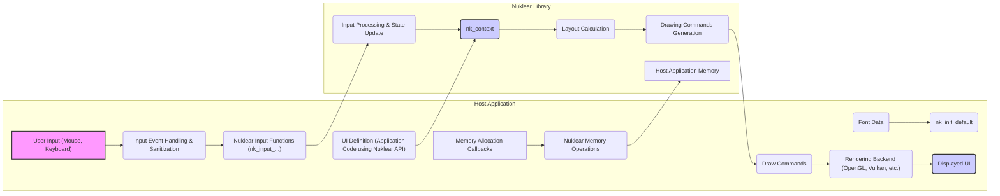

# Project Design Document: Nuklear UI Library

**Version:** 1.1
**Date:** October 26, 2023
**Author:** AI Software Architect

## 1. Introduction

This document provides an enhanced and detailed design overview of the Nuklear immediate-mode graphical user interface (GUI) library, as found in the repository [https://github.com/vurtun/nuklear](https://github.com/vurtun/nuklear). This document aims to provide a comprehensive understanding of the library's architecture, components, and data flow, with a specific focus on aspects relevant to threat modeling and security analysis.

## 2. Project Overview

Nuklear is a single-header ANSI C library offering a simple, portable, and dependency-free immediate-mode GUI solution. Its design emphasizes ease of integration into existing applications and broad platform support through various rendering backends. A key characteristic of immediate-mode GUIs like Nuklear is that UI state is transient, existing only during the frame where it's defined by the application. The library's primary responsibilities are processing input, managing layout calculations, and generating low-level drawing commands based on the application's UI description for each frame.

## 3. Architectural Design

Nuklear's architecture is deliberately minimalist, placing significant responsibility on the host application for state management, rendering, and input provision. This section details the key components, their interactions, and external interfaces.

### 3.1. Key Components

*   **Input Handling:** This component receives raw user input events (mouse movements, button presses, keyboard input) from the host application. It translates these raw events into an internal representation that Nuklear can process. A critical aspect is the reliance on the host application to sanitize and correctly interpret platform-specific input before passing it to Nuklear.
*   **Context (`nk_context`):** The central data structure that encapsulates the transient UI state for the current frame. It holds information about input states, styling parameters, layout configurations, and internal buffers used for processing. Access to the context is primarily through Nuklear's API functions.
*   **User Interface Definition (Application Code):** This is not a distinct module within Nuklear but represents the application's code that utilizes Nuklear's API to describe the UI elements (windows, buttons, text fields, etc.) to be rendered in the current frame. This definition dictates the structure and content of the UI.
*   **Layout System:** This component implements the logic for determining the size and position of UI elements based on the layout directives provided by the application (e.g., using functions like `nk_layout_row_dynamic`, `nk_layout_space_begin`). It calculates the bounding boxes and spatial relationships of UI elements.
*   **Drawing Commands Generation:** Based on the layout calculations and the defined UI elements, this component generates a sequential list of low-level drawing commands. These commands specify primitive drawing operations such as drawing rectangles, text, lines, and images, along with associated parameters like color and coordinates.
*   **Rendering Backend (External):** Nuklear does not perform the actual pixel rendering. It relies entirely on an external rendering backend implemented by the host application. This backend consumes the generated drawing commands and uses a graphics API (e.g., OpenGL, Vulkan, DirectX) or a software renderer to draw the UI to the screen. The security of the rendered output heavily depends on the robustness of this backend.
*   **Style System:**  This system allows customization of the visual appearance of UI elements. The `nk_style` structure contains parameters defining colors, fonts, padding, and other visual attributes. The application can modify this structure to alter the look and feel of the UI.

### 3.2. External Interfaces

*   **Input Events Interface:** The host application provides input events to Nuklear through a series of functions:
    *   `nk_input_begin()`: Signals the start of input processing for a frame.
    *   `nk_input_motion()`: Informs Nuklear about mouse cursor movements.
    *   `nk_input_button()`: Notifies Nuklear about mouse button presses and releases.
    *   `nk_input_key()`:  Provides information about keyboard key presses and releases.
    *   `nk_input_unicode()`:  Allows input of Unicode characters.
    *   `nk_input_end()`: Signals the end of input processing for a frame.
    *   **Security Relevance:**  Vulnerabilities can arise if the host application doesn't properly sanitize or validate input data before passing it to these functions. Malicious input could potentially lead to unexpected behavior or crashes within Nuklear.
*   **Font Data Interface:** The host application provides font data to Nuklear, typically during initialization. This data is used for rendering text.
    *   `nk_init_default()`:  A common function used to initialize Nuklear with default settings, including font information.
    *   **Security Relevance:** Using untrusted or malformed font data could potentially lead to vulnerabilities in the text rendering process.
*   **Draw Commands Output Interface:** Nuklear outputs a list of drawing commands that the host application's rendering backend consumes. This is typically accessed through the `nk_command_foreach` macro or by directly iterating through the command buffer.
    *   **Security Relevance:**  The structure and content of these draw commands are critical. Vulnerabilities in the rendering backend could be exploited by crafting specific sequences of draw commands.
*   **Memory Allocation Interface:** Nuklear uses callbacks provided by the host application for memory allocation and deallocation. This is configured through the `nk_allocator` structure.
    *   **Security Relevance:**  Improperly implemented memory allocation callbacks in the host application could introduce vulnerabilities such as memory leaks, double frees, or heap corruption, which could be triggered by Nuklear's memory management operations.

### 3.3. Internal Modules (Conceptual)

While Nuklear is distributed as a single-header library, its functionality can be conceptually divided into internal modules:

*   **Input Processing Module:** Responsible for receiving and interpreting raw input events provided by the host application. This involves updating the `nk_context` with the current state of input devices.
*   **Layout Management Module:** Implements the layout algorithms that determine the position and size of UI elements. This module processes layout directives from the application and calculates the geometry of the UI.
*   **Widget Logic Module:** Contains the core logic for individual UI widgets (buttons, sliders, etc.). This includes handling interactions with these widgets based on input events and updating their internal state within the context for the current frame.
*   **Drawing Command Buffer Management:** Manages the allocation and population of the buffer that stores the generated drawing commands.
*   **Text Rendering Module:** Handles the generation of draw commands specifically for rendering text, taking into account font data and styling.
*   **Style Handling Module:**  Applies the current style settings from the `nk_style` structure to the UI elements during the layout and drawing command generation phases.

## 4. Data Flow

The following diagram illustrates the data flow within a typical Nuklear application, highlighting the interaction between the host application and the Nuklear library:

**Data Flow Description:**

1. **User Input:** The user interacts with the application through input devices.
2. **Input Event Handling & Sanitization (Host Application):** The host application captures raw input events and performs necessary sanitization and platform-specific interpretation.
3. **Nuklear Input Functions:** The sanitized input events are passed to Nuklear through functions like `nk_input_begin`, `nk_input_motion`, etc., updating the `nk_context`.
4. **Font Data Initialization:** The host application provides font data to Nuklear during initialization.
5. **UI Definition (Host Application):** The application code defines the UI elements for the current frame using Nuklear's API, influencing the state within the `nk_context`.
6. **Input Processing & State Update (Nuklear):** Nuklear processes the input events and updates the internal state within the `nk_context`, reflecting user interactions.
7. **Layout Calculation (Nuklear):** Based on the UI definition and current state, Nuklear calculates the layout of UI elements.
8. **Drawing Commands Generation (Nuklear):** Nuklear generates a list of low-level drawing commands based on the calculated layout and widget states.
9. **Draw Commands Output:** These drawing commands are outputted by Nuklear.
10. **Rendering Backend (Host Application):** The host application's rendering backend receives and processes these drawing commands.
11. **Displayed UI:** The rendering backend renders the UI to the screen.
12. **Memory Allocation:** Nuklear requests memory through callbacks provided by the host application.

## 5. Security Considerations

Given Nuklear's design and its reliance on the host application, several security considerations are paramount:

*   **Insufficient Input Validation:** If the host application fails to adequately validate and sanitize user input before passing it to Nuklear, vulnerabilities such as buffer overflows or injection attacks could occur within Nuklear's internal processing or the rendering backend.
*   **Memory Safety Issues in Nuklear:** As Nuklear is written in C, it is susceptible to memory safety vulnerabilities like buffer overflows, use-after-free errors, and dangling pointers. These could be exploited through crafted input or UI definitions.
*   **Rendering Backend Exploits:**  Vulnerabilities in the host application's rendering backend can be exploited through maliciously crafted sequences of drawing commands generated by Nuklear. This could lead to arbitrary code execution or denial of service.
*   **Application State Management Vulnerabilities:** While Nuklear doesn't retain long-term UI state, the application does. Improper management of this state can lead to security issues if sensitive information is exposed or manipulated due to UI interactions.
*   **Font Handling Vulnerabilities:**  Using untrusted or malformed font data could potentially lead to vulnerabilities in Nuklear's text rendering routines or within the underlying font rendering libraries used by the host application's rendering backend.
*   **Integer Overflows in Layout Calculations:** Integer overflows in calculations related to layout or sizing could lead to unexpected behavior, memory corruption, or denial of service.
*   **Denial of Service through Malicious UI Definitions:**  A malicious application could define a UI with an extremely large number of elements or complex layouts, potentially leading to excessive resource consumption and a denial of service.
*   **Insecure Memory Allocation Callbacks:** If the memory allocation callbacks provided by the host application are not implemented securely, vulnerabilities like heap corruption could be introduced.

## 6. Assumptions and Constraints

*   It is assumed that the host application is responsible for the secure handling of user input before it is passed to Nuklear.
*   The security of the rendered output is entirely dependent on the security and robustness of the host application's rendering backend.
*   Nuklear's security relies on the absence of memory safety vulnerabilities within its codebase.
*   The performance of Nuklear is influenced by the efficiency of the host application's rendering backend and memory management.
*   The application developer is responsible for managing the application's UI state securely.

## 7. Future Considerations

*   **Formal Security Audits:** Conducting thorough and independent security audits of the Nuklear codebase to identify and address potential vulnerabilities.
*   **Fuzzing and Static Analysis:** Implementing continuous fuzzing and static analysis processes to proactively detect memory safety issues and other potential vulnerabilities.
*   **AddressSanitizer (ASan) and MemorySanitizer (MSan) Integration:** Encouraging the use of memory safety tools like ASan and MSan during development and testing to identify memory-related errors.
*   **Consideration of Safe String Handling Practices:** Reviewing and potentially refactoring string handling within Nuklear to mitigate buffer overflow risks.
*   **Documentation of Security Best Practices:** Providing clear documentation and guidelines for developers on how to securely integrate and use Nuklear, particularly regarding input validation and rendering backend security.
*   **Explore Options for Input Sanitization within Nuklear (Optional):** While primarily the host application's responsibility, exploring potential mechanisms within Nuklear to provide some level of input sanitization could be considered.
*   **Community Engagement for Security Vulnerability Reporting:** Establishing clear channels for the community to report potential security vulnerabilities.

This enhanced design document provides a more detailed and security-focused overview of the Nuklear UI library. This information is crucial for conducting comprehensive threat modeling activities and for developing secure applications that utilize Nuklear.