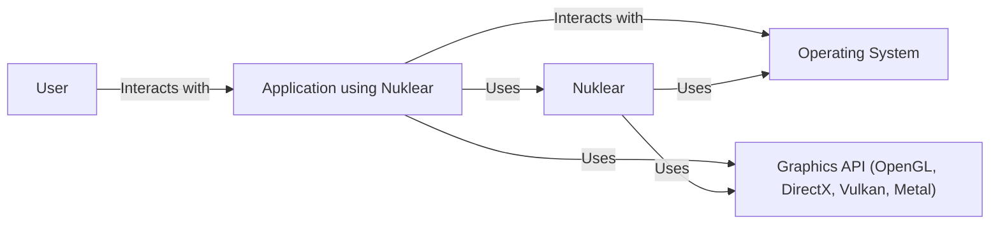
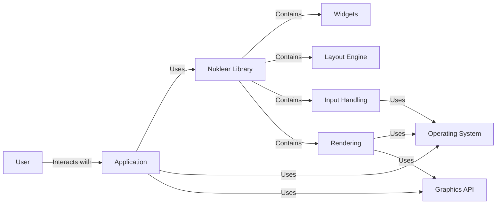
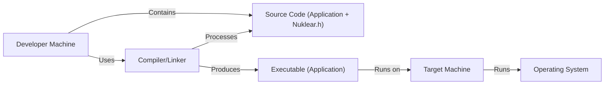
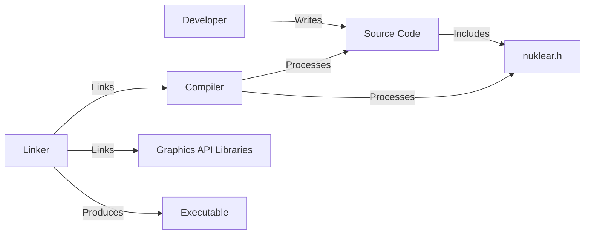

Okay, let's create a design document for the Nuklear project, focusing on aspects relevant for threat modeling.

# BUSINESS POSTURE

Nuklear is a minimal-state, immediate-mode graphical user interface (GUI) toolkit.  It's designed to be lightweight, portable, and easily integrated into various applications, particularly games and graphical tools.  It's not a full-fledged GUI framework like Qt or GTK, but rather a single-header library focused on immediate mode rendering.

Priorities:

1.  Portability:  The library must be easily portable across different operating systems and platforms. This is a core design principle.
2.  Minimal Dependencies:  Nuklear aims to have minimal external dependencies to simplify integration and reduce the risk of dependency conflicts.
3.  Ease of Integration:  The library should be easy to integrate into existing projects, requiring minimal setup and configuration.
4.  Performance:  GUI rendering should be efficient, especially crucial for real-time applications like games.
5.  Flexibility:  Provide a sufficient set of GUI widgets and customization options to be useful in a variety of contexts.

Business Goals:

1.  Provide a simple, immediate-mode GUI solution for developers who need basic GUI functionality without the overhead of larger frameworks.
2.  Enable rapid prototyping and development of graphical tools and applications.
3.  Offer a cross-platform GUI solution that works consistently across different environments.

Most Important Business Risks:

1.  Buffer Overflow Vulnerabilities: Given that Nuklear is written in C, buffer overflows are a significant concern.  These could lead to application crashes or potentially arbitrary code execution.
2.  Input Validation Issues:  Improper handling of user input could lead to unexpected behavior, crashes, or potentially denial-of-service.
3.  Denial of Service (DoS):  Maliciously crafted input or excessive GUI updates could potentially lead to application freezes or crashes, impacting availability.
4.  Integration Risks:  While Nuklear itself might be secure, vulnerabilities in the application integrating it could expose Nuklear to attacks.  This is a risk inherent in any library.
5.  Lack of Memory Safety: C's lack of memory safety features (compared to languages like Rust or Java) increases the risk of memory corruption bugs.

# SECURITY POSTURE

Existing Security Controls:

*   security control: Code Style and Reviews: The project appears to have a consistent coding style, and being open-source, it benefits from community review, which can help identify potential issues. (Described in GitHub repository and contribution guidelines).
*   security control: Simple API: The relatively small and focused API surface reduces the potential attack vector compared to more complex GUI libraries. (Described in the project's README and header file).
*   security control: Minimal State: The immediate-mode nature of Nuklear means it holds minimal internal state, reducing the potential for state-related vulnerabilities. (Described in the project's design philosophy).

Accepted Risks:

*   accepted risk: Reliance on Host Application Security: Nuklear relies on the host application for memory management and security.  Vulnerabilities in the host application can compromise Nuklear.
*   accepted risk: C Language Risks: The inherent risks of using C (manual memory management, potential for buffer overflows) are accepted, mitigated by careful coding practices.
*   accepted risk: Limited Input Sanitization: Nuklear performs some basic input validation, but it primarily relies on the application to provide valid data.

Recommended Security Controls:

*   security control: Static Analysis: Integrate static analysis tools (e.g., Coverity, clang-analyzer) into the development workflow to automatically detect potential bugs and vulnerabilities.
*   security control: Fuzz Testing: Implement fuzz testing to systematically test Nuklear with a wide range of inputs, including invalid and unexpected data, to identify potential crashes or vulnerabilities.
*   security control: Dynamic Analysis: Use dynamic analysis tools (e.g., Valgrind, AddressSanitizer) to detect memory errors and other runtime issues.
*   security control: Documentation of Security Considerations: Provide clear documentation for developers integrating Nuklear, outlining security best practices and potential risks.

Security Requirements:

*   Authentication: Not directly applicable to Nuklear, as it's a GUI library, not an authentication system. Authentication is the responsibility of the integrating application.
*   Authorization: Not directly applicable. Authorization is handled by the application using Nuklear.
*   Input Validation:
    *   Nuklear should perform basic bounds checking on input values (e.g., text lengths, numerical ranges) to prevent buffer overflows and other input-related issues.
    *   The application integrating Nuklear *must* perform thorough input validation and sanitization before passing data to Nuklear.
*   Cryptography: Not directly applicable, unless Nuklear is used to display or input sensitive data, in which case the *application* is responsible for encryption. Nuklear itself does not handle cryptographic operations.

# DESIGN

## C4 CONTEXT

Elements Description:

*   Element:
    *   Name: User
    *   Type: Person
    *   Description: A person interacting with an application that uses Nuklear for its GUI.
    *   Responsibilities: Provides input to the application, views the output displayed by the application.
    *   Security controls: None (external to the system).

*   Element:
    *   Name: Application using Nuklear
    *   Type: Software System
    *   Description: The software application that integrates the Nuklear library for its GUI.
    *   Responsibilities: Handles application logic, manages application state, integrates Nuklear for GUI rendering, provides data to Nuklear, handles user input from Nuklear.
    *   Security controls: Input validation, output encoding, secure coding practices, memory management, potentially authentication and authorization.

*   Element:
    *   Name: Nuklear
    *   Type: Library
    *   Description: The Nuklear immediate-mode GUI library.
    *   Responsibilities: Provides GUI widgets, handles GUI layout, renders GUI elements, processes user input events related to the GUI.
    *   Security controls: Basic input validation, bounds checking.

*   Element:
    *   Name: Operating System
    *   Type: Software System
    *   Description: The underlying operating system (e.g., Windows, macOS, Linux).
    *   Responsibilities: Provides system calls, manages hardware resources, handles windowing.
    *   Security controls: OS-level security mechanisms (e.g., ASLR, DEP), user permissions.

*   Element:
    *   Name: Graphics API
    *   Type: Library/Software System
    *   Description: The graphics API used for rendering (e.g., OpenGL, DirectX, Vulkan, Metal).
    *   Responsibilities: Provides low-level graphics rendering functions.
    *   Security controls: Driver-level security, potentially GPU sandboxing.

## C4 CONTAINER

Since Nuklear is a single-header library, the container diagram is essentially an extension of the context diagram. The "containers" are conceptual rather than separate deployable units.

Elements Description:

*   Element:
    *   Name: Application
    *   Type: Software System
    *   Description: The application integrating Nuklear.
    *   Responsibilities: Same as in the Context diagram.
    *   Security controls: Same as in the Context diagram.

*   Element:
    *   Name: Nuklear Library
    *   Type: Library
    *   Description: The Nuklear library itself.
    *   Responsibilities: Same as in the Context diagram.
    *   Security controls: Same as in the Context diagram.

*   Element:
    *   Name: Widgets
    *   Type: Component
    *   Description: The collection of GUI widgets provided by Nuklear (buttons, sliders, text fields, etc.).
    *   Responsibilities: Rendering individual GUI elements, handling basic user interaction.
    *   Security controls: Basic input validation specific to each widget type.

*   Element:
    *   Name: Layout Engine
    *   Type: Component
    *   Description: The component responsible for arranging GUI elements according to layout rules.
    *   Responsibilities: Calculating widget positions and sizes.
    *   Security controls: Bounds checking to prevent layout-related overflows.

*   Element:
    *   Name: Input Handling
    *   Type: Component
    *   Description: The component that processes user input events (mouse clicks, keyboard presses).
    *   Responsibilities: Receiving input events from the OS, translating them into Nuklear events.
    *   Security controls: Basic input validation, event filtering.

*   Element:
    *   Name: Rendering
    *   Type: Component
    *   Description: The component that draws the GUI elements using the graphics API.
    *   Responsibilities: Translating Nuklear drawing commands into graphics API calls.
    *   Security controls: None directly, relies on the security of the graphics API and drivers.

*   Element:
    *   Name: Operating System
    *   Type: Software System
    *   Description: The underlying operating system.
    *   Responsibilities: Same as in the Context diagram.
    *   Security controls: Same as in the Context diagram.

*   Element:
    *   Name: Graphics API
    *   Type: Library/Software System
    *   Description: The graphics API used for rendering.
    *   Responsibilities: Same as in the Context diagram.
    *   Security controls: Same as in the Context diagram.

## DEPLOYMENT

Nuklear, being a single-header library, doesn't have a traditional deployment process in the sense of deploying a server or application.  It's *integrated* directly into the application's build process.  However, we can describe how an application *using* Nuklear might be deployed.

Possible Deployment Solutions:

1.  Static Linking: The Nuklear code is compiled directly into the application executable. This is the simplest and most common approach.
2.  Dynamic Linking (Less Common):  While Nuklear is designed for static linking, it's theoretically possible to compile it as a dynamic library (DLL on Windows, SO on Linux, dylib on macOS). This is generally not recommended.

Chosen Solution (Static Linking):

Elements Description:

*   Element:
    *   Name: Developer Machine
    *   Type: Device
    *   Description: The machine used by the developer to write and build the application.
    *   Responsibilities: Hosts the development environment, source code, and build tools.
    *   Security controls: Developer machine security (antivirus, firewall, etc.).

*   Element:
    *   Name: Source Code (Application + Nuklear.h)
    *   Type: Data
    *   Description: The source code of the application, including the Nuklear header file.
    *   Responsibilities: Contains the application logic and GUI definitions.
    *   Security controls: Code review, secure coding practices.

*   Element:
    *   Name: Compiler/Linker
    *   Type: Tool
    *   Description: The compiler and linker used to build the application.
    *   Responsibilities: Compiles the source code and links it into an executable.
    *   Security controls: Compiler security flags (e.g., stack protection, ASLR).

*   Element:
    *   Name: Executable (Application)
    *   Type: File
    *   Description: The compiled application executable.
    *   Responsibilities: Runs the application logic and GUI.
    *   Security controls: Code signing, runtime protection mechanisms.

*   Element:
    *   Name: Target Machine
    *   Type: Device
    *   Description: The machine where the application will be run.
    *   Responsibilities: Provides the runtime environment for the application.
    *   Security controls: Operating system security, antivirus, firewall.

*   Element:
    *   Name: Operating System
    *   Type: Software System
    *   Description: Operating system of target machine.
    *   Responsibilities: Provides system calls, manages hardware resources, handles windowing.
    *   Security controls: OS-level security mechanisms (e.g., ASLR, DEP), user permissions.

## BUILD

The build process for an application using Nuklear typically involves including the `nuklear.h` header file and compiling the application code along with the necessary graphics API libraries.

Security Controls in Build Process:

*   security control: Compiler Security Flags: Use compiler flags to enable security features like stack protection, address space layout randomization (ASLR), and data execution prevention (DEP).
*   security control: Static Analysis: Integrate static analysis tools into the build process (e.g., as a pre-build step) to automatically detect potential vulnerabilities.
*   security control: Dependency Management: If using external libraries (other than Nuklear and the graphics API), carefully manage dependencies and ensure they are up-to-date and secure. Use a dependency management tool if appropriate for the language.
*   security control: Build Automation: Use a build system (e.g., Make, CMake, Ninja) to automate the build process, ensuring consistency and reducing the risk of manual errors.
*   security control: Code Signing: Digitally sign the executable to ensure its integrity and authenticity.

# RISK ASSESSMENT

Critical Business Processes:

*   Application Functionality: The primary business process is the functionality provided by the application *using* Nuklear. Nuklear itself is a component, not a complete process. The criticality depends on the specific application.
*   User Experience: Providing a responsive and reliable user interface is crucial for a positive user experience.

Data to Protect:

*   Application Data: The data handled by the application using Nuklear. The sensitivity of this data depends entirely on the specific application. Examples include:
    *   Game state data (low sensitivity, typically).
    *   User input in a text editor (potentially high sensitivity, depending on the content).
    *   Configuration settings (low to medium sensitivity).
*   GUI Layout Data: The data defining the GUI layout (widget positions, sizes, etc.). This is generally low sensitivity.

Data Sensitivity:

*   The sensitivity of the data handled by an application using Nuklear is entirely dependent on the *application itself*. Nuklear, as a GUI library, does not inherently handle sensitive data. It's the responsibility of the application developer to protect any sensitive data used within the application.

# QUESTIONS & ASSUMPTIONS

Questions:

1.  Are there any specific target platforms or operating systems that are of higher priority than others?
2.  What is the expected level of user expertise? (This can influence the design of error handling and security warnings.)
3.  Are there any specific performance requirements or constraints?
4.  What graphics APIs are intended to be supported? (This impacts the rendering component.)
5.  What is the intended use case for this library? (Game, tool, other?)

Assumptions:

*   BUSINESS POSTURE: The primary goal is to provide a simple, portable, and easy-to-use immediate-mode GUI library. Performance and minimal dependencies are prioritized over extensive features.
*   SECURITY POSTURE: The development team is aware of the inherent risks of using C and will employ careful coding practices to mitigate them. The integrating application is responsible for the majority of security concerns, including input sanitization and data protection.
*   DESIGN: Static linking is the preferred and recommended deployment method. The application developer is responsible for integrating Nuklear correctly and securely into their application. The application developer is responsible for handling any sensitive data appropriately.