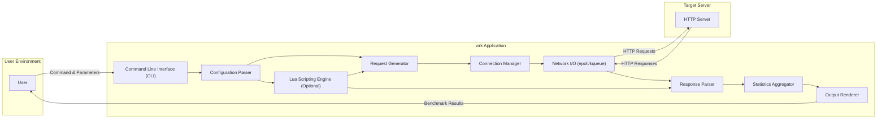
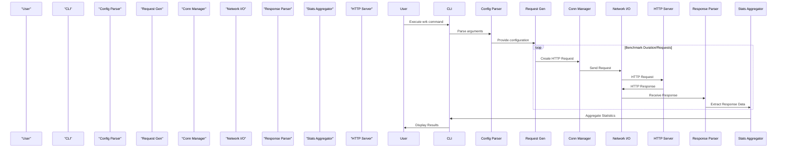

# Project Design Document: wrk - HTTP Benchmarking Tool

**Version:** 1.1
**Date:** October 26, 2023
**Author:** AI Software Architect

## 1. Introduction

This document provides a detailed design overview of the `wrk` HTTP benchmarking tool. It aims to describe the system's architecture, components, data flow, and deployment model. This document will serve as the foundation for subsequent threat modeling activities. This revision includes clarifications and expansions based on the initial design.

## 2. Goals and Objectives

The primary goal of `wrk` is to provide a simple and efficient command-line tool for benchmarking HTTP servers. Key objectives include:

* **High Performance:**  Generate a significant load on the target server by efficiently managing concurrent connections and requests.
* **Low Resource Consumption:** Minimize the resource footprint (CPU, memory, network) of the benchmarking tool itself to avoid skewing results and allow for higher load generation.
* **Flexibility:** Allow users to configure various aspects of the benchmark, such as the number of threads/connections, duration, request methods, headers, and body content.
* **Scriptability:** Enable users to define custom request patterns, pre-request actions, and response handling logic using the embedded Lua scripting engine. This allows for more realistic and complex benchmarking scenarios.
* **Clear Reporting:** Provide concise and informative statistics about the benchmark results, including latency distribution, request rates, and error counts.

## 3. Architecture Overview

`wrk` is a single-process, multi-threaded application written in C. It leverages non-blocking I/O and event-driven programming to achieve high concurrency with minimal overhead. The core architecture can be visualized as follows:

## 4. Component Description

This section details the key components of the `wrk` application:

* **Command Line Interface (CLI):**
    * Responsible for receiving user input, including command-line arguments specifying the target URL, number of threads/connections, duration, and other options like request headers and data.
    * Uses standard input/output streams for interaction with the user.
    * Parses command-line arguments using standard C library functions like `getopt`.

* **Configuration Parser:**
    * Takes the raw command-line arguments and parses them into a structured configuration object that is used by other components.
    * Performs validation of the input parameters, checking for valid ranges and formats to prevent errors and potential security issues.
    * Handles default values for unspecified options, ensuring the application can run with minimal user input.

* **Request Generator:**
    * Creates HTTP request messages (including headers and body) based on the parsed configuration.
    * Supports various HTTP methods (GET, POST, PUT, DELETE, etc.) as specified by the user.
    * Allows setting custom headers and request bodies, either directly via command-line arguments or through Lua scripting.
    * When Lua scripting is used, this component interacts with the Lua engine to generate dynamic requests based on script logic.

* **Connection Manager:**
    * Manages a pool of persistent TCP connections to the target server. The number of connections is configurable by the user.
    * Distributes generated requests across the available connections to maximize concurrency.
    * Handles connection establishment (including DNS resolution), reuse (keeping connections alive for subsequent requests), and closure.
    * Employs non-blocking sockets and event notification mechanisms (epoll on Linux, kqueue on macOS/BSD) for efficient handling of multiple concurrent connections.

* **Network I/O (epoll/kqueue):**
    * The core of the asynchronous I/O handling within `wrk`.
    * Monitors multiple socket file descriptors for read and write events, allowing the application to react to network activity without blocking.
    * Manages the sending of HTTP requests and the receiving of HTTP responses on the established connections.

* **Response Parser:**
    * Receives raw data from the network sockets managed by the Network I/O component.
    * Parses the HTTP response headers and body according to HTTP specifications.
    * Extracts relevant information, such as HTTP status codes, latency (time taken for the server to respond), and content length.
    * Can be customized via Lua scripting to perform more complex response analysis, such as validating specific content or extracting data for custom metrics.

* **Statistics Aggregator:**
    * Collects and aggregates performance metrics throughout the benchmark execution.
    * Tracks key metrics such as:
        * **Requests per second (RPS):** The rate at which requests are successfully processed.
        * **Average latency:** The average time taken for the server to respond to requests.
        * **Maximum latency:** The longest time taken for a single request to be processed.
        * **Standard deviation of latency:** A measure of the variability in response times.
        * **Latency distribution:** Provides a breakdown of response times across different percentiles.
        * **Number of errors:** Counts of connection errors, timeouts, and non-2xx/3xx HTTP status codes.
        * **Data transferred:** The total amount of data sent and received during the benchmark.

* **Lua Scripting Engine (Optional):**
    * Embeds a Lua interpreter to provide flexible scripting capabilities for advanced benchmarking scenarios.
    * Allows users to define custom logic for:
        * **Request generation:** Dynamically create requests based on variables, counters, or external data.
        * **Pre-request actions:** Execute code before sending a request (e.g., setting cookies, generating authentication tokens).
        * **Response handling:** Analyze response data, validate content, and define custom metrics.
    * Provides access to `wrk`'s internal state and functions through a defined API, allowing scripts to interact with the benchmarking process.

* **Output Renderer:**
    * Formats and displays the aggregated statistics to the user in a human-readable format.
    * Presents the results, including key metrics and latency distribution, to the standard output stream.

## 5. Data Flow

The typical data flow during a `wrk` benchmark can be described as follows:

1. **User Input:** The user executes the `wrk` command with specified parameters, potentially including Lua scripts.
2. **Configuration Parsing:** The CLI parses the command-line arguments and passes the configuration to the Configuration Parser for validation and structuring.
3. **Lua Script Loading (Optional):** If a Lua script is specified, the script is loaded and initialized by the Lua Scripting Engine.
4. **Request Generation:** Based on the configuration (and potentially Lua scripts), the Request Generator creates HTTP request objects. If Lua scripting is involved, the script may influence the content and headers of the requests.
5. **Connection Management:** The Connection Manager selects an available connection from its pool or establishes a new one to the target server.
6. **Network Transmission:** The HTTP request is sent to the target server via the Network I/O component using a non-blocking socket.
7. **Server Processing:** The target HTTP server receives and processes the request.
8. **Network Reception:** The Network I/O component receives the HTTP response from the server on the corresponding socket.
9. **Response Parsing:** The Response Parser analyzes the received data, extracting headers, status code, and body. If a Lua script is involved, it may be used to further process the response.
10. **Statistics Aggregation:** The extracted response information, including latency and status code, is fed to the Statistics Aggregator to update the performance metrics.
11. **Looping:** Steps 4-10 are repeated concurrently for the specified duration or number of requests, managed by multiple threads.
12. **Output Rendering:** Once the benchmark is complete, the Output Renderer formats and displays the aggregated statistics to the user.

## 6. Deployment Model

`wrk` is typically deployed as a standalone command-line executable. Common deployment scenarios include:

* **Local Execution:** Running `wrk` directly on a user's machine to benchmark a locally running server or a remote server accessible over the network. This is common for development and quick performance checks.
* **Within Containerized Environments:**  Including `wrk` within a Docker container or similar environment for isolated and reproducible benchmarking. This ensures consistent environments and simplifies deployment in CI/CD pipelines.
* **On Dedicated Load Generation Machines:** Deploying `wrk` on dedicated servers designed for generating high loads in testing environments. This allows for more realistic and scalable performance testing.

The deployment process usually involves:

1. **Compilation:** Compiling the `wrk` source code using a C compiler (e.g., GCC, Clang) and the `make` build system. This typically involves resolving dependencies like the Lua library if scripting support is desired.
2. **Installation (Optional):** Copying the compiled executable to a directory in the system's PATH (e.g., `/usr/local/bin`) for easy access from the command line.

## 7. Technology Stack

* **Programming Language:** C
* **Networking Library:** Standard POSIX sockets API
* **Asynchronous I/O:** epoll (Linux), kqueue (macOS/BSD) for efficient event handling
* **Scripting Language (Optional):** Lua (specifically LuaJIT for performance)
* **Build System:** make

## 8. Security Considerations (Pre-Threat Modeling)

While `wrk` is primarily a benchmarking tool, several security aspects are relevant for threat modeling:

* **Input Validation:**
    * **Threat:** Malicious users could provide crafted command-line arguments (e.g., excessively large numbers for threads/connections, invalid URLs) leading to resource exhaustion or unexpected behavior.
    * **Mitigation:** The CLI and Configuration Parser must rigorously validate all user-provided input to ensure it conforms to expected formats and ranges.

* **Resource Exhaustion (Self):**
    * **Threat:**  Running `wrk` with excessively high concurrency or duration can consume significant system resources (CPU, memory, network bandwidth) on the machine running `wrk`, potentially leading to its own denial-of-service or impacting other applications.
    * **Mitigation:** Users should be aware of the resource implications of their configurations. Consider implementing safeguards or warnings within `wrk` for potentially problematic configurations.

* **Lua Scripting Security:**
    * **Threat:** If Lua scripting is enabled, vulnerabilities in user-provided scripts could be exploited to gain unauthorized access to the system running `wrk` or compromise the benchmarking process (e.g., arbitrary code execution).
    * **Mitigation:**  Carefully consider the API exposed to Lua scripts, limiting access to sensitive functions. Implement sandboxing or other security measures for the Lua environment. Educate users on the risks of running untrusted scripts.

* **Network Security:**
    * **Threat:** `wrk` interacts with remote servers over the network. If not used carefully, it could be used to amplify network attacks or expose sensitive information if communicating over unencrypted channels.
    * **Mitigation:** Encourage the use of HTTPS for benchmarking secure endpoints. Ensure the machine running `wrk` is on a secure network.

* **Denial of Service (Target):**
    * **Threat:** Misconfigured or overly aggressive `wrk` usage can unintentionally cause a denial-of-service on the target server by overwhelming it with requests.
    * **Mitigation:** Users should understand the potential impact of their benchmark configurations on the target server. Start with lower loads and gradually increase.

* **Buffer Overflows/Memory Corruption:**
    * **Threat:** Vulnerabilities in the C code of `wrk`, particularly in areas handling network data or string manipulation, could lead to buffer overflows or other memory corruption issues, potentially allowing for arbitrary code execution.
    * **Mitigation:**  Follow secure coding practices during development. Conduct thorough code reviews and consider using static analysis tools to identify potential vulnerabilities.

## 9. Assumptions and Constraints

* **Network Connectivity:**  It is assumed that the machine running `wrk` has reliable network connectivity to the target server.
* **Target Server Availability:** The target HTTP server is assumed to be running and accessible throughout the benchmark duration.
* **Operating System Support:** `wrk` primarily targets Linux and macOS/BSD systems due to its reliance on epoll and kqueue for high-performance networking. Windows support may be limited or require alternative I/O mechanisms.
* **Single Process:** `wrk` operates as a single process, which might limit its ability to fully utilize resources on heavily multi-core systems in certain scenarios. However, it leverages multi-threading within that process.
* **No Built-in Reporting/Visualization:** `wrk` provides basic text-based output to the standard output. More advanced reporting or visualization of benchmark results typically requires external tools or scripts.

This design document provides a comprehensive overview of the `wrk` HTTP benchmarking tool, incorporating improvements and clarifications. It lays the groundwork for a thorough threat modeling exercise by clearly outlining the system's architecture, components, and data flow. The expanded security considerations provide more specific areas of focus for identifying potential threats.
