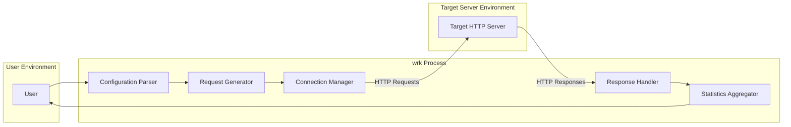
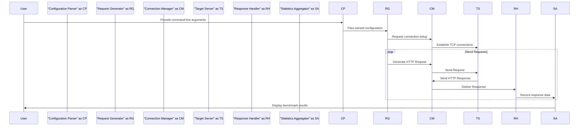

# Project Design Document: wrk - Modern HTTP Benchmarking Tool

**Version:** 1.1
**Date:** October 26, 2023
**Author:** AI Software Architect

## 1. Introduction

This document provides a detailed design overview of the `wrk` project, a modern HTTP benchmarking tool. The primary purpose of this document is to clearly articulate the architecture, components, and data flow of `wrk` to serve as a foundation for subsequent threat modeling activities. This detailed design will enable a thorough identification of potential security vulnerabilities and risks associated with the tool.

## 2. Goals and Objectives

The core goal of `wrk` is to offer a high-performance and efficient method for benchmarking HTTP servers. Key objectives include:

*   Facilitating the generation of a configurable number of concurrent HTTP requests.
*   Accurately measuring the performance characteristics of the target server, focusing on metrics like latency and throughput.
*   Providing support for various standard HTTP methods (e.g., GET, POST, PUT, DELETE).
*   Enabling user customization of request headers and bodies for realistic testing scenarios.
*   Presenting benchmark results in a clear, concise, and easily interpretable format.

## 3. Architecture Overview

`wrk` employs a single-process, multi-threaded architecture implemented in C. It leverages non-blocking I/O operations and an event-driven programming model to achieve high concurrency while minimizing resource consumption. This design allows `wrk` to simulate a large number of concurrent users with relatively low overhead.

## 4. Component Details

This section provides a detailed breakdown of the key components within the `wrk` application, outlining their responsibilities and interactions:

*   **Configuration Parser (CP):**
    *   **Responsibility:**  Parses command-line arguments and configuration options provided by the user. This includes parameters like the target URL, number of threads, number of connections, test duration, and custom request details.
    *   **Functionality:**  Validates the input to ensure it conforms to expected formats and constraints. It then translates these configurations into internal parameters used by other components. Error handling for invalid input is crucial.
    *   **Interaction:** Receives input directly from the user via the command line and passes the parsed configuration to the Request Generator.

*   **Request Generator (RG):**
    *   **Responsibility:**  Generates HTTP requests based on the configuration received from the Configuration Parser.
    *   **Functionality:** Constructs the raw HTTP request strings, including the request line (method, URI, HTTP version), headers, and the optional request body. It handles any user-defined customizations for headers and body content.
    *   **Interaction:** Receives configuration from the Configuration Parser and provides fully formed HTTP requests to the Connection Manager.

*   **Connection Manager (CM):**
    *   **Responsibility:** Manages a pool of persistent TCP connections to the target server. This is the core of `wrk`'s concurrency model.
    *   **Functionality:** Establishes and maintains a specified number of TCP connections. It distributes the generated requests from the Request Generator across these connections, implementing a strategy for efficient request dispatch. It utilizes non-blocking I/O to handle multiple concurrent connections without blocking the main thread. It also handles connection reuse and manages potential connection errors (e.g., timeouts, resets).
    *   **Interaction:** Receives requests from the Request Generator and sends them to the Target Server. It also receives responses from the Target Server and forwards them to the Response Handler.

*   **Response Handler (RH):**
    *   **Responsibility:** Receives and processes HTTP responses from the target server.
    *   **Functionality:** Parses the incoming HTTP response, extracting key information such as the status code, headers, and the response body (though the body is typically not fully processed for performance reasons). It measures the time taken for each response to arrive, contributing to latency calculations. It also identifies and counts different types of errors (e.g., HTTP error codes, connection errors).
    *   **Interaction:** Receives responses from the Connection Manager and forwards the relevant data to the Statistics Aggregator.

*   **Statistics Aggregator (SA):**
    *   **Responsibility:** Collects, aggregates, and calculates performance data from the Response Handlers.
    *   **Functionality:**  Maintains running totals and distributions of key metrics. It calculates:
        *   Requests per second (throughput).
        *   Latency distribution (minimum, maximum, average, standard deviation, and configurable percentiles).
        *   Counts of different HTTP status codes.
        *   Number of connection errors and other types of errors.
        *   Total bytes transferred.
    *   Formats and presents the final benchmark results to the user in a clear and readable format.
    *   **Interaction:** Receives processed response data from the Response Handler and presents the final results to the User.

## 5. Data Flow

The following outlines the typical sequence of actions and data flow during a `wrk` benchmark execution:

1. The **User** initiates `wrk` by providing command-line arguments specifying the target URL and other benchmarking parameters.
2. The **Configuration Parser** receives these arguments, parses them, and performs validation.
3. The **Request Generator**, based on the parsed configuration, prepares templates or instructions for generating HTTP requests.
4. The **Connection Manager** establishes a pool of TCP connections to the specified **Target Server**.
5. The **Request Generator** instructs the **Connection Manager** to send HTTP requests.
6. The **Connection Manager** picks a connection from its pool and sends the HTTP request to the **Target Server**.
7. The **Target Server** processes the request and sends back an HTTP response.
8. The **Connection Manager** receives the HTTP response.
9. The **Connection Manager** forwards the response to the **Response Handler**.
10. The **Response Handler** parses the response, measures the response time, and extracts relevant information (status code, etc.).
11. The **Response Handler** sends the processed response data to the **Statistics Aggregator**.
12. The **Statistics Aggregator** accumulates the data and calculates performance metrics.
13. Once the benchmark duration is complete, the **Statistics Aggregator** presents the final benchmark results to the **User**.

## 6. Deployment Model

`wrk` is designed for direct execution on a user's machine or a dedicated benchmarking server. It is a command-line tool that requires compilation from source code but has minimal runtime dependencies.

*   **Execution Environment:** Runs as a native executable on the host operating system.
*   **Dependencies:** Primarily relies on standard C libraries and system calls for networking functionalities. Potentially `libm` for math functions.

## 7. Security Considerations (Detailed)

This section expands on the initial security considerations, providing more specific examples of potential threats and vulnerabilities associated with each component and the data flow:

*   **Configuration Parser (CP):**
    *   **Threat:** Command Injection: Maliciously crafted command-line arguments could potentially inject commands that are executed by the underlying operating system if input validation is insufficient.
    *   **Threat:** Integer Overflow/Underflow: Providing extremely large or negative numbers for parameters like the number of threads or connections could lead to integer overflow or underflow issues, potentially causing crashes or unexpected behavior.
    *   **Threat:** Path Traversal: If `wrk` were extended to read configuration from files, insufficient validation of file paths could allow an attacker to access arbitrary files on the system.

*   **Request Generator (RG):**
    *   **Threat:** HTTP Request Smuggling: If user-provided headers are not properly sanitized, an attacker could craft malicious headers that lead to HTTP request smuggling vulnerabilities on the target server.
    *   **Threat:** Denial of Service (DoS):  The ability to customize request bodies could be abused to send excessively large payloads, potentially overwhelming the target server.

*   **Connection Manager (CM):**
    *   **Threat:** Resource Exhaustion:  While intended for load testing, if `wrk` itself were compromised, an attacker could use it to launch a DoS attack by opening an excessive number of connections, exhausting the target server's resources or the resources of the machine running `wrk`.
    *   **Threat:** Connection Hijacking (less likely for `wrk` itself, but a consideration for the network): If the network communication is not secured (e.g., using HTTPS), an attacker could potentially intercept and manipulate the communication between `wrk` and the target server.

*   **Response Handler (RH):**
    *   **Threat:** Buffer Overflow: If the response parsing logic is not carefully implemented, particularly when handling large headers or response bodies (even if not fully processed), buffer overflow vulnerabilities could exist.
    *   **Threat:** Information Disclosure: Errors during response processing could potentially leak sensitive information about the target server or the benchmarking process.

*   **Statistics Aggregator (SA):**
    *   **Threat:** Integer Overflow:  Accumulating very large numbers of requests or response times could potentially lead to integer overflow issues in the statistics calculations, resulting in inaccurate reporting.

*   **General:**
    *   **Threat:** Denial of Service (Misuse):  As a load testing tool, `wrk` can be intentionally misused to perform DoS attacks. This is an inherent risk associated with such tools.
    *   **Threat:** Memory Safety Issues: Being written in C, `wrk` is susceptible to memory safety vulnerabilities like buffer overflows, use-after-free errors, and dangling pointers if not implemented carefully.

## 8. Assumptions and Constraints

The following assumptions and constraints are relevant to this design document:

*   It is assumed that `wrk` is primarily used in controlled environments for legitimate performance testing and benchmarking activities.
*   The target server being benchmarked is assumed to be a standard compliant HTTP server.
*   The underlying network infrastructure is assumed to be reasonably reliable and stable.
*   This document focuses on the core functionality of `wrk` and does not delve into platform-specific implementation details or potential extensions.

## 9. Future Considerations

*   Conduct a comprehensive threat modeling exercise based on this detailed design document to systematically identify and analyze potential security risks.
*   Perform a thorough security code review of the `wrk` codebase to identify and address potential vulnerabilities in the implementation.
*   Implement and enforce secure coding practices throughout the development lifecycle to mitigate identified risks and prevent future vulnerabilities.
*   Consider adding support for secure communication protocols like HTTPS with proper certificate validation to enhance the security of the benchmarking process.
*   Explore options for sandboxing or isolating the `wrk` process to limit the potential impact of any vulnerabilities.
*   Develop guidelines and best practices for the secure usage of `wrk` to prevent its misuse.