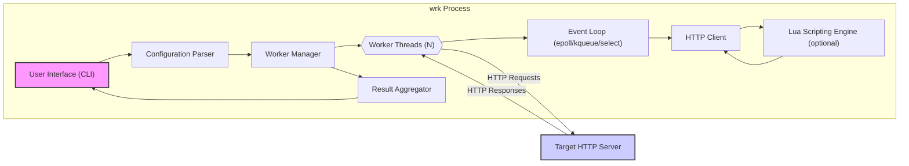

# Project Design Document: wrk - HTTP Benchmarking Tool

**Version:** 1.1
**Date:** October 27, 2023
**Author:** AI Software Architect

## 1. Introduction

This document provides a detailed design overview of the `wrk` HTTP benchmarking tool (available at [https://github.com/wg/wrk](https://github.com/wg/wrk)). This document is intended to serve as a foundation for threat modeling and security analysis of the `wrk` project. It outlines the system architecture, components, data flow, and technologies used, highlighting key areas relevant to security considerations.  `wrk` is designed for benchmarking HTTP servers, focusing on measuring latency, throughput, and concurrency capabilities.

## 2. Project Overview

`wrk` is a modern, high-performance HTTP benchmarking tool designed to generate significant load from a single multi-core CPU. It achieves this through a combination of multithreading and efficient event notification systems like `epoll` (Linux) and `kqueue` (macOS, BSD).  The tool is highly configurable via command-line arguments and extends its functionality through Lua scripting, allowing for customized request generation and response processing. `wrk` is primarily focused on benchmarking HTTP/1.1 servers, although its underlying socket handling could potentially be used for other protocols.

**Key Features:**

*   **Multi-threaded Worker Model:** Employs multiple worker threads to simulate concurrent users, maximizing CPU utilization and generating high request loads. Threads operate independently, minimizing locking and contention.
*   **Scalable Event-Driven Architecture:** Leverages non-blocking I/O using system-specific event notification mechanisms (`epoll`, `kqueue`, `select`) for efficient management of thousands of concurrent connections.
*   **Lua Scripting for Customization:** Integrates a Lua scripting engine to enable users to define custom request payloads, headers, paths, and methods. Lua scripts can also process responses and implement custom result aggregation logic.
*   **Command-line Interface (CLI) Driven:** Provides a straightforward and powerful command-line interface for configuring benchmark parameters such as target URL, number of threads, connections, duration, and script paths.
*   **Precise Latency and Throughput Measurement:** Accurately measures request latency (including minimum, maximum, average, and standard deviation) and overall throughput (requests per second, bytes transferred).
*   **Support for Keep-Alive Connections:**  Efficiently reuses HTTP keep-alive connections to reduce connection overhead and simulate realistic client behavior.
*   **SSL/TLS Support:**  Can be configured to benchmark HTTPS servers, utilizing system SSL/TLS libraries.

**Purpose:**

The primary purpose of `wrk` is to assess the performance and scalability of HTTP servers and web applications under various load conditions. It helps developers and system administrators:

*   Identify performance bottlenecks in web applications and infrastructure.
*   Measure the impact of code changes or infrastructure upgrades on performance.
*   Determine the maximum throughput and concurrency a server can handle.
*   Evaluate the latency characteristics of a web application under load.
*   Compare the performance of different server configurations or hardware.

## 3. System Architecture

`wrk` adopts a client-side, distributed load generation architecture. A single `wrk` process acts as the load generator, orchestrating multiple worker threads to bombard a target HTTP server with requests.

### 3.1. Architecture Diagram

### 3.2. Component Description

*   **User Interface (CLI):**
    *   **Function:**  Provides the command-line interface for user interaction, accepting and displaying benchmark parameters and results.
    *   **Responsibilities:**
        *   Parses command-line arguments, including URL, number of threads/connections, duration, request types, headers, and Lua script paths.
        *   Performs basic validation of input parameters to ensure they are within acceptable ranges and formats.
        *   Initiates the `Configuration Parser` to process validated arguments.
        *   Receives aggregated benchmark results from the `Result Aggregator`.
        *   Presents benchmark results to the user in a clear and concise format on the command line (e.g., requests/sec, latency distribution, errors).

*   **Configuration Parser:**
    *   **Function:**  Interprets the validated command-line arguments and prepares a structured configuration object accessible to other components.
    *   **Responsibilities:**
        *   Parses and interprets all command-line options, converting them into internal data structures.
        *   Loads and parses the specified Lua script file (if any), handling potential file I/O errors.
        *   Sets up global configuration parameters, such as target URL, number of threads, connections per thread, benchmark duration, timeout values, and scripting configurations.
        *   Distributes relevant configuration subsets to the `Worker Manager` and `Lua Scripting Engine`.

*   **Worker Manager:**
    *   **Function:**  Creates, manages, and orchestrates the pool of worker threads responsible for generating load.
    *   **Responsibilities:**
        *   Spawns the specified number of worker threads at the start of the benchmark.
        *   Distributes per-thread configuration data to each worker thread, ensuring each thread operates independently.
        *   Monitors the status of worker threads and handles potential thread errors or crashes.
        *   Signals worker threads to start and stop the benchmark execution.
        *   Collects performance metrics from each worker thread after the benchmark duration.
        *   Passes collected metrics to the `Result Aggregator`.

*   **Worker Threads:**
    *   **Function:**  Simulate individual virtual users, generating HTTP requests and processing responses concurrently.
    *   **Responsibilities:**
        *   Each thread maintains a dedicated set of HTTP connections to the target server, as configured.
        *   Runs an `Event Loop` to manage asynchronous network I/O and timers efficiently.
        *   Generates HTTP requests based on the configured request parameters and optional Lua scripts.
        *   Utilizes the `HTTP Client` to send requests and receive responses over established connections.
        *   Implements HTTP connection management, including keep-alive handling and connection closing.
        *   Collects per-thread performance metrics, such as request latency, response codes, and error counts.
        *   Provides collected metrics to the `Worker Manager` upon benchmark completion.

*   **Event Loop (epoll/kqueue/select):**
    *   **Function:**  Provides asynchronous, non-blocking I/O handling within each worker thread, maximizing efficiency and scalability.
    *   **Responsibilities:**
        *   Utilizes system-level event notification mechanisms (`epoll`, `kqueue`, or `select` as a fallback) to monitor sockets for read and write events without blocking the thread.
        *   Manages timers for request timeouts and scheduling of periodic tasks within the thread.
        *   Dispatches events to the `HTTP Client` for processing (e.g., socket readability triggers response parsing, socket writability triggers request sending).
        *   Ensures that network operations are non-blocking, allowing each thread to manage many connections concurrently.

*   **HTTP Client:**
    *   **Function:**  Handles the low-level HTTP protocol interactions with the target server, abstracting away socket management and HTTP parsing details.
    *   **Responsibilities:**
        *   Establishes and manages TCP connections (sockets) to the target server, including handling connection establishment errors.
        *   Implements HTTP request formatting according to HTTP/1.1 specifications, including methods (GET, POST, etc.), headers, paths, and bodies (potentially generated by Lua scripts).
        *   Handles SSL/TLS encryption if the target URL is HTTPS, using system SSL/TLS libraries (e.g., OpenSSL).
        *   Sends formatted HTTP requests over established sockets using non-blocking I/O.
        *   Parses HTTP responses received from the server, extracting status codes, headers, and bodies.
        *   Implements HTTP keep-alive connection management, reusing connections for subsequent requests to reduce overhead.
        *   Handles basic HTTP error conditions and potentially redirects (depending on the specific implementation).

*   **Lua Scripting Engine (optional):**
    *   **Function:**  Provides a sandboxed Lua environment for users to customize request generation and response processing logic.
    *   **Responsibilities:**
        *   Initializes and manages a Lua scripting environment within each worker thread (or potentially shared across threads with careful synchronization).
        *   Executes user-provided Lua scripts to:
            *   Generate dynamic HTTP request bodies and headers based on custom logic or external data.
            *   Modify request paths, methods, and other request parameters.
            *   Process HTTP responses, extract specific data, and perform custom validation or analysis.
            *   Define custom performance metrics and reporting logic beyond the default metrics.
        *   Provides a defined API for Lua scripts to interact with `wrk` internals, such as accessing request/response data, setting variables, and controlling benchmark flow.
        *   Enforces a security sandbox to prevent Lua scripts from accessing system resources or performing actions outside the intended scope of benchmarking customization.

*   **Result Aggregator:**
    *   **Function:**  Collects and aggregates performance metrics from all worker threads to produce overall benchmark results.
    *   **Responsibilities:**
        *   Receives per-thread performance metrics from the `Worker Manager` after the benchmark completes.
        *   Aggregates metrics across all threads to calculate overall statistics, such as total requests, requests per second, average latency, latency distribution (percentiles), and error rates.
        *   Formats the aggregated results into a human-readable output format for display by the `User Interface (CLI)`.

*   **Target HTTP Server:**
    *   **Function:**  The external web server or application being benchmarked.
    *   **Responsibilities:**
        *   Receives and processes HTTP requests sent by `wrk`.
        *   Generates HTTP responses based on the received requests and its internal logic.
        *   Its performance characteristics (latency, throughput, error rates under load) are measured by `wrk`.
        *   *Note:* The Target HTTP Server is considered an external entity and is not part of the `wrk` application itself.

## 4. Data Flow

The data flow within `wrk` during a benchmark execution follows these steps:

1.  **User Input & Configuration:** The user provides benchmark parameters via the CLI. The `Configuration Parser` validates and processes these inputs, creating a configuration object. Lua scripts are loaded and parsed if specified.
2.  **Worker Thread Initialization:** The `Worker Manager` creates and initializes worker threads, distributing configuration data to each.
3.  **Benchmark Start:** The `Worker Manager` signals worker threads to begin the benchmark.
4.  **Request Loop (per worker thread):**
    *   The `Event Loop` in each worker thread manages network I/O.
    *   Based on configuration and Lua scripts, the `HTTP Client` generates and sends HTTP requests to the `Target HTTP Server`.
    *   The `Event Loop` monitors for responses from the server.
5.  **Response Processing (per worker thread):**
    *   When a response is received, the `HTTP Client` parses it.
    *   Lua scripts (if used) can process the response content.
    *   Performance metrics (latency, status code, etc.) are recorded by the worker thread.
6.  **Benchmark Duration:** Steps 4 and 5 repeat for the configured benchmark duration.
7.  **Benchmark Stop:** After the duration, the `Worker Manager` signals worker threads to stop.
8.  **Result Aggregation:** Worker threads send their collected metrics to the `Worker Manager`, which passes them to the `Result Aggregator`.
9.  **Result Output:** The `Result Aggregator` calculates overall benchmark statistics and sends them to the `User Interface (CLI)`, which displays the results to the user.

## 5. Technology Stack

*   **Core Programming Language:** C (for performance and system-level access)
*   **Scripting Language:** Lua (version likely 5.x, for flexible scripting capabilities)
*   **Networking Libraries:** POSIX sockets API (direct system calls for optimal performance)
*   **SSL/TLS Library:** OpenSSL or a similar system-provided SSL/TLS library (for HTTPS support)
*   **Event Notification Mechanisms:**
    *   `epoll` (Linux for high scalability)
    *   `kqueue` (macOS, BSD for high scalability)
    *   `select` (POSIX standard, fallback for systems without epoll/kqueue)
*   **Threading Library:** POSIX Threads (pthreads) or a similar system-level threading API
*   **Build System:** Make or a similar build system (for compiling C code)
*   **Standard C Library:** glibc or platform-specific standard C library.

## 6. Security Considerations (Pre-Threat Modeling)

This section expands on the initial security considerations, providing more specific potential threats for each area.

*   **Lua Scripting Vulnerabilities:**
    *   **Unsafe Script Execution & Sandbox Escape:** If the Lua sandbox is not properly implemented or contains vulnerabilities, malicious scripts could escape the sandbox and gain access to the underlying system, potentially leading to arbitrary code execution on the `wrk` host.
    *   **Resource Exhaustion via Scripts:** Malicious or poorly written Lua scripts could consume excessive resources (CPU, memory, file descriptors) on the `wrk` host, leading to denial of service of the benchmarking tool itself.
    *   **Script Injection Vulnerabilities:** If the mechanism for loading Lua scripts is vulnerable (e.g., path traversal, insecure file handling), attackers could inject malicious scripts into the system.
    *   **Vulnerabilities in Lua Interpreter:**  Although less likely, vulnerabilities in the Lua interpreter itself could be exploited if `wrk` uses a vulnerable version.

*   **HTTP Client Vulnerabilities:**
    *   **HTTP Parsing Bugs (Request & Response):**  Vulnerabilities in the C code responsible for parsing HTTP requests and responses (headers, bodies, status lines) could be exploited by a malicious server or crafted responses. This could lead to buffer overflows, integer overflows, format string bugs, or other memory corruption issues in `wrk`.
    *   **Denial of Service via Malformed Responses:** A malicious server could send specially crafted HTTP responses (e.g., extremely large headers, compressed bodies with decompression bombs, infinite redirects) to cause resource exhaustion or crashes in `wrk`.
    *   **Connection Handling Issues (Resource Leaks):** Improper management of HTTP connections (e.g., failure to close sockets properly, connection leaks in error conditions) could lead to resource exhaustion on the `wrk` host, especially under high load or when interacting with unreliable servers.
    *   **SSL/TLS Vulnerabilities:** If `wrk`'s SSL/TLS implementation (using OpenSSL or similar) is not up-to-date or is misconfigured, it could be vulnerable to known SSL/TLS attacks (e.g., man-in-the-middle attacks, protocol downgrade attacks, vulnerabilities in cipher suites).
    *   **HTTP Header Injection/Manipulation:** Although less relevant for a client, vulnerabilities in header handling could potentially be exploited in certain scenarios.

*   **Resource Exhaustion (DoS against `wrk` Host or Target):**
    *   **Excessive Thread/Connection Count:**  Running `wrk` with very high thread and connection counts can overwhelm the resources of the machine running `wrk` (CPU, memory, network bandwidth, file descriptors, process limits), leading to crashes or instability of `wrk` itself.
    *   **Memory Leaks:** Memory leaks in `wrk`'s C code, especially in long-running benchmarks, could gradually exhaust memory resources and eventually lead to crashes.
    *   **Socket Leaks:** Failure to properly close sockets in error conditions or during connection management could lead to socket exhaustion, preventing `wrk` from establishing new connections.
    *   **Unintentional DoS against Target Server:**  While the purpose is benchmarking, misconfigured or excessively aggressive `wrk` usage could unintentionally overload and potentially crash the target HTTP server, especially if the server is not designed to handle such high loads.

*   **Input Validation Vulnerabilities:**
    *   **Command-line Argument Injection (Less Likely):** While less probable in `wrk`'s design, improper handling of command-line arguments *could* theoretically lead to command injection if arguments are passed directly to shell commands without proper sanitization.
    *   **URL Parsing Vulnerabilities:**  Bugs in URL parsing logic could be exploited by providing maliciously crafted URLs, potentially leading to crashes or unexpected behavior.
    *   **Integer Overflow/Underflow in Numeric Inputs:**  Lack of proper validation for numeric inputs (threads, connections, duration, timeouts) could lead to integer overflows or underflows, potentially causing unexpected behavior or vulnerabilities.

*   **Error Handling and Information Disclosure:**
    *   **Verbose Error Messages in Output/Logs:**  Detailed error messages displayed to the user or logged to files might inadvertently disclose sensitive information about the `wrk` environment, internal paths, or the target server's configuration.
    *   **Crash Dumps/Core Dumps:** If `wrk` crashes, core dumps or crash logs might contain sensitive information, such as memory contents or configuration details.
    *   **Timing Information Leakage:** While less likely, subtle variations in timing measurements could potentially leak information in very specific scenarios, although this is generally not a major concern for a benchmarking tool.

*   **Dependency Vulnerabilities:**
    *   **Vulnerabilities in Lua Library:**  If `wrk` uses a vulnerable version of the Lua library, it could inherit those vulnerabilities.
    *   **Vulnerabilities in OpenSSL or other SSL/TLS Libraries:**  Vulnerabilities in the underlying SSL/TLS library used for HTTPS connections could directly impact `wrk`'s security.
    *   **Vulnerabilities in System Libraries:**  Although less direct, vulnerabilities in core system libraries (libc, etc.) could indirectly affect `wrk`. Regular dependency scanning and updates are important.

*   **Concurrency Issues (Race Conditions):**
    *   **Race Conditions in Shared Data Structures:** If `wrk` uses shared data structures between threads without proper synchronization (locks, mutexes), race conditions could occur, leading to data corruption, inconsistent results, or crashes. This is especially relevant in metric aggregation or shared configuration access.

## 7. Conclusion

This revised design document provides a more detailed and comprehensive overview of the `wrk` HTTP benchmarking tool, with a significantly expanded section on security considerations. This document now serves as a stronger foundation for conducting a thorough threat modeling exercise. The detailed component descriptions, data flow analysis, and the expanded list of potential threats will be invaluable in identifying and mitigating security risks associated with the `wrk` project. The next step is to perform a formal threat modeling process, utilizing this document as a key input, to systematically analyze and address the identified security concerns.