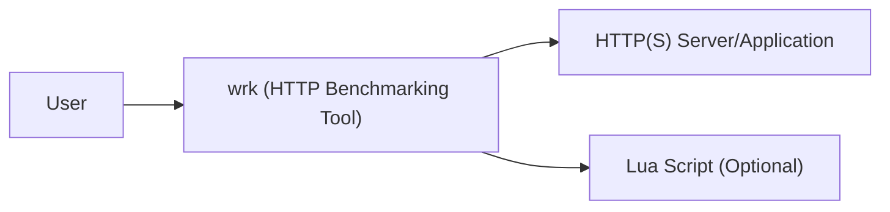
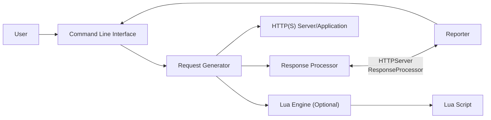

Okay, let's create a design document for the `wrk` project, a modern HTTP benchmarking tool.

# BUSINESS POSTURE

Business Priorities and Goals:

*   Provide a high-performance, scriptable HTTP benchmarking tool.
*   Offer a simple, command-line interface for ease of use.
*   Enable users to generate significant load to test HTTP servers and applications.
*   Support custom scripting (Lua) for advanced testing scenarios.
*   Be open-source and readily available for a wide range of users.

Most Important Business Risks:

*   Inaccurate Benchmarking Results: The tool providing misleading or incorrect performance metrics, leading to flawed conclusions about the system under test.
*   Security Vulnerabilities in `wrk` Itself:  Exploitable vulnerabilities within `wrk` could potentially be used to compromise the system running the benchmark, although this is a lower risk given its typical usage.
*   Lack of Adoption:  If the tool is not widely adopted, its development and maintenance may become unsustainable.
*   Misuse of the Tool: Users could potentially use `wrk` for malicious purposes, such as launching denial-of-service attacks. While this is a risk with any benchmarking tool, it's important to acknowledge.
*   Compatibility Issues: `wrk` may not function correctly on all supported platforms or with all versions of LuaJIT, leading to user frustration.

# SECURITY POSTURE

Existing Security Controls:

*   security control: Code Reviews: The GitHub repository indicates a collaborative development process, suggesting that code reviews are likely performed, although the specific process isn't detailed.
*   security control: Simple, Focused Codebase: `wrk` is designed to be a relatively small and focused tool, which inherently reduces the attack surface compared to larger, more complex applications.
*   security control: Limited External Dependencies: `wrk` has a limited number of external dependencies, reducing the risk of supply chain attacks.
*   security control: Input Validation: `wrk` validates command-line arguments and Lua script inputs to prevent unexpected behavior or crashes. (Implicit in the code, but not explicitly documented).
*   security control: No Authentication/Authorization: `wrk` itself does not implement any authentication or authorization mechanisms, as it's a client-side tool. It relies on the target server for these aspects.
*   security control: Open Source: The open-source nature of the project allows for community scrutiny and contributions, potentially leading to faster identification and resolution of security issues.

Accepted Risks:

*   accepted risk: Denial of Service (DoS) Against the Benchmarking Machine: Running `wrk` with excessive threads or connections could potentially exhaust resources on the machine running the benchmark itself.
*   accepted risk: Limited Input Sanitization: While some input validation exists, `wrk` primarily focuses on generating HTTP requests, and extensive sanitization of target URLs or headers is not its primary concern. This is acceptable as it's a benchmarking tool, not a proxy or firewall.
*   accepted risk: Lua Scripting Security: The security of Lua scripts provided by the user is the user's responsibility. `wrk` executes these scripts, so a malicious script could potentially harm the system.

Recommended Security Controls:

*   security control: Static Analysis: Integrate static analysis tools (e.g., linters, SAST) into the build process to identify potential vulnerabilities early.
*   security control: Fuzz Testing: Implement fuzz testing to identify unexpected behavior or crashes caused by malformed inputs.
*   security control: Documentation of Security Considerations: Add a section to the README or a separate security document that explicitly addresses security considerations, including the risks associated with Lua scripting and potential misuse of the tool.
*   security control: Dependency Management: Regularly review and update dependencies to mitigate supply chain risks. Consider using a dependency management tool to track and audit dependencies.

Security Requirements:

*   Authentication: Not directly applicable to `wrk` itself, as it's a client-side tool.
*   Authorization: Not directly applicable to `wrk` itself.
*   Input Validation:
    *   Validate command-line arguments to ensure they are within expected ranges and formats.
    *   Validate Lua script inputs to prevent common injection vulnerabilities.
    *   Sanitize target URLs to prevent basic injection attacks.
*   Cryptography:
    *   If supporting HTTPS, ensure proper TLS configuration and certificate validation.
*   Data Sensitivity: `wrk` handles data provided by user, e.g. HTTP headers, request body.

# DESIGN

## C4 CONTEXT



Element Description:

*   Element:
    *   Name: User
    *   Type: Person
    *   Description: The person initiating and controlling the benchmark.
    *   Responsibilities:
        *   Configures `wrk` with appropriate parameters (URL, threads, connections, duration, script).
        *   Starts and stops the benchmark.
        *   Interprets the results.
    *   Security controls: N/A - This is the user of the tool.

*   Element:
    *   Name: wrk (HTTP Benchmarking Tool)
    *   Type: Software System
    *   Description: The `wrk` benchmarking tool itself.
    *   Responsibilities:
        *   Generates HTTP requests based on user configuration.
        *   Measures response times and other performance metrics.
        *   Reports results to the user.
        *   Executes optional Lua scripts for custom behavior.
    *   Security controls: Input validation, limited external dependencies.

*   Element:
    *   Name: HTTP(S) Server/Application
    *   Type: Software System
    *   Description: The target server or application being benchmarked.
    *   Responsibilities:
        *   Responds to HTTP requests from `wrk`.
    *   Security controls: Relies on the server's own security mechanisms (authentication, authorization, input validation, etc.).

*   Element:
    *   Name: Lua Script (Optional)
    *   Type: External Component
    *   Description: An optional Lua script provided by the user to customize `wrk`'s behavior.
    *   Responsibilities:
        *   Defines custom request generation logic.
        *   Processes responses.
        *   Performs other custom actions during the benchmark.
    *   Security controls: Relies on the user to ensure the script's security. `wrk` should perform basic input validation to prevent crashes.

## C4 CONTAINER

In the case of `wrk`, the container diagram is essentially an extension of the context diagram, as `wrk` itself is a single, relatively simple application.



Element Description:

*   Element:
    *   Name: Command Line Interface
    *   Type: Component
    *   Description: Parses command-line arguments and initializes the benchmarking process.
    *   Responsibilities:
        *   Validates user input.
        *   Sets up the benchmarking parameters.
        *   Displays results to the user.
    *   Security controls: Input validation.

*   Element:
    *   Name: Request Generator
    *   Type: Component
    *   Description: Generates HTTP requests based on the configured parameters and optional Lua script.
    *   Responsibilities:
        *   Creates HTTP requests.
        *   Manages connections and threads.
        *   Interacts with the Lua Engine if a script is provided.
    *   Security controls: None specific, relies on the correctness of the HTTP library used.

*   Element:
    *   Name: Response Processor
    *   Type: Component
    *   Description: Processes HTTP responses received from the target server.
    *   Responsibilities:
        *   Measures response times.
        *   Tracks errors.
        *   Provides response data to the Lua Engine (if a script is used).
    *   Security controls: None specific.

*   Element:
    *   Name: Reporter
    *   Type: Component
    *   Description: Formats and presents the benchmarking results to the user.
    *   Responsibilities:
        *   Calculates statistics (latency, throughput, etc.).
        *   Displays results in a human-readable format.
    *   Security controls: None specific.

*   Element:
    *   Name: Lua Engine (Optional)
    *   Type: Component
    *   Description: Executes the optional Lua script provided by the user.
    *   Responsibilities:
        *   Loads and runs the Lua script.
        *   Provides an API for the script to interact with `wrk`.
    *   Security controls: Basic input validation of the script, but relies on the user for the script's security.

*   Element:
    *   Name: Lua Script
    *   Type: External Component
    *   Description: The user-provided Lua script.
    *   Responsibilities: Defined by the user.
    *   Security controls: User's responsibility.

*   Element:
    *   Name: HTTP(S) Server/Application
    *   Type: Software System
    *   Description: The target server or application being benchmarked.
    *   Responsibilities:
        *   Responds to HTTP requests from `wrk`.
    *   Security controls: Relies on the server's own security mechanisms.

## DEPLOYMENT

`wrk` is typically deployed as a standalone executable on a user's machine (laptop, server, etc.). It doesn't have a complex deployment architecture.

Possible Deployment Solutions:

1.  Manual Compilation and Installation: Users download the source code and compile it themselves.
2.  Pre-built Binaries:  Provide pre-built binaries for common operating systems (Linux, macOS, Windows).
3.  Package Managers:  Make `wrk` available through package managers (apt, yum, brew, etc.).

Chosen Solution (Combination):  Provide pre-built binaries for convenience, but also support manual compilation and package manager installation for users who prefer those methods.

```mermaid
graph LR
    DeveloperMachine["Developer Machine"] --> GitHub["GitHub Repository"]
    GitHub --> BuildServer["Build Server (e.g., GitHub Actions)"]
    BuildServer --> BinaryArtifacts["Binary Artifacts (Linux, macOS, Windows)"]
    UserMachine["User Machine"] <-- BinaryArtifacts
    UserMachine <-- GitHub

```

Element Description:

*   Element:
    *   Name: Developer Machine
    *   Type: Infrastructure Node
    *   Description: The machine where the `wrk` code is developed and maintained.
    *   Responsibilities: Code development, testing, and pushing to the repository.
    *   Security controls: Standard development machine security practices.

*   Element:
    *   Name: GitHub Repository
    *   Type: Infrastructure Node
    *   Description: The Git repository hosted on GitHub.
    *   Responsibilities: Source code management, version control, collaboration.
    *   Security controls: GitHub's built-in security features, access controls, code review processes.

*   Element:
    *   Name: Build Server (e.g., GitHub Actions)
    *   Type: Infrastructure Node
    *   Description: A server that automatically builds `wrk` from source code.
    *   Responsibilities: Compiling the code, running tests, creating release artifacts.
    *   Security controls: Secure configuration of the build environment, dependency management.

*   Element:
    *   Name: Binary Artifacts (Linux, macOS, Windows)
    *   Type: Artifact
    *   Description: The compiled `wrk` executables for different operating systems.
    *   Responsibilities: N/A - These are the output of the build process.
    *   Security controls: Code signing (ideally) to ensure authenticity and integrity.

*   Element:
    *   Name: User Machine
    *   Type: Infrastructure Node
    *   Description: The machine where `wrk` is executed.
    *   Responsibilities: Running the benchmark.
    *   Security controls: Standard operating system security practices.

## BUILD

The build process for `wrk` involves compiling the C code and linking it with the necessary libraries (LuaJIT, OpenSSL, etc.).  GitHub Actions is used for automated builds.

```mermaid
graph LR
    Developer["Developer"] --> GitPush["Git Push"]
    GitPush --> GitHub["GitHub Repository"]
    GitHub --> GitHubActions["GitHub Actions (CI)"]
    GitHubActions --> Checkout["Checkout Code"]
    Checkout --> Compile["Compile (make)"]
    Compile --> Link["Link (with LuaJIT, OpenSSL)"]
    Link --> Test["Run Tests"]
    Test --> Artifact["Create Artifact (wrk executable)"]
    Artifact --> Release["Create GitHub Release (Optional)"]

```



Security Controls in Build Process:

*   security control: Build Automation (GitHub Actions):  Automates the build process, ensuring consistency and reducing the risk of manual errors.
*   security control: Version Control (Git):  Tracks all code changes, making it easier to identify and revert vulnerabilities.
*   security control: Dependency Management: Dependencies are explicitly listed in the Makefile, allowing for review and auditing.
*   security control: Static Analysis (Potential):  Could be integrated into the GitHub Actions workflow to automatically scan for potential vulnerabilities.
*   security control: Testing:  The Makefile includes a `test` target, suggesting that some level of testing is performed, although the specifics are not detailed in the repository.

# RISK ASSESSMENT

Critical Business Processes:

*   Accurate Performance Measurement: The primary business process is providing accurate and reliable performance measurements of HTTP servers and applications.

Data to Protect and Sensitivity:

*   `wrk` itself does not handle sensitive data directly. It primarily deals with:
    *   Target URLs: These could potentially contain sensitive information, but `wrk` doesn't store or process them beyond making HTTP requests.
    *   HTTP Headers and Request Bodies:  These are provided by the user and could contain sensitive data. `wrk` transmits this data to the target server but doesn't store or process it internally.
    *   Benchmarking Results:  These are performance metrics, not typically considered sensitive data.

# QUESTIONS & ASSUMPTIONS

Questions:

*   What is the specific testing strategy used for `wrk`?  Are there unit tests, integration tests, or other forms of testing?
*   What is the process for handling security vulnerabilities reported by users or researchers?
*   Are there any plans to add features that might introduce new security considerations (e.g., support for more complex authentication schemes)?
*   What are the specific versions of LuaJIT and OpenSSL that are supported?
*   Are there any known limitations or edge cases where `wrk` might produce inaccurate results?

Assumptions:

*   BUSINESS POSTURE: It is assumed that the primary goal is to provide a reliable and accurate benchmarking tool, and that widespread adoption is desirable.
*   SECURITY POSTURE: It is assumed that a moderate level of security is desired, balancing the need for security with the simplicity and performance goals of the tool. It's also assumed that users are responsible for the security of their Lua scripts and the target servers they are testing.
*   DESIGN: It is assumed that the current design is relatively stable and that major architectural changes are not anticipated in the near future. The deployment model is assumed to be simple, with users typically running `wrk` directly on their machines.