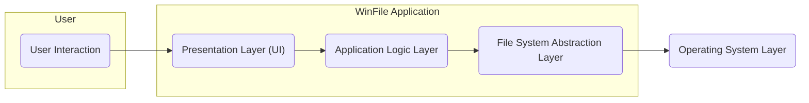

# Project Design Document: WinFile (Modern File Explorer)

**Version:** 1.1
**Date:** October 26, 2023
**Prepared By:** Gemini (AI Architecture Expert)

## 1. Introduction

This document provides a detailed design overview of the WinFile project, a modern file explorer application based on the open-source project found at [https://github.com/microsoft/winfile](https://github.com/microsoft/winfile). This document aims to clearly outline the system's architecture, components, and data flow to facilitate future threat modeling activities. It describes the key elements of the application and their interactions, providing a foundation for identifying potential security vulnerabilities. This revision includes clarifications and minor additions to enhance its utility for security analysis.

## 2. Goals and Objectives

The primary goals of the WinFile project are to:

* Provide a modern and efficient user interface for file system navigation and management on Windows.
* Offer a user experience that is both familiar to users of the classic File Explorer and incorporates modern design principles.
* Support core file management operations such as browsing, creating, deleting, renaming, copying, and moving files and directories.
* Potentially extend functionality through a plugin or extension model (though not explicitly detailed in the provided link, it's a common feature in modern applications and worth considering for threat modeling).
* Maintain or improve upon the performance and stability of the classic File Explorer.

## 3. High-Level Architecture

The WinFile application can be broadly categorized into the following architectural layers:

* **Presentation Layer (User Interface):** This layer is responsible for rendering the user interface, handling user input, and displaying information to the user. It likely utilizes Windows Presentation Foundation (WPF) or a similar UI framework. This layer translates user actions into commands for the Application Logic Layer.
* **Application Logic Layer:** This layer contains the core business logic of the application. It handles user requests, orchestrates interactions between different components, and implements file management operations. This layer acts as an intermediary between the UI and the File System Abstraction Layer.
* **File System Abstraction Layer:** This layer provides an abstraction over the underlying Windows file system API. It handles interactions with the operating system for file and directory operations, isolating the application logic from the specifics of the OS file system implementation.
* **Operating System Layer:** This is the underlying Windows operating system that provides the necessary APIs for file system access, security, and other system-level functionalities.

## 4. Detailed Design

This section delves into the key components within each architectural layer.

### 4.1. Presentation Layer (User Interface)

* **Main Window:** The primary application window that hosts the file explorer interface, managing the layout and interactions of other UI elements.
* **Navigation Pane:**  Displays drives, folders, and potentially other navigation elements (e.g., Quick Access, This PC). Handles user clicks and expands/collapses folder structures.
* **Content Pane:**  Displays the files and subdirectories of the currently selected folder. Supports different view modes (e.g., details, list, icons) and handles user selection of files and folders.
* **Toolbar/Ribbon:** Provides access to common file management actions (e.g., copy, paste, delete, new folder). These elements trigger commands within the Application Logic Layer.
* **Context Menus:**  Appear upon right-clicking on files or folders, offering context-specific actions. The available actions are determined by the selected item and the application's logic.
* **Dialog Boxes:** Used for specific tasks like renaming files, creating new folders, displaying properties, or handling error messages. These often involve data input from the user.
* **Drag and Drop Functionality:** Enables users to move or copy files and folders by dragging them within the application or from/to other applications. This involves monitoring mouse events and initiating file operations.
* **Preview Pane (Potential):**  A pane that displays a preview of the selected file's content. This might involve rendering different file formats.

### 4.2. Application Logic Layer

* **File Explorer Core:**  The central component responsible for managing the state of the file explorer, including the current directory, selected files, view settings, and potentially the history of visited folders.
* **Command Handlers:**  Components that handle user actions initiated through the UI (e.g., clicking a button, selecting a menu item). These handlers translate user requests into specific file system operations by interacting with the File Operation Manager. Examples include `CopyCommandHandler`, `DeleteCommandHandler`, `RenameCommandHandler`.
* **File Operation Manager:**  Manages the execution of file system operations (copy, move, delete, etc.), potentially handling progress updates, error conditions, and user confirmations. It interacts with the File System Abstraction Layer to perform the actual operations.
* **View Management:**  Responsible for managing different views of the file system (e.g., details, list, icons), sorting, and filtering.
* **Search Functionality:**  Implements the logic for searching for files and folders based on user-defined criteria. This might involve interacting with the operating system's indexing service or performing a recursive file system traversal.
* **Plugin/Extension Manager (Potential):** If implemented, this component would manage the loading, unloading, and interaction with external plugins or extensions. It would need to handle plugin isolation and security.
* **Configuration Manager:**  Responsible for loading, saving, and managing application settings and user preferences.

### 4.3. File System Abstraction Layer

* **File System Interface:** Defines a set of interfaces for interacting with the underlying file system, providing an abstract way to perform operations like `GetDirectoryContents`, `CreateFile`, `DeleteFile`, `CopyFile`, etc.
* **Windows File System Implementation:**  A concrete implementation of the `File System Interface` that utilizes the Windows API (e.g., `System.IO` namespace in .NET) to perform file and directory operations. This component handles the translation of abstract requests into specific OS calls.
* **Permission Handling:**  Manages the retrieval and interpretation of file system permissions (ACLs). It ensures that the application respects user access rights when performing file operations.
* **Error Handling:**  Provides a consistent way to handle errors returned by the underlying file system, translating OS-specific error codes into more generic application-level errors.
* **Path Canonicalization:**  Responsible for converting user-provided paths into canonical, absolute paths to prevent path traversal vulnerabilities.

### 4.4. Operating System Layer

* **Windows Kernel:** The core of the operating system, responsible for managing system resources, providing low-level access to hardware, and enforcing security policies.
* **File System Drivers (NTFS, FAT32, etc.):**  Drivers that allow the operating system to interact with different file system formats, handling the low-level details of reading and writing data to storage devices.
* **Security Subsystem:**  Manages user authentication, authorization, and access control to files and directories. This includes enforcing file system permissions and handling user privileges.
* **Windows API:**  Provides the interfaces and functions that the WinFile application uses to interact with the operating system, including file system access, process management, and UI rendering.

## 5. Data Flow

The following outlines a typical data flow for a common file operation (e.g., copying a file):

1. **User Initiates Copy:** The user selects a file in the content pane and initiates a copy operation (e.g., via the toolbar, context menu, or keyboard shortcut).
2. **Presentation Layer Receives Input:** The UI captures the user's action (e.g., a button click) and passes it to the appropriate command handler in the Application Logic Layer. This might involve packaging the source and destination paths.
3. **Command Handler Invokes File Operation Manager:** The specific command handler (e.g., `CopyCommandHandler`) calls the `File Operation Manager`, providing the source and destination paths, and potentially other parameters like copy options.
4. **File Operation Manager Interacts with Abstraction Layer:** The `File Operation Manager` uses the `File System Interface` to request the file copy operation. It passes the necessary information to the `CopyFile` method of the interface.
5. **Abstraction Layer Calls Windows API:** The `Windows File System Implementation` within the abstraction layer translates the abstract `CopyFile` request into calls to the appropriate Windows API functions (e.g., `CopyFileW`). This layer might also perform path validation and permission checks before calling the API.
6. **Operating System Performs Operation:** The Windows operating system, through its file system drivers and security subsystem, performs the actual file copy operation, respecting file system permissions and handling potential errors.
7. **Status Updates:** The operating system provides status updates (e.g., progress, errors) back through the layers to the Presentation Layer. This might involve events or callbacks.
8. **UI Updates:** The Presentation Layer updates the user interface to reflect the progress or completion of the file copy operation, potentially displaying a progress bar or a confirmation message.

```mermaid
graph LR
    subgraph "User"
        A("User Action (Copy File)")
    end
    subgraph "WinFile Application"
        B("Presentation Layer")
        C("Application Logic Layer (Command Handler)")
        D("Application Logic Layer (File Operation Manager)")
        E("File System Abstraction Layer")
    end
    F("Operating System Layer (Windows API)")

    A -- "Initiates Copy" --> B
    B -- "Request Copy Operation" --> C
    C -- "Delegate Copy Task" --> D
    D -- "Request File Copy (Abstract)" --> E
    E -- "Call Windows API (CopyFileW)" --> F
    F -- "Perform File Copy" --> F
    F -- "Status Updates" --> E
    E -- "Status Updates" --> D
    D -- "Notify Completion/Progress" --> C
    C -- "Update UI Elements" --> B
    B -- "Display Status to User" --> A
```

## 6. Security Considerations (Initial Thoughts for Threat Modeling)

This section outlines initial security considerations that will be further explored during the threat modeling process.

* **File System Permissions Enforcement:** Ensuring the application strictly adheres to and enforces file system permissions (ACLs) to prevent unauthorized access, modification, or deletion of files and directories. Consider scenarios where the application might inadvertently bypass permissions.
* **Path Traversal Vulnerabilities:**  Implementing robust input validation and path canonicalization to prevent users or malicious actors from manipulating file paths to access resources outside of their intended scope. This includes handling relative paths and special characters.
* **Privilege Escalation:**  Analyzing potential vulnerabilities that could allow a malicious actor to gain elevated privileges through the application. This includes examining interactions with system processes and the handling of user credentials.
* **Malicious File Handling:**  Considering the risks associated with opening, processing, or displaying potentially malicious files. This includes vulnerabilities related to parsing file formats, executing embedded code, or displaying harmful content.
* **Buffer Overflows/Memory Corruption:**  Ensuring the application is robust against memory-related vulnerabilities, especially when handling file data, user input, or network communication (if applicable). Employing safe memory management practices is crucial.
* **Code Injection (if plugins are supported):**  If a plugin architecture exists, rigorously securing the plugin loading, execution, and communication mechanisms to prevent malicious code injection and ensure plugin isolation. Consider sandboxing techniques.
* **Data Confidentiality and Integrity:**  Protecting sensitive file data from unauthorized access or modification. This includes considering encryption for sensitive data at rest or in transit (if applicable).
* **Denial of Service:**  Considering potential vulnerabilities that could allow an attacker to crash or make the application unavailable. This includes resource exhaustion attacks or vulnerabilities in file processing logic.
* **Dependency Vulnerabilities:**  Regularly scanning and updating third-party libraries and components to address known security vulnerabilities. Maintaining an inventory of dependencies is essential.
* **Cross-Site Scripting (XSS) or similar UI injection vulnerabilities:** If the application renders any external content or allows user-generated content in previews or descriptions, consider potential UI injection vulnerabilities.
* **Insecure File Operations:**  Analyzing the security implications of file operations like renaming, moving, and deleting, ensuring that these operations are performed securely and do not introduce vulnerabilities.

## 7. Deployment Model

The WinFile application is expected to be deployed as a standalone desktop application on Windows operating systems. The deployment process likely involves:

* **Building the Application:** Compiling the source code into executable files and associated libraries.
* **Packaging the Application:** Creating a secure and properly signed installer package (e.g., MSIX or EXE with digital signature) that includes all necessary files, dependencies, and metadata.
* **Distribution:**  Distributing the installer package through trusted channels to end-users. Consider using code signing certificates to verify the authenticity and integrity of the installer.
* **Installation:**  Users run the installer with appropriate privileges to install the application on their local machines. The installation process should follow security best practices.
* **Updates:**  Providing a secure mechanism for delivering and installing updates to the application. This could involve automatic updates or user-initiated updates, ensuring the integrity and authenticity of the update packages.

## 8. Assumptions and Constraints

The following assumptions and constraints are relevant to this design document:

* **Target Platform:** The application is primarily designed for Windows operating systems.
* **Development Language:**  Likely developed using C# and .NET (based on the GitHub repository).
* **File System Interaction:**  Relies on the standard Windows file system APIs.
* **User Permissions:**  Assumes the application runs with the permissions of the logged-in user. However, the application should not require or request unnecessary elevated privileges.
* **Open Source Nature:** The open-source nature of the project allows for community contributions and scrutiny, which can aid in identifying and addressing potential issues. However, it also means that the source code is publicly available for potential attackers to analyze.
* **No Network Communication (Initially Assumed):** This design assumes the core file explorer functionality does not involve network communication. If network features are added, the design and threat model will need to be updated.

This document provides a more detailed and refined design overview of the WinFile project, further enhancing its utility for effective threat modeling. The detailed descriptions of components, data flow, and expanded security considerations will be crucial in identifying potential vulnerabilities and developing appropriate mitigation strategies.