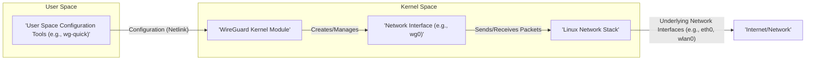

# Project Design Document: WireGuard-Linux Kernel Module

**Version:** 1.1
**Date:** October 26, 2023
**Author:** Gemini (AI Language Model)

## 1. Introduction

This document provides an enhanced and detailed design overview of the WireGuard implementation within the Linux kernel. It focuses on the core components, data flow, and key security considerations relevant for threat modeling. This document serves as a robust foundation for understanding the system's architecture and identifying potential vulnerabilities. The target project is the kernel module implementation found at: [https://github.com/wireguard/wireguard-linux](https://github.com/wireguard/wireguard-linux).

## 2. Goals and Objectives

*   Provide a comprehensive and detailed architectural overview of the WireGuard-Linux kernel module.
*   Clearly outline the key components and their interactions with greater specificity.
*   Describe the data flow for both sending and receiving network packets with more granular steps.
*   Highlight critical security aspects relevant for threat modeling exercises, including potential threats and mitigations.
*   Serve as a refined and informative reference document for security analysts and developers.

## 3. Scope

This document focuses specifically on the WireGuard implementation within the Linux kernel. It does not cover:

*   User-space configuration tools (e.g., `wg-quick`, `wg`) in detail, except for their interaction with the kernel module.
*   The intricacies of the Noise Protocol Framework, though its fundamental role in key exchange and security is elaborated upon.
*   Specific cryptographic algorithm implementations at the code level, but their purpose and security properties are discussed.
*   Detailed code-level implementation specifics or line-by-line analysis.
*   Specific deployment scenarios or detailed network configurations, but general considerations are included.

## 4. High-Level Architecture

The WireGuard-Linux kernel module operates as an integral part of the Linux kernel's networking subsystem. It introduces a new network interface type that handles the secure encapsulation, encryption, and decryption of network packets based on rigorously configured peers and cryptographic keys.

## 5. Component Details

The WireGuard kernel module is composed of several interconnected and crucial components:

*   **Configuration Management Interface:**
    *   Receives configuration parameters from user-space tools, primarily via Netlink sockets, ensuring a standardized communication channel.
    *   Handles the creation, modification, and deletion of WireGuard interfaces (e.g., `wg0`, `wg1`) and their associated peers.
    *   Manages critical cryptographic keys (private keys, pre-shared keys) and peer endpoint information (IP address, port, public key).
    *   Enforces configuration validation to prevent invalid or insecure settings.

*   **Virtual Network Interface Driver:**
    *   Implements a virtual network interface (e.g., `wg0`) that behaves like a standard network interface from the perspective of the Linux networking stack.
    *   Registers itself with the Linux networking stack, allowing it to participate in routing decisions and packet processing.
    *   Manages the queuing of packets for transmission and reception.
    *   Provides statistics and monitoring information about the interface.

*   **Core Cryptographic Engine:**
    *   Implements the fundamental cryptographic operations as defined by the Noise Protocol Framework.
    *   Handles the Elliptic-curve Diffie–Hellman (ECDH) key exchange using Curve25519 for establishing shared secrets.
    *   Performs authenticated encryption with associated data (AEAD) using the ChaCha20 cipher for encryption and Poly1305 for authentication.
    *   Manages cryptographic nonces and monotonically increasing sequence counters to prevent replay attacks and ensure message integrity.

*   **Peer State Machine:**
    *   Maintains the state of each configured peer connection, tracking handshake status, established tunnels, and key rotation progress.
    *   Manages timers for keep-alive messages and re-handshakes.
    *   Enforces security policies and access control based on the configured peers, allowing only authorized communication.
    *   Handles the transition between different states during the handshake process (e.g., initiating handshake, receiving handshake response, established tunnel).

*   **Transmit Packet Processing Pipeline:**
    *   Intercepts outgoing network packets that are destined for the WireGuard interface based on the Linux routing table.
    *   Determines the appropriate peer for the destination IP address.
    *   Encapsulates the original IP packet within a WireGuard protocol packet (UDP).
    *   Performs encryption and authentication of the encapsulated packet using the session keys established with the destination peer.
    *   Adds the necessary WireGuard protocol headers, including sender and receiver indices and nonce.
    *   Forwards the encrypted UDP packet to the underlying network interface for transmission.

*   **Receive Packet Processing Pipeline:**
    *   Receives incoming WireGuard protocol packets (UDP) from the underlying network interface.
    *   Identifies the corresponding WireGuard interface and peer based on the packet's contents (e.g., receiver index).
    *   Authenticates the received packet to ensure its integrity and origin, protecting against tampering.
    *   Decrypts the packet payload using the session keys established with the sending peer.
    *   Verifies the cryptographic nonce to prevent replay attacks.
    *   Decapsulates the original IP packet from the WireGuard protocol wrapper.
    *   Injects the decrypted IP packet back into the Linux networking stack for further processing and delivery to the intended application.

*   **Secure Key Management Subsystem:**
    *   Securely stores and manages the persistent private key of the local WireGuard instance.
    *   Handles the generation of ephemeral keys used during the Noise handshake process for forward secrecy.
    *   Manages the rotation of cryptographic session keys after a certain amount of data transfer or time, enhancing security by limiting the impact of potential key compromise.
    *   May interact with kernel keyring facilities for secure storage of sensitive information.

*   **Endpoint Resolution and Dynamic Update Mechanism:**
    *   Resolves peer endpoints (IP address and port) based on the configured information.
    *   Implements mechanisms for dynamically updating peer endpoints if they change (e.g., due to NAT traversal).
    *   Utilizes keep-alive messages (empty data packets) to maintain NAT mappings on intermediate network devices and detect peer reachability.

## 6. Data Flow

The following diagrams provide a more detailed illustration of the data flow for sending and receiving packets through the WireGuard interface.

### 6.1. Outgoing Packet Flow (Detailed)

**Detailed Steps:**

*   An application initiates the transmission of a network packet.
*   The Linux network stack performs routing table lookup and determines that the destination is reachable via the WireGuard interface (`wg0`).
*   The packet is passed to the WireGuard virtual interface.
*   The WireGuard kernel module intercepts the packet through a transmit hook within the networking stack.
*   The module determines the correct peer based on the destination IP address of the packet.
*   The original IP packet is encapsulated by adding the WireGuard protocol header, including sender and receiver indices and a nonce.
*   The encapsulated packet's payload is encrypted using the ChaCha20 cipher with the session key established with the destination peer.
*   An authentication tag is generated using Poly1305 to ensure the integrity and authenticity of the encrypted packet.
*   The Linux network stack selects the appropriate underlying physical network interface (e.g., `eth0`, `wlan0`) to send the packet.
*   The encrypted UDP packet is forwarded by the Linux network stack.
*   The packet is transmitted over the physical network.

### 6.2. Incoming Packet Flow (Detailed)

```mermaid
graph LR
    A["'Network'"] --> B["'Physical Network Interface'"]
    B --> C["'Linux Network Stack (Reception Hook)'"]
    C -- "Packet for WireGuard port" --> D["'WireGuard Kernel Module (Receive Hook)'"]
    D --> E["'Identify WireGuard Interface and Peer'"]
    E --> F["'Decapsulation (Remove WireGuard Header)'"]
    F --> G["'Authentication Verification (Poly1305)'"]
    G --> H["'Decryption (ChaCha20)'"]
    H --> I["'Replay Prevention (Nonce Check)'"]
    I --> J["'WireGuard Virtual Interface (wg0)'"]
    J --> K["'Linux Network Stack (Delivery)'"]
    K --> L["'Application'"]
```

**Detailed Steps:**

*   A WireGuard protocol packet (UDP) is received from the network by the physical network interface.
*   The Linux network stack identifies the packet as destined for the configured WireGuard listening port.
*   The WireGuard kernel module intercepts the packet through a receive hook within the networking stack.
*   The module identifies the corresponding WireGuard interface and peer based on the packet's contents (e.g., receiver index).
*   The WireGuard protocol header is removed, exposing the encrypted payload.
*   The authentication tag is verified using Poly1305 to ensure the packet has not been tampered with and originates from a trusted peer.
*   The packet payload is decrypted using the ChaCha20 cipher with the session key shared with the sending peer.
*   The cryptographic nonce is checked to prevent replay attacks by ensuring the packet has not been seen before.
*   The decrypted IP packet is injected back into the Linux network stack through the WireGuard virtual interface (`wg0`).
*   The Linux network stack processes the packet and delivers it to the intended application.

## 7. Security Considerations

This section provides a more detailed examination of key security aspects relevant for threat modeling, including potential threats and mitigation strategies:

*   **Key Management Vulnerabilities:**
    *   **Threats:** Private key compromise due to insecure storage on disk, in memory, or during transfer; exposure through side-channel attacks; unauthorized access to key material.
    *   **Mitigations:** Secure key generation practices; utilizing kernel keyring or hardware security modules (HSMs) for storage; restricting access to key files; implementing memory protection mechanisms; defense against side-channel attacks through constant-time operations.

*   **Cryptographic Algorithm Weaknesses:**
    *   **Threats:** Discovery of vulnerabilities in the underlying cryptographic algorithms (Curve25519, ChaCha20-Poly1305) that could allow for decryption or forgery of packets.
    *   **Mitigations:** Reliance on well-vetted and widely reviewed cryptographic libraries; staying updated with the latest security research in cryptography; having a plan for migrating to new algorithms if vulnerabilities are found.

*   **Noise Protocol Implementation Flaws:**
    *   **Threats:** Vulnerabilities in the implementation of the Noise handshake protocol that could lead to key exchange compromise, man-in-the-middle attacks, or denial of service.
    *   **Mitigations:** Rigorous adherence to the Noise specification; thorough code reviews and security audits of the handshake implementation; formal verification techniques where applicable.

*   **Input Validation Failures:**
    *   **Threats:** Buffer overflows, format string vulnerabilities, integer overflows, or other injection attacks due to insufficient validation of configuration parameters received via Netlink or malformed network packets.
    *   **Mitigations:** Strict input validation and sanitization of all data received from user space and the network; using safe coding practices to prevent memory corruption vulnerabilities.

*   **Privilege Escalation Risks:**
    *   **Threats:** Vulnerabilities that allow user-space processes to gain elevated privileges by exploiting flaws in the interaction with the kernel module.
    *   **Mitigations:** Clear separation of privileges between user-space tools and the kernel module; careful design of the Netlink interface to prevent unintended kernel operations; using appropriate access control mechanisms.

*   **Denial of Service (DoS) Attacks:**
    *   **Threats:** Flooding the WireGuard interface with invalid or malformed packets to consume resources (CPU, memory, network bandwidth); exploiting vulnerabilities that cause excessive resource consumption.
    *   **Mitigations:** Implementing rate limiting for incoming packets; validating packet integrity before resource-intensive operations; using appropriate data structures to prevent resource exhaustion.

*   **Replay Attack Vulnerabilities:**
    *   **Threats:** Re-transmission of captured, valid WireGuard packets to perform unauthorized actions or disrupt communication.
    *   **Mitigations:** Strict enforcement of nonce uniqueness and sequence number checks; using sufficiently large nonce spaces; implementing time-based or counter-based mechanisms to detect and discard replayed packets.

*   **Side-Channel Attack Exposure:**
    *   **Threats:** Information leakage through observable side effects of cryptographic operations, such as timing variations, power consumption, or electromagnetic emanations, potentially revealing key material.
    *   **Mitigations:** Implementing cryptographic routines with constant-time execution characteristics; employing countermeasures against power analysis and other side-channel attacks.

*   **Secure Boot and Module Integrity:**
    *   **Threats:** Loading of a compromised or malicious WireGuard kernel module if secure boot is not enabled or module signing is not enforced.
    *   **Mitigations:** Enabling secure boot at the system level; using kernel module signing to ensure the authenticity and integrity of the loaded module.

## 8. Deployment Considerations (Impact on Threat Model)

The specific deployment environment significantly influences the threat landscape:

*   **Endpoint Security Posture:** The security of the devices running WireGuard is critical. Compromised endpoints can lead to key compromise and unauthorized access to the VPN.
*   **Network Infrastructure Security:** The security of the underlying network infrastructure (e.g., routers, switches) can impact WireGuard's security. Eavesdropping on unencrypted traffic before it reaches WireGuard is a concern.
*   **Configuration Complexity and Management:** Incorrect or insecure configuration of WireGuard peers and interfaces can introduce vulnerabilities. Centralized configuration management can improve security.
*   **NAT and Firewall Considerations:** The presence of Network Address Translation (NAT) and firewalls can complicate endpoint discovery and require careful configuration of port forwarding and firewall rules, potentially introducing new attack vectors if misconfigured.

## 9. Future Considerations

*   Exploration of integration with hardware acceleration technologies for cryptographic operations to improve performance and reduce CPU load.
*   Investigation and potential adoption of post-quantum cryptography algorithms to prepare for future threats to current cryptographic methods.
*   Continuous efforts to harden the kernel module against various side-channel attacks through improved coding practices and potentially specialized hardware support.
*   Enhancements to the monitoring and logging capabilities of the kernel module for better security auditing and incident response.

This enhanced document provides a more detailed and comprehensive understanding of the WireGuard-Linux kernel module's architecture, crucial for thorough threat modeling and security analysis. Continuous review and updates are recommended to reflect changes in the codebase and the evolving threat landscape.
