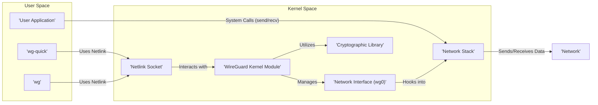

## Project Design Document: WireGuard-Linux Kernel Module (Improved)

**1. Project Overview**

This document provides a detailed design overview of the WireGuard-Linux kernel module, a modern and secure virtual private network (VPN) solution implemented directly within the Linux kernel. This document serves as a foundational resource for understanding the system's architecture, component interactions, and security considerations, specifically for the purpose of subsequent threat modeling activities. It focuses on the core functional elements and their relationships within the Linux kernel environment.

**2. Goals**

* To present a clear and comprehensive architectural blueprint of the WireGuard-Linux kernel module.
* To thoroughly describe the function and responsibilities of each key component.
* To illustrate the detailed flow of data packets through the system during both transmission and reception.
* To explicitly highlight security-relevant design choices and potential areas of concern.
* To serve as the primary reference document for future threat modeling and security analysis efforts.

**3. Target Audience**

This document is intended for individuals and teams involved in the security assessment and development of systems utilizing WireGuard, including:

* Security architects and engineers tasked with performing threat modeling and risk analysis.
* Software developers contributing to or integrating with the WireGuard codebase.
* System administrators responsible for the deployment, configuration, and maintenance of WireGuard instances.
* Cybersecurity researchers seeking a deep understanding of WireGuard's internal workings.

**4. Architecture Overview**

The WireGuard-Linux kernel module operates as an integral part of the Linux kernel, providing a high-performance and secure network tunneling capability. It interacts with user-space applications for configuration and control, and directly with the Linux network stack for packet processing.

**5. Component Details**

* **User Application:** Any process running in user space that intends to send or receive network traffic through the WireGuard tunnel. These applications interact with the WireGuard virtual network interface as they would with any standard network interface.
* **`wg-quick`:** A high-level configuration utility (typically a shell script) designed to simplify the setup and management of WireGuard interfaces. It leverages the `wg` command-line tool to interact with the kernel module. Its responsibilities include:
    * Creating and destroying WireGuard network interfaces.
    * Setting interface IP addresses and routing rules.
    * Configuring peers based on configuration files.
    * Bringing the interface up and down.
* **`wg`:** The primary command-line interface for managing the WireGuard kernel module. It communicates with the module via the Netlink socket and allows users to:
    * Create, configure, and delete WireGuard interfaces.
    * Add, remove, and modify peer configurations (including public keys, allowed IPs, and endpoint information).
    * Display the current status of the WireGuard interface and its peers (e.g., handshake status, transfer statistics).
    * Manage the listening port and private key of the local interface.
* **WireGuard Kernel Module:** The core of the WireGuard implementation, residing within the Linux kernel. Its key responsibilities include:
    * **Interface Management:** Creating and managing virtual network interfaces (e.g., `wg0`).
    * **Peer Management:** Storing and managing the configuration information for each configured peer, including their public keys, allowed IP addresses, and endpoint details.
    * **Key Exchange:** Implementing the Noise protocol handshake for establishing secure, authenticated connections with peers. This involves the exchange of cryptographic keys.
    * **Encryption and Decryption:** Performing symmetric encryption and decryption of data packets using the ChaCha20 cipher with the Poly1305 authenticator.
    * **Packet Processing:** Intercepting packets destined for or originating from the WireGuard interface, applying encryption or decryption as needed, and forwarding them to the network stack.
    * **State Management:** Maintaining the current state of the connection with each peer, including handshake status, last received handshake timestamp, and allowed IPs.
    * **Nonce Handling:** Managing and validating nonce values to prevent replay attacks.
    * **Interaction with Cryptographic Library:** Utilizing a cryptographic library (e.g., a kernel crypto API or a bundled library) for the underlying cryptographic operations.
    * **Netlink Interface Handling:**  Receiving configuration commands and sending status updates via the Netlink socket.
* **Network Stack:** The standard Linux networking subsystem responsible for all network-related operations. The WireGuard module integrates with the network stack by:
    * Registering virtual network interfaces.
    * Receiving outgoing packets destined for the WireGuard interface.
    * Delivering decrypted incoming packets from the WireGuard module to the appropriate destination.
    * Handling routing decisions for traffic entering and leaving the WireGuard tunnel.
* **Cryptographic Library:** Provides the fundamental cryptographic primitives used by the WireGuard module. This typically includes implementations of:
    * **Curve25519:** For elliptic-curve Diffie-Hellman key exchange.
    * **ChaCha20:** For symmetric encryption of data.
    * **Poly1305:** For message authentication.
    * **BLAKE2s:** For cryptographic hashing.
    * **The Noise Protocol Framework:**  For structuring the key exchange process.
* **Network Interface (e.g., `wg0`):** A virtual network interface created by the WireGuard kernel module. User-space applications send traffic to this interface when they want it to be routed through the VPN tunnel.
* **Netlink Socket:** A communication channel between user space and the kernel. The `wg` command-line tool and `wg-quick` utility use Netlink sockets to send configuration commands to the WireGuard kernel module and receive status information.

**6. Data Flow**

The following sections detail the typical flow of data packets when transmitted through and received by a WireGuard interface.

**6.1. Outgoing Traffic Flow:**

```mermaid
graph LR
    A["'User Application'"] --> B["'Network Stack'"];
    B -- "Packet destined for wg0" --> C["'WireGuard Kernel Module'"];
    C -- "Lookup Peer by Destination IP" --> D["'Peer Configuration'"];
    D -- "Retrieve Peer Public Key" --> E["'Noise_IK Handshake (if needed)'"];
    E -- "Establish/Retrieve Session Keys" --> F["'Encrypt Payload (ChaCha20-Poly1305)'"];
    F -- "Encapsulate in UDP" --> G["'Network Stack'"];
    G -- "Route and Send UDP Packet" --> H["'Network'"];
```

* **User Application initiates transmission:** An application sends a network packet destined for an IP address that should be routed through the WireGuard tunnel.
* **Network Stack routing:** The Linux network stack identifies the destination IP and routes the packet to the WireGuard virtual interface (e.g., `wg0`).
* **WireGuard Module interception:** The WireGuard kernel module intercepts the outgoing packet.
* **Peer Lookup:** The module determines the intended recipient (peer) based on the destination IP address and the configured allowed IPs for each peer.
* **Handshake Initiation (if necessary):** If a secure session with the peer hasn't been established or has expired, the module initiates the Noise_IK handshake protocol.
* **Session Key Derivation/Retrieval:** Once a secure session is established, the module retrieves the current session keys for encrypting the data.
* **Encryption and Authentication:** The module encrypts the packet payload using the ChaCha20 symmetric cipher and adds an authentication tag using Poly1305.
* **UDP Encapsulation:** The encrypted packet is encapsulated within a UDP packet. The UDP header includes the source and destination ports (typically the WireGuard listening port and the peer's endpoint).
* **Network Stack Transmission:** The encapsulated UDP packet is passed back to the network stack for routing and transmission over the physical network interface to the peer's configured endpoint.

**6.2. Incoming Traffic Flow:**

```mermaid
graph LR
    A["'Network'"] --> B["'Network Stack'"];
    B -- "Incoming UDP Packet on Listening Port" --> C["'WireGuard Kernel Module'"];
    C -- "Lookup Peer by Source Endpoint" --> D["'Peer Configuration'"];
    D -- "Verify MAC (Poly1305)" --> E["'Decrypt Payload (ChaCha20)'"];
    E -- "Pass Decrypted Packet" --> F["'Network Stack'"];
    F -- "Route to Destination Application" --> G["'User Application'"];
```

* **Network Stack receives UDP packet:** The system's network interface receives a UDP packet on the configured WireGuard listening port.
* **WireGuard Module interception:** The network stack identifies the destination port and passes the UDP packet to the WireGuard kernel module.
* **Peer Lookup:** The module identifies the sending peer based on the source IP address and port of the UDP packet.
* **Authentication Verification:** The module verifies the integrity and authenticity of the received packet using the Poly1305 Message Authentication Code (MAC). Packets with invalid MACs are discarded.
* **Decryption:** If the authentication is successful, the module decrypts the packet payload using the ChaCha20 symmetric cipher and the session key associated with the peer.
* **Network Stack Delivery:** The decrypted packet is passed back to the network stack.
* **Routing and Delivery:** The network stack routes the decrypted packet to the appropriate local application based on the destination IP address and port in the decrypted packet's header.

**7. Security Considerations**

* **Cryptographic Algorithm Selection:** WireGuard's reliance on specific, modern cryptographic primitives (Curve25519, ChaCha20, Poly1305, BLAKE2s) provides strong security but limits cryptographic agility. Vulnerabilities in these algorithms could have significant impact.
* **Key Management and Security:** The security of the entire system hinges on the secure generation, storage, and handling of private keys. Compromised private keys allow attackers to impersonate the owner.
* **Peer Authentication:** WireGuard uses pre-shared public keys for authentication. Secure distribution and management of these public keys are crucial to prevent unauthorized peers.
* **Replay Attack Prevention:** The protocol incorporates monotonically increasing nonce values within encrypted packets to prevent replay attacks. Proper implementation and nonce management are essential.
* **Denial of Service (DoS) Attacks:** Like any network service, WireGuard is susceptible to DoS attacks targeting the listening port or exploiting vulnerabilities in the protocol implementation. Rate limiting and proper firewall configuration are important mitigations.
* **Side-Channel Attacks:** Implementations of the cryptographic algorithms could be vulnerable to side-channel attacks (e.g., timing attacks). Careful implementation and potentially hardware acceleration can mitigate these risks.
* **Kernel Module Security:** As a kernel module, vulnerabilities in the WireGuard code could lead to system-wide compromise. Rigorous code review, static analysis, and fuzzing are critical for ensuring the module's security.
* **Netlink Interface Security:** The Netlink interface used for configuration must be protected to prevent unauthorized modification of WireGuard settings. Access to this interface should be restricted to privileged processes.
* **Roaming and Key Updates:** WireGuard's design allows for seamless roaming between networks. The key update mechanism (re-keying) must be secure and efficient to maintain uninterrupted secure communication.
* **Initial Handshake Vulnerabilities:** While the Noise protocol is generally considered secure, vulnerabilities could exist in its specific implementation within WireGuard. Careful scrutiny of the handshake process is necessary.

**8. Deployment Considerations**

* **Firewall Configuration:**  Appropriate firewall rules must be configured to allow UDP traffic on the chosen WireGuard listening port.
* **Network Address Translation (NAT) Traversal:**  Consideration must be given to NAT traversal when deploying WireGuard in environments where peers are behind NAT. Techniques like UDP hole punching might be necessary.
* **Public Key Distribution:** Secure and reliable methods for distributing public keys to authorized peers are essential.
* **Private Key Storage:** Private keys should be stored securely with appropriate file permissions and potentially encryption at rest.
* **User Permissions and Access Control:** Access to the `wg` command and configuration files should be restricted to authorized users and processes.
* **Monitoring and Logging:** Implementing proper monitoring and logging of WireGuard activity can aid in detecting and responding to security incidents.

**9. Future Considerations**

* **Post-Quantum Cryptography:** Exploring and potentially integrating post-quantum resistant cryptographic algorithms to mitigate future threats from quantum computing.
* **Formal Verification:** Applying formal verification techniques to the WireGuard codebase to provide mathematical proofs of its security properties.
* **Improved Integration with Network Management Tools:** Enhancing integration with network management tools like NetworkManager and systemd-networkd for simplified configuration and management.
* **Hardware Acceleration:** Exploring opportunities for hardware acceleration of cryptographic operations to improve performance and reduce CPU overhead.

This improved design document provides a more detailed and comprehensive overview of the WireGuard-Linux kernel module's architecture, data flow, and security considerations. It serves as a robust foundation for conducting thorough threat modeling and security analysis activities.