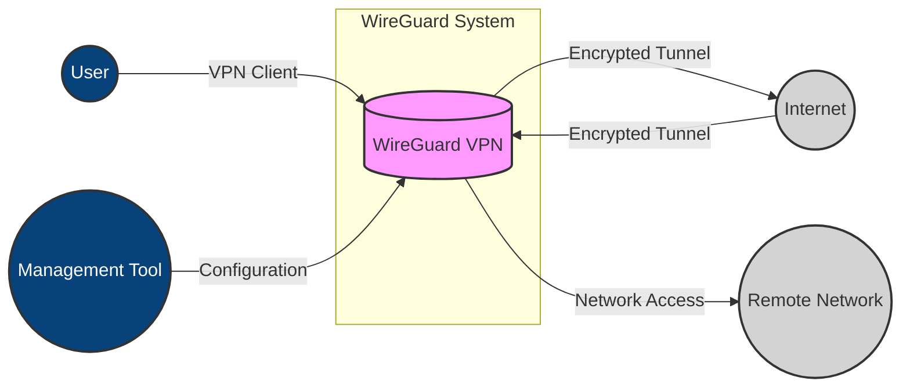
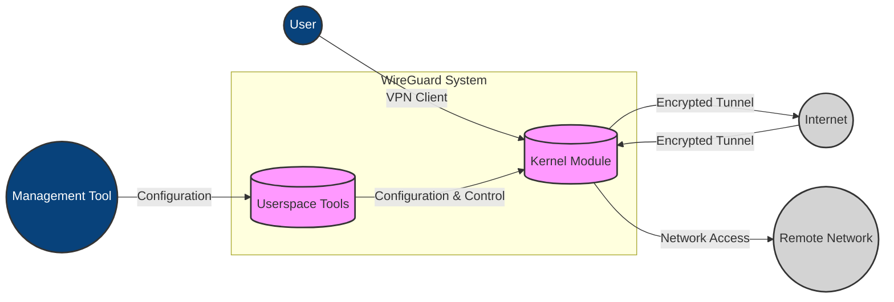
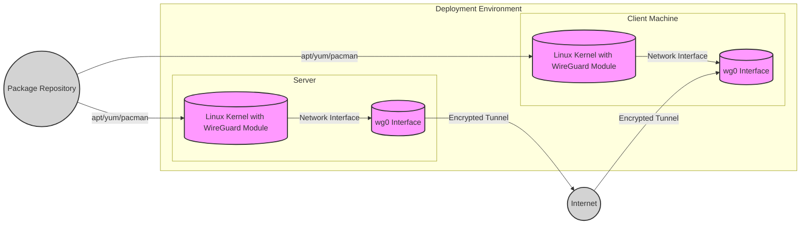
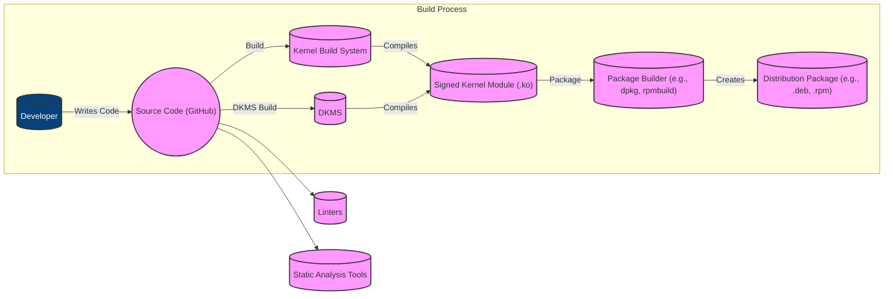

Okay, let's create a design document for the WireGuard Linux project.

# BUSINESS POSTURE

WireGuard is a fast, modern, and secure VPN tunnel. It aims to be more performant and less complex than existing solutions like IPsec and OpenVPN.  Given its nature as a core piece of networking infrastructure, the business priorities revolve around performance, security, and maintainability.  It's likely used in a wide variety of contexts, from individual users to large enterprises, so adaptability is also key.

Business Priorities:

*   Performance:  Provide a high-speed VPN solution with minimal overhead.
*   Security:  Offer strong cryptographic protection for user data.
*   Simplicity:  Be easy to configure and deploy compared to alternatives.
*   Maintainability:  Have a clean and well-documented codebase for long-term viability.
*   Cross-Platform Compatibility (While this document focuses on the Linux implementation, the broader WireGuard project aims for this).
*   Auditability: The code should be easy to audit for security vulnerabilities.

Business Goals:

*   Become a widely adopted VPN solution.
*   Replace legacy VPN technologies in many use cases.
*   Provide a secure and reliable way to access private networks.
*   Minimize the attack surface exposed by the VPN software.

Most Important Business Risks:

*   Cryptographic Weakness:  A flaw in the cryptographic implementation could compromise the security of all users.
*   Vulnerabilities in Code:  Bugs in the kernel module or user-space tools could lead to denial of service, privilege escalation, or information leaks.
*   Complexity Creep:  Adding features without careful consideration could lead to a more complex and less secure system over time.
*   Lack of Adoption: If WireGuard fails to gain traction, it may not receive the necessary community support and scrutiny.
*   Integration Challenges: Difficulty integrating with existing network infrastructure could hinder adoption.

# SECURITY POSTURE

Existing Security Controls:

*   security control: Cryptography: WireGuard uses a well-defined set of modern cryptographic primitives (Noise protocol framework, ChaCha20, Poly1305, BLAKE2s, SipHash24, HKDF). This is described in the whitepaper and source code.
*   security control: Minimal Attack Surface: The design philosophy emphasizes simplicity and a small codebase, reducing the potential for vulnerabilities. This is evident in the project's goals and code structure.
*   security control: Kernel Module: Running as a Linux kernel module allows for high performance and direct access to network interfaces.
*   security control: Authenticated Encryption: All packets are authenticated and encrypted, preventing tampering and eavesdropping. This is inherent to the Noise protocol framework.
*   security control: Key Exchange: Uses a secure key exchange mechanism based on public keys. This is detailed in the protocol specification.
*   security control: Perfect Forward Secrecy: Provides forward secrecy, meaning that past sessions cannot be decrypted even if long-term keys are compromised. This is a property of the Noise protocol framework.
*   security control: Cryptokey Routing: Associates each public key with a list of allowed IP addresses, providing a simple form of access control. This is a core part of the WireGuard configuration.
*   security control: Denial-of-Service Mitigation: Includes mechanisms to mitigate denial-of-service attacks, such as handling unauthenticated packets efficiently. This is mentioned in the documentation and implemented in the code.

Accepted Risks:

*   accepted risk: Kernel Module Risks: Running code in the kernel inherently carries risks, as a vulnerability could compromise the entire system. This is mitigated by the small codebase and focus on security, but the risk remains.
*   accepted risk: Reliance on Cryptographic Primitives: The security of WireGuard depends entirely on the security of the chosen cryptographic primitives. While these are considered strong, future cryptanalytic advances could weaken them.
*   accepted risk: User Misconfiguration: While WireGuard itself is designed to be secure, users can still misconfigure it, potentially creating security vulnerabilities (e.g., using weak pre-shared keys, exposing the interface to the public internet unintentionally).

Recommended Security Controls:

*   security control: Formal Verification: Consider applying formal verification techniques to critical parts of the codebase to prove their correctness.
*   security control: Regular Security Audits: Conduct regular independent security audits of the codebase and protocol.
*   security control: Fuzzing: Implement continuous fuzzing to identify potential vulnerabilities in the code.
*   security control: Static Analysis: Integrate static analysis tools into the build process to catch potential bugs early.

Security Requirements:

*   Authentication:
    *   All peers must be authenticated using their public keys.
    *   Pre-shared keys should be optional and used only for specific use cases.
    *   The key exchange mechanism must be resistant to known attacks.

*   Authorization:
    *   Cryptokey routing should be enforced to restrict access to specific IP addresses.
    *   Consider adding more granular access control mechanisms in the future (e.g., based on user identity).

*   Input Validation:
    *   All input from user-space tools and configuration files must be carefully validated.
    *   All network packets must be validated to ensure they conform to the protocol specification.

*   Cryptography:
    *   Only strong, well-vetted cryptographic primitives should be used.
    *   Cryptographic keys must be generated and stored securely.
    *   The implementation must be resistant to side-channel attacks.

# DESIGN

## C4 CONTEXT

Element Descriptions:

*   Element:
    *   Name: User
    *   Type: Person
    *   Description: An individual or device using WireGuard to establish a VPN connection.
    *   Responsibilities: Initiates and terminates VPN connections; Sends and receives data through the VPN tunnel.
    *   Security controls: Uses a VPN client with a WireGuard implementation; Authenticates with a private key.

*   Element:
    *   Name: WireGuard VPN
    *   Type: Software System
    *   Description: The WireGuard VPN tunnel implementation (kernel module and user-space tools).
    *   Responsibilities: Establishes and manages VPN tunnels; Encrypts and decrypts network traffic; Enforces cryptokey routing.
    *   Security controls: Cryptography (Noise protocol framework, ChaCha20, Poly1305, BLAKE2s, SipHash24, HKDF); Authenticated Encryption; Key Exchange; Perfect Forward Secrecy; Cryptokey Routing; Denial-of-Service Mitigation.

*   Element:
    *   Name: Remote Network
    *   Type: External System
    *   Description: The network that the user is trying to access through the VPN.
    *   Responsibilities: Provides resources and services to authorized users.
    *   Security controls: Network firewalls; Intrusion detection systems; Access control lists. (These are outside the scope of WireGuard itself, but relevant to the overall context).

*   Element:
    *   Name: Internet
    *   Type: External System
    *   Description: The public network over which the encrypted VPN tunnel is established.
    *   Responsibilities: Transports encrypted data between WireGuard peers.
    *   Security controls: None (from WireGuard's perspective). WireGuard assumes the internet is untrusted.

*   Element:
    *   Name: Management Tool
    *   Type: Person
    *   Description: Administrator using tools like `wg` and `wg-quick` to configure and manage WireGuard interfaces.
    *   Responsibilities: Configures WireGuard interfaces; Manages keys; Monitors connection status.
    *   Security controls: Requires administrative privileges; Uses secure configuration files.

## C4 CONTAINER

Element Descriptions:

*   Element:
    *   Name: Kernel Module
    *   Type: Container (Kernel Module)
    *   Description: The core of WireGuard, running within the Linux kernel.
    *   Responsibilities: Handles packet encryption/decryption; Enforces cryptokey routing; Manages network interfaces.
    *   Security controls: All core cryptographic and security mechanisms are implemented here.

*   Element:
    *   Name: Userspace Tools
    *   Type: Container (Userspace Applications)
    *   Description: Command-line utilities (`wg`, `wg-quick`) for configuring and managing the WireGuard kernel module.
    *   Responsibilities: Provides an interface for users to configure WireGuard; Interacts with the kernel module to set up interfaces and keys.
    *   Security controls: Input validation; Requires administrative privileges to modify kernel state.

*   Element:
    *   Name: User
    *   Type: Person
    *   Description: An individual or device using WireGuard to establish a VPN connection.
    *   Responsibilities: Initiates and terminates VPN connections; Sends and receives data through the VPN tunnel.
    *   Security controls: Uses a VPN client with a WireGuard implementation; Authenticates with a private key.

*   Element:
    *   Name: Remote Network
    *   Type: External System
    *   Description: The network that the user is trying to access through the VPN.
    *   Responsibilities: Provides resources and services to authorized users.
    *   Security controls: Network firewalls; Intrusion detection systems; Access control lists. (These are outside the scope of WireGuard itself, but relevant to the overall context).

*   Element:
    *   Name: Internet
    *   Type: External System
    *   Description: The public network over which the encrypted VPN tunnel is established.
    *   Responsibilities: Transports encrypted data between WireGuard peers.
    *   Security controls: None (from WireGuard's perspective). WireGuard assumes the internet is untrusted.

*   Element:
    *   Name: Management Tool
    *   Type: Person
    *   Description: Administrator using tools like `wg` and `wg-quick` to configure and manage WireGuard interfaces.
    *   Responsibilities: Configures WireGuard interfaces; Manages keys; Monitors connection status.
    *   Security controls: Requires administrative privileges; Uses secure configuration files.

## DEPLOYMENT

Possible Deployment Solutions:

1.  Manual Installation:  Compiling the kernel module from source and installing it manually.  This is common for users who need the latest version or want to customize the build.
2.  Distribution Packages:  Using pre-built packages provided by Linux distributions (e.g., `apt`, `yum`, `pacman`). This is the easiest option for most users.
3.  Embedded Systems:  Integrating WireGuard into embedded systems like routers and firewalls. This often involves cross-compiling and creating custom firmware images.
4.  Cloud Deployments: Using cloud-init or similar tools to automatically configure WireGuard on virtual machines in cloud environments.

Chosen Solution (for detailed description): Distribution Packages

Element Descriptions:

*   Element:
    *   Name: Package Repository
    *   Type: External System
    *   Description: A repository containing pre-built packages for a Linux distribution (e.g., Debian, Ubuntu, Fedora, Arch).
    *   Responsibilities: Provides a trusted source for software packages.
    *   Security controls: Package signing; Repository integrity checks.

*   Element:
    *   Name: Linux Kernel with WireGuard Module (Server)
    *   Type: Node
    *   Description: The Linux kernel running on the server, with the WireGuard module loaded.
    *   Responsibilities: Provides the core networking functionality and the WireGuard VPN tunnel.
    *   Security controls: Kernel security features; WireGuard's security mechanisms.

*   Element:
    *   Name: wg0 Interface (Server)
    *   Type: Node
    *   Description: The virtual network interface created by WireGuard on the server.
    *   Responsibilities: Represents the server's endpoint of the VPN tunnel.
    *   Security controls: Cryptokey routing; Packet filtering.

*   Element:
    *   Name: Linux Kernel with WireGuard Module (Client)
    *   Type: Node
    *   Description: The Linux kernel running on the client machine, with the WireGuard module loaded.
    *   Responsibilities: Provides the core networking functionality and the WireGuard VPN tunnel.
    *   Security controls: Kernel security features; WireGuard's security mechanisms.

*   Element:
    *   Name: wg0 Interface (Client)
    *   Type: Node
    *   Description: The virtual network interface created by WireGuard on the client.
    *   Responsibilities: Represents the client's endpoint of the VPN tunnel.
    *   Security controls: Cryptokey routing; Packet filtering.

*   Element:
    *   Name: Internet
    *   Type: External System
    *   Description: The public network over which the encrypted VPN tunnel is established.
    *   Responsibilities: Transports encrypted data between WireGuard peers.
    *   Security controls: None (from WireGuard's perspective).

## BUILD

The WireGuard-linux project, being primarily a kernel module, has a build process tightly integrated with the Linux kernel build system.

Build Process Description:

1.  Development: Developers write and modify the C code for the WireGuard kernel module, hosted on GitHub.
2.  Source Code: The source code is retrieved from the repository (e.g., via `git clone`).
3.  Kernel Build System: The code is compiled using the Linux kernel build system (kbuild). This involves using Makefiles and configuration files specific to the kernel.
4.  DKMS (Dynamic Kernel Module Support): DKMS is often used to build and install WireGuard as an out-of-tree module. This allows the module to be automatically rebuilt when the kernel is updated.
5.  Signed Kernel Module: The output of the build process is a compiled kernel module (`.ko` file).  Ideally, this module should be digitally signed to ensure its integrity and authenticity.
6.  Package Builder:  Tools like `dpkg` (Debian/Ubuntu) or `rpmbuild` (Fedora/Red Hat) are used to create distribution packages from the compiled module and associated files.
7.  Distribution Package: The final output is a package (e.g., `.deb`, `.rpm`) that can be easily installed on target systems.
8.  Linters: Linters are used to check the code for style and potential errors.
9.  Static Analysis: Static analysis tools are used to identify potential bugs and security vulnerabilities in the code.

Security Controls in Build Process:

*   security control: Code Review: All changes to the codebase should be reviewed by other developers before being merged.
*   security control: Static Analysis: Static analysis tools (as mentioned above) should be integrated into the build process.
*   security control: DKMS: Using DKMS helps ensure that the module is compatible with the running kernel.
*   security control: Package Signing: Distribution packages should be digitally signed to prevent tampering.
*   security control: Reproducible Builds:  Strive for reproducible builds, where the same source code always produces the same binary output. This helps ensure that the build process has not been compromised.

# RISK ASSESSMENT

Critical Business Processes to Protect:

*   Secure Remote Access: The primary business process is providing secure remote access to private networks. Any disruption or compromise of this process would have significant consequences.
*   Data Confidentiality: Maintaining the confidentiality of data transmitted through the VPN tunnel is critical.
*   Data Integrity: Ensuring the integrity of data transmitted through the VPN tunnel is also essential.
*   System Availability: The VPN service must be available and reliable for users.

Data to Protect and Sensitivity:

*   Network Traffic: All data transmitted through the VPN tunnel is considered highly sensitive. This could include anything from web browsing traffic to confidential business data.
*   Cryptographic Keys: The private keys used by WireGuard peers are extremely sensitive and must be protected at all costs. Compromise of a private key would allow an attacker to impersonate a user or decrypt their traffic.
*   Configuration Data: WireGuard configuration files (containing public keys, allowed IPs, etc.) are moderately sensitive. While they don't contain private keys, they could reveal information about the network topology and access control policies.

# QUESTIONS & ASSUMPTIONS

Questions:

*   What specific Linux distributions and kernel versions are the primary targets for deployment? This will influence the build and packaging process.
*   Are there any specific compliance requirements (e.g., FIPS 140-2) that need to be considered?
*   What is the expected scale of deployment (number of users, concurrent connections)? This will impact performance testing and optimization.
*   What are the existing security monitoring and incident response procedures? This will help determine how WireGuard logs and alerts should be integrated.
*   Are there plans to integrate with any specific identity providers or access management systems?

Assumptions:

*   BUSINESS POSTURE: We assume a moderate risk appetite. While WireGuard aims for simplicity, security is paramount, and performance optimizations should not compromise security.
*   SECURITY POSTURE: We assume that the underlying Linux operating system is reasonably secure and up-to-date. We also assume that users will follow best practices for securing their private keys.
*   DESIGN: We assume that the standard deployment method will be via distribution packages. We also assume that users will primarily use the `wg-quick` tool for configuration.