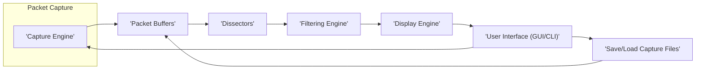
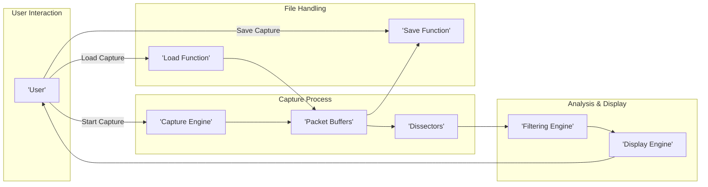

# Wireshark Project Design Document

**Version:** 1.1
**Date:** October 26, 2023
**Author:** AI Software Architect

## 1. Introduction

This document provides a detailed architectural design of the Wireshark project, a widely used network protocol analyzer. The purpose of this document is to serve as a foundation for threat modeling activities, providing a comprehensive understanding of the system's components, data flows, and interactions. This document focuses on the core functionalities and architecture relevant to security considerations.

## 2. Goals and Objectives

The primary goals of this design document are:

*   Clearly outline the major components and their interactions within the Wireshark application.
*   Describe the data flow from packet capture to display and analysis.
*   Identify key areas and interfaces that are relevant for security analysis and threat modeling.
*   Provide a structured overview of the system to facilitate understanding for security professionals.

## 3. High-Level Architecture

Wireshark's architecture can be broadly divided into the following key stages:

This diagram illustrates the main stages of packet processing within Wireshark. Packets are captured, buffered, dissected, filtered, and then displayed to the user. The user interface allows for interaction with all stages, including initiating captures and saving/loading capture files.

## 4. Detailed Architecture

The following sections provide a more detailed breakdown of the key components and their interactions.

### 4.1. Capture Engine

*   **Description:** Responsible for capturing network traffic from various interfaces. This component often interacts directly with the operating system's kernel.
*   **Functionality:**
    *   Interacts with underlying operating system APIs (e.g., libpcap on Linux/macOS, Npcap on Windows) to capture raw network packets. This often involves kernel-level drivers.
    *   Supports capturing from various network interfaces (Ethernet, Wi-Fi, loopback, etc.).
    *   Handles packet filtering at the capture level using Berkeley Packet Filter (BPF) syntax or similar mechanisms. This filtering happens *before* packets are fully processed, reducing overhead.
    *   Typically requires elevated privileges (e.g., root or administrator) to access network interfaces in promiscuous mode.
*   **Security Considerations:**
    *   Requires appropriate operating system-level permissions to access network interfaces. Exploiting vulnerabilities here could lead to privilege escalation.
    *   Vulnerabilities in the underlying capture libraries (libpcap, Npcap) directly impact Wireshark's security. Regular updates of these libraries are crucial.
    *   Capture filters, while intended for efficiency, can be complex and might have subtle vulnerabilities if not parsed and applied correctly by the underlying capture library. Maliciously crafted capture filters could potentially cause issues.
    *   The interaction with kernel drivers introduces a potential attack surface if vulnerabilities exist in those drivers.

### 4.2. Packet Buffers

*   **Description:** Temporary storage for captured packets at various stages of processing. These buffers hold raw packet data and potentially dissected data.
*   **Functionality:**
    *   Holds raw packet data immediately after capture from the network interface.
    *   May involve multiple buffers or queues to manage packets efficiently between the capture engine, dissectors, and display engine.
    *   Buffering allows for asynchronous processing of packets.
*   **Security Considerations:**
    *   Potential for buffer overflows if the size of incoming packets or the number of packets exceeds the buffer capacity and bounds checking is insufficient.
    *   Sensitive network data resides in these buffers in memory, making them a potential target for memory scraping attacks if the process is compromised.
    *   Improper management of buffer allocation and deallocation could lead to memory leaks or use-after-free vulnerabilities.

### 4.3. Dissectors

*   **Description:** Modules responsible for parsing and interpreting the structure of various network protocols. This is where the raw bytes of a packet are translated into meaningful fields.
*   **Functionality:**
    *   A vast and extensible library of dissectors exists for a wide range of network protocols (TCP, HTTP, DNS, TLS, etc.).
    *   Breaks down raw packet data into structured fields and presents them in a human-readable format.
    *   Provides metadata about the packet, which is used for filtering, display, and analysis.
    *   Dissectors are primarily written in C, offering performance but also potential for memory safety issues. Lua is also used for some dissectors, offering flexibility but requiring careful sandboxing.
*   **Security Considerations:**
    *   Dissectors are a significant and historically active attack surface. Bugs in dissectors, especially those handling complex or less common protocols, can lead to crashes, denial-of-service, or even remote code execution if a malicious packet triggers the vulnerability.
    *   The complexity of network protocols makes writing secure and robust dissectors challenging. Edge cases and malformed packets need to be handled gracefully.
    *   Lua dissectors, while providing flexibility, introduce potential security risks if the Lua sandbox is bypassed or if the dissector interacts with external resources insecurely.
    *   Fuzzing is a critical technique used to identify vulnerabilities in dissectors by feeding them a large volume of potentially malformed or unexpected packet data.

### 4.4. Filtering Engine

*   **Description:** Allows users to select and display specific packets based on defined criteria. This engine operates on the dissected packet data.
*   **Functionality:**
    *   Supports display filters (applied to already captured packets) using a specific syntax. These filters operate on the dissected fields.
    *   Evaluates filter expressions against the dissected packet data to determine if a packet should be displayed.
    *   Provides a powerful mechanism for focusing on specific network events or traffic patterns.
*   **Security Considerations:**
    *   Bugs in the filter engine's parsing or evaluation logic could lead to filter bypasses, where packets that should be filtered out are still displayed. This could expose sensitive information.
    *   Complex or maliciously crafted filter expressions could potentially cause performance issues or even denial-of-service if the evaluation process is inefficient.
    *   Vulnerabilities in the filter syntax or parsing could potentially be exploited to cause unexpected behavior.

### 4.5. Display Engine

*   **Description:** Responsible for presenting the dissected and filtered packet data to the user in a user-friendly format.
*   **Functionality:**
    *   Formats and displays packet information in various views (packet list, packet details, byte stream).
    *   Handles coloring and highlighting of packets based on filters, protocols, or other criteria to improve readability.
    *   May involve rendering complex data structures or embedded content within packets.
*   **Security Considerations:**
    *   Vulnerabilities in the display logic, especially when rendering complex or potentially malicious data (e.g., embedded HTML or JavaScript within packets), could lead to issues like cross-site scripting (XSS) if the display engine doesn't properly sanitize the output.
    *   Bugs in handling overly large or malformed data during display could lead to crashes or denial-of-service.
    *   Information leakage could occur if sensitive data is inadvertently displayed or not properly masked.

### 4.6. User Interface (GUI/CLI)

*   **Description:** Provides the means for users to interact with Wireshark, configure settings, initiate captures, and analyze data.
*   **Functionality:**
    *   Graphical User Interface (GUI) built using the Qt framework, providing a visual way to interact with the application.
    *   Command-Line Interface (CLI) tools like `tshark`, allowing for scripting and automation of packet capture and analysis.
    *   Allows users to start and stop captures, apply filters, save and load capture files, configure preferences, and access various analysis tools.
*   **Security Considerations:**
    *   GUI components, especially those handling user input or displaying external content, can have vulnerabilities. Input validation is crucial to prevent issues like command injection or path traversal.
    *   The Qt framework itself may have vulnerabilities that could affect Wireshark. Keeping the framework updated is important.
    *   CLI tools, if not carefully designed, can be susceptible to command injection vulnerabilities if user-supplied input is not properly sanitized before being used in system commands.
    *   Insecure handling of user preferences or configuration files could allow attackers to modify settings to their advantage.

### 4.7. Save/Load Capture Files

*   **Description:** Functionality to persist captured packets to files for later analysis and to load previously saved captures.
*   **Functionality:**
    *   Supports various standard capture file formats, such as pcap and pcapng.
    *   Handles compression and decompression of capture files to save storage space.
    *   May include features for merging or splitting capture files.
*   **Security Considerations:**
    *   Vulnerabilities in the parsing logic for different capture file formats could lead to issues when loading malicious capture files. Attackers could craft specially crafted pcap files to exploit these vulnerabilities, potentially leading to code execution.
    *   Saved capture files contain sensitive network data and need to be protected from unauthorized access. Proper file permissions and encryption (if necessary) are important.
    *   The process of saving and loading files should be robust and handle potential errors or malformed data gracefully to prevent crashes or unexpected behavior.

## 5. Data Flow

The typical data flow within Wireshark can be described as follows:

1. **Capture Initiation:** The user initiates a capture through the UI or CLI, specifying the network interface and optional capture filters.
2. **Packet Capture:** The 'Capture Engine' interacts with the operating system's network stack and capture libraries (libpcap/Npcap) to capture raw network packets from the specified interface.
3. **Buffering:** Captured packets are temporarily stored in 'Packet Buffers'.
4. **Dissection:** Packets from the buffers are passed to the appropriate 'Dissectors' based on their protocol type (identified by examining packet headers). Dissectors parse the raw packet data into structured fields.
5. **Filtering (Optional):** If display filters are applied by the user, the 'Filtering Engine' evaluates these filters against the dissected packet data.
6. **Display:** The 'Display Engine' renders the filtered (or unfiltered) packet information in the user interface (GUI or CLI).
7. **Saving (Optional):** The user can choose to save the captured packets to a file using the 'Save Function'. The raw packet data from the buffers is written to the specified file format (e.g., pcap, pcapng).
8. **Loading (Optional):** The user can load previously saved capture files using the 'Load Function'. The file is parsed, and the packet data is loaded into 'Packet Buffers', then processed by the 'Dissectors' and potentially filtered and displayed.

## 6. Security Considerations (Summary for Threat Modeling)

This section summarizes the key areas to focus on during threat modeling activities:

*   **Capture Engine and Underlying Libraries:**
    *   Potential for privilege escalation vulnerabilities due to the need for elevated permissions.
    *   Reliance on the security of libpcap/Npcap; vulnerabilities in these libraries directly impact Wireshark.
    *   Risk of vulnerabilities in the parsing and application of capture filters.
    *   Potential attack surface in kernel drivers used for packet capture.
*   **Packet Buffers:**
    *   Risk of buffer overflows if packet sizes or volume exceed buffer limits.
    *   Exposure of sensitive network data in memory, making it a target for memory scraping.
    *   Potential for memory leaks or use-after-free vulnerabilities due to improper buffer management.
*   **Dissectors:**
    *   High-risk area for vulnerabilities leading to crashes, denial-of-service, or remote code execution due to malformed or unexpected packet data.
    *   Challenges in writing secure and robust dissectors for complex and evolving network protocols.
    *   Security risks associated with Lua dissectors if sandboxing is bypassed or external resources are accessed insecurely.
*   **Filtering Engine:**
    *   Potential for filter bypass vulnerabilities, allowing the display of sensitive data that should be filtered out.
    *   Risk of denial-of-service through complex or maliciously crafted filter expressions.
    *   Potential vulnerabilities in the filter syntax or parsing logic.
*   **Display Engine:**
    *   Risk of cross-site scripting (XSS) vulnerabilities if the engine renders untrusted content from packets without proper sanitization.
    *   Potential for crashes or denial-of-service when displaying overly large or malformed data.
    *   Risk of information leakage if sensitive data is inadvertently displayed or not properly masked.
*   **User Interface (GUI/CLI):**
    *   Risk of input validation vulnerabilities, such as command injection or path traversal, especially in CLI tools.
    *   Potential vulnerabilities in the underlying Qt framework.
    *   Risk of insecure handling of user preferences or configuration files.
*   **Save/Load Capture Files:**
    *   Significant risk of vulnerabilities in pcap/pcapng parsing logic that could lead to code execution when loading malicious capture files.
    *   Importance of protecting saved capture files due to the sensitive network data they contain.

## 7. Deployment Considerations

Wireshark is typically deployed as a desktop application on various operating systems (Windows, macOS, Linux). Deployment considerations relevant to security include:

*   **Installation:** Ensuring the installation process is secure and prevents tampering with the application binaries. Using official sources for installation is crucial.
*   **Permissions:** Running Wireshark with the principle of least privilege. Capture operations inherently require elevated privileges, but other tasks should be performed with lower privileges.
*   **Updates:** Regularly updating Wireshark to the latest version to patch known security vulnerabilities in the core application and its dependencies (like TShark and the underlying capture libraries).
*   **Network Environment:** The security of the network where Wireshark is used can impact its own security. For example, if the network is compromised, malicious packets could be injected to trigger vulnerabilities in Wireshark.
*   **Secure Storage of Captures:** Implementing secure storage practices for saved capture files, including access controls and encryption where necessary, to protect the sensitive data they contain.

## 8. Future Considerations

Potential future developments or areas for further security analysis include:

*   **Cloud-based capture and analysis:** The increasing trend of cloud-based network monitoring introduces new security challenges related to cloud infrastructure security, data storage in the cloud, and access control.
*   **Integration with other security tools:** Ensuring secure and authenticated communication and data exchange when integrating Wireshark with other security tools and platforms.
*   **New protocol dissectors:** Continuously developing and maintaining secure dissectors for new and emerging network protocols is an ongoing effort and a critical area for security focus. Thorough testing and fuzzing of new dissectors are essential.
*   **Sandboxing and Isolation:** Exploring and implementing stronger sandboxing or isolation techniques for dissectors to limit the impact of potential vulnerabilities.

This document provides a comprehensive overview of the Wireshark architecture for the purpose of threat modeling. It highlights the key components, data flows, and security considerations that should be taken into account when assessing the security posture of the application.