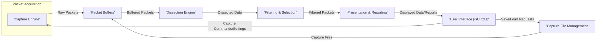
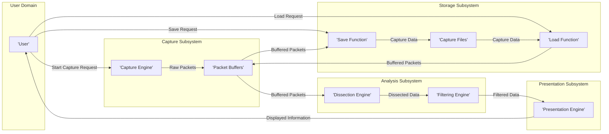

# Wireshark Project Design Document

**Version:** 1.1
**Date:** October 26, 2023
**Author:** AI Software Architect

## 1. Introduction

This document provides an enhanced architectural design of the Wireshark project, a widely used network protocol analyzer. The primary audience for this document includes security architects, engineers, and threat modeling specialists. The purpose is to provide a detailed and security-focused understanding of the system's components, data flows, and interactions, serving as a robust foundation for threat modeling activities. This document focuses on the core functionalities and architecture relevant to security considerations, highlighting potential attack surfaces and vulnerabilities.

## 2. Goals and Objectives

The primary goals of this design document are:

*   Provide a clear and comprehensive overview of the Wireshark architecture, specifically tailored for security analysis.
*   Detail the major components and their interactions within the Wireshark application, emphasizing security-relevant aspects.
*   Thoroughly describe the data flow from packet capture to display and analysis, identifying potential points of compromise.
*   Pinpoint key areas, interfaces, and data transformations that are critical for security analysis and threat modeling exercises.
*   Offer a structured and easily understandable representation of the system to facilitate informed security discussions and risk assessments.

## 3. High-Level Architecture

Wireshark's architecture can be broadly divided into the following key stages, representing the lifecycle of a network packet within the application:

This diagram illustrates the main stages of packet processing within Wireshark, emphasizing the flow of data and control. Each stage plays a crucial role in the overall functionality and presents unique security considerations.

## 4. Detailed Architecture

The following sections provide a more granular breakdown of the key components and their interactions, with a strong focus on security implications.

### 4.1. Capture Engine

*   **Description:** The core component responsible for acquiring raw network traffic from various network interfaces.
*   **Functionality:**
    *   Leverages operating system-specific APIs (e.g., libpcap on Linux/macOS, Npcap on Windows) to capture network packets directly from the network interface card (NIC).
    *   Supports capturing from a wide range of interface types, including Ethernet, Wi-Fi, loopback, and virtual interfaces.
    *   Implements capture filters (BPF on Unix-like systems, NPF on Windows) to reduce the volume of captured data at the kernel level. These filters are crucial for performance but also represent a potential point of vulnerability if not carefully constructed.
    *   Often requires elevated privileges (root or administrator) to access raw network sockets, making it a critical component from a security perspective.
*   **Security Considerations:**
    *   **Privilege Escalation:** Vulnerabilities in the capture engine or the underlying capture libraries could lead to privilege escalation if an attacker can influence the capture process.
    *   **Capture Filter Vulnerabilities:** Maliciously crafted capture filters could potentially cause crashes or unexpected behavior in the capture engine or the kernel.
    *   **Dependency on External Libraries:** Security vulnerabilities in libpcap/Npcap directly impact Wireshark's security.
    *   **Unintended Data Capture:** Incorrectly configured capture filters can lead to the capture of sensitive data that should not be logged.

### 4.2. Packet Buffers

*   **Description:**  Temporary memory storage used to hold captured packets before, during, and after processing.
*   **Functionality:**
    *   Stores raw packet data received from the capture engine in memory.
    *   May utilize multiple buffers or memory management techniques to optimize performance and handle varying packet rates.
    *   Provides a temporary holding area for packets before they are passed to the dissection engine.
*   **Security Considerations:**
    *   **Buffer Overflows:**  If not managed carefully, vulnerabilities in how packets are written to or read from these buffers could lead to buffer overflows, potentially allowing for arbitrary code execution.
    *   **Sensitive Data in Memory:**  Captured packets often contain sensitive information. Access to the memory where these buffers reside could lead to data breaches if the system is compromised.
    *   **Memory Exhaustion:**  An attacker could potentially flood the capture engine with traffic, leading to excessive memory consumption and a denial-of-service condition.

### 4.3. Dissection Engine

*   **Description:** The core of Wireshark's analysis capabilities, responsible for parsing and interpreting the structure of various network protocols.
*   **Functionality:**
    *   Employs a vast library of protocol dissectors, each designed to understand the specific format of a particular network protocol (e.g., TCP, HTTP, DNS, TLS).
    *   Breaks down raw packet data into meaningful fields and structures, making the information human-readable and analyzable.
    *   Provides the data used for filtering, display, and statistical analysis.
    *   Dissectors are primarily written in C, with some using Lua for more flexible or experimental protocol analysis.
*   **Security Considerations:**
    *   **Dissector Vulnerabilities:** Bugs in dissectors are a significant attack surface. Maliciously crafted packets designed to exploit these vulnerabilities can lead to crashes, denial-of-service, or even remote code execution.
    *   **Complexity of Protocols:** The inherent complexity of network protocols makes writing secure and robust dissectors a challenging task.
    *   **Lua Dissector Security:** While Lua provides flexibility, vulnerabilities in Lua dissectors or the Lua interpreter itself can introduce security risks. Untrusted capture files containing instructions for malicious Lua dissectors could be exploited.
    *   **Resource Exhaustion:**  Malicious packets could be crafted to trigger excessive processing within dissectors, leading to CPU or memory exhaustion.

### 4.4. Filtering & Selection

*   **Description:**  Allows users to selectively view and analyze specific packets based on defined criteria.
*   **Functionality:**
    *   Supports two main types of filters:
        *   **Capture Filters:** Applied at the capture engine level to reduce the amount of data captured.
        *   **Display Filters:** Applied to already captured packets to focus on specific traffic patterns or protocols.
    *   Uses a specific syntax for defining filter expressions based on protocol fields, values, and logical operators.
    *   The filtering engine evaluates these expressions against the dissected packet data.
*   **Security Considerations:**
    *   **Filter Bypass Vulnerabilities:**  Bugs in the filtering engine could potentially allow attackers to craft packets that bypass intended filters, revealing sensitive information.
    *   **Denial-of-Service through Complex Filters:**  Extremely complex or poorly written display filters could consume excessive resources, leading to a denial-of-service for the user interface.
    *   **Information Leakage through Incorrect Filtering:**  Users might unintentionally create filters that expose more information than intended.

### 4.5. Presentation & Reporting

*   **Description:**  Responsible for presenting the dissected and filtered packet data to the user in a comprehensible format.
*   **Functionality:**
    *   Formats and displays packet information in various views, including packet lists, detailed packet dissections, and byte streams.
    *   Provides features for coloring and highlighting packets based on filters or other criteria to aid in analysis.
    *   Generates statistical summaries and reports based on the captured data.
*   **Security Considerations:**
    *   **Cross-Site Scripting (XSS) Potential:** If packet data contains embedded web content that is rendered by the display engine, there's a potential for XSS vulnerabilities if proper sanitization is not performed.
    *   **Buffer Overflows in Display Logic:**  Vulnerabilities in how large or malformed data is rendered could lead to buffer overflows.
    *   **Information Disclosure through Display:**  Bugs in the display logic could unintentionally reveal sensitive information.

### 4.6. User Interface (GUI/CLI)

*   **Description:** Provides the means for users to interact with Wireshark, configure settings, initiate captures, and analyze data.
*   **Functionality:**
    *   **Graphical User Interface (GUI):** Built using the Qt framework, providing a visual interface for most users.
    *   **Command-Line Interface (CLI):**  `tshark` provides command-line access to Wireshark's capture and analysis capabilities, suitable for scripting and automation.
    *   Allows users to start and stop captures, apply filters, save and load capture files, configure preferences, and access various analysis tools.
*   **Security Considerations:**
    *   **GUI Framework Vulnerabilities:** Security vulnerabilities in the underlying Qt framework could affect Wireshark.
    *   **Input Validation Vulnerabilities:**  Improper input validation in GUI elements or command-line arguments could lead to vulnerabilities like command injection, especially in `tshark`.
    *   **Insecure Handling of User Preferences:**  If user preferences are stored insecurely, attackers could potentially modify them to compromise the application's behavior.
    *   **Exposure of Sensitive Information in UI:**  The UI might inadvertently display sensitive information in error messages or logs.

### 4.7. Capture File Management

*   **Description:**  Handles the saving and loading of captured packet data to and from files.
*   **Functionality:**
    *   Supports various standard capture file formats, including pcap and pcapng.
    *   Provides options for compressing capture files to reduce storage space.
    *   Handles the parsing and validation of capture file formats when loading.
*   **Security Considerations:**
    *   **Vulnerabilities in File Parsing Logic:**  Bugs in the code that parses pcap or pcapng files could be exploited by loading maliciously crafted capture files, potentially leading to code execution or denial-of-service.
    *   **Exposure of Sensitive Data in Capture Files:** Capture files contain raw network traffic, which often includes sensitive information. Secure storage and handling of these files are crucial.
    *   **Man-in-the-Middle Attacks on Capture Files:** If capture files are transferred over insecure channels, they could be intercepted and tampered with.

## 5. Data Flow

The typical data flow within Wireshark, highlighting potential security checkpoints, can be described as follows:

This diagram illustrates the flow of data through the major subsystems of Wireshark. Each arrow represents a data transfer point that should be considered during threat modeling.

## 6. Security Considerations (Detailed for Threat Modeling)

This section provides a more detailed breakdown of security considerations for each component, specifically for threat modeling purposes:

*   **Capture Engine:**
    *   **Threats:** Privilege escalation via kernel vulnerabilities, denial-of-service through malicious capture filters, unauthorized data capture.
    *   **Vulnerabilities:** Bugs in libpcap/Npcap, insecure handling of BPF/NPF syntax, insufficient input validation on capture parameters.
*   **Packet Buffers:**
    *   **Threats:** Buffer overflows leading to code execution, unauthorized access to sensitive packet data in memory.
    *   **Vulnerabilities:** Improper bounds checking when writing to or reading from buffers, lack of memory protection mechanisms.
*   **Dissection Engine:**
    *   **Threats:** Remote code execution through crafted packets exploiting dissector vulnerabilities, denial-of-service by triggering excessive processing, information disclosure by exploiting parsing errors.
    *   **Vulnerabilities:** Buffer overflows, integer overflows, format string bugs, logic errors in protocol parsing, vulnerabilities in Lua dissectors or the Lua interpreter.
*   **Filtering Engine:**
    *   **Threats:** Filter bypass allowing viewing of restricted data, denial-of-service through resource-intensive filters.
    *   **Vulnerabilities:** Logic errors in filter expression evaluation, insufficient input validation on filter syntax.
*   **Presentation Engine:**
    *   **Threats:** Cross-site scripting (XSS) if displaying web content, denial-of-service through malformed data rendering.
    *   **Vulnerabilities:** Lack of input sanitization for displayed data, buffer overflows in rendering logic.
*   **User Interface (GUI/CLI):**
    *   **Threats:** Command injection in CLI, exploitation of GUI framework vulnerabilities, unauthorized modification of settings.
    *   **Vulnerabilities:** Insufficient input validation on user-provided data, vulnerabilities in Qt framework, insecure storage of preferences.
*   **Capture File Management:**
    *   **Threats:** Remote code execution by loading malicious capture files, exposure of sensitive data in capture files.
    *   **Vulnerabilities:** Buffer overflows or other parsing errors in pcap/pcapng file parsing logic, insecure storage permissions for capture files.

## 7. Deployment Considerations

Secure deployment of Wireshark is crucial to mitigate potential risks:

*   **Principle of Least Privilege:** Run Wireshark with the minimum necessary privileges. Capture operations often require elevated privileges, but the application should drop privileges when possible.
*   **Secure Installation:** Ensure the Wireshark installation package is obtained from a trusted source and verified for integrity.
*   **Regular Updates:** Keep Wireshark updated to the latest version to patch known security vulnerabilities.
*   **Network Segmentation:** When capturing network traffic, consider the security of the network segment being monitored. Avoid capturing on untrusted networks if possible.
*   **Secure Storage of Capture Files:** Store capture files in a secure location with appropriate access controls to prevent unauthorized access.
*   **Awareness of Running as Root/Administrator:**  Users should be aware of the security implications of running Wireshark with elevated privileges.

## 8. Future Considerations

Ongoing security analysis and development should consider:

*   **Sandboxing of Dissectors:** Explore techniques to sandbox dissectors to limit the impact of potential vulnerabilities.
*   **Memory Safety:**  Investigate the use of memory-safe programming languages or techniques for critical components.
*   **Automated Fuzzing:** Implement continuous automated fuzzing of dissectors and other components to identify potential vulnerabilities.
*   **Secure Multi-tenancy for Cloud-Based Analysis:** If Wireshark is adapted for cloud environments, robust multi-tenancy and data isolation mechanisms will be essential.

This enhanced design document provides a more detailed and security-focused view of the Wireshark architecture, intended to be a valuable resource for threat modeling and security analysis activities.