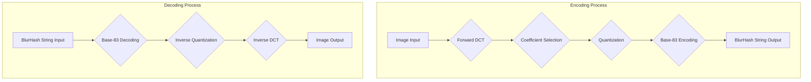

## Project Design Document: BlurHash Library (Improved)

**1. Introduction**

This document provides an enhanced design overview of the BlurHash library, as found in the repository [https://github.com/woltapp/blurhash](https://github.com/woltapp/blurhash). This detailed design serves as a critical foundation for subsequent threat modeling activities, enabling a comprehensive analysis of potential security vulnerabilities. It meticulously outlines the system's architecture, individual components, and the intricate flow of data during both encoding and decoding processes. The primary objective is to foster a clear, in-depth understanding of the BlurHash library's design and operational mechanics from a security perspective.

**2. Goals**

*   Precisely define the architectural structure and constituent components of the BlurHash library.
*   Thoroughly describe the data flow within the library, distinguishing between the encoding and decoding pathways.
*   Clearly identify key functionalities and elucidate their interdependencies and interactions.
*   Establish a robust and detailed basis for identifying potential security vulnerabilities during subsequent threat modeling exercises.
*   Provide sufficient technical detail to facilitate informed security analysis.

**3. Scope**

This document concentrates on the fundamental functionality of the BlurHash library: the encoding of an image into a compact string representation and the reverse process of decoding that string back into a blurred image. The scope encompasses the algorithmic underpinnings and the diverse language implementations available within the repository. While acknowledging their role, this document does not delve into the intricate specifics of the underlying image processing libraries utilized by each implementation (e.g., platform-specific image handling routines). The focus remains on the core BlurHash logic.

**4. System Overview**

The BlurHash library offers a method for generating a concise ASCII string that effectively captures the essential visual characteristics of an image. This string can be employed to display a blurred placeholder of the image while the full-resolution image is loading, thereby enhancing the user's perceived loading speed and overall experience.

The library's core functionality is bifurcated into two primary operations:

*   **Encoding:** The process of transforming an input image into its corresponding BlurHash string representation.
*   **Decoding:** The process of reconstructing a blurred image from a given BlurHash string.

The BlurHash library has been implemented across a range of programming languages, including but not limited to:

*   JavaScript
*   Kotlin (for Android platforms)
*   Swift (for iOS platforms)
*   Python
*   Go
*   Rust

While each implementation adheres to the same fundamental algorithm, variations may exist in how image data is handled and processed due to the specific libraries and conventions inherent to each programming language.

**5. Component Details**

The BlurHash process can be dissected into the following essential components, detailing the data transformations at each stage:

*   **Image Input (Encoding):** This represents the raw image data supplied to the encoding function. The format and internal representation of this data are implementation-specific (e.g., arrays of pixel values, image objects managed by platform libraries).
*   **Forward Discrete Cosine Transform (FDCT):** The encoding process begins by applying a Forward Discrete Cosine Transform (typically a Type-II DCT) to the image's color channels (Red, Green, and Blue are common). This transforms the image from the spatial domain into the frequency domain, representing the image as a sum of cosine functions with varying frequencies and amplitudes.
    *   The FDCT is applied independently to each color channel.
    *   The number of cosine basis functions used in the transform (the number of components) directly influences the length of the resulting BlurHash string and the level of detail preserved.
*   **Coefficient Selection and Quantization:** Following the FDCT, a limited number of low-frequency coefficients are selected. These coefficients are chosen because they represent the most significant color variations and overall structure of the image.
    *   The selected coefficients are then quantized. Quantization involves reducing the precision of these coefficients by dividing them by a quantization step and rounding to the nearest integer. This lossy process is crucial for compression.
*   **Base-83 Encoding:** The quantized coefficients are subsequently encoded into a compact, URL-safe ASCII string using a base-83 encoding scheme. This encoding maps groups of numerical values to a set of 83 distinct ASCII characters.
    *   The specific base-83 alphabet and encoding algorithm are defined within the BlurHash specification.
*   **BlurHash String Output (Encoding):** This is the final output of the encoding process – the compact ASCII string representing the blurred image.

*   **BlurHash String Input (Decoding):** This is the BlurHash string provided as input to the decoding function.
*   **Base-83 Decoding:** The input BlurHash string is first decoded back into the quantized coefficients using the inverse of the base-83 encoding scheme.
*   **Inverse Quantization:** The decoded coefficients are then de-quantized. This involves multiplying the coefficients by the original quantization step (or an approximation thereof) to restore them to their approximate original values before quantization.
*   **Inverse Discrete Cosine Transform (IDCT):** An Inverse Discrete Cosine Transform (typically a Type-III DCT, the inverse of the Type-II) is applied to the de-quantized coefficients. This transforms the data back from the frequency domain to the spatial domain, reconstructing the pixel values of the blurred image.
    *   The IDCT is applied independently to each color channel.
*   **Image Output (Decoding):** This is the resulting blurred image generated from the BlurHash string. The format and representation of this output are implementation-specific, mirroring the input format.

**6. Data Flow Diagram**

**7. Security Considerations**

This section outlines potential security considerations relevant to the BlurHash library.

*   **Input Validation Vulnerabilities:**
    *   **Malicious Image Input (Encoding):** Providing specially crafted or corrupted image data during encoding could exploit vulnerabilities in image processing libraries or the BlurHash implementation itself, potentially leading to crashes, resource exhaustion, or unexpected behavior. Examples include excessively large images, images with unusual color depths, or malformed header information.
    *   **Malformed BlurHash String (Decoding):**  Supplying invalid or malformed BlurHash strings during decoding could cause errors, exceptions, or unexpected output. Robust input validation is crucial to prevent processing of strings that do not conform to the expected format. This includes checking the length, character set, and internal structure of the string.
*   **Algorithm-Specific Vulnerabilities:**
    *   **Integer Overflow/Underflow:**  Careless implementation of the DCT, quantization, or base-83 encoding/decoding steps could lead to integer overflow or underflow, potentially resulting in incorrect calculations and unpredictable output.
    *   **Precision Errors:** Loss of precision during quantization and de-quantization could be exploited in certain scenarios, although the intended lossy nature of BlurHash mitigates this to some extent.
*   **Denial of Service (DoS):**
    *   **Encoding DoS:**  Repeatedly submitting very large or computationally intensive images for encoding could exhaust server resources (CPU, memory), leading to a denial of service.
    *   **Decoding DoS:** Attempting to decode extremely long or complex (potentially maliciously crafted) BlurHash strings could similarly consume excessive resources.
*   **Information Disclosure:**
    *   While BlurHash is designed to be a lossy representation, analyzing patterns in the generated BlurHash strings for a large number of images might reveal unintended information about the original images or the encoding process. This is a low-risk concern but worth considering.
*   **Dependency Vulnerabilities:**
    *   The security of the BlurHash library is dependent on the security of the underlying libraries used for image processing and other utilities in each language implementation. Vulnerabilities in these dependencies could indirectly impact the security of BlurHash. Regular updates and security audits of dependencies are essential.
*   **Code Injection (Less Likely but Possible):** In highly unusual scenarios, if the BlurHash string is used in contexts where it's interpreted rather than simply displayed (which is not the intended use case), there's a theoretical risk of code injection if the base-83 alphabet or decoding process has unforeseen vulnerabilities. This is highly unlikely given the intended use.
*   **Cross-Site Scripting (XSS) via Display (Context Dependent):** If the system displaying the decoded BlurHash doesn't properly sanitize or handle the output, there's a theoretical (and unlikely given the nature of image data) risk of XSS if a malicious BlurHash could somehow be crafted to inject script. This is more a concern of the rendering system than BlurHash itself.

**8. Assumptions and Constraints**

*   The underlying mathematical principles of the Discrete Cosine Transform are assumed to be sound and free from inherent security flaws.
*   The base-83 encoding scheme is assumed to be secure for its intended purpose of data representation and compactness, not for cryptographic security.
*   The performance characteristics of the encoding and decoding processes are considered acceptable for typical use cases.
*   This design document focuses on the core BlurHash algorithm and its implementations. The security of systems and applications *utilizing* the BlurHash library is outside the direct scope of this document.
*   It is assumed that developers integrating the BlurHash library will follow secure coding practices in their own applications.

**9. Threat Model Scope**

The subsequent threat modeling exercise, informed by this design document, will primarily focus on the following aspects of the BlurHash library:

*   **Data Validation:**  Analyzing the robustness of input validation for both encoding (image data) and decoding (BlurHash strings).
*   **Algorithm Implementation:**  Examining the potential for vulnerabilities within the implementation of the DCT, quantization, and base-83 encoding/decoding algorithms across different language implementations.
*   **Resource Management:**  Assessing the potential for resource exhaustion and denial-of-service attacks related to both encoding and decoding processes.
*   **Dependency Analysis:**  Identifying and evaluating the security posture of external libraries used by the various BlurHash implementations.

**10. Future Considerations**

*   **Formal Specification:** Developing a formal, language-agnostic specification for the BlurHash algorithm could enhance interoperability and provide a clearer basis for security analysis.
*   **Security Audits:**  Regularly conducting independent security audits of the various language implementations is crucial for identifying and addressing potential vulnerabilities.
*   **Performance and Security Trade-offs:**  Exploring potential trade-offs between performance optimization and enhanced security measures.
*   **Error Handling and Reporting:**  Improving error handling and reporting mechanisms to provide more informative feedback in case of invalid input or unexpected conditions.
*   **Consideration of Cryptographic Hashing (Future):** While not the current design, future iterations could explore incorporating cryptographic hashing of the original image alongside the BlurHash for integrity verification, although this would significantly increase the output size and complexity.

This improved design document provides a more detailed and nuanced understanding of the BlurHash library, setting a stronger foundation for effective threat modeling and security analysis.
