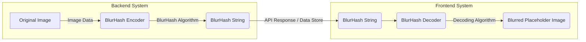
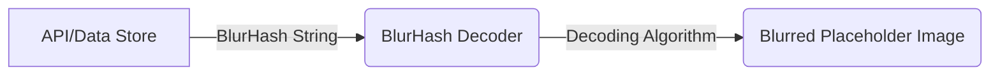

# Project Design Document: BlurHash Integration

**Project Name:** BlurHash Integration

**Project Repository:** [https://github.com/woltapp/blurhash](https://github.com/woltapp/blurhash)

**Document Version:** 1.1

**Date:** October 26, 2023

**Author:** AI Architecture Expert

## 1. Introduction

This document details the design for integrating the BlurHash algorithm into a system. BlurHash provides a compact string representation of an image's placeholder. Instead of displaying a generic loading indicator or a low-resolution image, the backend generates a BlurHash string from the original image. This string is then transmitted to the frontend, where it's decoded to render a blurred, visually representative placeholder while the full-resolution image loads. This approach significantly improves the perceived loading performance and user experience. This document serves as the foundation for subsequent threat modeling and security analysis.

## 2. Goals

*   Clearly articulate the process of integrating the BlurHash algorithm.
*   Identify and describe all key components involved in the BlurHash workflow.
*   Illustrate the flow of data during both BlurHash encoding and decoding.
*   Establish a solid foundation for future threat modeling and security evaluations.
*   Provide sufficient detail for developers to understand the integration points.

## 3. System Architecture

The BlurHash integration process is divided into two primary stages: encoding (generating the BlurHash string) and decoding (rendering the blurred image from the string).

### 3.1. High-Level Architecture Diagram

### 3.2. Component Breakdown

*   **Original Image:** The source image that requires a BlurHash representation.
    *   Origin: User uploads, content management systems, external image services, or locally stored assets.
    *   Formats: Typically supports common web image formats like JPEG, PNG, WebP, and potentially GIF.
    *   Considerations: Image dimensions and file size can impact encoding performance.
*   **BlurHash Encoder:** The software component responsible for generating the BlurHash string from the input image.
    *   Functionality: Implements the core BlurHash algorithm, typically involving Discrete Cosine Transform (DCT).
    *   Input: Raw image pixel data.
    *   Configuration: May allow configuration of the number of X and Y components used in the encoding, affecting the precision and length of the BlurHash string.
    *   Output: The generated BlurHash string.
*   **BlurHash String:** The compact, text-based representation of the blurred image.
    *   Format: A string adhering to the specific BlurHash encoding scheme.
    *   Characteristics: String length is typically short, making it efficient for transmission.
    *   Storage: Can be stored alongside image metadata in databases, cached in memory, or included directly in API responses.
*   **API/Data Store:** The mechanism for transferring the BlurHash string from the backend to the frontend.
    *   Examples:
        *   RESTful API endpoint returning image details including the BlurHash.
        *   GraphQL API field associated with image data.
        *   Database column storing the BlurHash alongside the image path or URL.
        *   Message queue or event stream for asynchronous updates.
    *   Considerations:  Latency and bandwidth limitations of the chosen mechanism.
*   **BlurHash Decoder:** The frontend component responsible for rendering the blurred image from the BlurHash string.
    *   Functionality: Implements the decoding logic corresponding to the BlurHash algorithm.
    *   Input: The BlurHash string.
    *   Rendering: Typically renders the blurred image onto an HTML `<canvas>` element.
    *   Libraries: Available in various frontend frameworks and as standalone JavaScript libraries.
*   **Blurred Placeholder Image:** The visual output on the frontend, representing the image while the full version loads.
    *   Appearance: The level of blurriness is determined by the parameters used during encoding (number of components).
    *   User Experience: Provides a smoother transition and reduces the jarring effect of empty image spaces.

## 4. Data Flow

### 4.1. Encoding Process

1. The **Original Image** is received or accessed by the **Backend System**.
2. The **Backend System** passes the **Original Image** data to the **BlurHash Encoder**.
3. The **BlurHash Encoder** processes the image data using the BlurHash algorithm, potentially configurable with parameters like the number of X and Y components.
4. The **BlurHash Encoder** generates the corresponding **BlurHash String**.
5. The **BlurHash String** is then stored or transmitted via the **API/Data Store**, associated with the original image.

### 4.2. Decoding Process

1. The **Frontend System** retrieves the **BlurHash String** from the **API/Data Store**.
2. The **Frontend System** provides the **BlurHash String** to the **BlurHash Decoder**.
3. The **BlurHash Decoder** decodes the string using the BlurHash decoding algorithm.
4. The **BlurHash Decoder** generates the pixel data representing the blurred image.
5. The **Blurred Placeholder Image** is rendered on the user interface, typically within an image container or a `<canvas>` element.

## 5. Technology Stack

The specific technologies will vary depending on the existing infrastructure and chosen implementation, but generally include:

*   **Backend:**
    *   Programming Languages: Python, Node.js, Go, Ruby, Java, PHP, Swift, Kotlin are all viable options with available BlurHash libraries.
    *   BlurHash Libraries: Language-specific implementations like `blurhash` (Python, Node.js), `BlurHash.swift` (Swift), etc.
    *   Image Processing Libraries: Libraries for manipulating image data if pre-processing is needed (e.g., Pillow (Python), sharp (Node.js), ImageMagick).
*   **Frontend:**
    *   JavaScript Frameworks/Libraries: React, Angular, Vue.js are common choices.
    *   BlurHash Libraries: JavaScript implementations like `blurhash`.
    *   Rendering Technologies: HTML `<canvas>` API is the standard for rendering the blurred image.
*   **Data Storage/API:**
    *   Databases: Relational (PostgreSQL, MySQL), NoSQL (MongoDB, DynamoDB), depending on the application's data model.
    *   API Technologies: REST (using frameworks like Express.js, Django REST Framework, Spring Boot), GraphQL.
    *   Caching Mechanisms: Redis, Memcached to store generated BlurHash strings for faster retrieval.

## 6. Security Considerations

This section outlines potential security considerations related to the BlurHash integration. A dedicated threat modeling exercise will provide a more in-depth analysis.

*   **Data Integrity of BlurHash Strings:**
    *   Risk: Tampering with the BlurHash string during transit or storage could lead to unexpected or broken placeholder images.
    *   Mitigation: Use HTTPS for secure transmission. Implement checksums or digital signatures if high integrity is required.
*   **Denial of Service (DoS) Attacks:**
    *   Risk:  Malicious actors could flood the backend with requests to generate BlurHashes, potentially overwhelming resources.
    *   Mitigation: Implement rate limiting, request throttling, and potentially CAPTCHA for high-volume image uploads.
*   **Information Disclosure via BlurHash:**
    *   Risk: Although lossy, a BlurHash with a high number of components might inadvertently reveal some sensitive information about the image content.
    *   Mitigation: Carefully consider the number of components used during encoding, balancing visual fidelity with the risk of information leakage. For highly sensitive images, consider alternative placeholder strategies.
*   **Cross-Site Scripting (XSS) Vulnerabilities:**
    *   Risk: If BlurHash strings are directly embedded into HTML without proper sanitization, a malicious actor could potentially inject scripts if they can control the BlurHash string (though this is less likely given the string's structure).
    *   Mitigation: Ensure proper output encoding and sanitization when rendering BlurHash strings in HTML.
*   **Vulnerabilities in BlurHash Libraries:**
    *   Risk: Security vulnerabilities in the chosen BlurHash encoding or decoding libraries could be exploited.
    *   Mitigation: Use well-maintained and reputable libraries. Regularly update dependencies to patch known vulnerabilities. Perform security audits of third-party libraries.
*   **Server-Side Resource Consumption:**
    *   Risk: Encoding BlurHashes for very large or numerous images can consume significant server resources (CPU, memory).
    *   Mitigation: Implement asynchronous processing, queueing mechanisms, and resource limits for BlurHash generation. Consider caching generated BlurHashes to avoid redundant processing.
*   **Frontend Performance Impact:**
    *   Risk: Decoding complex BlurHash strings repeatedly on low-powered devices could impact frontend performance.
    *   Mitigation: Optimize decoding logic and consider the number of components used in encoding for different use cases.

## 7. Deployment Considerations

The deployment strategy for BlurHash integration depends on the existing architecture and infrastructure. Common deployment scenarios include:

*   **Integrated within Existing Backend Service:** The BlurHash encoding logic is implemented directly within the backend service responsible for handling image uploads or processing. This is suitable for simpler architectures.
    *   Example: Adding BlurHash generation to an API endpoint that handles image uploads.
*   **Dedicated Microservice for BlurHash Generation:** A separate, independent service is deployed specifically for generating BlurHashes. This offers better scalability and isolation.
    *   Example: A "BlurHash Generator" service that receives image data and returns the BlurHash string.
*   **Serverless Functions:** Utilizing serverless functions (e.g., AWS Lambda, Azure Functions, Google Cloud Functions) to handle BlurHash generation on demand. This is cost-effective for sporadic or event-driven image processing.
    *   Example: A serverless function triggered when a new image is uploaded to cloud storage.
*   **Content Delivery Network (CDN) Integration:** BlurHash strings can be generated offline or on-demand and associated with image URLs. The CDN can then serve the BlurHash string along with image metadata.
    *   Example: Generating BlurHashes during a build process or when content is published and storing them in the CDN's metadata.
*   **Edge Computing:** For applications with real-time image processing needs, BlurHash generation can be performed closer to the data source or the user (edge computing).

## 8. Future Considerations

*   **Performance Optimization:** Continuously evaluate and optimize the performance of both encoding and decoding processes, especially for high-volume scenarios or resource-constrained environments.
*   **Customization Options:** Explore options for customizing the appearance of the blurred placeholder, such as adjusting the blur intensity or adding subtle animations.
*   **Error Handling and Fallbacks:** Implement robust error handling for both encoding and decoding failures, providing fallback mechanisms (e.g., displaying a generic placeholder image).
*   **Integration with Image Optimization Pipelines:** Integrate BlurHash generation into existing image optimization workflows to ensure consistency and efficiency.
*   **Support for Animated Images (GIFs, WebP Animations):** Investigate strategies for generating BlurHashes for animated images, potentially using a representative frame.
*   **Client-Side Encoding (Considerations):**  While typically a backend task, explore potential use cases and security implications of client-side BlurHash encoding.

This improved design document provides a more detailed and comprehensive understanding of the BlurHash integration process, addressing various aspects from architecture and data flow to security and deployment. It serves as a strong foundation for future development and threat modeling efforts.
