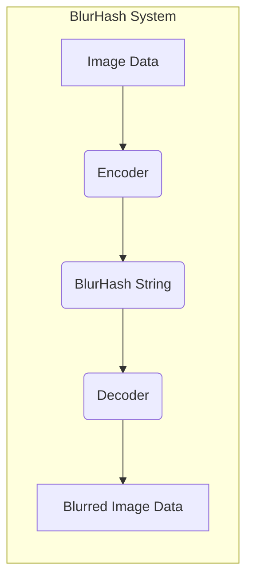

# Project Design Document: BlurHash

**Version:** 1.1
**Date:** October 26, 2023
**Author:** AI Software Architect

## 1. Introduction

This document outlines the design of the BlurHash project, based on the open-source implementation found at [https://github.com/woltapp/blurhash](https://github.com/woltapp/blurhash). BlurHash is a perceptual image hashing algorithm that generates a compact ASCII string representing a blurry preview of an image. This string can be decoded back into a low-resolution, color-representative placeholder. This design document serves as a foundation for subsequent threat modeling activities.

## 2. Goals

*   Provide a comprehensive and easily understandable description of the BlurHash architecture and its constituent components.
*   Clearly document the flow of data during both the BlurHash encoding and decoding processes.
*   Pinpoint critical areas and components that are most relevant for security analysis and threat modeling.
*   Establish a solid basis for identifying and evaluating potential vulnerabilities and security risks associated with the BlurHash implementation.

## 3. Non-Goals

*   This document does not delve into the intricacies of code-level implementation details for specific language bindings of BlurHash.
*   Operational aspects related to the deployment, management, and scaling of systems utilizing BlurHash are outside the scope.
*   Performance evaluation, benchmarking, and optimization strategies for BlurHash are not covered here.

## 4. System Architecture

The BlurHash system is conceptually divided into two primary functional units: the **Encoder** and the **Decoder**.

### 4.1. High-Level Architecture

*   **Image Data:** The initial input to the system, representing the raw pixel data of the original image.
*   **Encoder:** The module responsible for processing the image data and generating the compact BlurHash string representation.
*   **BlurHash String:** The resulting short, human-readable ASCII string that encodes the blurry image information.
*   **Decoder:** The module responsible for taking the BlurHash string as input and reconstructing the blurred image data.
*   **Blurred Image Data:** The final output, representing the low-resolution, color-accurate approximation of the original image.

### 4.2. Component-Level Architecture

#### 4.2.1. Encoder

The Encoder component performs a series of well-defined steps to transform image data into a BlurHash string:

*   **Input Acquisition and Normalization:**
    *   Receives the image data, typically as an array of pixel values with color channels (e.g., RGB or RGBA).
    *   May involve normalizing pixel values to a specific range (e.g., 0 to 1).
*   **Forward Discrete Cosine Transform (DCT):**
    *   Applies a two-dimensional Discrete Cosine Transform to the normalized image data. This transforms the image from the spatial domain (pixels) to the frequency domain (coefficients representing different frequencies).
    *   The DCT decomposes the image into a sum of cosine functions at different frequencies.
*   **Low-Frequency Coefficient Selection:**
    *   Selects a limited number of the lowest-frequency DCT coefficients. The number of coefficients retained directly impacts the visual quality of the decoded image and the length of the BlurHash string.
    *   These low-frequency components capture the dominant color and shape characteristics of the image.
*   **Coefficient Quantization:**
    *   Quantizes the selected DCT coefficients. This process reduces the precision of the coefficients by dividing them by a quantization step and rounding to the nearest integer.
    *   Quantization is essential for compressing the data and limiting the number of possible values for each coefficient.
*   **Base83 Encoding:**
    *   Encodes the quantized coefficients into a compact ASCII string using a base-83 encoding scheme. This involves mapping numerical values to a set of 83 distinct ASCII characters.
    *   The encoding includes information about the number of horizontal and vertical components used in the DCT, the DC (average color) component, and the subsequent AC coefficients.

#### 4.2.2. Decoder

The Decoder component reverses the encoding process to reconstruct the blurred image from the BlurHash string:

*   **Base83 Decoding:**
    *   Receives the BlurHash string and decodes it back into the quantized DCT coefficients. This involves reversing the base-83 mapping to retrieve the numerical values.
    *   Extracts the number of horizontal and vertical components and the values of the quantized coefficients.
*   **Coefficient Dequantization:**
    *   Dequantizes the coefficients by multiplying them by the original quantization step (or an approximation). This restores the approximate values of the DCT coefficients.
*   **Inverse Discrete Cosine Transform (IDCT):**
    *   Applies a two-dimensional Inverse Discrete Cosine Transform to the dequantized coefficients. This transforms the data back from the frequency domain to the spatial domain, reconstructing the pixel values of the blurred image.
    *   The IDCT synthesizes the image based on the limited number of low-frequency coefficients.
*   **Output Generation:**
    *   Generates the blurred image data, typically as an array of pixel values with color channels, ready for display or further processing.

## 5. Data Flow

The following diagram illustrates the step-by-step flow of data through the BlurHash system during both encoding and decoding:

```mermaid
graph LR
    subgraph "Encoding Data Flow"
        A1["Image Data"] --> B1("Input Acquisition & Normalization");
        B1 --> C1("Forward DCT");
        C1 --> D1("Low-Frequency Coefficient Selection");
        D1 --> E1("Coefficient Quantization");
        E1 --> F1("Base83 Encoding");
        F1 --> G1["BlurHash String"];
    end

    subgraph "Decoding Data Flow"
        A2["BlurHash String"] --> B2("Base83 Decoding");
        B2 --> C2("Coefficient Dequantization");
        C2 --> D2("Inverse DCT");
        D2 --> E2["Blurred Image Data"];
    end

    G1 --> A2;
```

*   **Encoding Data Flow:** Depicts the transformation of the original image data into the compact BlurHash string.
*   **Decoding Data Flow:** Illustrates the reconstruction of the blurred image from the BlurHash string.
*   The BlurHash string serves as the intermediary data representation, bridging the encoding and decoding processes.

## 6. Security Considerations

This section details potential security considerations that are crucial for threat modeling the BlurHash project.

### 6.1. Input Validation and Sanitization

*   **Encoder Input (Image Data):**
    *   **Maliciously Crafted Image Files:** The encoder must be resilient against processing malformed or malicious image files (e.g., GIF bombing, oversized headers) that could exploit underlying image processing libraries and lead to vulnerabilities like buffer overflows, denial-of-service, or arbitrary code execution.
    *   **Extremely Large or High-Resolution Images:** Processing excessively large images can lead to resource exhaustion (memory exhaustion, CPU overload), potentially causing denial-of-service. Input size limits and resource management are critical.
*   **Decoder Input (BlurHash String):**
    *   **Invalid or Malformed BlurHash Strings:** The decoder needs to robustly handle invalid BlurHash strings (e.g., incorrect length, invalid characters) to prevent crashes, unexpected behavior, or potential exploits in the decoding logic. Proper input validation and error handling are essential.
    *   **Injection Attacks (Unlikely but Consider):** While less likely due to the constrained nature of the BlurHash string, consider if carefully crafted strings could potentially exploit vulnerabilities in the decoding process, especially if the decoded data is used in further processing without proper sanitization.

### 6.2. Algorithmic and Logical Vulnerabilities

*   **Mathematical Precision Errors:** While DCT and IDCT are established algorithms, implementation errors or limitations in floating-point precision could theoretically lead to subtle inaccuracies in encoding or decoding, potentially exploitable in specific contexts.
*   **Information Disclosure through Analysis:**  While designed to be blurry, sophisticated analysis of the BlurHash string, especially with higher component counts, might reveal more information about the original image than intended. This could be a concern in scenarios where even blurry representations need to be protected.
*   **Side-Channel Attacks:**  Consider potential side-channel attacks (e.g., timing attacks) where the time taken to encode or decode might leak information about the input data, although this is less likely for BlurHash due to its relatively simple computations.

### 6.3. Implementation-Specific Vulnerabilities

*   **Buffer Overflows and Memory Management Issues:** Improper memory allocation, deallocation, or boundary checks during encoding or decoding, particularly in languages like C/C++, can lead to buffer overflows, potentially allowing for arbitrary code execution.
*   **Integer Overflows:** Calculations involving image dimensions, DCT coefficients, or loop counters could potentially result in integer overflows, leading to unexpected behavior or security vulnerabilities.
*   **Denial of Service (DoS):**  Specifically crafted inputs (either image data or BlurHash strings) could trigger computationally expensive operations or excessive memory allocation, leading to a denial of service. Rate limiting and resource management are important countermeasures.
*   **Cross-Site Scripting (XSS) via BlurHash Display:** If BlurHash strings are directly embedded into web pages without proper encoding or sanitization, and a vulnerability exists in the decoding or rendering logic, it's theoretically possible (though unlikely with standard implementations) that a malicious BlurHash string could be crafted to execute JavaScript in the user's browser. This highlights the importance of secure handling of decoded data.

### 6.4. Dependencies and Third-Party Libraries

*   **Vulnerabilities in Image Processing Libraries:** If the BlurHash implementation relies on external image processing libraries for input handling, vulnerabilities in those libraries could indirectly affect the security of the BlurHash implementation. Keeping dependencies up-to-date and using secure libraries is crucial.
*   **Vulnerabilities in Base83 Encoding/Decoding Libraries:** Similarly, if external libraries are used for Base83 encoding/decoding, vulnerabilities in those libraries could be a point of weakness.

### 6.5. Deployment Environment Considerations

*   **Client-Side Decoding in Untrusted Environments:** If BlurHash decoding happens on the client-side (e.g., in a web browser or a mobile app), the decoding logic is exposed and could be analyzed for vulnerabilities. Malicious actors could potentially reverse-engineer the implementation or exploit any weaknesses.
*   **Server-Side Encoding/Decoding:** Server-side implementations need to be protected against standard web application vulnerabilities (e.g., injection attacks, cross-site scripting, insecure deserialization) if BlurHash functionality is exposed through an API.
*   **Storage and Transmission of BlurHash Strings:** While the BlurHash string itself doesn't contain sensitive information, its integrity should be maintained. Tampering with the string will result in a different blurry image. Consider the security of the storage and transmission mechanisms.

## 7. Deployment Considerations

BlurHash offers flexibility in deployment, with common scenarios including:

*   **Client-Side Rendering:** Decoding is performed directly within the user's browser or mobile application, enabling rapid display of placeholder images without server-side processing.
*   **Server-Side Rendering:** Encoding is performed on the server to generate BlurHash strings before sending them to clients. Decoding might also occur server-side for pre-rendering or image processing pipelines.
*   **Hybrid Architectures:** Encoding might happen as part of an image upload or processing pipeline on the server, while decoding occurs on the client-side for display.

The chosen deployment strategy significantly impacts the relevant threat landscape and the necessary security controls.

## 8. Future Considerations

*   **Formal Specification and Standardization:** Developing a formal specification for the BlurHash algorithm could enhance interoperability and provide a clearer basis for security analysis and implementation.
*   **Independent Security Audits:** Conducting independent security audits of popular BlurHash implementations across different languages could proactively identify potential vulnerabilities.
*   **Performance and Security Trade-offs Analysis:**  Further research into the trade-offs between performance, visual quality, and security could lead to more robust and efficient implementations.
*   **Consideration of Algorithmic Improvements:** Exploring potential improvements to the algorithm to enhance security or reduce information leakage while maintaining its core functionality.

This improved design document provides a more detailed and nuanced understanding of the BlurHash project, specifically focusing on aspects relevant to threat modeling. By considering the various security considerations outlined, developers and security professionals can better assess and mitigate potential risks associated with the implementation and deployment of BlurHash.