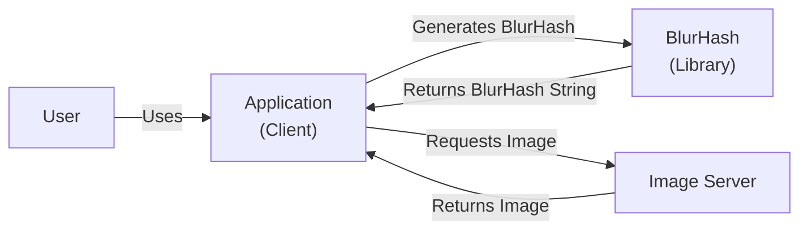
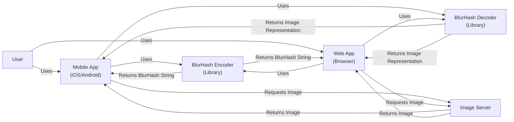
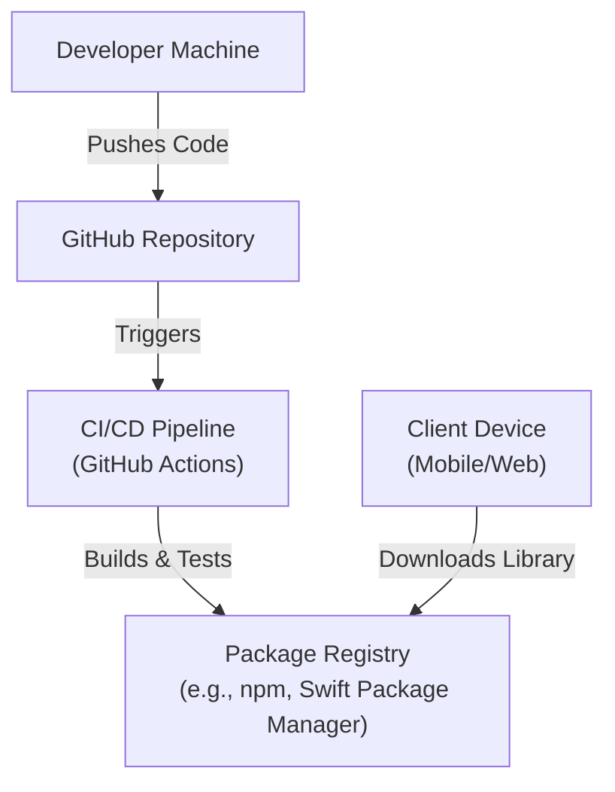
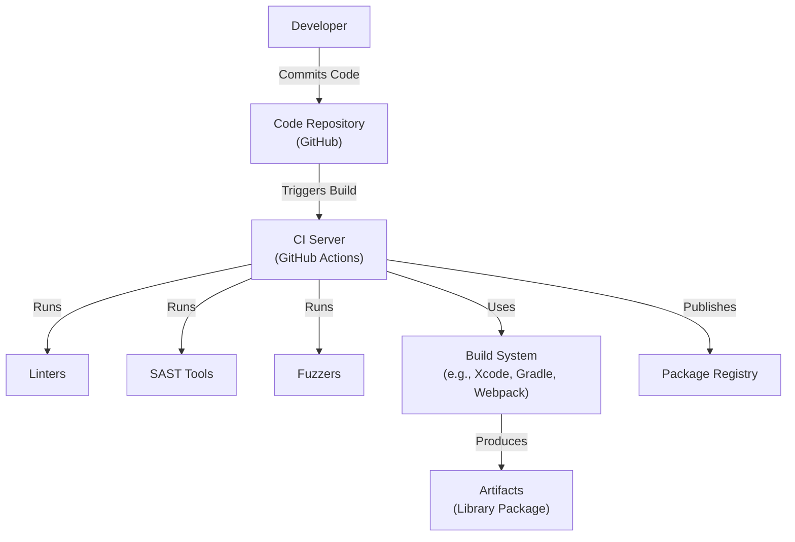

# BUSINESS POSTURE

Business Priorities and Goals:

*   Provide a compact representation of a placeholder for an image.
*   Improve the user experience by displaying a blurred preview of an image while the actual image is loading.
*   Offer an open-source solution that is easy to integrate into various platforms (iOS, Android, Web).
*   Reduce perceived loading times and improve application responsiveness.
*   Minimize bandwidth usage by transferring small blurhash strings instead of full-sized placeholder images.

Business Risks:

*   Inconsistent implementations across different platforms could lead to a fragmented user experience.
*   Poor encoding/decoding performance could negatively impact application responsiveness.
*   Lack of proper documentation and community support could hinder adoption and maintenance.
*   Security vulnerabilities in the encoding/decoding process could potentially be exploited.
*   Compatibility issues with future image formats or platform updates could break existing implementations.

# SECURITY POSTURE

Existing Security Controls:

*   security control: The library itself doesn't handle sensitive data directly. It primarily deals with image data transformed into a blurhash string. (Described in the repository's README and source code).
*   security control: The repository uses GitHub, which provides certain inherent security features like access control, code scanning (if enabled), and audit trails. (GitHub's platform security).

Accepted Risks:

*   accepted risk: The library assumes that the input image data is not malicious. It does not perform extensive input validation to detect and prevent potential image-based attacks (e.g., specially crafted images designed to exploit vulnerabilities in image processing libraries).
*   accepted risk: The library's security relies on the security of the underlying platform and libraries used for image encoding/decoding (e.g., C libraries for image processing).

Recommended Security Controls:

*   security control: Integrate static analysis tools (SAST) into the build process to identify potential vulnerabilities in the code.
*   security control: Implement fuzz testing to test the encoder and decoder with unexpected or malformed input.
*   security control: Provide clear documentation on security considerations and best practices for using the library.
*   security control: Establish a process for handling security vulnerabilities, including a security contact and a vulnerability disclosure policy.

Security Requirements:

*   Authentication: Not directly applicable, as the library doesn't handle user authentication.
*   Authorization: Not directly applicable, as the library doesn't manage access control.
*   Input Validation:
    *   The library should validate the dimensions of the input image to prevent excessively large images from causing performance issues or denial-of-service.
    *   Consider adding checks to ensure the input data is a valid image format, although this might be handled by underlying image processing libraries.
*   Cryptography: Not directly applicable, as the library's primary function is not encryption. However, if the blurhash strings are ever transmitted over a network or stored, consider using secure transport protocols (HTTPS) and appropriate storage mechanisms.
*   Output Encoding: Ensure that the blurhash string output is properly encoded to prevent potential injection vulnerabilities if the string is used in a context where it could be interpreted as code (e.g., HTML attributes).

# DESIGN

## C4 CONTEXT

Element Descriptions:

*   Element:
    *   Name: User
    *   Type: Person
    *   Description: The end-user interacting with the application.
    *   Responsibilities: Interacts with the application to view images.
    *   Security controls: None (handled by the application).

*   Element:
    *   Name: Application (Client)
    *   Type: Software System
    *   Description: The application (iOS, Android, Web) that integrates the BlurHash library.
    *   Responsibilities: Integrates the BlurHash library. Requests images from the Image Server. Displays the BlurHash placeholder and the full image.
    *   Security controls: Input validation. Secure communication with the Image Server (HTTPS). Secure storage of any sensitive data.

*   Element:
    *   Name: BlurHash (Library)
    *   Type: Software System
    *   Description: The BlurHash library for encoding and decoding images.
    *   Responsibilities: Provides functions for encoding an image into a BlurHash string. Provides functions for decoding a BlurHash string into an image representation.
    *   Security controls: Input validation (image dimensions). Fuzz testing. SAST.

*   Element:
    *   Name: Image Server
    *   Type: Software System
    *   Description: The server that hosts the full-resolution images.
    *   Responsibilities: Stores and serves images.
    *   Security controls: Access controls. Secure storage. Secure communication (HTTPS).

## C4 CONTAINER

Element Descriptions:

*   Element:
    *   Name: User
    *   Type: Person
    *   Description: The end-user interacting with the application.
    *   Responsibilities: Interacts with the application to view images.
    *   Security controls: None (handled by the application).

*   Element:
    *   Name: Mobile App (iOS/Android)
    *   Type: Container
    *   Description: The mobile application running on iOS or Android.
    *   Responsibilities: Displays images to the user. Uses the BlurHash library to generate and display placeholders.
    *   Security controls: Secure communication (HTTPS). Secure storage of sensitive data. Input validation.

*   Element:
    *   Name: Web App (Browser)
    *   Type: Container
    *   Description: The web application running in a web browser.
    *   Responsibilities: Displays images to the user. Uses the BlurHash library to generate and display placeholders.
    *   Security controls: Secure communication (HTTPS). Secure storage of sensitive data (e.g., using secure cookies). Input validation. Content Security Policy (CSP).

*   Element:
    *   Name: BlurHash Encoder (Library)
    *   Type: Container
    *   Description: The component of the BlurHash library responsible for encoding images.
    *   Responsibilities: Takes an image as input and generates a BlurHash string.
    *   Security controls: Input validation (image dimensions). Fuzz testing. SAST.

*   Element:
    *   Name: BlurHash Decoder (Library)
    *   Type: Container
    *   Description: The component of the BlurHash library responsible for decoding BlurHash strings.
    *   Responsibilities: Takes a BlurHash string as input and generates an image representation.
    *   Security controls: Input validation (BlurHash string format). Fuzz testing. SAST.

*   Element:
    *   Name: Image Server
    *   Type: Container
    *   Description: The server that hosts the full-resolution images.
    *   Responsibilities: Stores and serves images.
    *   Security controls: Access controls. Secure storage. Secure communication (HTTPS).

## DEPLOYMENT

Possible Deployment Solutions:

1.  **Client-side library:** The BlurHash library is typically deployed as a client-side library (e.g., a Swift package for iOS, a Kotlin library for Android, a JavaScript package for web). The encoding can happen on the client or on a server, depending on the application's architecture. Decoding usually happens on the client.
2.  **Server-side encoding:** The encoding process can be offloaded to a server, especially if the client devices have limited processing power or if the images are already stored on a server. The server would generate the BlurHash strings and send them to the client along with the image URLs.
3.  **Edge computing:** Encoding could also be performed at the edge (e.g., using a CDN with image processing capabilities) to reduce latency and server load.

Chosen Deployment Solution (Client-side library):

Element Descriptions:

*   Element:
    *   Name: Developer Machine
    *   Type: Infrastructure Node
    *   Description: The developer's local machine used for development.
    *   Responsibilities: Writing code, running local tests.
    *   Security controls: Local security measures (e.g., firewall, antivirus).

*   Element:
    *   Name: GitHub Repository
    *   Type: Infrastructure Node
    *   Description: The Git repository hosted on GitHub.
    *   Responsibilities: Source code version control.
    *   Security controls: GitHub's built-in security features (access control, code scanning).

*   Element:
    *   Name: CI/CD Pipeline (GitHub Actions)
    *   Type: Infrastructure Node
    *   Description: The continuous integration and continuous delivery pipeline.
    *   Responsibilities: Automates the build, test, and deployment process.
    *   Security controls: SAST. Fuzz testing. Secure configuration of the pipeline.

*   Element:
    *   Name: Package Registry (e.g., npm, Swift Package Manager)
    *   Type: Infrastructure Node
    *   Description: The registry where the compiled library is published.
    *   Responsibilities: Stores and serves the library packages.
    *   Security controls: Access controls. Package signing (if supported).

*   Element:
    *   Name: Client Device (Mobile/Web)
    *   Type: Infrastructure Node
    *   Description: The end-user's device (mobile phone, web browser).
    *   Responsibilities: Runs the application and uses the BlurHash library.
    *   Security controls: Device security features (e.g., OS security updates).

## BUILD

The build process for BlurHash varies depending on the target platform (iOS, Android, Web). However, a general outline is provided below, focusing on security controls.

Build Process Description:

1.  **Code Commit:** A developer commits code changes to the GitHub repository.
2.  **CI Trigger:** The commit triggers a build on the CI server (GitHub Actions).
3.  **Linting:** Linters are run to check for code style and potential errors.
4.  **Static Analysis (SAST):** SAST tools are run to scan the code for security vulnerabilities.
5.  **Fuzzing:** Fuzzers are used to test the encoder and decoder with unexpected input.
6.  **Build:** The build system (e.g., Xcode for iOS, Gradle for Android, Webpack for web) compiles the code and creates the library package.
7.  **Artifact Publication:** The CI server publishes the library package to the appropriate package registry (e.g., npm, Swift Package Manager).

Security Controls in Build Process:

*   **Linters:** Enforce code style and identify potential errors that could lead to vulnerabilities.
*   **SAST Tools:** Detect security vulnerabilities in the code before deployment.
*   **Fuzzers:** Test the robustness of the encoder and decoder against unexpected input.
*   **Secure CI/CD Configuration:** Ensure the CI/CD pipeline is configured securely, with appropriate access controls and secrets management.
*   **Dependency Management:** Regularly update dependencies to address known vulnerabilities. Use tools to scan for vulnerable dependencies.

# RISK ASSESSMENT

Critical Business Processes:

*   Displaying images to users in a visually appealing and performant way.
*   Providing a smooth user experience, even with slow network connections.

Data to Protect:

*   **Image Data:** While the BlurHash library itself doesn't handle sensitive user data, it processes image data. The sensitivity of this data depends on the content of the images. If the application handles user-generated images, there could be privacy concerns.
*   **BlurHash Strings:** The BlurHash strings themselves are not inherently sensitive, but they represent a visual approximation of the image. In some cases, this could be considered sensitive information, depending on the image content.
*   Sensitivity: Low to Medium (depending on the image content).

# QUESTIONS & ASSUMPTIONS

Questions:

*   What types of images will the application be handling (e.g., user-generated content, stock photos, product images)? This impacts the sensitivity of the data.
*   Will the BlurHash strings be stored or transmitted? If so, where and how?
*   Are there any specific performance requirements for the encoding and decoding process?
*   What are the target platforms and their specific security requirements?
*   Is there a need for server-side encoding, or will all encoding be done on the client?

Assumptions:

*   BUSINESS POSTURE: The primary goal is to improve user experience by providing image placeholders. Cost and speed of implementation are important.
*   SECURITY POSTURE: The application using BlurHash will handle any sensitive data and its security. The BlurHash library itself is not expected to handle highly sensitive data.
*   DESIGN: The BlurHash library will be integrated into existing applications as a client-side library. The build process will use GitHub Actions.