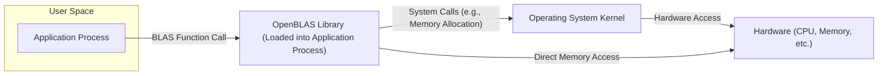
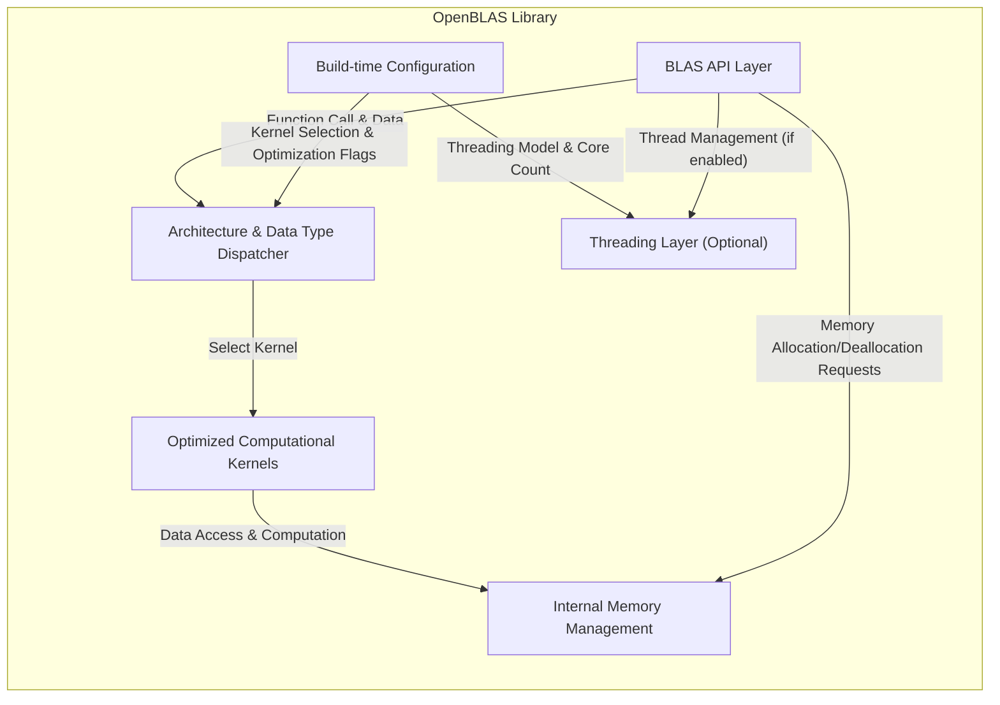

## Project Design Document: OpenBLAS (Improved)

**1. Introduction**

This document provides an enhanced architectural overview of the OpenBLAS project, an open-source implementation of the Basic Linear Algebra Subprograms (BLAS) API. This detailed description is designed to be a robust foundation for subsequent threat modeling activities, offering a clear understanding of the system's components, interactions, and data flows.

**2. Goals and Non-Goals**

* **Goals:**
    * Deliver a highly performant and portable implementation of the standard BLAS API.
    * Offer comprehensive support for a diverse range of processor architectures, including x86, ARM, PowerPC, and others.
    * Provide architecture-specific optimized kernels leveraging hardware features like SIMD instructions.
    * Maintain strict adherence and compatibility with the established BLAS interface specifications.
    * Facilitate seamless integration into a wide array of software projects and scientific computing environments.

* **Non-Goals:**
    * Include a graphical user interface (GUI) or any direct user interaction layer.
    * Implement higher-level linear algebra functionalities beyond the scope of the BLAS standard (e.g., routines from LAPACK or ScaLAPACK).
    * Incorporate user authentication, authorization, or access control mechanisms.
    * Directly manage or handle network communication protocols.
    * Integrate explicit, built-in security features beyond adhering to secure coding practices during development.

**3. System Architecture**

OpenBLAS is fundamentally a software library intended for linking with other applications. Its architecture can be analyzed at different levels to understand its functionality and potential vulnerabilities.

**3.1. High-Level Architecture**



* **Application Process:** Represents the software application that utilizes OpenBLAS. This process executes in user space.
* **OpenBLAS Library (Loaded into Application Process):** The core of OpenBLAS, dynamically or statically linked into the application's address space.
* **Operating System Kernel:** Provides essential services like memory management, process scheduling, and hardware abstraction.
* **Hardware (CPU, Memory, etc.):** The physical resources where computations are performed and data is stored.

**3.2. Component-Level Architecture**



* **BLAS API Layer:** Defines the public function interface (e.g., `cblas_dgemm`). This layer handles argument parsing and dispatches calls. *Potential vulnerability: Input validation flaws here could lead to buffer overflows or other memory corruption issues.*
* **Architecture & Data Type Dispatcher:**  Analyzes the CPU architecture and data types of the input to select the most efficient kernel implementation. *Potential vulnerability: Incorrect detection or dispatch logic could lead to unexpected behavior or the use of unoptimized/vulnerable code paths.*
* **Optimized Computational Kernels:**  The core computational routines, often written in highly optimized C or assembly language. These are tailored for specific architectures and data types. *Potential vulnerability: Bugs in these low-level kernels, especially in assembly code, could be difficult to detect and exploit.*
* **Internal Memory Management:** Handles allocation and deallocation of temporary memory required during computations. This might involve wrappers around standard `malloc`/`free` or custom allocators. *Potential vulnerability: Memory leaks, double frees, or use-after-free vulnerabilities could exist here.*
* **Build-time Configuration:**  Settings determined during the compilation process using CMake, influencing which kernels are included, optimization levels, and target architectures. *Potential vulnerability: Insecure build configurations or compromised build environments could introduce vulnerabilities.*
* **Threading Layer (Optional):** Manages parallel execution of BLAS routines using threads (e.g., OpenMP, POSIX threads). This component is optional and depends on the build configuration. *Potential vulnerability: Race conditions, deadlocks, or other concurrency issues could arise in the threading layer.*

**4. Data Flow**

A typical execution flow for a BLAS function call within OpenBLAS involves:

1. The **Application Process** calls a BLAS function in the **API Layer**, passing input data (matrices, vectors, scalars) and parameters.
2. The **API Layer** performs initial validation of the input arguments.
3. The **Architecture & Data Type Dispatcher** examines the CPU features and data types to determine the optimal **Kernel**.
4. The selected **Kernel** receives pointers to the input data from the **API Layer**.
5. The **Kernel** performs the core linear algebra computation, potentially utilizing the **Internal Memory Management** for temporary storage.
6. Data is read from and written to memory locations pointed to by the input arguments.
7. If threading is enabled, the **Threading Layer** manages the distribution of work across multiple threads.
8. The **Kernel** writes the result of the computation back to the memory locations provided by the application.
9. The **API Layer** returns control to the **Application Process**.

**5. Key Interfaces and Interactions**

* **BLAS API (CBLAS, Fortran BLAS):** The standardized programming interface through which applications invoke OpenBLAS functions. *This is the primary attack surface for external interaction.*
* **Operating System API (System Calls):** OpenBLAS relies on the OS for fundamental services like memory allocation (`malloc`, `free`, `mmap`), thread creation (`pthread_create`), and potentially for accessing performance counters or hardware features. *Vulnerabilities in the OS or incorrect usage of system calls can be exploited.*
* **Hardware Instruction Set:** The optimized kernels directly interact with the CPU's instruction set (e.g., x86 SIMD instructions like SSE, AVX; ARM NEON). *Exploiting vulnerabilities at this level is complex but possible (e.g., side-channel attacks).*
* **Build System (CMake):**  The build system manages the compilation process, including fetching dependencies, configuring compiler flags, and linking object files. *A compromised build system can inject malicious code into the final library.*

**6. Deployment Considerations**

OpenBLAS can be deployed in two primary ways:

* **Dynamically Linked Library (.so, .dll):**
    * The OpenBLAS library is a separate file loaded into the application's memory space at runtime by the operating system's dynamic linker.
    * **Deployment Diagram:**
    ```mermaid
    graph LR
        A["Application Executable"]
        B["Operating System Loader"]
        C["OpenBLAS Shared Library (.so/.dll)"]
        D["Memory"]

        A -- "Loads & Executes" --> B
        B -- "Loads" --> C
        B -- "Manages Memory" --> D
        A -- "Function Calls" --> C
    ```
    * *Security Implication:* Requires careful management of library dependencies and potential for "DLL hijacking" or similar attacks if the library loading path is not secure.

* **Statically Linked Library (.a, .lib):**
    * The OpenBLAS code is directly incorporated into the application's executable file during the linking phase.
    * **Deployment Diagram:**
    ```mermaid
    graph LR
        A["Application Executable (includes OpenBLAS code)"]
        B["Operating System Loader"]
        C["Memory"]

        A -- "Loads & Executes" --> B
        B -- "Manages Memory" --> C
    ```
    * *Security Implication:* Increases the size of the application executable. Updates to OpenBLAS require recompilation and redistribution of the application.

**7. Security Considerations (Detailed)**

This section expands on potential security concerns, providing more specific examples relevant for threat modeling:

* **Input Validation Vulnerabilities (CWE-20):**
    * **Example:** Passing excessively large matrix dimensions to a BLAS function without proper bounds checking could lead to buffer overflows when allocating internal buffers.
    * **Example:** Providing out-of-range values for scalar parameters could cause unexpected behavior or crashes.

* **Memory Management Errors (CWE-401, CWE-415, CWE-416):**
    * **Example:** Failure to free allocated memory after computation could lead to memory leaks and eventually denial of service.
    * **Example:** Double-freeing memory or using memory after it has been freed could lead to crashes or exploitable vulnerabilities.

* **Kernel Vulnerabilities (CWE-119, CWE-120):**
    * **Example:** Buffer overflows within assembly language kernels due to incorrect indexing or boundary checks.
    * **Example:** Integer overflows in loop counters or address calculations within kernels.

* **Build System and Supply Chain Risks (CWE-426):**
    * **Example:** A compromised dependency used during the build process could inject malicious code into the resulting OpenBLAS library.
    * **Example:**  A malicious actor could submit a pull request containing backdoors or vulnerabilities that are not properly reviewed.

* **Side-Channel Attacks (CWE-200):**
    * **Example:** Timing attacks that exploit variations in execution time based on input data to infer sensitive information.
    * **Example:** Power analysis attacks that monitor power consumption to extract cryptographic keys or other secrets (less likely in standard BLAS but relevant in specialized cryptographic BLAS implementations).

* **Configuration Vulnerabilities:**
    * **Example:** Building OpenBLAS with debugging symbols enabled in a production environment could expose sensitive information.
    * **Example:** Incorrectly configuring threading parameters could lead to denial-of-service by exhausting system resources.

* **Concurrency Issues (CWE-362):**
    * **Example:** Race conditions in multi-threaded kernels where shared memory is accessed without proper synchronization, leading to data corruption or unpredictable behavior.
    * **Example:** Deadlocks where threads are blocked indefinitely, causing the application to hang.

**8. Future Considerations**

* **Enhanced Security Auditing:**  Regular security audits and penetration testing to identify and address potential vulnerabilities.
* **Formal Verification of Critical Kernels:** Applying formal methods to mathematically prove the correctness and security of highly sensitive kernel implementations.
* **Improved Input Sanitization and Validation:** Implementing more robust input validation mechanisms at the API layer.
* **Strengthening the Build Process:** Implementing measures to ensure the integrity and security of the build environment and dependencies.
* **Exploration of Memory-Safe Languages:** Investigating the feasibility of implementing parts of OpenBLAS in memory-safe languages to mitigate certain classes of vulnerabilities.

This improved design document provides a more detailed and security-focused overview of the OpenBLAS project architecture, making it a more effective foundation for subsequent threat modeling efforts. The enhanced descriptions of components, data flows, and potential vulnerabilities offer a clearer understanding of the system's attack surface.
