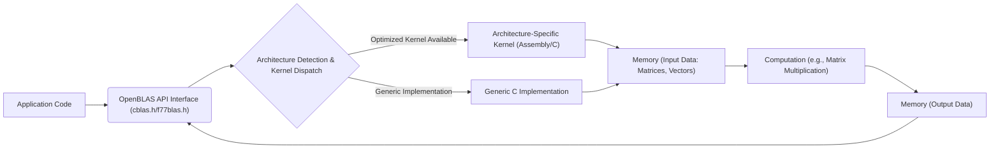

## Project Design Document: OpenBLAS (Improved)

**1. Introduction**

This document provides an enhanced architectural design of the OpenBLAS project, an open-source implementation of the Basic Linear Algebra Subprograms (BLAS) API. This detailed design serves as a robust foundation for subsequent threat modeling activities, offering a clear understanding of the system's components, interactions, and potential vulnerabilities.

**2. Project Overview**

OpenBLAS is a high-performance library designed to execute fundamental linear algebra operations, including vector and matrix manipulations. It aims to be a performant, portable, and freely available alternative to proprietary BLAS libraries. The library is primarily implemented in C and Assembly language, with architecture-specific optimizations targeting various processor families (e.g., x86 with AVX/AVX2/AVX512, ARM with NEON/SVE, MIPS).

**3. Goals and Objectives**

* **Exceptional Performance:** Achieve state-of-the-art performance on a diverse range of hardware architectures, often matching or exceeding vendor-provided BLAS implementations.
* **Broad Portability:** Support a wide array of operating systems (Linux, Windows, macOS, etc.) and processor architectures (x86, ARM, MIPS, PowerPC, RISC-V).
* **Open Source Nature:** Maintain an open and transparent development process under the BSD-3-Clause license, fostering community contributions and scrutiny.
* **Strict API Compatibility:** Adhere to the standard BLAS and LAPACK (Linear Algebra PACKage) APIs, enabling seamless drop-in replacement for other BLAS/LAPACK implementations.
* **Numerical Accuracy and Stability:** Ensure the correctness and stability of numerical computations across different platforms and input ranges.

**4. Architectural Overview**

OpenBLAS's architecture is centered around providing optimized implementations of BLAS routines. Key aspects of its architecture include:

* **Modular Design:**  Separation of generic C implementations from architecture-specific optimized kernels.
* **Runtime Dispatching:**  Dynamically selecting the most appropriate kernel based on the detected CPU features at runtime.
* **Platform Abstraction:**  Mechanisms to handle differences in operating systems and compiler toolchains.
* **Extensibility:**  Design that allows for the addition of new architectures and optimized kernels.

**5. Component Details**

* **Core BLAS and LAPACK Routines:**
    * Level 1 BLAS: Basic vector operations (e.g., `SAXPY` - scalar times a vector plus a vector, `DDOT` - double-precision dot product).
    * Level 2 BLAS: Matrix-vector operations (e.g., `SGEMV` - single-precision general matrix-vector multiplication, `DTMV` - double-precision triangular matrix-vector multiplication).
    * Level 3 BLAS: Matrix-matrix operations (e.g., `SGEMM` - single-precision general matrix-matrix multiplication, `DSYRK` - double-precision symmetric rank-k update).
    * LAPACK Routines (subset): Higher-level linear algebra routines built upon BLAS (e.g., routines for solving linear systems, eigenvalue problems).
* **Architecture-Specific Optimized Kernels:**
    * Hand-tuned assembly code for performance-critical routines like `GEMM`, leveraging SIMD instructions (e.g., SSE, AVX, NEON, SVE).
    * Located in architecture-specific directories (e.g., `kernel/x86_64`, `kernel/arm64`).
    * Example kernel files: `sgemm_kernel.S`, `dgemm_ncopy.c`.
    * Dispatching logic implemented in C, often using function pointers or conditional execution based on CPU feature detection.
* **Interface Layer:**
    * C and Fortran APIs defined in standard BLAS header files (e.g., `cblas.h`, `f77blas.h`).
    * Provides a consistent interface for applications regardless of the underlying implementation.
    * Includes functions for setting the number of threads for parallel execution.
* **Build System (CMake):**
    * Uses `CMakeLists.txt` files to define the build process across different platforms.
    * Detects the target architecture, available compiler features, and necessary build tools.
    * Allows for configuration options (e.g., enabling specific architectures, setting compiler flags).
    * Manages the compilation of both C and assembly code.
* **Testing Framework:**
    * Comprehensive suite of test cases written in C and Fortran to verify the correctness of BLAS and LAPACK routines.
    * Includes unit tests for individual routines and integration tests for more complex scenarios.
    * Benchmarking tools to measure performance and identify potential regressions.

**6. Data Flow Diagram**

**7. Detailed Component Interaction**

1. **Application Invocation:** An application written in C, C++, Fortran, or another language with a BLAS binding calls a specific BLAS function (e.g., `cblas_sgemm` for single-precision general matrix multiply) through the OpenBLAS library interface.
2. **Interface Layer Handling:** The OpenBLAS interface layer receives the function call and its associated arguments, including pointers to input matrices/vectors, their dimensions, leading dimensions, and scalar values.
3. **Architecture Detection and Kernel Dispatch:** OpenBLAS determines the underlying CPU architecture and its supported features (e.g., AVX-512, NEON) at runtime. Based on this information and the specific BLAS function called, it dispatches the execution to the most appropriate implementation. This might involve selecting a highly optimized assembly kernel or a generic C implementation.
4. **Optimized Kernel Execution:** If an architecture-specific kernel is selected, the execution is transferred to the corresponding assembly or optimized C code. These kernels are designed for maximum performance by directly utilizing CPU registers, SIMD instructions, and cache-aware techniques.
5. **Generic Implementation Execution:** If no specialized kernel is available or deemed necessary, the generic C implementation of the BLAS routine is executed. This provides a fallback for less common architectures or simpler operations.
6. **Memory Access and Computation:** Both optimized kernels and generic implementations access memory to read the input data (matrices, vectors) and perform the required linear algebra computations.
7. **Result Storage:** The results of the computation are written back to memory at the locations specified by the output parameters of the BLAS function.
8. **Return to Application:** Once the computation is complete, control is returned to the calling application, along with any output values or status codes.

**8. Security Considerations (Focused on Threat Modeling)**

This section outlines potential security vulnerabilities within OpenBLAS, providing specific areas for in-depth threat modeling.

* **Input Validation Vulnerabilities:**
    * **Buffer Overflows:** Insufficient checks on input matrix/vector dimensions and leading dimensions could lead to out-of-bounds memory access during computations, potentially allowing attackers to overwrite adjacent memory regions. Example: A large, attacker-controlled dimension could cause a write beyond allocated buffer in a kernel.
    * **Integer Overflows:**  Calculations involving input dimensions (e.g., determining the size of memory allocations) could overflow, leading to undersized buffers and subsequent buffer overflows. Example: Multiplying large dimensions without proper overflow checks.
    * **Format String Bugs:** If user-supplied data is directly used in format strings (less likely in core BLAS but possible in extensions or utilities), it could lead to information disclosure or arbitrary code execution.
* **Memory Management Issues:**
    * **Heap Corruption:** Errors in memory allocation or deallocation within OpenBLAS could corrupt the heap, potentially leading to crashes or exploitable vulnerabilities. Example: Double-freeing memory used by internal data structures.
    * **Use-After-Free:** Accessing memory that has already been freed could lead to unpredictable behavior or exploitable conditions. Example: A race condition where one thread frees memory while another thread is still accessing it.
* **Build System and Supply Chain Risks:**
    * **Compromised Dependencies:** While OpenBLAS has minimal external dependencies, any included libraries or build tools could be compromised, introducing malicious code.
    * **Malicious Contributions:**  The open-source nature makes it susceptible to malicious contributions that introduce vulnerabilities or backdoors. Code review processes are crucial to mitigate this.
    * **Build-Time Manipulation:** Attackers could potentially modify the build scripts (`CMakeLists.txt`) to inject malicious code into the compiled library.
* **Side-Channel Attack Potential:**
    * **Timing Attacks:** Performance optimizations, especially in assembly kernels, might introduce timing variations that could leak sensitive information, particularly if OpenBLAS is used in cryptographic contexts (though this is not its primary purpose). Example: The execution time of a routine might depend on the values of the input data.
* **ABI Compatibility and Linking Issues:**
    * **Symbol Collision:** Conflicts with symbols from other libraries could lead to unexpected behavior or vulnerabilities.
    * **Incompatible Compiler Flags:** Using OpenBLAS compiled with different compiler flags than the application could lead to subtle bugs or security issues.
* **Multi-threading Vulnerabilities:**
    * **Race Conditions:** Concurrent access to shared data structures without proper synchronization could lead to data corruption or unexpected behavior. Example: Multiple threads updating the same matrix element simultaneously.
    * **Deadlocks:**  Improper locking mechanisms could lead to deadlocks, causing the application to hang.

**9. Assumptions and Constraints**

* This design document focuses on the core OpenBLAS library implementation as found in the provided GitHub repository. It does not cover external bindings or applications that utilize OpenBLAS.
* The security considerations are intended to be comprehensive but may not cover all potential vulnerabilities. Threat modeling will provide a more detailed analysis.
* We assume a standard and secure build environment and toolchain for compiling OpenBLAS.
* The analysis primarily considers vulnerabilities within the OpenBLAS codebase itself, not vulnerabilities in the underlying operating system or hardware.

**10. Future Considerations**

* **Formal Verification:** Applying formal verification techniques to critical routines, especially assembly kernels, to mathematically prove their correctness and absence of certain classes of vulnerabilities.
* **Sandboxing and Isolation:** Exploring mechanisms to run OpenBLAS computations in isolated environments to limit the impact of potential vulnerabilities.
* **Enhanced Input Validation:** Implementing more robust input validation techniques, including range checks and sanitization, to prevent common vulnerabilities.
* ** নিয়মিত Security Audits:** Conducting regular security audits and penetration testing to identify and address potential vulnerabilities proactively.

This improved design document provides a more detailed and nuanced understanding of the OpenBLAS architecture, specifically tailored for effective threat modeling. The enhanced component descriptions, interaction details, and security considerations offer a solid foundation for identifying and mitigating potential risks.