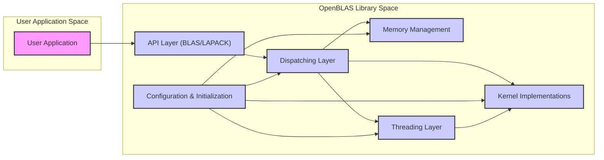

# Project Design Document: OpenBLAS Library for Threat Modeling (Improved)

**Project Name:** OpenBLAS (Optimized Basic Linear Algebra Subprograms)

**Project Repository:** [https://github.com/xianyi/openblas](https://github.com/xianyi/openblas)

**Document Version:** 1.1
**Date:** 2023-10-27
**Author:** AI Software & Security Architect

## 1. Introduction

This document provides an enhanced design overview of the OpenBLAS library, specifically tailored for comprehensive threat modeling and security analysis. OpenBLAS is a widely adopted, high-performance, open-source implementation of the Basic Linear Algebra Subprograms (BLAS) API. It targets scientific computing, machine learning, and other domains demanding efficient linear algebra operations. This document details the architecture, key components, data flow, and external interfaces of OpenBLAS to facilitate a robust identification of potential security threats, vulnerabilities, and attack vectors. This document is intended for security researchers, developers, and anyone involved in securing systems that utilize OpenBLAS.

## 2. Project Overview

OpenBLAS's primary goal is to deliver a BLAS library that is both exceptionally fast and highly portable across diverse hardware platforms.  Its performance advantages are achieved through:

*   **Micro-architectural Optimizations:**  Extensive use of hand-optimized assembly language kernels meticulously crafted for specific CPU architectures (including but not limited to x86, ARM, PowerPC, MIPS, RISC-V). These kernels exploit instruction-level parallelism and specific CPU features.
*   **Parallel Processing Capabilities:**  Robust multi-threading support to effectively utilize multi-core processors, enabling parallel execution of linear algebra operations and significantly reducing computation time.
*   **Intelligent Memory Management:**  Sophisticated memory management strategies designed to minimize memory access latency, reduce cache misses, and improve overall data locality, contributing to higher performance.
*   **Standard API Compliance:**  Full adherence to the standard BLAS and LAPACK (Linear Algebra PACKage) APIs, ensuring seamless drop-in replacement compatibility with other BLAS libraries and simplifying integration into existing software.

The library is predominantly implemented in C and Assembly language, reflecting the need for both high-level structure and low-level performance tuning. It is designed to be compiled as a shared or static library and linked into user applications. OpenBLAS is intended for developers and researchers who require high-performance linear algebra routines in their applications.

## 3. System Architecture

The following diagram illustrates the refined high-level architecture of OpenBLAS, providing more detail on component interactions:

**Components Description (Enhanced):**

*   **A. User Application:**  Represents any software application (e.g., scientific simulation, machine learning framework, financial modeling software) that links and utilizes the OpenBLAS library. Interaction occurs exclusively through the well-defined API Layer.
*   **B. API Layer (BLAS/LAPACK):**  This is the public-facing interface of OpenBLAS, providing a comprehensive set of functions conforming to the BLAS and LAPACK standards. Examples include `dgemm` (double-precision general matrix multiplication), `daxpy` (double-precision scalar times vector plus vector), `dgesv` (double-precision general system of linear equations solver), and many others.  This layer is responsible for argument parsing and basic validation before dispatching calls.
*   **C. Dispatching Layer:**  A critical component acting as an intelligent router. It dynamically selects the most optimal Kernel Implementation based on a combination of runtime and compile-time factors:
    *   **Target CPU Architecture:**  Detects the CPU architecture at runtime (e.g., using CPUID on x86) or relies on compile-time configuration to choose architecture-specific kernels.
    *   **Problem Dimensions:**  Analyzes matrix and vector dimensions to select kernels optimized for specific sizes (e.g., different kernels for small, medium, and large matrices).
    *   **Data Types:**  Dispatches to kernels tailored for different data types (single-precision, double-precision, complex numbers).
    *   **Hardware Features:**  Leverages CPU features like SIMD instruction sets (SSE, AVX, NEON, etc.) by selecting kernels that utilize these for vectorization.
    *   **Threading Configuration:**  Considers the configured number of threads and dispatches to multi-threaded or single-threaded kernels as appropriate.
    This layer ensures that the most performant kernel is invoked for each operation.
*   **D. Kernel Implementations:**  The performance-critical core of OpenBLAS. This component houses a vast collection of highly optimized implementations of BLAS and LAPACK routines. Key characteristics:
    *   **Assembly Language Focus:**  Many kernels are written in assembly language for maximum control over hardware and instruction scheduling.
    *   **Architecture-Specific Variants:**  Multiple kernel versions exist for the same BLAS/LAPACK function, each meticulously optimized for a specific CPU architecture or micro-architecture.
    *   **Algorithm Optimization:**  Kernels employ advanced algorithms and techniques (e.g., loop unrolling, blocking, tiling) to maximize cache utilization and minimize memory bandwidth requirements.
*   **E. Memory Management:**  Responsible for efficient allocation and deallocation of memory buffers used for matrices, vectors, and intermediate results during computations.  Key aspects:
    *   **Dynamic Allocation:**  Allocates memory on demand as needed by the kernels.
    *   **Potential for Memory Pooling/Caching:**  May employ internal memory pooling or caching mechanisms to reduce the overhead of frequent memory allocation and deallocation, especially for small, repeated operations.
    *   **Alignment Considerations:**  Ensures proper memory alignment to optimize data access patterns and take advantage of SIMD instructions.
*   **F. Configuration & Initialization:**  Handles the library's setup and initialization when it is loaded into an application's process.  Tasks include:
    *   **CPU Feature Detection:**  Detecting the CPU architecture and available features (SIMD support, core count, etc.) at runtime.
    *   **Kernel Loading:**  Loading the appropriate set of optimized kernel implementations based on detected CPU features and configuration.
    *   **Threading Setup:**  Initializing the threading layer and configuring the number of threads to be used (often configurable via environment variables or API calls).
    *   **Configuration Parameter Handling:**  Reading and processing configuration parameters, potentially from environment variables or configuration files (though file-based configuration is less common in core OpenBLAS).
*   **G. Threading Layer:** Manages thread creation, synchronization, and workload distribution for parallel operations.  Abstracts the underlying threading API (pthreads, Windows Threads, OpenMP) to provide a consistent threading interface for the rest of the library. This layer is crucial for enabling multi-core performance.

## 4. Data Flow (Detailed)

The following diagram and description provide a more granular view of the data flow during a typical OpenBLAS function call, highlighting the types of data exchanged between components:

```mermaid
graph LR
    A["User Application"] --> B["API Layer: Function Call & Data (Pointers, Sizes)"];
    B --> C["Dispatching Layer: Function ID, Data Pointers, Sizes"];
    C --> D["Kernel Implementations: Function Pointer, Data Pointers, Sizes"];
    D --> E["Memory Management: Allocation Requests (Sizes), Data Access (Pointers)"];
    E --> D["Kernel Implementations: Memory Pointers"];
    D --> F["Kernel Implementations: Computation (Data Processing)"];
    F --> E["Memory Management: Data Access (Pointers), Deallocation Requests (Pointers)"];
    E --> F["Kernel Implementations: Memory Pointers"];
    F --> G["Dispatching Layer: Return Code, Result Data Pointers"];
    G --> H["API Layer: Return Code, Result Data Pointers"];
    H --> A["User Application: Results"];

    style A fill:#f9f,stroke:#333,stroke-width:2px
    style B fill:#ccf,stroke:#333,stroke-width:2px
    style C fill:#ccf,stroke:#333,stroke-width:2px
    style D fill:#ccf,stroke:#333,stroke-width:2px
    style E fill:#ccf,stroke:#333,stroke-width:2px
    style F fill:#ccf,stroke:#333,stroke-width:2px
    style G fill:#ccf,stroke:#333,stroke-width:2px
    style H fill:#ccf,stroke:#333,stroke-width:2px

    classDef libraryNode fill:#ccf,stroke:#333,stroke-width:2px
    class B,C,D,E,F,G,H libraryNode
```

**Detailed Data Flow Description:**

1.  **User Application Invocation (A -> B):** The user application initiates a BLAS/LAPACK function call through the API Layer. This involves passing:
    *   **Function Identifier:**  Implicitly determined by the function call itself (e.g., `dgemm`).
    *   **Data Pointers:** Pointers to input matrices and vectors in the user application's memory space.
    *   **Size Parameters:** Dimensions of matrices and vectors (e.g., rows, columns, leading dimensions).
    *   **Scalar Arguments:**  Scalar values required by the function (e.g., alpha, beta in `dgemm`).
2.  **Dispatching Preparation (B -> C):** The API Layer receives the function call and arguments. It performs initial argument parsing and potentially basic validation (e.g., checking for null pointers, basic size range checks). It then passes:
    *   **Function ID:**  A numerical or symbolic identifier representing the BLAS/LAPACK function.
    *   **Data Pointers:**  The same data pointers received from the user application.
    *   **Size Parameters:**  Matrix and vector dimensions.
3.  **Kernel Selection and Invocation (C -> D):** The Dispatching Layer uses the Function ID, size parameters, and system information (CPU architecture, etc.) to select the appropriate Kernel Implementation. It then invokes the chosen kernel by passing:
    *   **Function Pointer:**  A pointer to the selected kernel function.
    *   **Data Pointers:**  Pointers to the input data.
    *   **Size Parameters:**  Dimensions and other relevant parameters.
4.  **Memory Operations (Kernel -> Memory Management <-> Kernel):** The Kernel Implementation interacts with the Memory Management component as needed:
    *   **Allocation Requests (Kernel -> Memory Management):**  If the kernel requires temporary buffers for intermediate computations, it requests memory allocation from the Memory Management component, specifying the required size.
    *   **Data Access (Kernel <-> Memory Management):**  Kernels access input data and store output data through memory pointers provided by the Memory Management component, or directly using the pointers passed from the API layer if operating in-place.
    *   **Memory Pointer Return (Memory Management -> Kernel):** The Memory Management component returns pointers to allocated memory buffers to the kernel.
5.  **Core Computation (Kernel Implementations - F):** The selected Kernel Implementation performs the core linear algebra computation using the provided data pointers and size parameters. This is where the optimized assembly code or C code is executed.
6.  **Result Handling and Memory Deallocation (Kernel -> Memory Management <-> Kernel):** After computation:
    *   **Data Access (Kernel <-> Memory Management):** The kernel writes the results to the designated output memory locations.
    *   **Deallocation Requests (Kernel -> Memory Management):** If the kernel allocated temporary buffers, it requests the Memory Management component to deallocate these buffers.
    *   **Memory Pointer Return (Memory Management -> Kernel):**  Acknowledgement or status of deallocation.
7.  **Dispatching Layer Return (Kernel -> Dispatching Layer - G):** The Kernel Implementation returns to the Dispatching Layer, typically passing:
    *   **Return Code:**  An indication of success or failure of the computation.
    *   **Result Data Pointers:** Pointers to the output data (which might be the same as input data pointers in in-place operations).
8.  **API Layer Return (Dispatching Layer -> API Layer - H):** The Dispatching Layer passes the return code and result data pointers back to the API Layer.
9.  **Return to User Application (API Layer -> User Application - A):** The API Layer returns the results to the user application, including:
    *   **Return Value:**  Function return value indicating success or failure.
    *   **Modified Data (via pointers):**  Output matrices or vectors are modified in the user application's memory space through the pointers initially passed to the API.

## 5. External Interfaces (Detailed)

*   **5.1. API (C/Fortran):**
    *   **Type:** Programming Interface (ABI - Application Binary Interface)
    *   **Description:**  The primary and most critical interface. Defined by the BLAS and LAPACK standards. Functions are exposed as C and Fortran callable routines.  Examples of API calls include:
        *   `cblas_dgemm()` (C interface for double-precision matrix multiplication)
        *   `LAPACKE_dgesv()` (C interface for double-precision linear system solver)
        *   `sgemv_()` (Fortran interface for single-precision matrix-vector multiplication)
    *   **Data Format:**  Primarily uses pointers to contiguous memory blocks for matrices and vectors. Data types include single-precision (float), double-precision (double), single-precision complex, and double-precision complex numbers.
    *   **Security Relevance:**
        *   **Input Validation Weakness:** Insufficient validation of input parameters (especially matrix dimensions, leading dimensions, and data pointers) can lead to buffer overflows, out-of-bounds memory access, and other memory corruption vulnerabilities within the kernels.
        *   **Format String Vulnerabilities (Less Likely but Possible):**  If error messages or debugging output are generated based on user-supplied input without proper sanitization, format string vulnerabilities could theoretically be introduced (though less common in numerical libraries).

*   **5.2. Build System (CMake, Make):**
    *   **Type:** Build and Configuration Interface
    *   **Description:**  Standard build systems (CMake and Make) are used to compile and configure OpenBLAS. This involves:
        *   Compiling C source code using compilers like GCC, Clang, or MSVC.
        *   Assembling assembly language kernels using assemblers like GAS or NASM.
        *   Linking object files into shared or static libraries.
        *   Generating configuration files and header files.
    *   **Security Relevance:**
        *   **Build Dependency Vulnerabilities:**  Vulnerabilities in build tools (CMake, Make, compilers, assemblers, linkers) or their dependencies could be exploited to inject malicious code during the build process.
        *   **Insecure Build Scripts:**  Poorly written or configured build scripts could introduce vulnerabilities, although OpenBLAS's build system is generally well-maintained.
        *   **Supply Chain Attacks:**  Compromised build environments or dependencies could lead to the distribution of backdoored OpenBLAS binaries.

*   **5.3. Operating System (OS) and Hardware:**
    *   **Type:** Runtime Environment Interface
    *   **Description:**  Deep interaction with the OS kernel and underlying hardware:
        *   **Memory Management:**  Relies on OS memory allocation functions (e.g., `malloc`, `free`, `mmap`) for memory management.
        *   **Threading:**  Utilizes OS threading APIs (pthreads on POSIX systems, Windows Threads on Windows) or OpenMP for multi-threading.
        *   **CPU Feature Detection:**  Uses OS-specific or CPUID instructions to detect CPU architecture and features.
        *   **System Calls:**  Makes system calls for various operations (e.g., time measurement, process management).
    *   **Security Relevance:**
        *   **OS Vulnerabilities:**  If the underlying OS has vulnerabilities (e.g., in memory management, threading, or system call handling), these could indirectly affect OpenBLAS's security.
        *   **Privilege Escalation (Less Likely):**  While less likely for a library like OpenBLAS, vulnerabilities in OS interaction could theoretically be exploited for local privilege escalation in highly specific scenarios if combined with other system weaknesses.
        *   **Resource Exhaustion:**  Incorrect resource management (e.g., excessive thread creation, memory leaks due to OS interaction bugs) could lead to denial-of-service conditions.

*   **5.4. Environment Variables (Configuration):**
    *   **Type:** Configuration Interface
    *   **Description:**  Environment variables are used to configure runtime behavior:
        *   `OPENBLAS_NUM_THREADS`: Controls the number of threads used by OpenBLAS.
        *   `GOTO_NUM_THREADS`:  Another environment variable for thread control (historical).
        *   `OPENBLAS_VERBOSE`:  Enables verbose output for debugging.
    *   **Security Relevance:**
        *   **Denial of Service via Thread Exhaustion:**  Setting excessively high thread counts via environment variables could potentially lead to resource exhaustion and denial-of-service, especially in resource-constrained environments.
        *   **Information Disclosure (Verbose Output):**  Enabling verbose output via environment variables might inadvertently disclose sensitive information in logs or output streams, depending on the context of use.
        *   **Configuration Injection (Less Likely):**  In highly unusual scenarios where environment variables are dynamically set based on untrusted input and directly influence critical security parameters within OpenBLAS (which is not typical), there *could* be a theoretical injection risk, but this is very unlikely in standard OpenBLAS usage.

*   **5.5. File System (Minimal):**
    *   **Type:** Data Storage/Access Interface (Limited)
    *   **Description:**  File system interaction is generally minimal in core OpenBLAS. Primarily for:
        *   **Installation:**  Libraries and header files are installed into file system directories during the build process.
        *   **Potential for JIT/Kernel Loading (Advanced/Custom Builds):** In highly customized or experimental builds, there *might* be mechanisms to load optimized kernels from disk at runtime, but this is not standard practice in typical OpenBLAS distributions.
    *   **Security Relevance:**
        *   **Insecure File Permissions (Installation):**  Incorrect file permissions during installation could allow unauthorized modification or replacement of OpenBLAS libraries, leading to code injection or library hijacking.
        *   **Path Traversal/Injection (JIT/Kernel Loading - Hypothetical):**  If file system paths for kernel loading were constructed based on untrusted input (in hypothetical advanced builds), path traversal or path injection vulnerabilities could arise, allowing loading of malicious kernels from arbitrary locations. *However, this is not a standard feature of OpenBLAS and is a hypothetical concern.*

## 6. Technology Stack

*   **Programming Languages:** C (core library, API layer, dispatching), Assembly (architecture-specific kernels - x86, ARM, PowerPC, MIPS, RISC-V, etc.), Fortran (API wrappers, some legacy code).
*   **Build System:** CMake (primary), Make (legacy support).
*   **CPU Architectures Supported:** Broad range, including x86 (x86, x86-64), ARM (ARMv7, ARMv8/AArch64), PowerPC, MIPS, RISC-V, SPARC, and others.
*   **Operating Systems:** Cross-platform support: Linux, Windows, macOS, Android, iOS, FreeBSD, and other POSIX-compliant systems.
*   **Threading Libraries:** POSIX Threads (pthreads - Linux, macOS, etc.), Windows Threads (Windows), OpenMP (optional, for some parallelization strategies).
*   **Compiler Toolchains:** GCC (GNU Compiler Collection), Clang, Intel Compiler, Microsoft Visual C++ (MSVC), and architecture-specific compilers and assemblers.
*   **Standard Libraries:** C Standard Library (libc), math libraries (libm).

## 7. Security Considerations (Detailed and Categorized)

Here are more detailed and categorized security considerations for threat modeling:

**7.1. Memory Safety Vulnerabilities:**

*   **7.1.1. Buffer Overflows in Kernels (C & Assembly):**
    *   **Description:**  Assembly and C kernels, especially those performing complex memory manipulations (e.g., matrix transposition, packing), are susceptible to buffer overflows if input sizes or loop bounds are not meticulously validated. Incorrect index calculations or off-by-one errors in assembly code are common sources.
    *   **Example Scenario:**  A `dgemm` kernel might incorrectly calculate the size of an intermediate buffer needed for matrix tiling, leading to a write beyond the allocated buffer when processing large matrices with specific dimensions.
    *   **Mitigation:**  Rigorous input validation at the API layer and within kernels, using safe memory access patterns, employing static analysis tools, and thorough testing with various input sizes and edge cases.

*   **7.1.2. Integer Overflows in Size Calculations (C):**
    *   **Description:**  Integer overflows can occur when calculating memory allocation sizes, loop counters, or array indices, especially when dealing with large matrix dimensions. If size calculations wrap around due to overflow, it can lead to undersized buffer allocations or incorrect loop bounds, resulting in buffer overflows or out-of-bounds access.
    *   **Example Scenario:**  Calculating the size of a buffer as `rows * columns * sizeof(double)` might overflow if `rows` and `columns` are very large, resulting in a smaller-than-expected buffer allocation and subsequent buffer overflow when the kernel writes data into it.
    *   **Mitigation:**  Use appropriate integer types (e.g., `size_t`, `uint64_t`) for size calculations, perform overflow checks where necessary, and use compiler options to detect integer overflows.

*   **7.1.3. Out-of-Bounds Memory Access (C & Assembly):**
    *   **Description:**  Kernels might access memory outside of allocated buffers due to incorrect address calculations, loop conditions, or pointer arithmetic errors. This can lead to crashes, data corruption, or exploitable vulnerabilities.
    *   **Example Scenario:**  A kernel implementing a vector operation might iterate beyond the intended bounds of the input vector due to a loop condition error, reading or writing to memory outside the vector's allocated region.
    *   **Mitigation:**  Careful code review of kernel implementations, especially assembly code, using memory safety tools (e.g., Valgrind, AddressSanitizer), and extensive unit testing to detect out-of-bounds accesses.

*   **7.1.4. Use-After-Free and Double-Free (C):**
    *   **Description:**  Errors in memory management within OpenBLAS or in interaction with OS memory allocation functions could lead to use-after-free vulnerabilities (accessing memory after it has been freed) or double-free vulnerabilities (freeing the same memory block twice).
    *   **Example Scenario:**  A kernel might free a temporary buffer and then later attempt to write to it, or a double-free could occur if memory deallocation logic is flawed in error handling paths.
    *   **Mitigation:**  Strict adherence to memory management best practices, careful tracking of memory ownership, using memory safety tools to detect use-after-free and double-free errors, and robust unit testing of memory allocation and deallocation paths.

**7.2. Concurrency and Threading Vulnerabilities:**

*   **7.2.1. Race Conditions in Multi-threaded Kernels (C & Assembly):**
    *   **Description:**  Multi-threaded kernels that access shared memory without proper synchronization mechanisms (locks, mutexes, atomic operations) are vulnerable to race conditions. This can lead to data corruption, inconsistent results, or unpredictable behavior.
    *   **Example Scenario:**  Multiple threads in a parallel matrix multiplication kernel might attempt to write to the same location in the output matrix simultaneously without proper locking, leading to data corruption.
    *   **Mitigation:**  Careful design of multi-threaded algorithms, using appropriate synchronization primitives (mutexes, locks, atomic operations) to protect shared data, and thorough testing under concurrent workloads to detect race conditions. Static analysis tools can also help identify potential race conditions.

*   **7.2.2. Deadlocks in Thread Synchronization (C):**
    *   **Description:**  Incorrect use of synchronization primitives (e.g., acquiring locks in the wrong order) can lead to deadlocks, where threads become blocked indefinitely, causing the application to hang.
    *   **Example Scenario:**  Two threads might attempt to acquire two locks in reverse order, leading to a deadlock if each thread holds one lock and is waiting for the other.
    *   **Mitigation:**  Careful design of thread synchronization logic, using consistent lock acquisition order, and employing deadlock detection techniques during testing.

**7.3. Side-Channel Vulnerabilities (Assembly & Algorithm Design):**

*   **7.3.1. Timing Attacks (Assembly & Algorithm Design):**
    *   **Description:**  Performance optimizations in kernels, especially conditional branches or data-dependent memory access patterns, might introduce timing variations that are correlated with sensitive data. Attackers could potentially exploit these timing differences to infer information about the data being processed.
    *   **Example Scenario:**  A kernel might take slightly longer to execute if certain bits in the input data are set, and an attacker could measure these timing differences to infer information about the input data.
    *   **Mitigation:**  Careful analysis of kernel execution paths to identify potential timing variations, using constant-time algorithms where security is critical, and potentially adding noise or randomization to execution times to mask timing signals. *Side-channel attacks are generally a concern only in very specific security-sensitive contexts, which are less common for general-purpose BLAS libraries.*

*   **7.3.2. Cache Attacks (Assembly & Algorithm Design):**
    *   **Description:**  Data access patterns in kernels might create predictable cache behavior that can be observed by attackers to infer information about the data being processed.
    *   **Example Scenario:**  An attacker might be able to monitor cache hits and misses to determine which parts of a matrix are being accessed, potentially revealing information about the matrix structure or values.
    *   **Mitigation:**  Designing algorithms and data access patterns to minimize cache predictability, using cache-oblivious algorithms where possible, and potentially employing cache randomization techniques. *Similar to timing attacks, cache attacks are typically a concern in highly specialized security contexts.*

**7.4. Input Validation and API Security:**

*   **7.4.1. Insufficient Input Validation at API Boundary (C & Fortran):**
    *   **Description:**  Lack of proper input validation at the API layer can allow malicious or malformed inputs (e.g., negative dimensions, excessively large sizes, invalid pointers) to reach the kernel implementations. This can trigger vulnerabilities in the kernels that rely on assumptions about input validity.
    *   **Example Scenario:**  An application might pass a negative matrix dimension to a BLAS function. If the API layer does not validate this input, the negative dimension could propagate to a kernel, leading to incorrect memory access or other undefined behavior.
    *   **Mitigation:**  Implement robust input validation at the API layer to check for valid ranges, data types, and pointer validity. Return error codes or exceptions for invalid inputs to prevent them from reaching the kernels.

**7.5. Supply Chain and Build System Security:**

*   **7.5.1. Compromised Build Dependencies (Build System):**
    *   **Description:**  If build dependencies (compilers, assemblers, linkers, CMake, Make) are compromised, malicious code could be injected into the OpenBLAS build process without directly modifying the OpenBLAS source code.
    *   **Example Scenario:**  A compromised compiler could inject a backdoor into the compiled OpenBLAS library during the build process.
    *   **Mitigation:**  Use trusted and verified build environments, regularly update build tools and dependencies, use dependency scanning tools to detect known vulnerabilities in build dependencies, and consider reproducible builds to verify the integrity of the build process.

*   **7.5.2. Insecure Distribution Channels (Distribution):**
    *   **Description:**  If OpenBLAS binaries are distributed through insecure channels (e.g., unencrypted HTTP, untrusted repositories), they could be tampered with during transit, leading to the distribution of compromised binaries.
    *   **Example Scenario:**  An attacker could perform a man-in-the-middle attack to replace a legitimate OpenBLAS binary with a malicious one during download.
    *   **Mitigation:**  Distribute OpenBLAS binaries through secure channels (HTTPS), use code signing to verify the integrity and authenticity of binaries, and encourage users to download binaries from trusted sources.

## 8. Threat Modeling Scope (OpenBLAS Specific)

The threat modeling exercise for OpenBLAS should be specifically focused on:

*   **Threat Actors:**
    *   **Malicious Users of Applications Using OpenBLAS:**  Attackers who control input to applications that use OpenBLAS and attempt to exploit vulnerabilities to gain unauthorized access, cause denial of service, or corrupt data within those applications.
    *   **Supply Chain Attackers:**  Attackers who aim to compromise the OpenBLAS build and distribution process to distribute backdoored versions of the library to a wide range of users.
    *   **Researchers/Security Auditors:**  Ethical hackers and security researchers who may discover vulnerabilities and report them responsibly.

*   **Assets:**
    *   **Integrity of Computations:** Ensuring that OpenBLAS performs linear algebra operations correctly and without data corruption.
    *   **Availability of Applications Using OpenBLAS:** Preventing denial-of-service attacks that could make applications using OpenBLAS unavailable.
    *   **Confidentiality of Data (Less Direct):** While OpenBLAS itself doesn't typically handle sensitive data directly, vulnerabilities could potentially be exploited to leak information about data being processed by applications using OpenBLAS (e.g., through side-channel attacks in very specific scenarios).
    *   **Reputation of OpenBLAS Project:** Maintaining the trustworthiness and security reputation of the OpenBLAS project.

*   **Threats (Based on Security Considerations):**
    *   **Memory Corruption Exploits:** Buffer overflows, integer overflows, out-of-bounds access, use-after-free, double-free vulnerabilities leading to crashes, arbitrary code execution, or data corruption.
    *   **Denial of Service:** Resource exhaustion due to thread mismanagement, excessive memory allocation, or exploitable crashes.
    *   **Supply Chain Compromise:** Distribution of backdoored OpenBLAS binaries.
    *   **Side-Channel Information Leakage (Context Dependent):** Timing attacks, cache attacks potentially leaking information in highly specific security-sensitive applications.

*   **Vulnerabilities:**  Focus on identifying specific code locations and design patterns within OpenBLAS that are prone to the security considerations outlined in Section 7. This includes:
    *   Kernel implementations (C and Assembly) related to memory manipulation and loop control.
    *   Input validation logic in the API layer.
    *   Memory management routines.
    *   Threading and synchronization code.
    *   Build system and distribution processes.

*   **Risk Assessment:**  Evaluate the likelihood and impact of each identified threat and vulnerability. Consider factors such as:
    *   Exploitability: How easy is it to exploit the vulnerability?
    *   Impact: What is the potential damage if the vulnerability is exploited?
    *   Likelihood: How likely is it that the vulnerability will be exploited in real-world scenarios?

*   **Mitigation Strategies:**  Develop and implement security controls to mitigate identified risks. This includes:
    *   Code reviews and security audits of critical components (kernels, API layer, memory management).
    *   Static and dynamic analysis tools to detect vulnerabilities.
    *   Fuzzing to test robustness against malformed inputs.
    *   Unit and integration testing with security focus.
    *   Secure coding practices and guidelines for developers.
    *   Secure build and distribution processes.
    *   Vulnerability disclosure and response plan.

**Recommended Threat Modeling Methodologies:**

*   **STRIDE:**  Focus on identifying threats categorized by Spoofing, Tampering, Repudiation, Information Disclosure, Denial of Service, and Elevation of Privilege.
*   **Attack Trees:**  Visually represent attack paths and decompose high-level threats into more granular attack steps.
*   **PASTA (Process for Attack Simulation and Threat Analysis):**  A seven-step methodology that emphasizes risk and business impact.

## 9. Assumptions and Limitations

*   **Assumptions:**
    *   This design document is based on a review of the OpenBLAS source code repository and publicly available documentation as of October 2023.
    *   The architecture and data flow described are representative of the general design of OpenBLAS, but specific implementations may vary across different versions and configurations.
    *   The security considerations outlined are based on common vulnerability patterns in C, Assembly, and numerical libraries, but may not be exhaustive.
*   **Limitations:**
    *   This document is a high-level design overview and does not constitute a complete security audit or vulnerability assessment.
    *   Detailed code review and dynamic analysis are necessary to identify specific vulnerabilities.
    *   The threat model is based on current understanding of potential threats and may need to be updated as new threats emerge.
    *   The effectiveness of mitigation strategies will depend on their implementation and ongoing maintenance.

## 10. Deployment View

OpenBLAS is typically deployed as a library that is linked into user applications. Common deployment scenarios include:

*   **Scientific Computing Applications:**  Integrated into scientific simulation software, numerical analysis tools, and research codes. Often deployed on high-performance computing clusters, workstations, and cloud environments.
*   **Machine Learning Frameworks:**  Used as the underlying BLAS library for machine learning frameworks like TensorFlow, PyTorch, and NumPy. Deployed in diverse environments ranging from personal computers to large-scale data centers and cloud platforms.
*   **Embedded Systems:**  Compiled and deployed on embedded systems and mobile devices for applications requiring linear algebra operations in resource-constrained environments.
*   **Cloud Services:**  Deployed as part of cloud-based services and platforms that offer numerical computation and machine learning capabilities.

The deployment context can influence the threat landscape. For example, in cloud environments, multi-tenancy and network exposure might introduce additional security considerations compared to isolated embedded systems. Similarly, applications processing sensitive data require more stringent security measures to mitigate side-channel attacks.

This improved design document provides a more detailed and structured foundation for conducting a thorough threat modeling exercise for the OpenBLAS library. It highlights key components, data flows, external interfaces, and potential security considerations, enabling a more focused and effective security analysis.