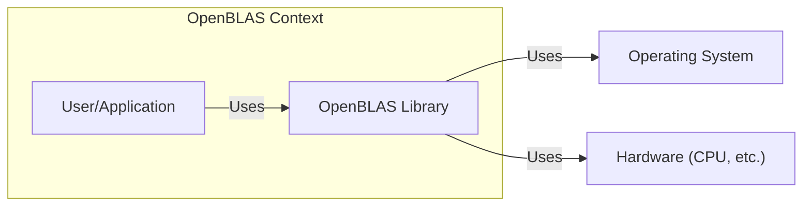
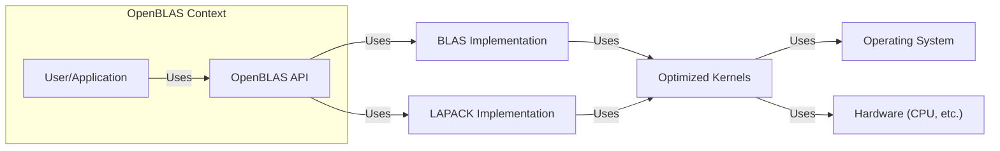
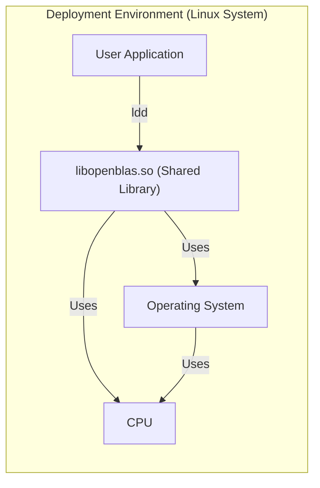
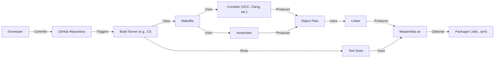

# BUSINESS POSTURE

OpenBLAS is an open-source implementation of the BLAS (Basic Linear Algebra Subprograms) and LAPACK (Linear Algebra PACKage) APIs. It's a foundational library used in numerous scientific computing, machine learning, and high-performance computing applications.

Business Priorities and Goals:

*   Provide a high-performance, freely available, and optimized BLAS and LAPACK implementation.
*   Support a wide range of hardware architectures and operating systems.
*   Maintain accuracy and numerical stability in computations.
*   Foster community contributions and ongoing development.
*   Serve as a drop-in replacement for other BLAS/LAPACK libraries.
*   Reduce the barrier to entry for high-performance computing.

Business Risks:

*   Incorrect computation results: Due to bugs or numerical instability, leading to flawed scientific conclusions or application failures.
*   Performance regressions: New code changes inadvertently slowing down performance, impacting users relying on OpenBLAS's speed.
*   Security vulnerabilities: Exploitable vulnerabilities in the library could allow attackers to compromise systems using OpenBLAS. This is particularly critical given its use in potentially sensitive scientific and machine learning contexts.
*   Lack of maintainability: Difficulty in maintaining and updating the codebase, hindering future development and support for new hardware.
*   Compatibility issues: Incompatibility with specific hardware or software configurations, limiting its usability.
*   Community fragmentation: Lack of a cohesive community or governance model, leading to divergent development efforts.

# SECURITY POSTURE

Existing Security Controls:

*   security control: Code reviews: The GitHub repository indicates a collaborative development process with pull requests, suggesting code reviews are likely performed. (Described in GitHub contribution guidelines).
*   security control: Community involvement: An active open-source community can help identify and address security issues. (Visible through GitHub issues and pull requests).
*   security control: Testing: The repository contains test suites, indicating efforts to ensure correctness and potentially identify some security-related bugs. (Located in the `test` directory).
*   security control: Fuzzing: Some fuzzing efforts are mentioned in the documentation, which can help uncover vulnerabilities. (Mentioned in the documentation).

Accepted Risks:

*   accepted risk: Complexity of low-level code: The nature of BLAS/LAPACK implementations involves intricate, performance-critical code (often in assembly), making it inherently more challenging to audit for security vulnerabilities.
*   accepted risk: Reliance on external compilers and tools: The build process depends on external compilers (like GCC, Clang, etc.) and build tools, which themselves could have vulnerabilities.
*   accepted risk: Limited formal security audits: While community review and fuzzing are present, there's no indication of regular, comprehensive security audits by dedicated security professionals.

Recommended Security Controls:

*   security control: Static analysis: Integrate static analysis tools (SAST) into the build process to automatically detect potential vulnerabilities.
*   security control: Continuous fuzzing: Implement a continuous fuzzing infrastructure to constantly test the library with a wide range of inputs.
*   security control: Memory safety checks: Explore the use of memory safety tools or techniques (e.g., AddressSanitizer) during development and testing.
*   security control: Dependency analysis: Regularly scan for vulnerabilities in dependencies.
*   security control: Security-focused code reviews: Explicitly include security considerations in code review checklists.

Security Requirements:

*   Authentication: Not directly applicable to a library like OpenBLAS, as it doesn't handle user authentication.
*   Authorization: Not directly applicable, as OpenBLAS doesn't manage access control.
*   Input validation:
    *   Crucial for preventing buffer overflows and other memory-related vulnerabilities.
    *   Validate array dimensions, strides, and other parameters passed to BLAS/LAPACK functions.
    *   Ensure that input pointers are valid and within allocated memory bounds.
*   Cryptography: Not directly applicable, as OpenBLAS is not a cryptographic library. However, if OpenBLAS were to incorporate any cryptographic functionality (e.g., for secure communication in a distributed setting), it would need to adhere to strong cryptographic standards.
*   Error Handling:
    *   OpenBLAS should handle errors gracefully, such as invalid input parameters or memory allocation failures.
    *   Error codes or messages should be informative but avoid revealing sensitive information that could be exploited.
*   Memory Management:
    *   OpenBLAS must manage memory safely to prevent buffer overflows, use-after-free errors, and other memory corruption vulnerabilities.
    *   Dynamic memory allocation should be minimized where possible to reduce the attack surface.

# DESIGN

## C4 CONTEXT

Element Descriptions:

*   Element: User/Application
    *   Name: User/Application
    *   Type: External Entity (Person or Software System)
    *   Description: Represents a user or an application that utilizes the OpenBLAS library for linear algebra computations.
    *   Responsibilities: Calls OpenBLAS functions with appropriate input data and handles the results.
    *   Security controls: Input validation before calling OpenBLAS functions.

*   Element: OpenBLAS Library
    *   Name: OpenBLAS Library
    *   Type: Software System
    *   Description: The OpenBLAS library itself, providing optimized BLAS and LAPACK routines.
    *   Responsibilities: Performing linear algebra calculations efficiently and accurately.
    *   Security controls: Input validation, memory safety checks (during development/testing), fuzzing.

*   Element: Operating System
    *   Name: Operating System
    *   Type: External System
    *   Description: The operating system on which OpenBLAS and the user application run.
    *   Responsibilities: Provides system calls, memory management, and other low-level services.
    *   Security controls: OS-level security features (e.g., ASLR, DEP).

*   Element: Hardware
    *   Name: Hardware (CPU, etc.)
    *   Type: External System
    *   Description: The underlying hardware platform, including the CPU, memory, and potentially other accelerators.
    *   Responsibilities: Executes the compiled code.
    *   Security controls: Hardware-level security features (e.g., secure boot).

## C4 CONTAINER

Since OpenBLAS is a single library, the container diagram is essentially an expansion of the context diagram.

Element Descriptions:

*   Element: User/Application
    *   Name: User/Application
    *   Type: External Entity (Person or Software System)
    *   Description: Represents a user or an application that utilizes the OpenBLAS library for linear algebra computations.
    *   Responsibilities: Calls OpenBLAS functions with appropriate input data and handles the results.
    *   Security controls: Input validation before calling OpenBLAS functions.

*   Element: OpenBLAS API
    *   Name: OpenBLAS API
    *   Type: API
    *   Description: The interface through which applications interact with OpenBLAS.
    *   Responsibilities: Exposes BLAS and LAPACK functions. Performs initial input validation.
    *   Security controls: Input validation.

*   Element: BLAS Implementation
    *   Name: BLAS Implementation
    *   Type: Component
    *   Description: Contains the implementation of BLAS routines.
    *   Responsibilities: Executes BLAS operations.
    *   Security controls: Input validation, memory safety.

*   Element: LAPACK Implementation
    *   Name: LAPACK Implementation
    *   Type: Component
    *   Description: Contains the implementation of LAPACK routines.
    *   Responsibilities: Executes LAPACK operations.
    *   Security controls: Input validation, memory safety.

*   Element: Optimized Kernels
    *   Name: Optimized Kernels
    *   Type: Component
    *   Description: Low-level, architecture-specific optimized routines (often written in assembly).
    *   Responsibilities: Perform core computations with maximum efficiency.
    *   Security controls: Careful code review, fuzzing, memory safety checks.

*   Element: Operating System
    *   Name: Operating System
    *   Type: External System
    *   Description: The operating system on which OpenBLAS and the user application run.
    *   Responsibilities: Provides system calls, memory management, and other low-level services.
    *   Security controls: OS-level security features (e.g., ASLR, DEP).

*   Element: Hardware
    *   Name: Hardware (CPU, etc.)
    *   Type: External System
    *   Description: The underlying hardware platform, including the CPU, memory, and potentially other accelerators.
    *   Responsibilities: Executes the compiled code.
    *   Security controls: Hardware-level security features (e.g., secure boot).

## DEPLOYMENT

OpenBLAS can be deployed in several ways:

1.  **System-wide installation:** Installed as a shared library (e.g., `.so` on Linux, `.dll` on Windows) in a standard system directory.  This is the most common approach for general use.
2.  **Local installation:** Compiled and linked directly into a specific application. This provides more control over the build configuration but makes updates more difficult.
3.  **Containerization:** Included as part of a container image (e.g., Docker). This ensures consistent behavior across different environments.
4.  **Embedded systems:** Cross-compiled and deployed on embedded devices.

We'll describe the system-wide installation on a Linux system, as it's the most common and relevant for threat modeling.

Element Descriptions:

*   Element: User Application
    *   Name: User Application
    *   Type: Software System
    *   Description: An application that uses OpenBLAS.
    *   Responsibilities: Calls OpenBLAS functions.
    *   Security controls: Input validation before calling OpenBLAS.

*   Element: libopenblas.so (Shared Library)
    *   Name: libopenblas.so (Shared Library)
    *   Type: Shared Library
    *   Description: The compiled OpenBLAS library, installed in a system directory (e.g., `/usr/lib`).
    *   Responsibilities: Provides BLAS/LAPACK functionality.
    *   Security controls:  Relies on OS and hardware security, plus internal security measures (input validation, etc.).

*   Element: Operating System
    *   Name: Operating System
    *   Type: Operating System
    *   Description: The Linux operating system.
    *   Responsibilities: Loads the shared library, manages memory, provides system calls.
    *   Security controls: ASLR, DEP, user permissions, etc.

*   Element: CPU
    *   Name: CPU
    *   Type: Hardware
    *   Description: The central processing unit.
    *   Responsibilities: Executes instructions.
    *   Security controls: Hardware security features.

## BUILD

The OpenBLAS build process typically involves the following steps:

1.  **Developer:** Writes code (C, Fortran, Assembly).
2.  **Source Code Repository (GitHub):** Code is stored and version-controlled.
3.  **Build System (Make):**  The `Makefile` orchestrates the compilation process.
4.  **Compiler (GCC, Clang, etc.):**  Translates source code into object files.
5.  **Assembler:**  Assembles assembly code into object files.
6.  **Linker:**  Combines object files and libraries to create the final shared library (`libopenblas.so`).
7.  **Testing:**  Test suites are run to verify correctness.
8.  **Packaging (Optional):**  The library may be packaged for distribution (e.g., `.deb`, `.rpm`).

Security Controls in the Build Process:

*   security control: Code review on GitHub: Before merging changes, code is reviewed by other developers.
*   security control: Build automation (Make): Ensures consistent and repeatable builds.
*   security control: Compiler warnings: Compilers can detect potential issues (although not always security-specific).
*   security control: Test suite: Helps identify functional bugs, which can sometimes be security-relevant.
*   security control: (Recommended) Static analysis (SAST): Integrate SAST tools into the build server to automatically scan for vulnerabilities.
*   security control: (Recommended) Fuzzing: Run fuzzers on the build server to test with a wide range of inputs.
*   security control: (Recommended) Dependency analysis: Scan for vulnerable dependencies.

# RISK ASSESSMENT

Critical Business Processes:

*   Providing accurate and efficient linear algebra computations. This is the core function of OpenBLAS and is essential for any application that relies on it.

Data to Protect:

*   Input data to BLAS/LAPACK functions: While OpenBLAS itself doesn't store persistent data, the input data it processes *could* be sensitive, depending on the application. For example, a scientific simulation might involve confidential research data, or a machine learning model might be trained on private data.  The *sensitivity* depends entirely on the *user application*.
*   Computation results:  Similar to input data, the results of computations could also be sensitive.
*   No persistent data is stored by OpenBLAS itself.

# QUESTIONS & ASSUMPTIONS

Questions:

*   Are there any specific compliance requirements (e.g., FIPS 140-2) that OpenBLAS needs to meet in certain deployment scenarios?
*   What is the expected threat model?  Are there specific types of attackers or attacks that are of particular concern?
*   What level of performance is considered acceptable?  This can influence security-performance trade-offs.
*   What are the specific target platforms and architectures that need to be supported?
*   Is there a formal process for handling security vulnerabilities reported by external researchers?

Assumptions:

*   BUSINESS POSTURE: The primary goal is to provide a high-performance, open-source BLAS/LAPACK implementation.  Security is important, but performance is a key consideration.
*   SECURITY POSTURE:  The development team relies primarily on community review, testing, and some fuzzing for security.  There isn't a dedicated security team or formal security audit process.
*   DESIGN:  The library is designed to be a drop-in replacement for other BLAS/LAPACK implementations.  It's primarily used as a shared library on Linux systems. The build process uses Make and standard compilers.