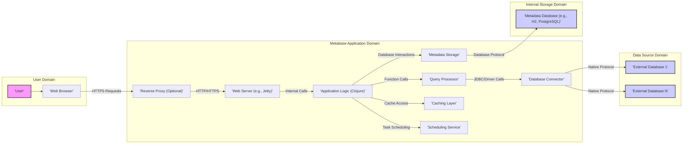

# Project Design Document: Metabase

**Version:** 1.1
**Date:** October 26, 2023
**Author:** AI Software Architect

## 1. Introduction

This document provides an enhanced architectural overview of the Metabase project, an open-source business intelligence tool. This design document is intended to serve as a robust foundation for subsequent threat modeling activities. It outlines the key components, data flows, and interactions within the Metabase system with greater detail and clarity.

## 2. Goals and Objectives

The primary goal of this document remains to provide a comprehensive and clear description of the Metabase architecture to facilitate effective threat modeling. This improved version aims to:

* Provide more granular detail on the major components of the Metabase system.
* Offer more precise descriptions of the interactions and data flows between these components, including specific protocols and data formats where relevant.
* Further highlight key security-relevant aspects of the architecture, linking them to specific components and data flows.
* Provide a more robust basis for identifying potential vulnerabilities and attack vectors.

## 3. System Architecture

Metabase is a web-based application that empowers users to connect to diverse data sources, explore data, create visualizations, and build dashboards. The core architecture is structured across the following layers:

* **Presentation Layer:**  The user interface accessed through standard web browsers, primarily utilizing HTML, CSS, and JavaScript.
* **Application Layer:** The central logic and business rules of Metabase, primarily implemented in Clojure and running on a Java Virtual Machine (JVM).
* **Data Access Layer:**  Manages connections and interactions with both external data sources (through JDBC or other specific drivers) and the internal metadata database.
* **Infrastructure Layer:** The underlying environment where the Metabase application is deployed and executed.

## 4. Data Flow

The following provides more detailed descriptions of key data flows within the Metabase system:

* **User Authentication:**
    * The User interacts with the Metabase interface via the Web Browser.
    * The Browser sends login credentials (typically username/password or SSO tokens) to the Web Server over HTTPS.
    * The Application Logic receives the credentials and authenticates the user against the stored user information in the Metadata Storage. This might involve password hashing and comparison or validation against an external identity provider.
    * Upon successful authentication, the Application Logic creates a session and sends a session cookie back to the Web Browser. Subsequent requests from the browser include this cookie for authorization.
* **Query Execution:**
    * The User constructs or triggers a query through the Web Browser interface. This could be a direct SQL query or a visual query builder interaction.
    * The Browser sends the query request (including parameters and connection details) to the Web Server via an API endpoint over HTTPS.
    * The Application Logic receives the request, performs authorization checks, and passes the query definition to the Query Processor.
    * The Query Processor analyzes the query, determines the target External Database, and utilizes the appropriate Database Connector.
    * The Database Connector establishes a connection to the External Database (using credentials stored securely or retrieved dynamically) and sends the query in the database's native query language.
    * The External Database executes the query and returns the result set to the Database Connector.
    * The Query Processor receives the results, potentially performs post-processing, and sends them back to the Application Logic.
    * The Application Logic formats the results (e.g., as JSON) and sends them to the Web Server.
    * The Web Server sends the formatted results to the Web Browser for rendering and display.
* **Saving Questions and Dashboards:**
    * The User creates or modifies a question or dashboard definition through the Web Browser interface. This definition includes query details, visualization settings, and layout information.
    * The Browser sends the question or dashboard definition (typically in JSON format) to the Web Server via an API endpoint over HTTPS.
    * The Application Logic receives the definition, performs validation and authorization checks, and stores it in the Metadata Storage. This involves serializing the definition and persisting it in the database.
* **Sharing and Permissions:**
    * The User configures sharing settings or permissions for questions, dashboards, or collections through the Web Browser interface.
    * The Browser sends the configuration data to the Web Server via an API endpoint over HTTPS.
    * The Application Logic receives the configuration, validates it, and updates the sharing and permission information in the Metadata Storage. This involves managing relationships between users, groups, and the shared items.
    * When a user attempts to access a shared item, the Application Logic retrieves the relevant permissions from the Metadata Storage to enforce access control. This involves querying the database to determine if the user has the necessary privileges.

## 5. Key Components

This section provides a more detailed description of the key components identified in the architecture diagram:

* **'User':** An individual interacting with the Metabase application through a web browser. User roles and permissions are managed within Metabase.
* **'Web Browser':** The client-side application (e.g., Chrome, Firefox, Safari) used to access the Metabase user interface. It renders HTML, CSS, and executes JavaScript code provided by the Metabase application.
* **'Reverse Proxy (Optional)':** A component like Nginx or Apache that can sit in front of the Web Server. It can provide functionalities such as:
    * **SSL Termination:** Handling HTTPS encryption and decryption.
    * **Load Balancing:** Distributing traffic across multiple Metabase instances.
    * **Request Routing:** Directing requests to the appropriate backend server.
    * **Security Features:** Implementing web application firewall (WAF) rules.
* **'Web Server (e.g., Jetty)':** The application server that hosts the compiled Metabase application (typically a JAR file). It listens for incoming HTTP/HTTPS requests and dispatches them to the Application Logic.
* **'Application Logic (Clojure)':** The core of the Metabase application, written in Clojure and running on the JVM. It handles:
    * **User Authentication and Authorization:** Verifying user identities and controlling access to resources.
    * **API Endpoints:** Providing RESTful APIs for the Web Browser to interact with.
    * **Business Logic:** Implementing the core functionalities of Metabase, such as query building, visualization creation, and dashboard management.
    * **Coordination of other components:** Orchestrating interactions between the Query Processor, Metadata Storage, and Caching Layer.
* **'Query Processor':** Responsible for:
    * **Parsing and validating user queries.**
    * **Generating database-specific SQL or other query languages.**
    * **Optimizing query execution.**
    * **Processing and formatting query results.**
* **'Metadata Storage':** A relational database (e.g., H2, PostgreSQL, MySQL) that stores Metabase's internal data, including:
    * **User accounts and credentials (hashed passwords).**
    * **Saved questions, dashboards, and collections.**
    * **Database connection details (encrypted).**
    * **Permissions and sharing settings.**
    * **Application settings and configurations.**
* **'Caching Layer':**  Used to improve performance by storing frequently accessed data in memory. This can include:
    * **Query results:** Caching the results of frequently executed queries.
    * **Metadata:** Caching information about databases, tables, and fields.
    * **Application configuration:** Caching frequently accessed configuration settings.
* **'Scheduling Service':** Manages scheduled tasks, such as:
    * **Sending out email reports or alerts.**
    * **Refreshing data in cached results.**
    * **Performing background maintenance tasks.**
* **'Database Connector':** A library or module that enables Metabase to connect to and interact with various types of external databases. These connectors typically use JDBC or other database-specific protocols.
* **'External Database 1...N':** The data sources that Metabase connects to for querying and analysis. These can be various types of relational databases, data warehouses, or other data stores.
* **'Metadata Database (e.g., H2, PostgreSQL)':** The specific database instance used for the Metadata Storage. The choice of database impacts scalability and features.

## 6. Security Considerations (Enhanced Overview)

This section expands on the initial security considerations, providing more context and detail:

* **Authentication and Authorization:**
    * **Authentication:** Metabase supports various authentication methods, including username/password, LDAP, SAML, and Google OAuth. Secure configuration and enforcement of strong password policies are crucial. Multi-factor authentication (MFA) can enhance security.
    * **Authorization:** Metabase employs a role-based access control (RBAC) system to manage permissions. Proper configuration of roles and permissions is essential to prevent unauthorized access to data and features. Row-level and column-level permissions can further restrict data access.
* **Data Encryption:**
    * **At Rest:** Sensitive data in the Metadata Storage, such as database credentials and user passwords, should be encrypted using strong encryption algorithms. Database-level encryption features should be utilized where available.
    * **In Transit:** All communication between the Web Browser and the Web Server should be encrypted using HTTPS (TLS/SSL). Internal communication between components should also be secured where sensitive data is transmitted.
* **Input Validation:**
    * The Application Logic must rigorously validate all user inputs received from the Web Browser to prevent injection attacks (e.g., SQL injection, cross-site scripting). This includes validating data types, formats, and lengths. Parameterized queries should be used to prevent SQL injection.
* **Access Control to Data Sources:**
    * Metabase relies on the underlying database's access control mechanisms. Secure configuration of database user accounts and permissions is paramount. Least privilege principles should be applied when configuring database access for Metabase. Connection credentials should be stored securely and access to them should be restricted.
* **Session Management:**
    * Secure session management practices are necessary to prevent session hijacking and unauthorized access. This includes using secure session cookies, setting appropriate session timeouts, and implementing mechanisms to prevent session fixation attacks.
* **Cross-Site Scripting (XSS) Prevention:**
    * The application must be designed to prevent XSS vulnerabilities by properly encoding user-generated content before rendering it in the Web Browser. Context-aware output encoding should be implemented.
* **Cross-Site Request Forgery (CSRF) Prevention:**
    * Mechanisms such as anti-CSRF tokens should be implemented to prevent CSRF attacks.
* **Dependency Management:**
    * Regularly updating dependencies (libraries and frameworks) is crucial to address known vulnerabilities. A robust dependency management process should be in place.
* **Administrative Interface Security:**
    * Access to the administrative interface should be strictly controlled and require strong authentication. Consider using a separate network or restricting access by IP address.
* **Logging and Auditing:**
    * Comprehensive logging of user activity, administrative actions, and security-related events is essential for monitoring and incident response. Logs should be stored securely and regularly reviewed.
* **Security Headers:**
    * Implementing security-related HTTP headers (e.g., Content Security Policy, HTTP Strict Transport Security, X-Frame-Options) can enhance the security of the application.

## 7. Assumptions and Constraints

The following assumptions and constraints remain relevant to this design document:

* **Deployment Environment:** This document assumes a typical server-based deployment of Metabase. Specific cloud deployments or containerized environments might introduce additional components and security considerations.
* **Core Functionality:** This document primarily focuses on the core functionality of Metabase related to data exploration, visualization, and dashboarding. Advanced features, embedding, and specific integrations might have additional architectural elements and security implications.
* **Standard Configuration:**  The document assumes a standard configuration of Metabase without significant customizations or extensions. Custom plugins or modifications could introduce new vulnerabilities.
* **Network Security:**  It is assumed that basic network security measures, such as firewalls and intrusion detection/prevention systems, are in place to protect the infrastructure.

## 8. Out of Scope

The following aspects are explicitly considered out of scope for this document:

* **Detailed implementation specifics of individual modules and code-level vulnerabilities.**
* **Specific deployment configurations (e.g., detailed Kubernetes manifests, specific Docker image configurations).**
* **In-depth analysis of all possible third-party integrations and plugins. This document focuses on the core Metabase architecture.**
* **Detailed performance optimization strategies and infrastructure scaling considerations.**
* **Specific details of the user interface implementation and front-end security best practices beyond general XSS prevention.**
* **Detailed code-level analysis and static/dynamic code analysis results.**
* **Specific legal and compliance requirements (e.g., GDPR, HIPAA).**

This improved design document provides a more detailed and comprehensive understanding of the Metabase architecture, serving as a stronger foundation for conducting a thorough threat model. The enhanced descriptions of components, data flows, and security considerations will be invaluable in identifying potential vulnerabilities and developing effective mitigation strategies.
