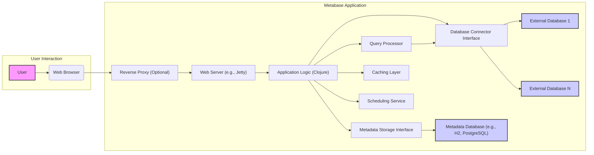

# Project Design Document: Metabase

**Version:** 1.1
**Date:** October 26, 2023
**Author:** AI Software Architect

## 1. Introduction

This document provides an enhanced architectural overview of the Metabase project, an open-source business intelligence tool. This detailed design document is specifically crafted to serve as a robust foundation for subsequent threat modeling activities. It meticulously outlines the key components, data flows, and interactions within the Metabase system, providing the necessary context for identifying potential security vulnerabilities.

## 2. Goals and Objectives

The primary goal of this document remains to provide a comprehensive and clear description of the Metabase architecture to facilitate effective threat modeling. Specifically, this document aims to:

* Clearly identify and describe the major components of the Metabase system and their responsibilities.
* Detail the interactions and data flows between these components for various user actions and system processes.
* Explicitly highlight key security-relevant aspects of the architecture, including potential attack surfaces and security controls.
* Serve as a precise and unambiguous reference point for identifying potential vulnerabilities, attack vectors, and security weaknesses during threat modeling sessions.

## 3. System Architecture

Metabase is a web-based application enabling users to connect to diverse data sources, explore data through querying, create insightful visualizations, and construct interactive dashboards. The architecture can be conceptually divided into the following layers, each with distinct responsibilities:

* **Presentation Layer:**  The user interface, primarily a single-page application accessed via standard web browsers. This layer handles user input and displays information.
* **Application Layer:** The core business logic and rules of Metabase. This layer processes user requests, orchestrates data retrieval, and manages application state.
* **Data Access Layer:**  Responsible for managing connections to both external data sources (databases, data warehouses) and the internal metadata database. This layer handles data retrieval and persistence.
* **Infrastructure Layer:** The underlying environment where the Metabase application is deployed and executed. This includes the operating system, Java Virtual Machine (JVM), and any containerization or orchestration platforms.

## 4. Data Flow

The following details key data flows within the Metabase system, illustrating how data moves between components for common operations:

* **User Authentication Flow:**
    * The "User" interacts with the "Web Browser".
    * The "Web Browser" sends login credentials (username/password or SSO token) to the "Web Server (e.g., Jetty)".
    * The "Web Server (e.g., Jetty)" forwards the authentication request to the "Application Logic (Clojure)".
    * The "Application Logic (Clojure)" retrieves user credentials from the "Metadata Database (e.g., H2, PostgreSQL)" via the "Metadata Storage Interface".
    * The "Application Logic (Clojure)" authenticates the user.
    * Upon successful authentication, the "Application Logic (Clojure)" creates a session and the "Web Server (e.g., Jetty)" sets a session cookie in the "Web Browser".
* **Query Execution Flow:**
    * The "User" formulates a query or selects a saved question in the "Web Browser".
    * The "Web Browser" sends an API request containing the query details to the "Web Server (e.g., Jetty)".
    * The "Web Server (e.g., Jetty)" routes the request to the "Application Logic (Clojure)".
    * The "Application Logic (Clojure)" passes the query to the "Query Processor".
    * The "Query Processor" identifies the target database and utilizes the appropriate "Database Connector Interface".
    * The "Database Connector Interface" interacts with the specific "External Database 1...N" using database-native protocols.
    * The "External Database 1...N" executes the query and returns the results to the "Database Connector Interface".
    * The "Database Connector Interface" passes the results back to the "Query Processor".
    * The "Query Processor" may apply post-processing and returns the data to the "Application Logic (Clojure)".
    * The "Application Logic (Clojure)" sends the results to the "Web Server (e.g., Jetty)".
    * The "Web Server (e.g., Jetty)" sends the results to the "Web Browser" for rendering.
* **Saving Questions and Dashboards Flow:**
    * The "User" creates or modifies a question or dashboard definition in the "Web Browser".
    * The "Web Browser" sends an API request containing the definition to the "Web Server (e.g., Jetty)".
    * The "Web Server (e.g., Jetty)" routes the request to the "Application Logic (Clojure)".
    * The "Application Logic (Clojure)" interacts with the "Metadata Database (e.g., H2, PostgreSQL)" via the "Metadata Storage Interface" to store or update the definition.
* **Sharing and Permissions Flow:**
    * The "User" configures sharing settings or permissions for questions or dashboards in the "Web Browser".
    * The "Web Browser" sends an API request containing the configuration to the "Web Server (e.g., Jetty)".
    * The "Web Server (e.g., Jetty)" routes the request to the "Application Logic (Clojure)".
    * The "Application Logic (Clojure)" updates the sharing and permission information in the "Metadata Database (e.g., H2, PostgreSQL)" via the "Metadata Storage Interface".
    * When another "User" attempts to access a shared item, the "Application Logic (Clojure)" retrieves the relevant permissions from the "Metadata Database (e.g., H2, PostgreSQL)" via the "Metadata Storage Interface" to enforce access control.

## 5. Key Components

This section provides a more detailed description of the key components within the Metabase architecture, elaborating on their functionalities and responsibilities:

* **User:**  An authenticated individual interacting with the Metabase application through a web browser to explore data, create visualizations, and build dashboards.
* **Web Browser:** The client-side application (typically a modern web browser) that renders the Metabase user interface and communicates with the server via HTTP/HTTPS.
* **Reverse Proxy (Optional):**  An intermediary server (e.g., Nginx, Apache HTTP Server) that can provide functionalities such as SSL termination, load balancing, request routing, and security filtering in front of the Web Server.
* **Web Server (e.g., Jetty):**  The application server (in Metabase's case, often an embedded Jetty instance) that receives HTTP requests from the browser (or reverse proxy) and dispatches them to the Application Logic. It also serves static assets.
* **Application Logic (Clojure):** The core of the Metabase application, primarily implemented in the Clojure programming language. It handles:
    * User authentication and authorization.
    * API endpoint handling.
    * Business logic for data exploration, visualization creation, and dashboard management.
    * Orchestration of interactions between other components.
* **Query Processor:**  Responsible for:
    * Receiving abstract query requests from the Application Logic.
    * Translating these requests into database-specific query languages (e.g., SQL).
    * Optimizing query execution.
    * Processing and formatting query results.
* **Metadata Storage Interface:** An abstraction layer that provides access to the underlying Metadata Database. This allows the Application Logic to interact with the metadata without being tightly coupled to a specific database implementation.
* **Caching Layer:**  A mechanism (e.g., in-memory cache, Redis) used to store frequently accessed data (e.g., query results, metadata) to improve performance and reduce database load.
* **Scheduling Service:**  Manages scheduled tasks, such as:
    * Sending out email reports and alerts.
    * Refreshing cached data.
    * Performing background maintenance tasks.
* **Database Connector Interface:** An abstraction layer that provides a consistent interface for connecting to and interacting with various types of external databases.
* **External Database 1...N:** The diverse range of data sources that Metabase can connect to, including relational databases (e.g., PostgreSQL, MySQL), data warehouses (e.g., Snowflake, BigQuery), and other data stores.
* **Metadata Database (e.g., H2, PostgreSQL):** The persistent storage for Metabase's internal data, including:
    * User accounts and permissions.
    * Saved questions and dashboards.
    * Database connection details.
    * Application settings.

## 6. Security Considerations (Detailed Overview)

This section expands on the initial security considerations, providing more specific examples and categorizing potential threats:

* **Authentication and Authorization:**
    * **Threats:** Brute-force attacks on login credentials, credential stuffing, unauthorized access due to weak passwords, privilege escalation.
    * **Considerations:** Strong password policies, multi-factor authentication (MFA), role-based access control (RBAC), secure session management, protection against session fixation and hijacking.
* **Data Encryption:**
    * **Threats:** Exposure of sensitive data (database credentials, user information, query results) if stored or transmitted without encryption.
    * **Considerations:** Encryption at rest for the Metadata Database, encryption in transit using TLS/SSL for all communication, secure storage of encryption keys.
* **Input Validation and Output Encoding:**
    * **Threats:** SQL injection, cross-site scripting (XSS), command injection, other injection vulnerabilities due to improper handling of user input.
    * **Considerations:** Strict input validation on all user-provided data, output encoding to prevent interpretation of malicious scripts, parameterized queries to prevent SQL injection.
* **Access Control to Data Sources:**
    * **Threats:** Unauthorized access to sensitive data in connected databases, data breaches due to compromised database credentials.
    * **Considerations:** Secure storage and management of database credentials, principle of least privilege for database access, network segmentation to limit access to database servers.
* **Session Management:**
    * **Threats:** Session hijacking, session fixation, unauthorized access due to insecure session handling.
    * **Considerations:** Use of secure session IDs, proper session timeout mechanisms, protection against cross-site request forgery (CSRF).
* **Cross-Site Scripting (XSS) Prevention:**
    * **Threats:** Injection of malicious scripts into the application, leading to data theft, session hijacking, or defacement.
    * **Considerations:** Proper output encoding of user-generated content, use of Content Security Policy (CSP).
* **Cross-Site Request Forgery (CSRF) Prevention:**
    * **Threats:** Unauthorized actions performed on behalf of a legitimate user without their knowledge.
    * **Considerations:** Implementation of anti-CSRF tokens.
* **Dependency Management:**
    * **Threats:** Vulnerabilities in third-party libraries and dependencies that could be exploited.
    * **Considerations:** Regular security scanning of dependencies, timely patching and updates.
* **Administrative Interface Security:**
    * **Threats:** Unauthorized access to administrative functions, leading to system compromise.
    * **Considerations:** Strong authentication for administrative users, limiting access to the administrative interface, auditing of administrative actions.
* **Logging and Monitoring:**
    * **Threats:** Difficulty in detecting and responding to security incidents without adequate logging and monitoring.
    * **Considerations:** Comprehensive logging of security-relevant events, monitoring for suspicious activity, alerting mechanisms for security incidents.

## 7. Assumptions and Constraints

The following assumptions and constraints are relevant to this design document and the subsequent threat modeling process:

* **Deployment Environment:** This document primarily considers a standard server-based deployment model for Metabase. Specific cloud deployment architectures (e.g., using managed services) might introduce additional components and security considerations not explicitly covered here.
* **Core Functionality Focus:** The scope of this document is primarily focused on the core functionalities of Metabase related to data connection, exploration, visualization, and dashboarding. Advanced features, plugins, and external integrations might introduce additional complexities.
* **Standard Configuration:**  The analysis assumes a relatively standard configuration of Metabase without significant custom code modifications or extensions. Customizations could introduce new vulnerabilities.
* **Network Security Baseline:** It is assumed that basic network security measures, such as firewalls and intrusion detection/prevention systems, are in place within the deployment environment.
* **Secure Development Practices:** It is assumed that the Metabase project follows secure development practices, including code reviews and vulnerability testing.

## 8. Out of Scope

The following aspects are explicitly considered outside the scope of this document:

* **Detailed implementation specifics of individual modules and code-level vulnerabilities.**
* **Specific deployment configurations and infrastructure details (e.g., Kubernetes manifests, Dockerfile specifics).**
* **In-depth analysis of all possible third-party integrations and plugins.**
* **Performance optimization strategies and architectural considerations for scalability.**
* **Detailed specifics of the user interface implementation and client-side security vulnerabilities.**
* **Operational procedures for maintaining and securing the Metabase instance after deployment.**

This enhanced design document provides a more detailed and structured foundation for conducting a comprehensive threat model of the Metabase project. The elaborated component descriptions, data flow diagrams, and security considerations offer a clearer understanding of the system's architecture and potential attack surfaces, facilitating a more effective threat identification and mitigation process.