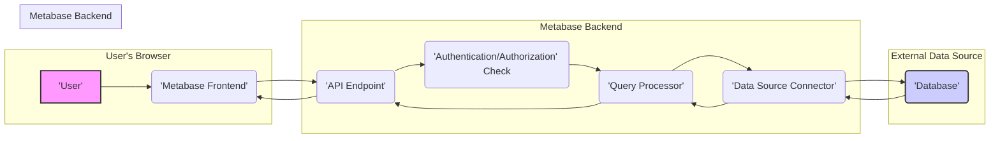
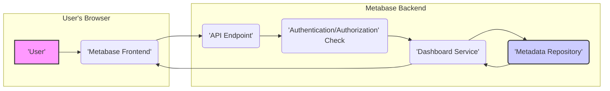
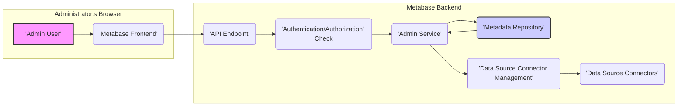

## Project Design Document: Metabase - Threat Modeling (Improved)

**Document Version:** 1.1
**Date:** October 26, 2023
**Author:** AI Software Architect

**1. Introduction**

This document provides an enhanced architectural overview of the Metabase project (as represented by the codebase at [https://github.com/metabase/metabase](https://github.com/metabase/metabase)). The primary purpose remains to serve as a robust foundation for subsequent threat modeling activities. It offers a more detailed exploration of the key components, data flows, and interactions within the Metabase application, facilitating a more granular analysis of potential security vulnerabilities. This improved version aims to provide greater clarity and depth based on a more thorough understanding of typical BI tool architectures and common implementation patterns.

**2. Goals**

*   Provide a clear, concise, and more detailed description of the Metabase architecture.
*   Identify the major components and their specific responsibilities with greater clarity.
*   Illustrate the key data flows within the system with improved diagrams and descriptions.
*   Highlight potential trust boundaries and areas of interest for security analysis with more specific examples.
*   Serve as a refined and more comprehensive reference point for threat modeling exercises.

**3. Scope**

This document covers the core application architecture of Metabase, including its frontend, backend, and database interactions, with a more detailed look at the interactions between these components. It focuses on the functionality directly related to data exploration, visualization, dashboard creation, and administrative functions.

The following are explicitly **out of scope**:

*   Specific deployment environments (e.g., Kubernetes, Docker configurations, specific cloud provider services).
*   Detailed configuration management practices and tools used for deployment.
*   Third-party integrations beyond the core database connections and standard authentication providers (e.g., specific OAuth implementations).
*   Fine-grained details of the user interface implementation, focusing on general functionality and data flow rather than specific UI elements or libraries.
*   The intricacies of the underlying JVM or JavaScript runtime environments, unless directly impacting application security.
*   Specific details of email server configurations or other external service integrations for reporting.

**4. System Overview**

Metabase is a web-based business intelligence (BI) tool enabling users to explore data, create visualizations, and build dashboards. The system comprises these key components:

*   **User Interface (Frontend):** The primary interface for user interaction, handling login, data exploration, query building, visualization creation, and dashboard management.
*   **API (Backend):** A RESTful API serving as the communication layer between the frontend and the core application logic, managing requests and responses.
*   **Query Processor:**  A more descriptive name for the component responsible for translating user-defined queries into executable commands for various data sources.
*   **Metadata Repository:**  The central store for Metabase's internal data, including user information, saved queries, dashboards, and connection details.
*   **Data Source Connectors:**  Specialized modules facilitating communication with diverse external data sources.
*   **Caching Mechanism:**  An optional layer to enhance performance by storing frequently accessed query results.
*   **Scheduling Service:**  Manages the execution of time-based tasks, such as scheduled reports and data refreshes.

**5. Detailed Component Description**

*   **User Interface (Frontend):**
    *   **Technology:**  Likely utilizes a modern JavaScript framework such as React or Vue.js, along with associated libraries for state management, routing, and UI components.
    *   **Responsibilities:**
        *   User authentication and session management using browser-based techniques (e.g., cookies, local storage).
        *   Rendering the application UI based on data received from the API.
        *   Capturing user input and interactions, translating them into API requests.
        *   Displaying interactive data visualizations using libraries like Chart.js or D3.js.
        *   Implementing client-side routing and navigation.
    *   **Potential Security Considerations:**
        *   Cross-Site Scripting (XSS) vulnerabilities due to insecure handling of user-generated content or API responses.
        *   Exposure of sensitive data in client-side storage or through insecure communication.
        *   Vulnerabilities in third-party frontend libraries.
        *   Client-side logic flaws leading to unauthorized actions.

*   **API (Backend):**
    *   **Technology:**  Potentially built using Java with frameworks like Spring Boot, or possibly other JVM-based languages like Kotlin, leveraging RESTful API principles.
    *   **Responsibilities:**
        *   Receiving and validating requests from the frontend, including authentication and authorization checks.
        *   Implementing core business logic for data exploration, visualization, and dashboard management.
        *   Orchestrating interactions between the Query Processor and Metadata Repository.
        *   Managing user sessions and enforcing authentication policies (e.g., password complexity, multi-factor authentication).
        *   Implementing role-based access control (RBAC) to manage user permissions.
    *   **Potential Security Considerations:**
        *   Authentication and authorization bypass vulnerabilities.
        *   API endpoint vulnerabilities such as injection flaws (e.g., SQL injection if constructing queries directly in the API layer), insecure direct object references (IDOR), and mass assignment issues.
        *   Insecure session management leading to session hijacking.
        *   Exposure of sensitive information through API responses (e.g., verbose error messages).
        *   Cross-Site Request Forgery (CSRF) vulnerabilities.

*   **Query Processor:**
    *   **Technology:**  Abstracts interactions with different database systems. May involve libraries like JDBC for relational databases or specific SDKs for other data sources. Could include an ORM (Object-Relational Mapper) or similar technology for abstracting database interactions.
    *   **Responsibilities:**
        *   Receiving abstract query requests from the API, often represented in an intermediate language or format.
        *   Translating these abstract queries into the specific query language of the target data source (e.g., SQL for relational databases, specific query syntax for NoSQL databases).
        *   Establishing connections to data sources using credentials retrieved from the Metadata Repository.
        *   Executing queries against connected data sources and handling potential errors.
        *   Returning query results to the API, potentially performing data transformation or aggregation.
    *   **Potential Security Considerations:**
        *   SQL injection vulnerabilities if user-provided data is not properly sanitized before being used in query construction.
        *   NoSQL injection vulnerabilities for relevant data sources.
        *   Information disclosure through error messages returned from the database.
        *   Insufficient access control checks leading to unauthorized data access.
        *   Vulnerabilities in database connector libraries.

*   **Metadata Repository:**
    *   **Technology:**  A relational database system, commonly PostgreSQL or MySQL, chosen for its reliability and transactional capabilities.
    *   **Responsibilities:**
        *   Storing user accounts, roles, permissions, and authentication credentials (hashed and salted).
        *   Persisting definitions of saved questions, dashboards, collections, and data models.
        *   Maintaining connection details for external data sources, including potentially sensitive credentials (encrypted at rest).
        *   Storing application settings, audit logs, and other configuration data.
    *   **Potential Security Considerations:**
        *   Unauthorized access to sensitive metadata, including database connection credentials, which could lead to broader data breaches.
        *   Data breaches targeting the Metadata Repository itself.
        *   Privilege escalation vulnerabilities allowing users to gain unauthorized access to metadata.
        *   Insufficient encryption of sensitive data at rest.

*   **Data Source Connectors:**
    *   **Technology:**  Specific JDBC drivers, Python libraries (e.g., `psycopg2`, `mysql-connector-python`), or other SDKs tailored to interact with various database systems, data warehouses, and cloud services.
    *   **Responsibilities:**
        *   Establishing and managing connections to external data sources based on connection details from the Metadata Repository.
        *   Authenticating with data sources using stored credentials.
        *   Translating generic query requests into data source-specific commands.
        *   Handling data type conversions and communication protocols.
    *   **Potential Security Considerations:**
        *   Vulnerabilities in connector libraries that could be exploited to gain unauthorized access to data sources.
        *   Insecure handling or storage of database credentials within the connector or the Metadata Repository.
        *   Potential for lateral movement if a data source is compromised through a vulnerability in the connector.

*   **Caching Mechanism:**
    *   **Technology:**  Could involve in-memory data stores like Redis or Memcached for fast access, or potentially a disk-based caching solution.
    *   **Responsibilities:**
        *   Storing the results of frequently executed queries to reduce database load and improve response times.
        *   Serving cached results to the frontend when available.
        *   Managing cache invalidation based on time or data changes.
    *   **Potential Security Considerations:**
        *   Exposure of sensitive data stored in the cache if not properly secured.
        *   Cache poisoning vulnerabilities where malicious data is injected into the cache.
        *   Unauthorized access to the cache contents.

*   **Scheduling Service:**
    *   **Technology:**  Likely utilizes a scheduler library within the backend framework (e.g., Quartz in Java) or an operating system-level scheduler (e.g., cron).
    *   **Responsibilities:**
        *   Executing tasks at predefined intervals or times (e.g., sending email reports, refreshing cached data, running data synchronization jobs).
        *   Managing scheduled job definitions, including parameters and execution schedules.
        *   Potentially interacting with other components, such as the Query Processor and email services.
    *   **Potential Security Considerations:**
        *   Unauthorized modification or creation of scheduled tasks, potentially leading to information disclosure or denial of service.
        *   Vulnerabilities in the scheduling mechanism allowing for arbitrary code execution if task configurations are not properly validated.
        *   Exposure of sensitive data through scheduled reports if access controls are not properly enforced.

**6. Data Flow Diagrams**

Here are refined data flow diagrams illustrating key data movement within Metabase.

*   **User Query Execution:**

*   **Dashboard Creation and Rendering:**

*   **Administrative Tasks (e.g., Adding a Database):**

**7. Security Considerations (Detailed)**

Building upon the initial thoughts, here are more detailed security considerations categorized by component:

*   **User Interface (Frontend):**
    *   Implement robust output encoding to prevent XSS vulnerabilities.
    *   Avoid storing sensitive information in local storage or cookies without proper encryption.
    *   Regularly update frontend libraries to patch known security flaws.
    *   Implement client-side input validation as a first line of defense, but always validate on the backend.
    *   Use Content Security Policy (CSP) to mitigate XSS risks.

*   **API (Backend):**
    *   Enforce strong authentication mechanisms (e.g., JWT, OAuth 2.0) and multi-factor authentication where appropriate.
    *   Implement comprehensive authorization checks at every API endpoint based on user roles and permissions.
    *   Sanitize and validate all user inputs to prevent injection attacks.
    *   Use parameterized queries or ORM features to avoid SQL injection.
    *   Protect against CSRF attacks using techniques like synchronizer tokens.
    *   Implement rate limiting and request throttling to prevent abuse.
    *   Securely manage API keys and secrets.

*   **Query Processor:**
    *   Employ parameterized queries or prepared statements exclusively to prevent SQL injection.
    *   Implement strict input validation before constructing database queries.
    *   Minimize the privileges granted to database users used by Metabase.
    *   Sanitize error messages returned from the database to avoid information disclosure.
    *   Implement row-level security or data masking where necessary to restrict data access based on user roles.

*   **Metadata Repository:**
    *   Encrypt sensitive data at rest, including database connection credentials and user passwords.
    *   Implement strong access controls to the Metadata Repository itself, limiting access to authorized services.
    *   Regularly back up the Metadata Repository to prevent data loss.
    *   Monitor access logs for suspicious activity.
    *   Enforce strong password policies for Metabase administrative users.

*   **Data Source Connectors:**
    *   Securely store and manage database credentials, ideally using a secrets management system.
    *   Keep connector libraries up-to-date to patch vulnerabilities.
    *   Implement secure communication protocols (e.g., TLS/SSL) when connecting to data sources.
    *   Follow the principle of least privilege when configuring database user accounts for Metabase.

*   **Caching Mechanism:**
    *   Secure the caching layer to prevent unauthorized access to cached data.
    *   Consider encrypting sensitive data stored in the cache.
    *   Implement mechanisms to prevent cache poisoning attacks.

*   **Scheduling Service:**
    *   Restrict access to scheduling functionalities to authorized administrators.
    *   Validate task configurations to prevent arbitrary command execution.
    *   Securely manage credentials used by scheduled tasks.
    *   Audit the creation and modification of scheduled tasks.

**8. Assumptions**

*   The codebase at the provided GitHub repository represents the core architectural principles of Metabase.
*   Secure coding practices are generally followed in the development of Metabase.
*   Communication between the frontend and backend is secured using HTTPS with valid certificates.
*   External data sources have their own security mechanisms in place.

**9. Next Steps**

This improved design document provides a more detailed and nuanced understanding of the Metabase architecture, enhancing the foundation for a comprehensive threat modeling exercise. The subsequent steps involve:

*   Conducting a structured threat modeling session using methodologies like STRIDE or PASTA.
*   Identifying specific threats targeting each component and data flow based on the detailed descriptions.
*   Analyzing the potential impact and likelihood of each identified threat.
*   Developing and documenting mitigation strategies to address the identified risks.
*   Prioritizing security efforts based on the risk assessment and business impact.
*   Regularly reviewing and updating this design document and the threat model as the application evolves.
