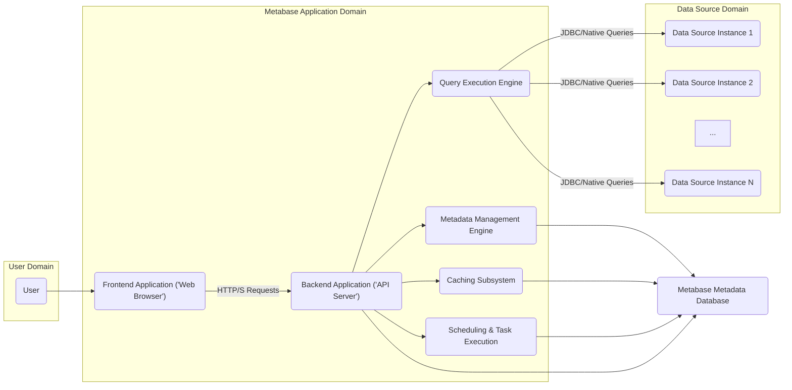
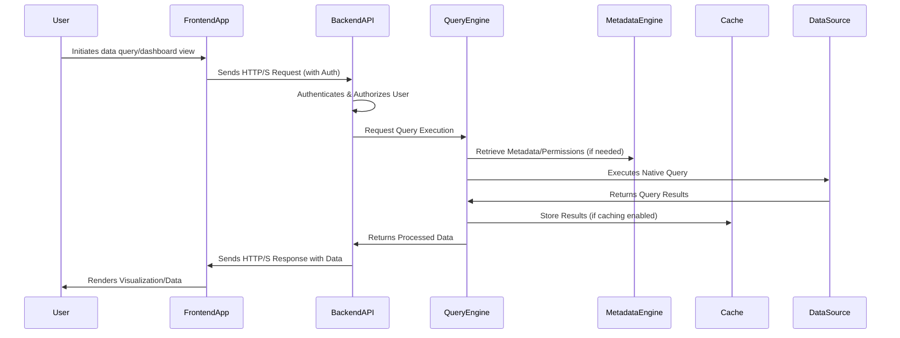
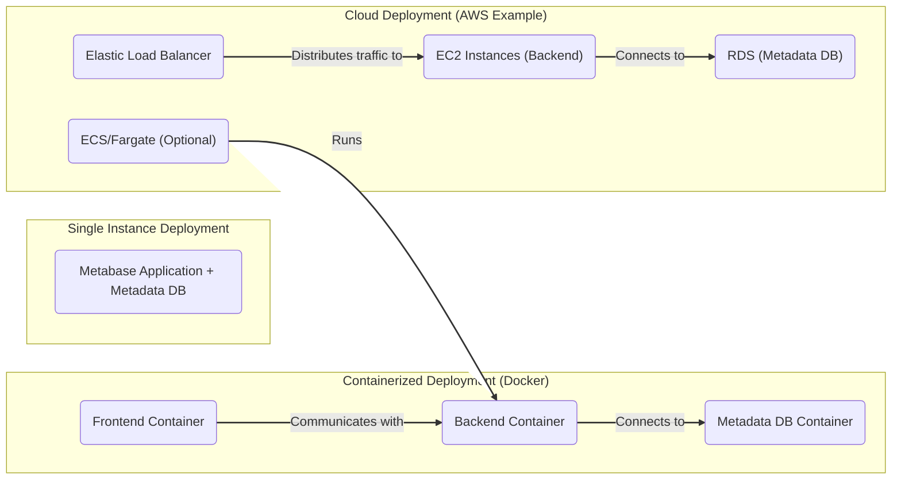

# Project Design Document: Metabase

**Version:** 1.1
**Date:** October 26, 2023
**Author:** AI Software Architect

## 1. Introduction

This document provides a detailed architectural design of the Metabase project, an open-source business intelligence and data visualization tool. This design aims to provide a comprehensive understanding of the system's components, interactions, data flow, and deployment considerations. This document will serve as the foundation for subsequent threat modeling activities, providing the necessary context and details about the system's inner workings.

## 2. Goals and Objectives

The primary goals of Metabase are to:

*   Provide an intuitive and user-friendly interface for exploring and visualizing data from various sources.
*   Empower non-technical users to formulate questions and derive insights from data without requiring direct SQL knowledge through a guided query interface.
*   Offer a collaborative platform for creating, sharing, and managing interactive dashboards and data insights.
*   Support seamless connections to a diverse range of data sources, including relational databases, cloud data warehouses, and more.
*   Implement robust user management and fine-grained permissioning capabilities to control access to data and features.

## 3. High-Level Architecture

Metabase employs a standard web application architecture, comprising a frontend user interface, a backend application server, and a metadata database. It interacts with external data sources to retrieve and process analytical data.

## 4. Detailed Component Architecture

The Metabase application can be dissected into the following core components:

*   **Frontend Application (Web Browser):**
    *   Technology: Primarily built using React and associated JavaScript/TypeScript libraries (e.g., Redux, various UI component libraries).
    *   Responsibility: Provides the interactive user interface for all Metabase functionalities.
    *   Responsibility: Handles user authentication and authorization flows, managing user sessions.
    *   Responsibility: Renders dynamic dashboards, data visualizations (charts, tables), and data exploration tools.
    *   Responsibility: Communicates with the Backend Application via asynchronous HTTP/S requests (typically JSON payloads).

*   **Backend Application (API Server):**
    *   Technology: Implemented predominantly in Clojure, leveraging libraries like Ring (for HTTP handling), Compojure (for routing), and various data access libraries.
    *   Responsibility: Serves as the central communication hub for the Frontend Application.
    *   Responsibility: Enforces authentication and authorization policies for all incoming requests.
    *   Responsibility: Receives requests from the Frontend and orchestrates the necessary operations by interacting with other internal components.
    *   Responsibility: Provides a RESTful API with endpoints for user management, data source management, query creation and execution, dashboard management, alerting, and more.

*   **Query Execution Engine:**
    *   Technology: Primarily Clojure, with integrations for specific database drivers (JDBC).
    *   Responsibility: Translates user-defined queries (expressed through the UI or API) into native query language (e.g., SQL) specific to the connected data sources.
    *   Responsibility: Manages the execution of these queries against the data sources.
    *   Responsibility: Handles query optimization where possible and manages connections to various data source types via appropriate drivers.
    *   Responsibility: May perform intermediate data processing or transformations as needed.

*   **Metadata Management Engine:**
    *   Technology: Clojure, interacting with the Metabase Metadata Database.
    *   Responsibility: Manages all metadata related to connected data sources and Metabase objects.
    *   Responsibility: Stores and retrieves information about database schemas, tables, columns, user-defined models, segments, metrics, and permissions.
    *   Responsibility: Enforces access controls based on user roles and permissions.

*   **Caching Subsystem:**
    *   Technology: Can utilize various caching mechanisms (e.g., in-memory caches like Caffeine, distributed caches like Redis), configurable via settings.
    *   Responsibility: Improves performance by caching frequently accessed query results and metadata.
    *   Responsibility: Reduces the load on connected data sources by serving cached data.
    *   Responsibility: Implements cache invalidation strategies based on data changes or time-to-live configurations.

*   **Scheduling & Task Execution:**
    *   Technology: Clojure, potentially leveraging libraries for scheduling (e.g., Quartz).
    *   Responsibility: Manages scheduled tasks such as refreshing cached data, sending out alerts, and performing other background operations.
    *   Responsibility: Stores scheduling information and task definitions in the Metabase Metadata Database.

## 5. Key Components in Detail

*   **Frontend Application:**
    *   Employs a component-based architecture using React, promoting reusability and maintainability.
    *   Manages application state using a state management library (e.g., Redux or similar).
    *   Handles user interactions and updates the UI reactively based on data changes.
    *   Implements client-side validation and user interface logic.

*   **Backend Application (Clojure):**
    *   Utilizes middleware for handling cross-cutting concerns like logging, authentication, and request processing.
    *   Implements business logic for various features, including query building, dashboard creation, and user management.
    *   Interacts with the Metabase Metadata Database for persistent storage.
    *   Integrates with external services for authentication (e.g., LDAP, SAML) and email notifications.

*   **Query Execution Engine:**
    *   Abstracts the complexities of different database dialects, providing a consistent interface for the Backend Application.
    *   May employ query rewriting or optimization techniques to improve performance.
    *   Relies on JDBC drivers or native database connectors to communicate with data sources.
    *   Enforces data access permissions defined in the Metadata Management Engine.

*   **Metadata Management Engine:**
    *   Provides an abstraction layer over the physical database schemas, allowing users to define more user-friendly names and descriptions.
    *   Manages relationships between tables and fields, enabling more intuitive data exploration.
    *   Stores definitions of user-defined metrics, segments, and models.

*   **Caching Subsystem:**
    *   Offers configurable caching strategies, allowing administrators to tune performance based on their specific needs.
    *   May cache at different levels (e.g., individual query results, dashboard data).
    *   Implements mechanisms to ensure data consistency between the cache and the underlying data sources.

*   **Scheduling & Task Execution:**
    *   Allows users to define schedules for refreshing data or triggering alerts based on data conditions.
    *   Manages the execution of these scheduled tasks in the background.
    *   Provides mechanisms for monitoring the status of scheduled tasks.

## 6. Data Flow

The typical data flow for a user querying data and viewing results in Metabase involves the following steps:

1. **User Action:** A user interacts with the Frontend Application (web browser) to formulate a question, explore data, or view a dashboard.
2. **Frontend Request:** The Frontend Application sends an HTTP/S request to the Backend Application's API, specifying the desired action (e.g., execute a query, retrieve dashboard data). The request typically includes authentication credentials or a session token.
3. **Authentication and Authorization:** The Backend Application receives the request and authenticates the user. It then authorizes the user to perform the requested action based on their roles and permissions.
4. **Query Processing Orchestration:** The Backend Application routes the request to the appropriate internal component. For data queries, it interacts with the Query Execution Engine.
5. **Metadata Retrieval (If Necessary):** The Query Execution Engine may consult the Metadata Management Engine to retrieve schema information, user-defined models, or permission details relevant to the query.
6. **Native Query Generation:** The Query Execution Engine translates the user's request into a native query (e.g., SQL) suitable for the target Data Source.
7. **Data Source Interaction:** The Query Execution Engine establishes a connection to the specified Data Source (using JDBC or a native connector) and executes the generated query.
8. **Data Retrieval:** The Data Source executes the query and returns the result set to the Query Execution Engine.
9. **Caching (Optional):** The Query Execution Engine may store the query results in the Caching Subsystem based on configured caching policies.
10. **Data Transformation and Formatting (If Necessary):** The Query Execution Engine may perform some data transformation or formatting before returning the results.
11. **Backend Response:** The Query Execution Engine returns the processed data to the Backend Application.
12. **Frontend Response:** The Backend Application sends an HTTP/S response back to the Frontend Application, containing the query results (typically in JSON format).
13. **Rendering:** The Frontend Application receives the data and renders the visualization (chart, table) or displays the results to the user.

## 7. Security Considerations

Security is paramount for Metabase, given its access to potentially sensitive data. Key considerations include:

*   **Authentication Mechanisms:**
    *   Local username/password authentication with secure password hashing (e.g., bcrypt).
    *   Integration with external authentication providers via protocols like LDAP, SAML, and OAuth 2.0.
    *   Support for multi-factor authentication (MFA) for enhanced security.

*   **Authorization and Access Control:**
    *   Role-Based Access Control (RBAC) to manage user permissions at different levels (e.g., data source access, feature access).
    *   Granular permissions on data sources, databases, tables, and individual saved questions and dashboards.
    *   Mechanisms for defining data access policies and enforcing them during query execution.

*   **Data Source Credential Management:**
    *   Secure storage of data source connection credentials, ideally encrypted at rest.
    *   Options for using credential vaults or secrets management services.
    *   Regular rotation of data source credentials.

*   **Input Validation and Sanitization:**
    *   Strict validation of all user inputs on both the frontend and backend to prevent injection attacks (e.g., SQL injection, Cross-Site Scripting - XSS).
    *   Proper sanitization of user-provided data before being used in queries or displayed in the UI.
    *   Protection against Cross-Site Request Forgery (CSRF) attacks.

*   **Data Security in Transit:**
    *   Enforcement of HTTPS for all communication between the Frontend Application and the Backend Application to encrypt data in transit.
    *   Utilizing secure connections (e.g., TLS/SSL) when connecting to data sources, where supported.

*   **Data Security at Rest:**
    *   Encryption of the Metabase Metadata Database, especially sensitive information like data source credentials and user information.
    *   Secure storage and encryption of backups.

*   **Session Management:**
    *   Securely managing user sessions using HTTP cookies or tokens.
    *   Implementing appropriate session timeouts to limit the window of opportunity for session hijacking.
    *   Protection against session fixation attacks.

*   **Logging and Auditing:**
    *   Comprehensive logging of user actions, API requests, and system events for auditing and security monitoring.
    *   Tracking data access and modifications.

*   **Dependency Security:**
    *   Regularly updating dependencies (libraries and frameworks) to patch known security vulnerabilities.
    *   Utilizing tools for dependency scanning and vulnerability management.

*   **Deployment Security:**
    *   Following security best practices for deploying web applications, including secure server configuration, firewalls, and intrusion detection systems.
    *   Regular security assessments and penetration testing.

## 8. Deployment Architecture

Metabase offers flexibility in deployment options:

*   **Single Instance Deployment:** All components (Frontend Application, Backend Application, Metabase Metadata Database) are deployed on a single server. Suitable for small teams, development, or testing environments.

*   **Containerized Deployment (Docker/Kubernetes):** Components are packaged into Docker containers, facilitating easier deployment, scaling, and management. Orchestration platforms like Kubernetes can be used for managing containerized deployments.

*   **Cloud-Based Deployment:** Metabase can be deployed on various cloud platforms (e.g., AWS, Azure, GCP) leveraging managed services for databases (e.g., RDS, Azure SQL), container orchestration (e.g., ECS, AKS, GKE), and other infrastructure components.

*   **Clustered Deployment:** For high availability and scalability, the Backend Application can be deployed in a cluster behind a load balancer, sharing a common Metabase Metadata Database. This setup can handle increased user load and provide redundancy.

## 9. Future Considerations

*   **Enhanced Data Governance and Lineage Tracking:** Implementing features to track the origin and transformations of data within Metabase.
*   **Integration with Data Catalogs:** Connecting with external data catalogs for improved data discovery and metadata management.
*   **Advanced Analytics and Machine Learning Integrations:** Providing tighter integration with machine learning platforms and tools for advanced analytics workflows.
*   **Improved Collaboration and Sharing Features:** Enhancing features for sharing insights, collaborating on data analysis, and embedding visualizations in other applications.
*   **More Granular Security Controls:** Exploring options for row-level and column-level security to further restrict data access.
*   **Extensibility through Plugins or APIs:** Developing a more robust plugin architecture or extending the existing APIs to allow for greater customization and integration with other systems.

This revised document provides a more detailed and comprehensive architectural overview of the Metabase project, incorporating specific technologies and expanding on security considerations. This enhanced level of detail will be beneficial for conducting thorough threat modeling activities.