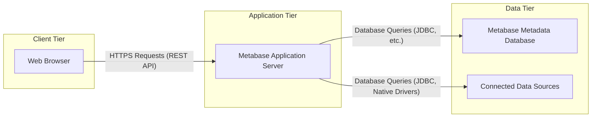

# Project Design Document: Metabase - Open Source Business Intelligence Tool

**Version:** 1.1
**Date:** 2023-10-27
**Author:** AI Expert

## 1. Introduction

This document provides a refined design overview of Metabase, an open-source business intelligence and analytics tool. Building upon the initial design document, this version aims for enhanced clarity, detail, and a stronger focus on security considerations relevant for threat modeling. It serves as a comprehensive resource for security analysis of the Metabase project, detailing system architecture, components, data flow, deployment options, and security aspects. This document is based on publicly available information and the architecture of Metabase as of October 2023, primarily derived from the project's GitHub repository: [https://github.com/metabase/metabase](https://github.com/metabase/metabase).

## 2. Project Overview

Metabase empowers users to explore data, create insightful dashboards, and derive business intelligence without requiring deep technical expertise. Its key strength lies in its user-friendly interface and broad connectivity to diverse data sources, ranging from traditional databases to modern data warehouses and cloud services. Metabase democratizes data access and analysis, making data-driven decision-making accessible across organizations.

**Key Features:**

*   **Broad Data Connectivity:** Supports a wide array of databases and data warehouses including PostgreSQL, MySQL, Snowflake, BigQuery, MongoDB, Amazon Redshift, Google Analytics, and more.
*   **Intuitive Data Exploration:** Offers a no-code query builder and a natural language "Ask a question" interface for easy data exploration.
*   **Interactive Dashboards:** Enables the creation of dynamic dashboards with various visualization types (charts, tables, maps) and interactive filters.
*   **Advanced SQL Editor:** Provides a fully featured SQL editor for users who prefer writing custom queries.
*   **RESTful API:** Exposes a comprehensive REST API for programmatic interaction, automation, and integration with other applications.
*   **Robust User Management & Permissions:** Features granular user and group management with role-based access control to manage data and feature access.
*   **Alerting & Scheduling:** Allows users to set up data alerts and schedule automated report delivery via email or Slack.
*   **Open Source & Extensible:**  Licensed under AGPLv3, fostering community contributions, transparency, and customization through plugins and extensions.
*   **Embeddable Dashboards:**  Allows embedding dashboards and visualizations into external websites and applications.

## 3. System Architecture

Metabase adopts a standard three-tier web application architecture, separating concerns into distinct layers:

*   **Presentation Layer (Client Tier):** User interaction via web browsers.
*   **Business Logic Layer (Application Tier):** Core Metabase server handling requests and logic.
*   **Data Storage Layer (Data Tier):**  Metadata storage and connections to external data sources.



**3.1. Client Tier - Web Browser**

*   **Technology:** JavaScript, React framework for a dynamic and responsive user interface.
*   **Functionality:**
    *   Serves as the primary user interface for all Metabase features and functionalities.
    *   Handles user input, displays data visualizations, and manages user interactions.
    *   Communicates with the Application Tier exclusively through secure HTTPS REST API calls.
    *   Does not have direct access to the Data Tier, ensuring security and separation of concerns.

**3.2. Application Tier - Metabase Application Server**

*   **Technology:** Java (Clojure) runtime environment on a JVM, leveraging the robustness and scalability of the Java ecosystem.
*   **Functionality:**
    *   **API Gateway & Request Handling:** Acts as the entry point, receiving and routing requests from the Client Tier to appropriate backend services.
    *   **Authentication & Authorization Service:** Manages user identity verification (authentication) through various methods and enforces access control policies (authorization) based on roles and permissions.
    *   **Core Business Logic Engine:** Implements the central logic of Metabase, encompassing:
        *   Query parsing, optimization, and execution across diverse data sources.
        *   Data visualization rendering and generation in various formats.
        *   Dashboard lifecycle management (creation, modification, sharing).
        *   User, group, and permission administration and enforcement.
        *   Metadata management for questions, dashboards, collections, and data sources.
    *   **Data Source Connector Framework:** Provides a modular framework for connecting to different data sources using JDBC drivers or optimized native drivers.
    *   **Caching Mechanisms:** Implements caching strategies (e.g., query result caching, metadata caching) to enhance performance and reduce database load.
    *   **Logging, Monitoring, and Auditing:** Provides comprehensive logging for application events, monitoring for performance and health, and audit trails for security and compliance.
    *   **Scheduling & Alerting Engine:** Manages scheduled tasks for report generation, data refresh, and triggers alerts based on predefined conditions.

**3.3. Data Tier**

*   **3.3.1. Metabase Metadata Database:**
    *   **Technology:**  Defaults to embedded H2 database (suitable for development and small deployments), but strongly recommends robust databases like PostgreSQL, MySQL, or MariaDB for production environments. Supports any JDBC-compatible database.
    *   **Functionality:** Persistently stores critical Metabase application metadata, including:
        *   User accounts, credentials (hashed), roles, and group memberships.
        *   Fine-grained permissions defining access to data, features, and functionalities.
        *   Definitions of dashboards, questions, collections, and data visualizations.
        *   Data source connection configurations, including connection strings and potentially encrypted credentials.
        *   Application settings, configurations, and preferences.
        *   Audit logs recording user activities and system events for security and compliance.

*   **3.3.2. Connected Data Sources:**
    *   **Technology:**  A heterogeneous landscape of database systems, data warehouses, cloud analytics services, and more (e.g., PostgreSQL, MySQL, Snowflake, BigQuery, MongoDB, Druid, Google Analytics, etc.).
    *   **Functionality:**  Holds the actual business data that users analyze, explore, and visualize using Metabase.
    *   **Connectivity:** Metabase establishes connections to these data sources using standard JDBC drivers or optimized native connectors, respecting the data source's native security mechanisms.

## 4. Data Flow - Query Execution Example

This section details the data flow for a typical user query initiated from the web browser:

```mermaid
graph LR
    A["Web Browser"] --> B["Metabase Application Server"]: "User initiates query (e.g., dashboard load, question run)"
    B --> C["Authentication & Authorization"]: "Verify user identity and permissions for requested data/action"
    C --> B: "Access Grant/Deny decision"
    B --> D["Query Processor"]: "Parse user request, generate optimized database query (SQL or native)"
    D --> E["Data Source Connector"]: "Establish connection to target data source using stored credentials"
    E --> F["Connected Data Source"]: "Execute generated query on the data source"
    F --> E: "Return query results (raw data)"
    E --> D: "Receive and process query results"
    D --> G["Data Visualization Engine"]: "Transform data, generate visualizations (charts, tables)"
    G --> B: "Prepare data and visualization instructions for client"
    B --> A: "Send data, visualization instructions, and UI updates (JSON over HTTPS)"
    A --> A: "Render visualizations and display results to the user"
```

**Detailed Data Flow Steps:**

1.  **User Action & Request Initiation:** A user interacts with the Metabase web interface, triggering a data retrieval operation (e.g., loading a dashboard, running a saved question, exploring data).
2.  **HTTPS API Request:** The browser sends an HTTPS request to the Metabase Application Server's REST API endpoint. This request encapsulates the user's action and necessary parameters in a structured format (e.g., JSON).
3.  **Authentication and Authorization Enforcement:** The Application Server's Authentication & Authorization module intercepts the request. It verifies the user's identity (authentication) using configured mechanisms and then checks if the user has sufficient privileges (authorization) to access the requested data and perform the intended action.
4.  **Query Processing & Generation:** Upon successful authorization, the Query Processor module takes over. It parses the user's request, translates it into an optimized database-specific query (typically SQL, but could be native query language for NoSQL databases), considering data source capabilities and performance.
5.  **Data Source Connection & Query Execution:** The Data Source Connector module utilizes stored connection details and potentially encrypted credentials from the Metadata Database to establish a secure connection to the target data source. The generated query is then transmitted and executed on the connected data source.
6.  **Data Retrieval from Source:** The connected data source processes the query and returns the result set (raw data) back to the Data Source Connector.
7.  **Data Processing & Transformation:** The Application Server receives the raw data. It may perform further processing, aggregation, filtering, or transformation of the data as required by the user's request or visualization needs.
8.  **Visualization Generation:** The Data Visualization Engine module takes the processed data and generates appropriate data visualizations (charts, graphs, tables, maps) based on the query type, user preferences, and dashboard configurations.
9.  **Response Preparation & Transmission:** The Application Server packages the processed data, visualization instructions (describing how to render visualizations), and UI update commands into a JSON response. This response is then sent back to the web browser over the secure HTTPS connection.
10. **Client-Side Rendering & Display:** The web browser receives the JSON response. JavaScript code within the browser interprets the visualization instructions and data, rendering the visualizations and updating the user interface to display the query results to the user.

## 5. Security Considerations (Threat Modeling Focus)

This section outlines key security areas within Metabase, crucial for identifying potential threats and vulnerabilities during threat modeling exercises.

**5.1. Authentication and Authorization:**

*   **Authentication Mechanisms & Threats:**
    *   **Username/Password (Local DB):** Vulnerable to brute-force attacks, credential stuffing, weak password usage. Requires strong password policies and potentially rate limiting.
    *   **LDAP/Active Directory:** Relies on external directory service security. Vulnerabilities in LDAP/AD configuration or infrastructure can be exploited.
    *   **Google OAuth/SAML SSO:**  Security depends on the SSO provider's security. Potential for misconfiguration, account takeover if SSO provider is compromised.
    *   **API Tokens:**  If tokens are not securely generated, stored, and rotated, they can be compromised and used for unauthorized API access.
    *   **Threats:** Brute-force attacks, credential stuffing, dictionary attacks, phishing attacks targeting user credentials, session hijacking, insecure session management.
*   **Authorization Model & Threats:**
    *   **Role-Based Access Control (RBAC):**  Complex RBAC configurations can lead to misconfigurations, unintended privilege escalation, or overly permissive access.
    *   **Granular Permissions:** While granular permissions are beneficial, managing them effectively is crucial. Incorrectly assigned permissions can lead to unauthorized data access or actions.
    *   **Data Source Permissions Sync:** Ensuring Metabase permissions are aligned and synchronized with underlying data source permissions is vital to prevent bypassing Metabase's access controls.
    *   **Threats:** Privilege escalation, horizontal and vertical privilege escalation, insecure direct object references (IDOR) in API endpoints, authorization bypass vulnerabilities, information disclosure due to misconfigured permissions.

**5.2. Data Source Security:**

*   **Connection Security & Threats:**
    *   **Credential Storage:** Metabase stores data source connection details, including credentials, in its metadata database. If this database is compromised, data source credentials could be exposed.  Insecure storage (e.g., plaintext) is a critical vulnerability.
    *   **Credential Encryption:**  Weak or improper encryption of data source credentials at rest and in transit can lead to exposure.
    *   **Connection String Injection:**  If connection string parameters are not properly sanitized, attackers might be able to inject malicious parameters.
    *   **Threats:** Data exfiltration through compromised credentials, unauthorized access to sensitive data sources, lateral movement to other systems via data source connections, man-in-the-middle attacks if connections are not properly secured (e.g., using TLS/SSL).
*   **Data Source Access Control & Threats:**
    *   **SQL Injection:** If Metabase allows users to write raw SQL queries or if query generation is not properly parameterized, it could be vulnerable to SQL injection attacks, potentially leading to data breaches or data manipulation.
    *   **NoSQL Injection:** Similar to SQL injection, vulnerabilities can exist in NoSQL query generation if input is not properly sanitized.
    *   **Data Exfiltration via Queries:**  Even with proper access controls, users with sufficient permissions might be able to craft queries to exfiltrate large amounts of sensitive data.
    *   **Threats:** SQL injection, NoSQL injection, data exfiltration, data manipulation, denial of service against data sources.
*   **JDBC/Driver Security & Threats:**
    *   **Driver Vulnerabilities:**  JDBC drivers and native database connectors themselves can contain security vulnerabilities. Outdated or unpatched drivers pose a risk.
    *   **Malicious Drivers:**  In a supply chain attack scenario, malicious JDBC drivers could be introduced, potentially compromising Metabase and connected data sources.
    *   **Threats:** Remote code execution through driver vulnerabilities, data interception, data manipulation, denial of service.

**5.3. Web Application Security:**

*   **Common Web Vulnerabilities & Threats (OWASP Top 10):**
    *   **Cross-Site Scripting (XSS):**  If user-supplied data is not properly sanitized before being displayed in the web interface, XSS vulnerabilities can arise, allowing attackers to inject malicious scripts.
    *   **Cross-Site Request Forgery (CSRF):**  Without proper CSRF protection, attackers could potentially trick authenticated users into performing unintended actions on the Metabase application.
    *   **SQL Injection (Revisited):**  As mentioned earlier, SQL injection remains a relevant web application vulnerability if raw SQL queries are allowed or query generation is flawed.
    *   **Insecure Deserialization:** If Metabase uses deserialization of untrusted data, it could be vulnerable to insecure deserialization attacks, potentially leading to remote code execution.
    *   **Security Misconfiguration:**  Default configurations, exposed administrative interfaces, or unnecessary services can create attack vectors.
    *   **Insufficient Logging and Monitoring:**  Lack of adequate logging and monitoring hinders incident detection and response.
    *   **Threats:** Account takeover, data theft, defacement, malware distribution, denial of service, remote code execution.
*   **API Security & Threats:**
    *   **API Authentication & Authorization Bypass:** Vulnerabilities in API authentication or authorization mechanisms could allow unauthorized access to API endpoints and functionalities.
    *   **API Rate Limiting & DoS:** Lack of rate limiting on API endpoints can make Metabase susceptible to denial-of-service attacks.
    *   **API Input Validation:** Insufficient input validation on API requests can lead to various vulnerabilities, including injection attacks and data manipulation.
    *   **Threats:** Unauthorized data access, data manipulation via API, denial of service, API abuse, information disclosure.

**5.4. Data Privacy and Compliance:**

*   **Handling Sensitive Data & Compliance Risks:**
    *   **Data Masking/Anonymization:** Lack of built-in data masking or anonymization features might make it challenging to comply with data privacy regulations when displaying sensitive data.
    *   **Data Residency & Location:**  Depending on deployment and data source locations, data residency requirements of regulations like GDPR might need to be considered.
    *   **Audit Logging for Compliance:**  Inadequate audit logging might hinder compliance with regulations requiring audit trails of data access and processing.
    *   **Threats:** Data breaches leading to regulatory fines, reputational damage, loss of customer trust, non-compliance with data privacy regulations (GDPR, HIPAA, CCPA, etc.).

**5.5. Infrastructure Security:**

*   **Server Security & Threats:**
    *   **Operating System Vulnerabilities:** Unpatched operating systems hosting Metabase servers are vulnerable to OS-level exploits.
    *   **Network Security Misconfigurations:**  Open ports, weak firewall rules, or insecure network configurations can expose Metabase to network-based attacks.
    *   **Threats:** Server compromise, data breaches, denial of service, lateral movement within the network.
*   **Dependency Management & Threats:**
    *   **Vulnerable Dependencies:** Metabase relies on numerous third-party libraries and dependencies. Vulnerabilities in these dependencies can be exploited.
    *   **Supply Chain Attacks:** Compromised dependencies or build pipelines could introduce malicious code into Metabase.
    *   **Threats:** Remote code execution through vulnerable dependencies, data breaches, denial of service, supply chain compromise.
*   **Deployment Security & Threats:**
    *   **Insecure Deployment Practices:**  Using default configurations, running Metabase with excessive privileges, or exposing unnecessary services can increase the attack surface.
    *   **Lack of Security Updates:**  Failure to apply security updates and patches promptly leaves Metabase vulnerable to known exploits.
    *   **Threats:** Security misconfiguration vulnerabilities, exposure of sensitive information, exploitation of known vulnerabilities, unauthorized access.

## 6. Technology Stack Summary

*   **Backend:** Java (Clojure), JVM
*   **Frontend:** JavaScript, React
*   **Metadata Database:** H2 (default - development), PostgreSQL, MySQL, MariaDB, and other JDBC-compatible databases (production)
*   **Data Source Connectivity:** JDBC, Native Database Drivers
*   **API:** RESTful API (JSON over HTTPS)
*   **Authentication:** Username/Password, LDAP, Active Directory, Google OAuth, SAML SSO, API Tokens
*   **Deployment Options:** Self-hosted (on-premise, cloud VMs), Cloud platforms (AWS, Azure, GCP)

## 7. Future Considerations

*   **Scalability and Performance Enhancements:**  Continued focus on optimizing performance for large datasets and high user concurrency, exploring distributed architectures and caching strategies.
*   **Advanced Security Features Roadmap:**  Prioritizing and implementing advanced security features such as:
    *   Data encryption at rest for metadata and potentially sensitive data in connected sources (where applicable and feasible).
    *   More granular and attribute-based access control (ABAC) models.
    *   Integration with threat intelligence feeds and security information and event management (SIEM) systems.
    *   Enhanced data masking and anonymization capabilities.
*   **Cloud-Native Deployments & Managed Service:**  Further optimization for cloud environments, exploring containerization (Docker, Kubernetes), serverless deployments, and potentially offering a managed Metabase cloud service.
*   **Plugin Ecosystem Expansion:**  Growing the plugin ecosystem to extend Metabase functionality and security features through community contributions and third-party integrations.

This enhanced design document provides a more detailed and security-focused overview of Metabase. It serves as a robust foundation for conducting thorough threat modeling, identifying potential security risks, and developing mitigation strategies to strengthen the overall security posture of Metabase deployments.