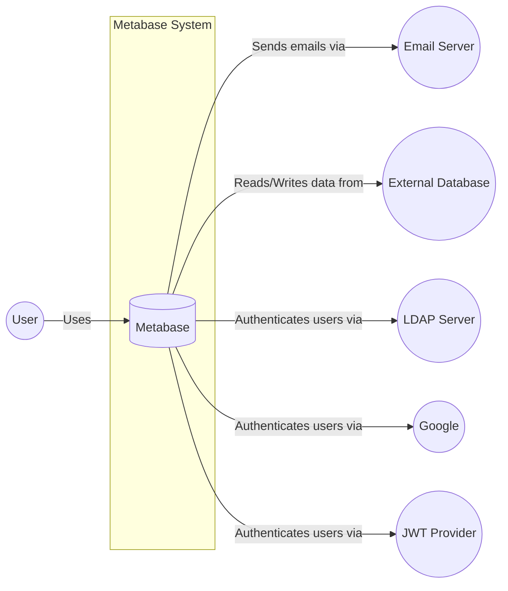
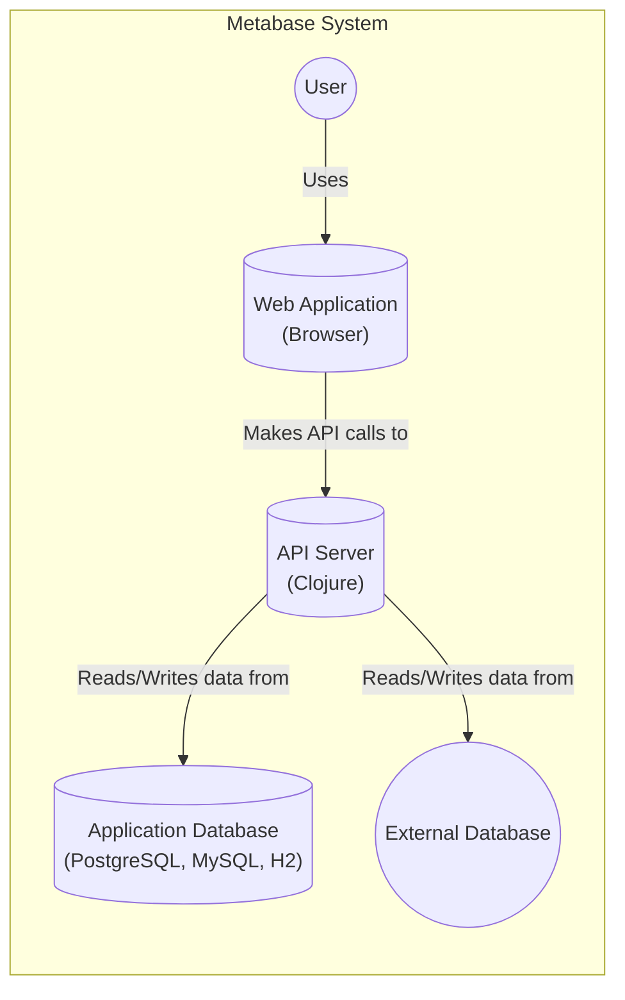
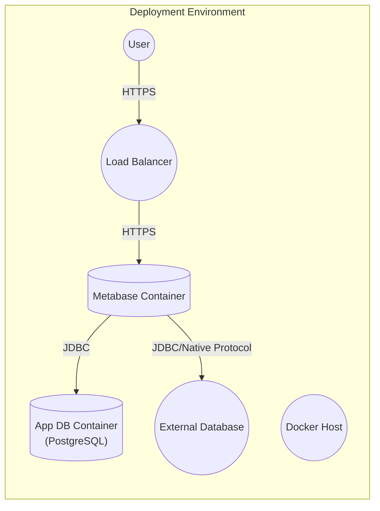
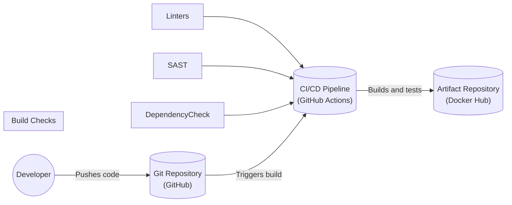

Okay, let's create a design document for the Metabase project, focusing on aspects relevant to threat modeling.

# BUSINESS POSTURE

Metabase is an open-source business intelligence (BI) tool that allows users to explore and visualize data from various sources. It aims to democratize data access within organizations, enabling even non-technical users to create dashboards and ask questions of their data.

Business Priorities:

*   Ease of use and accessibility: Metabase's primary goal is to make data analysis accessible to everyone, regardless of their technical skills.
*   Data democratization: Empowering users across the organization to access and understand data.
*   Scalability and performance: Handling growing data volumes and user bases efficiently.
*   Integration with diverse data sources: Supporting a wide range of databases and data warehouses.
*   Open-source community and ecosystem: Fostering a vibrant community and encouraging contributions.
*   Security and data privacy: Protecting sensitive data and ensuring compliance with relevant regulations.

Business Goals:

*   Provide a user-friendly BI tool that simplifies data exploration.
*   Enable data-driven decision-making across the organization.
*   Offer a cost-effective alternative to proprietary BI solutions.
*   Maintain a strong open-source community.

Most Important Business Risks:

*   Data breaches and unauthorized access: Given that Metabase handles potentially sensitive business data, unauthorized access or data leakage is a critical risk.
*   Data integrity issues: Incorrect or manipulated data could lead to flawed insights and poor decision-making.
*   Availability and performance bottlenecks: If Metabase is slow or unavailable, it disrupts business operations and data analysis workflows.
*   Compliance violations: Failure to comply with data privacy regulations (e.g., GDPR, CCPA) could result in significant penalties.
*   Supply chain vulnerabilities: As an open-source project with dependencies, vulnerabilities in third-party libraries could expose Metabase to attacks.
*   Misconfiguration and user error: Incorrectly configured security settings or user mistakes could lead to data exposure.

# SECURITY POSTURE

Existing Security Controls (based on the GitHub repository and general knowledge of Metabase):

*   security control: Authentication: Metabase supports various authentication methods, including email/password, LDAP, Google Sign-In, and JWT. (Implemented in backend codebase and configuration settings).
*   security control: Authorization: Role-based access control (RBAC) is implemented to manage user permissions and data access. (Implemented in backend codebase and database schema).
*   security control: Data encryption in transit: HTTPS is enforced to encrypt communication between the client and the server. (Configured via environment variables or application settings).
*   security control: Data encryption at rest: Metabase itself doesn't directly manage data at rest encryption for connected databases; this is the responsibility of the underlying database systems. However, Metabase can store its application database (containing metadata, dashboards, etc.) encrypted at rest, depending on the chosen database (e.g., PostgreSQL, MySQL) and its configuration.
*   security control: Input validation: Metabase performs input validation to prevent common web vulnerabilities like SQL injection and cross-site scripting (XSS). (Implemented in backend and frontend codebase).
*   security control: Regular security audits and penetration testing: While not explicitly documented in the repository's top level, Metabase likely undergoes periodic security assessments.
*   security control: Dependency management: Metabase uses dependency management tools (e.g., `lein` for Clojure) to track and update dependencies.
*   security control: Security headers: Metabase sets various HTTP security headers (e.g., HSTS, Content Security Policy) to enhance browser security. (Implemented in backend codebase).
*   security control: Audit logging: Metabase logs user activity and system events, which can be used for auditing and security monitoring. (Implemented in backend codebase).
*   security control: Rate limiting: Metabase implements rate limiting to protect against brute-force attacks and denial-of-service (DoS) attempts. (Implemented in backend codebase).

Accepted Risks:

*   accepted risk: Reliance on external database security: Metabase relies on the security configurations of the connected databases for data at rest encryption and access control.
*   accepted risk: Open-source nature: While beneficial, the open-source nature means that vulnerabilities are publicly visible, potentially increasing the risk of exploitation before patches are applied.
*   accepted risk: User-managed deployments: Many Metabase deployments are self-managed, meaning security configurations and updates are the responsibility of the user, which can lead to inconsistencies and potential vulnerabilities.

Recommended Security Controls (High Priority):

*   Implement a robust vulnerability management program, including automated scanning and timely patching of dependencies.
*   Provide detailed security hardening guides and best practices for self-managed deployments.
*   Offer a managed cloud service with enhanced security features and automated updates (Metabase Cloud already addresses this).
*   Implement more granular permission controls beyond basic RBAC.
*   Integrate with security information and event management (SIEM) systems for centralized security monitoring.
*   Implement multi-factor authentication (MFA).

Security Requirements:

*   Authentication:
    *   Support for strong password policies (length, complexity, expiration).
    *   Integration with existing identity providers (e.g., SAML, OAuth 2.0).
    *   Protection against brute-force attacks.
    *   Session management with secure cookies and timeouts.
*   Authorization:
    *   Fine-grained access control to data sources, dashboards, and questions.
    *   Ability to define custom roles and permissions.
    *   Regular review and auditing of user permissions.
*   Input Validation:
    *   Strict validation of all user inputs to prevent SQL injection, XSS, and other web vulnerabilities.
    *   Parameterized queries for database interactions.
    *   Encoding of output to prevent XSS.
*   Cryptography:
    *   Use of strong, industry-standard cryptographic algorithms for encryption and hashing.
    *   Secure key management practices.
    *   Protection of sensitive data in transit and at rest (where applicable).

# DESIGN

## C4 CONTEXT

Element Descriptions:

*   Element:
    *   Name: User
    *   Type: Person
    *   Description: A person who interacts with Metabase to explore data, create dashboards, and ask questions.
    *   Responsibilities: Interacting with the Metabase UI, creating and viewing dashboards, asking questions, managing settings (if authorized).
    *   Security controls: Authentication, Authorization, Audit logging.

*   Element:
    *   Name: Metabase
    *   Type: Software System
    *   Description: The Metabase application itself.
    *   Responsibilities: Providing a user interface for data exploration, connecting to data sources, executing queries, managing users and permissions, sending emails.
    *   Security controls: Authentication, Authorization, Input validation, Data encryption in transit, Security headers, Rate limiting, Audit logging.

*   Element:
    *   Name: Email Server
    *   Type: External System
    *   Description: An external email server used by Metabase to send notifications, alerts, and password reset emails.
    *   Responsibilities: Sending emails on behalf of Metabase.
    *   Security controls: Secure communication (TLS), Authentication.

*   Element:
    *   Name: External Database
    *   Type: External System
    *   Description: The database(s) that Metabase connects to for data analysis (e.g., PostgreSQL, MySQL, SQL Server, BigQuery, etc.).
    *   Responsibilities: Storing and managing the data that Metabase analyzes.
    *   Security controls: Database-level security controls (authentication, authorization, encryption at rest, auditing).

*   Element:
    *   Name: LDAP Server
    *   Type: External System
    *   Description: An optional LDAP server for user authentication.
    *   Responsibilities: Authenticating users against an LDAP directory.
    *   Security controls: Secure communication (LDAPS), Authentication.

*   Element:
    *   Name: Google
    *   Type: External System
    *   Description: Google Sign-In for user authentication.
    *   Responsibilities: Authenticating users via their Google accounts.
    *   Security controls: OAuth 2.0, Authentication.

*   Element:
    *   Name: JWT Provider
    *   Type: External System
    *   Description: JSON Web Token provider for user authentication.
    *   Responsibilities: Authenticating users via JWT.
    *   Security controls: JWT validation, Authentication.

## C4 CONTAINER

Element Descriptions:

*   Element:
    *   Name: Web Application
    *   Type: Container: Browser
    *   Description: The Metabase frontend, running in the user's web browser.
    *   Responsibilities: Rendering the user interface, handling user interactions, making API requests to the backend.
    *   Security controls: Input validation (client-side), Secure communication (HTTPS), XSS protection.

*   Element:
    *   Name: API Server
    *   Type: Container: Clojure Application
    *   Description: The Metabase backend, written in Clojure.
    *   Responsibilities: Handling API requests, processing data, connecting to databases, managing users and permissions, enforcing security policies.
    *   Security controls: Authentication, Authorization, Input validation (server-side), Rate limiting, Audit logging, Security headers.

*   Element:
    *   Name: Application Database
    *   Type: Container: Database
    *   Description: The database used by Metabase to store its own data (users, dashboards, questions, settings, etc.).
    *   Responsibilities: Storing Metabase's internal data.
    *   Security controls: Database-level security controls (authentication, authorization, encryption at rest, auditing).

*   Element:
    *   Name: External Database
    *   Type: External System
    *   Description: The database(s) that Metabase connects to for data analysis (e.g., PostgreSQL, MySQL, SQL Server, BigQuery, etc.).
    *   Responsibilities: Storing and managing the data that Metabase analyzes.
    *   Security controls: Database-level security controls (authentication, authorization, encryption at rest, auditing).

## DEPLOYMENT

Possible Deployment Solutions:

1.  Docker Container: Deploying Metabase as a Docker container.
2.  Java Application: Running Metabase as a standalone Java application.
3.  Kubernetes: Deploying Metabase on a Kubernetes cluster.
4.  Cloud Provider Specific Services: Using managed services like AWS Elastic Beanstalk, Google Cloud Run, or Azure App Service.
5.  Metabase Cloud: Using the official managed cloud offering.

Chosen Solution (for detailed description): Docker Container

Element Descriptions:

*   Element:
    *   Name: User
    *   Type: Person
    *   Description: A person accessing Metabase.
    *   Responsibilities: Interacting with the Metabase UI.
    *   Security controls: Authentication, Authorization.

*   Element:
    *   Name: Load Balancer
    *   Type: Infrastructure Node
    *   Description: A load balancer that distributes traffic to Metabase instances.
    *   Responsibilities: Distributing traffic, TLS termination.
    *   Security controls: TLS configuration, DDoS protection.

*   Element:
    *   Name: Docker Host
    *   Type: Infrastructure Node
    *   Description: The server that hosts the Docker containers.
    *   Responsibilities: Running Docker containers.
    *   Security controls: Operating system security, Docker security best practices.

*   Element:
    *   Name: Metabase Container
    *   Type: Container Instance
    *   Description: The Docker container running the Metabase application.
    *   Responsibilities: Running the Metabase API server and web application.
    *   Security controls: Container security best practices (e.g., minimal base image, non-root user).

*   Element:
    *   Name: App DB Container
    *   Type: Container Instance
    *   Description: A Docker container running the application database (e.g., PostgreSQL).
    *   Responsibilities: Storing Metabase's internal data.
    *   Security controls: Database-level security controls, container security best practices.

*   Element:
    *   Name: External Database
    *   Type: External System
    *   Description: The external database(s) being analyzed.
    *   Responsibilities: Storing and managing the data.
    *   Security controls: Database-level security controls.

## BUILD

Build Process Description:

1.  Developer commits and pushes code changes to the Git repository (GitHub).
2.  The push triggers a build in the CI/CD pipeline (GitHub Actions).
3.  The CI pipeline performs the following steps:
    *   Checks out the code.
    *   Runs linters (e.g., `clj-kondo`) to enforce code style and identify potential issues.
    *   Runs static analysis security testing (SAST) tools (e.g., `Kics` by Checkmarx) to detect security vulnerabilities in the code.
    *   Performs dependency checking (e.g., `lein ancient`, OWASP Dependency-Check) to identify known vulnerabilities in dependencies.
    *   Builds the Metabase application (creates a JAR file).
    *   Builds a Docker image containing the Metabase application.
    *   Runs unit and integration tests.
    *   If all tests pass, pushes the Docker image to an artifact repository (e.g., Docker Hub).

Security Controls:

*   security control: Code review: Pull requests are used to review code changes before merging.
*   security control: Linters: Enforce code style and identify potential issues.
*   security control: SAST: Detect security vulnerabilities in the code.
*   security control: Dependency checking: Identify known vulnerabilities in dependencies.
*   security control: Automated testing: Unit and integration tests ensure code quality and functionality.
*   security control: Immutable artifacts: Docker images provide immutable artifacts for deployment.
*   security control: Signed commits: Ensure the integrity and authenticity of code changes.

# RISK ASSESSMENT

Critical Business Processes to Protect:

*   Data exploration and analysis: Ensuring users can access and analyze data without interruption or compromise.
*   Dashboard creation and sharing: Protecting the integrity and confidentiality of dashboards.
*   User authentication and authorization: Preventing unauthorized access to Metabase and connected data sources.
*   Data source connections: Maintaining secure connections to external databases.
*   Application availability and performance: Ensuring Metabase is responsive and available to users.

Data to Protect and Sensitivity:

*   Application data (stored in the Metabase application database):
    *   User accounts and credentials (highly sensitive).
    *   Dashboard and question metadata (moderately sensitive).
    *   Connection details for external databases (highly sensitive).
    *   Audit logs (moderately sensitive).
*   Business data (stored in external databases):
    *   Varies greatly depending on the connected data sources. Can range from non-sensitive to highly sensitive (e.g., financial data, customer data, PII).

# QUESTIONS & ASSUMPTIONS

Questions:

*   What specific compliance requirements (e.g., GDPR, CCPA, HIPAA) apply to Metabase deployments? This depends on the data being analyzed and the organization's policies.
*   What are the specific threat models and attack vectors considered during Metabase's development?
*   What is the frequency and scope of security audits and penetration testing?
*   Are there any specific security configurations or hardening steps recommended for self-managed deployments?
*   What is the process for reporting and handling security vulnerabilities discovered in Metabase?

Assumptions:

*   BUSINESS POSTURE: Metabase users prioritize ease of use and data accessibility, but also require a reasonable level of security.
*   SECURITY POSTURE: Metabase has implemented basic security controls, but there is room for improvement, especially in areas like vulnerability management and advanced access controls.
*   DESIGN: The provided design diagrams represent a typical Metabase deployment, but specific configurations may vary. The build process utilizes GitHub Actions, but other CI/CD systems could be used. The deployment uses Docker, but other options are available.
*   The external databases connected to Metabase are properly secured and managed by their respective owners.
*   Users are responsible for managing their own credentials and following security best practices.
*   Metabase Cloud provides a higher level of security and management compared to self-managed deployments.