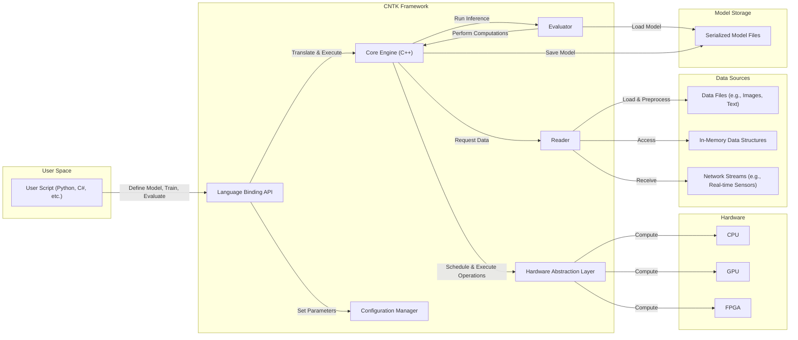

# Project Design Document: Microsoft Cognitive Toolkit (CNTK)

**Version:** 1.1
**Date:** October 26, 2023
**Prepared By:** AI Architecture Expert

## 1. Introduction

This document provides an enhanced architectural design overview of the Microsoft Cognitive Toolkit (CNTK), an open-source deep-learning framework. This detailed description is specifically tailored to serve as a robust foundation for subsequent threat modeling activities. It meticulously outlines the key components, their intricate interactions, and the comprehensive data flow within the CNTK ecosystem, providing the necessary context for identifying potential security vulnerabilities.

## 2. Goals and Scope

**Goals:**

*   Deliver a precise and comprehensive description of the CNTK architecture, suitable for security analysis.
*   Clearly define the major components, elaborating on their specific responsibilities and functionalities.
*   Illustrate the data flow within the system with greater detail, highlighting data transformations and pathways.
*   Identify key technologies and dependencies, including specific libraries and tools.
*   Establish a solid and detailed basis for identifying potential security vulnerabilities and attack vectors during threat modeling sessions.

**Scope:**

This document focuses on the core architectural elements of the CNTK framework. It encompasses:

*   The fundamental computational engine responsible for core operations.
*   The various language bindings (Python, C++, etc.) that facilitate user interaction.
*   The essential data structures and the operations performed on them.
*   The mechanisms for interacting with hardware accelerators (GPUs, specialized hardware).
*   Common deployment scenarios and their architectural implications.

This document explicitly excludes:

*   Specific deep learning models or network architectures implemented using CNTK.
*   Fine-grained implementation details within individual components' codebases.
*   The broader ecosystem of external tools and libraries that might interface with CNTK in specific use cases.
*   Highly specific deployment environments or customized configurations beyond general scenarios.

## 3. Architectural Overview

CNTK operates as a computational graph-based deep learning framework. Users define neural networks as directed graphs where nodes represent mathematical operations and edges represent the flow of data (tensors). The framework optimizes and executes these operations efficiently, often leveraging heterogeneous hardware for accelerated computation.

### 3.1. High-Level Components

*   **Core Engine (C++):** The central processing unit of CNTK, responsible for:
    *   Representing and manipulating the computational graph structure.
    *   Scheduling and executing operations on various hardware backends.
    *   Managing memory allocation and deallocation for tensors and intermediate results.
    *   Calculating gradients using automatic differentiation for backpropagation.
    *   Implementing optimization algorithms to update model parameters.
    *   Serializing and deserializing trained models to and from persistent storage.
*   **Language Bindings (Python, C#, Java, etc.):**  Provide user-friendly interfaces for interacting with the core engine:
    *   Allow users to define and train deep learning models using high-level programming languages.
    *   Translate user-defined operations and model structures into the core engine's internal representation.
    *   Offer utilities for data loading, preprocessing, and manipulation.
    *   Expose APIs for model evaluation (inference) and deployment.
*   **Evaluators:** Dedicated components for performing inference (making predictions) using trained models:
    *   Load serialized model graphs.
    *   Feed input data through the graph to compute output predictions.
    *   May support batch processing for efficient inference.
    *   Can be deployed independently of the training infrastructure.
*   **Readers:** Modules responsible for ingesting and preparing data for training and evaluation:
    *   Support reading data from various sources, including files (e.g., text, image formats), in-memory data structures, and potentially network streams.
    *   Implement data preprocessing steps such as normalization, shuffling, and batching.
    *   May handle data augmentation techniques to increase the diversity of the training data.
*   **Hardware Abstraction Layer (HAL):**  Provides an abstraction layer to enable CNTK to run on diverse hardware platforms:
    *   Abstracts away the specifics of different hardware architectures (CPUs, GPUs from various vendors, FPGAs).
    *   Allows the core engine to execute computations on the available hardware without requiring platform-specific code.
    *   Manages the allocation and utilization of hardware resources.
*   **Configuration System:**  Allows users to customize various aspects of the framework's behavior:
    *   Defines parameters for training algorithms (e.g., learning rate, batch size).
    *   Specifies hardware settings and resource allocation.
    *   Controls logging and debugging options.
    *   Can be configured through configuration files or programmatically.

### 3.2. Component Interactions

**Detailed Description of Interactions:**

*   **User Script <--> Language Binding API:** Users write scripts in languages like Python to define model architectures, initiate training processes, and perform evaluations. The language binding API acts as the primary interface, translating these high-level commands into instructions for the underlying C++ core.
*   **Language Binding API --> Core Engine:** The language bindings translate the user's model definition and training commands into the core engine's internal representation of the computational graph and execution plan.
*   **Language Binding API --> Configuration Manager:** Users can configure various aspects of CNTK through the API, which interacts with the configuration manager to set parameters and options.
*   **Core Engine --> Hardware Abstraction Layer:** The core engine utilizes the HAL to execute the operations defined in the computational graph. It requests the HAL to perform computations on the available hardware (CPU, GPU, FPGA).
*   **Core Engine --> Evaluator:** For inference tasks, the core engine interacts with the evaluator component, providing the trained model and input data for prediction.
*   **Core Engine --> Reader:** When training or evaluating, the core engine instructs the reader to load and preprocess data from the specified sources.
*   **Reader --> Data Sources:** The reader retrieves data from various sources, such as image files, text documents, in-memory arrays, or potentially real-time data streams over a network.
*   **Hardware Abstraction Layer --> Hardware:** The HAL directly interacts with the underlying hardware (CPU, GPU, FPGA) to perform the requested computations.
*   **Evaluator --> Core Engine:** The evaluator relies on the core engine for the actual execution of the model's computational graph during inference.
*   **Evaluator --> Model Storage:** The evaluator loads trained models from persistent storage (e.g., serialized model files) before performing inference.
*   **Core Engine --> Model Storage:** After training, the core engine serializes the trained model and saves it to persistent storage.

### 3.3. Data Flow

The typical data flow within CNTK during a training or inference workflow involves these key stages:

*   **Data Ingestion (Reader):** The `Reader` component loads raw data from configured sources (e.g., image files, text corpora, sensor data).
*   **Data Preprocessing (Reader/User Script):** The loaded data undergoes preprocessing steps, which might include normalization, scaling, tokenization, or data augmentation. This can occur within the `Reader` or through user-defined transformations.
*   **Graph Definition (User Script/Language Binding):** The user defines the neural network architecture as a computational graph using the language bindings. This graph specifies the sequence of operations to be performed on the data.
*   **Forward Propagation (Core Engine/HAL):** Input data (tensors) flows through the computational graph. Each node in the graph performs a specific mathematical operation, and the results are passed to subsequent nodes. The HAL manages the execution of these operations on the designated hardware.
*   **Loss Calculation (Core Engine):** During training, the output of the forward pass is compared to the ground truth labels, and a loss function calculates the error.
*   **Backward Propagation (Core Engine/HAL):** The gradients of the loss function with respect to the model's parameters are calculated using automatic differentiation and propagated backward through the graph. The HAL assists in these computations.
*   **Parameter Update (Core Engine):** Optimization algorithms use the calculated gradients to update the model's parameters, aiming to minimize the loss function.
*   **Inference (Evaluator/Core Engine/HAL):** For inference, pre-trained model parameters are loaded. Input data flows through the graph (forward propagation) to generate predictions.
*   **Model Serialization/Deserialization (Core Engine/Evaluator):** Trained models are serialized and saved to disk. The evaluator deserializes these models when performing inference.

## 4. Key Technologies and Dependencies

*   **Core Programming Language:** C++ (for the core engine).
*   **Primary User Interface Languages:** Python, C#, Java.
*   **Hardware Acceleration Libraries:** CUDA (for NVIDIA GPUs), cuDNN (for deep learning primitives on NVIDIA GPUs), OpenCL (for cross-platform hardware acceleration).
*   **Build System:** CMake (for cross-platform build management).
*   **Internal Communication Mechanisms:** Primarily in-memory function calls and shared data structures within the C++ core. Language bindings utilize inter-process communication or foreign function interfaces to interact with the core engine.
*   **Data Serialization Formats:** Protocol Buffers (often used for serializing models and data).
*   **Supported Data Formats (Readers):**  Various formats including image formats (JPEG, PNG), text formats (plain text, CSV), binary formats, and potentially custom formats.

## 5. Deployment Considerations

CNTK can be deployed in a variety of environments, each with its own security implications:

*   **Local Development Machines:** Primarily for development, experimentation, and debugging. Security risks are often lower but still include potential exposure of code and data.
*   **On-Premise Servers:** Deployed within an organization's own data centers. Security relies on the organization's infrastructure security measures, including network security, access controls, and physical security.
*   **Cloud Environments (e.g., Azure, AWS, GCP):** Leveraging cloud-based compute resources for training and inference. Security becomes a shared responsibility between the cloud provider and the user, requiring careful configuration of cloud security services (e.g., firewalls, IAM, encryption). Containerization (e.g., Docker) is frequently used for deployment in cloud environments.
*   **Edge Devices:** Deployment on devices with limited resources, such as embedded systems or mobile devices. Security considerations are paramount due to the potential for physical access and less controlled environments. Model optimization and security hardening are crucial.

Deployment typically involves installing the CNTK library and its dependencies, which can be done through package managers (e.g., pip for Python) or by building from source. Cloud deployments often utilize pre-built container images.

## 6. Security Considerations (Detailed)

This section provides a more detailed examination of potential security considerations, building upon the architectural overview.

*   **Input Validation Vulnerabilities (Readers):**
    *   **Malicious Data Injection:**  Attackers could craft malicious data files (e.g., corrupted images, adversarial text) that exploit vulnerabilities in the `Reader` components, potentially leading to crashes, denial of service, or even code execution.
    *   **Format String Bugs:** If the `Reader` uses external libraries for parsing, vulnerabilities in those libraries could be exploited.
    *   **Buffer Overflows:** Improper handling of input data sizes could lead to buffer overflows in the `Reader` or subsequent processing stages.
*   **Model Security and Integrity:**
    *   **Model Theft:** Trained models represent significant intellectual property and can be valuable to competitors. Unauthorized access to model storage or transfer channels could lead to theft.
    *   **Model Poisoning:** Attackers could inject malicious data into the training process to subtly alter the model's behavior, causing it to make incorrect predictions in specific scenarios.
    *   **Model Tampering:**  Modifying a trained model's parameters could lead to unexpected or malicious behavior during inference.
*   **Dependency Management Risks:**
    *   **Vulnerable Dependencies:** CNTK relies on third-party libraries (e.g., CUDA, cuDNN). Known vulnerabilities in these dependencies could be exploited if not properly managed and updated.
    *   **Supply Chain Attacks:** Compromised dependencies introduced during the build process could introduce vulnerabilities.
*   **Code Injection Vulnerabilities (Language Bindings):**
    *   **Unsafe Deserialization:** If language bindings involve deserializing data from untrusted sources, vulnerabilities could allow for arbitrary code execution.
    *   **Exploiting FFI/IPC:**  Vulnerabilities in the mechanisms used for communication between language bindings and the core engine could be exploited.
*   **Resource Exhaustion Attacks:**
    *   **Denial of Service (DoS):** Maliciously crafted inputs or model definitions could consume excessive CPU, memory, or GPU resources, leading to a denial of service.
    *   **Algorithmic Complexity Attacks:** Exploiting inefficient algorithms within CNTK with carefully crafted inputs.
*   **Supply Chain Security of CNTK Itself:**
    *   **Compromised Source Code:**  If the CNTK source code repository were compromised, malicious code could be introduced.
    *   **Compromised Build Pipeline:**  An attacker could compromise the build and release process to distribute a backdoored version of CNTK.
*   **Access Control and Authentication:**
    *   **Unauthorized Access to Resources:**  Lack of proper access controls could allow unauthorized users to access training data, models, or infrastructure.
    *   **Weak Authentication:**  Weak or default credentials could be exploited to gain unauthorized access.
*   **Serialization/Deserialization Vulnerabilities (Model Storage):**
    *   **Arbitrary Code Execution:** Vulnerabilities in the model serialization/deserialization process could allow attackers to embed and execute malicious code when a model is loaded.
*   **Hardware Security Considerations:**
    *   **Hardware Trojans:** While CNTK abstracts the hardware, vulnerabilities in the underlying hardware or firmware could be exploited.
    *   **Side-Channel Attacks:**  Information leakage through hardware characteristics (e.g., power consumption, timing).
*   **Logging and Monitoring:**
    *   **Insufficient Logging:** Lack of adequate logging can hinder incident response and forensic analysis.
    *   **Exposure of Sensitive Information in Logs:** Logs might inadvertently contain sensitive data.

## 7. Future Considerations

Future development efforts for CNTK might include:

*   **Enhanced Support for Emerging Hardware Architectures:**  Adapting to new types of accelerators and processing units.
*   **Improvements in Distributed Training Scalability and Efficiency:**  Further optimizing the framework for large-scale distributed training across multiple machines and GPUs.
*   **Deeper Integration with Cloud Platforms and Services:**  Streamlining deployment and management in cloud environments.
*   **Focus on Edge Computing Capabilities:**  Optimizing CNTK for resource-constrained edge devices.
*   **Strengthened Security Features:**
    *   Implementing robust input validation mechanisms.
    *   Adding features for model encryption and integrity verification.
    *   Improving dependency management and security scanning.
    *   Enhancing logging and auditing capabilities.
    *   Exploring secure multi-party computation techniques for privacy-preserving machine learning.

This enhanced design document provides a more comprehensive and detailed understanding of the CNTK architecture, specifically tailored for effective threat modeling. The identified components, interactions, data flow, and security considerations offer a solid foundation for identifying and mitigating potential security risks.
