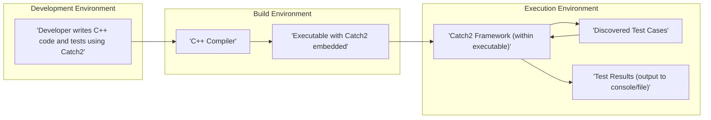
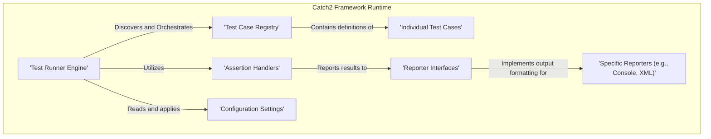

# Project Design Document: Catch2 C++ Testing Framework

**Version:** 1.1
**Date:** October 26, 2023
**Author:** Gemini (AI Language Model)

## 1. Introduction

This document provides a detailed design overview of the Catch2 C++ testing framework, intended to serve as a foundation for subsequent threat modeling activities. It outlines the architecture, key components, and data flow within the framework, with a focus on aspects relevant to security considerations.

Catch2 is a mature, header-only, C++ testing framework designed for unit tests, Test-Driven Development (TDD), and Behavior-Driven Development (BDD). Its core tenets are expressiveness, ease of use, and high configurability, enabling developers to create and execute automated tests for C++ code effectively.

## 2. Goals and Objectives

The primary goals of Catch2 are:

* **Ease of Use:** To provide a simple and intuitive Application Programming Interface (API) for writing and structuring tests.
* **Expressiveness:** To allow developers to write clear, readable, and maintainable test cases that accurately reflect the intended behavior of the code under test.
* **Flexibility:** To support a variety of testing methodologies, including unit testing, TDD, and BDD, within a single framework.
* **Extensibility:** To enable users to customize and extend the framework's functionality through features like custom reporters and matchers.
* **Header-Only Design:** To simplify integration into C++ projects by requiring only the inclusion of a single header file, eliminating the need for separate compilation and linking of library files.
* **Automatic Test Discovery:** To automatically discover and register test cases defined within the codebase, reducing manual configuration.
* **Comprehensive Reporting:** To provide detailed and informative test results, including success/failure status, assertion details, and diagnostic information.

## 3. Architectural Overview

Catch2's architecture is primarily defined by its role within a C++ project's build and execution lifecycle. It is not a standalone service but rather a library integrated directly into the compiled executable. We can analyze its architecture from the perspectives of integration and runtime execution.

### 3.1. High-Level Architecture

* **Development Environment:** Developers utilize Catch2's macros and assertion mechanisms to create test cases alongside their C++ code.
* **Build Environment:** The C++ compiler processes the source code, incorporating the Catch2 header file, and links the necessary components into the final executable. The Catch2 framework becomes an integral part of this executable.
* **Execution Environment:** When the compiled executable is launched, the embedded Catch2 framework takes over, discovering and executing the defined test cases and generating reports.

### 3.2. Component Architecture (Runtime)

During the execution of a Catch2-enabled executable, several key components within the framework interact to manage the testing process.

* **Test Runner Engine:** The central component responsible for the overall test execution process. It discovers available tests, manages their execution order (based on configuration), and coordinates the reporting of results.
* **Test Case Registry:** A container that stores information about all the test cases defined within the executable. Test cases are registered automatically through Catch2's macros.
* **Individual Test Cases:** The specific blocks of code written by developers that contain the actual test logic and assertions. These are defined using macros like `TEST_CASE`, `SECTION`, etc.
* **Assertion Handlers:** Components that evaluate the truthiness of expressions within test cases using macros like `REQUIRE`, `CHECK`, `SUCCEED`, etc. They capture failure information when assertions are not met.
* **Reporter Interfaces:** Abstract interfaces that define how test results are formatted and outputted.
* **Specific Reporters (e.g., Console, XML):** Concrete implementations of the reporter interfaces that generate output in various formats, such as plain text for the console or structured XML files.
* **Configuration Settings:** Parameters that control the behavior of the Test Runner, such as which tests to run (based on tags or names), the output format, verbosity levels, and other execution options. These can be set via command-line arguments or programmatic configuration.

## 4. Data Flow

The execution of Catch2 tests involves a specific flow of data and control:

1. **Executable Invocation:** The user initiates the execution of the compiled C++ executable that includes the Catch2 framework and test definitions.
2. **Framework Initialization:** Upon startup, the Catch2 framework within the executable initializes its internal components, including the Test Runner Engine and the Test Case Registry.
3. **Test Discovery:** The Test Runner Engine scans the executable's code sections for test cases registered using Catch2's macros (e.g., `TEST_CASE`). Information about each discovered test (name, tags, source location) is stored in the Test Case Registry.
4. **Configuration Loading:** The Test Runner Engine loads configuration settings. This typically involves parsing command-line arguments provided by the user, but can also include reading environment variables or using programmatic configuration.
5. **Test Case Selection:** Based on the loaded configuration, the Test Runner Engine determines which test cases to execute. This might involve filtering by test name, tags, or other criteria.
6. **Test Case Execution:** The Test Runner Engine iterates through the selected test cases and executes them one by one.
7. **Assertion Evaluation:** Within each test case, the Assertion Handlers evaluate the expressions provided to assertion macros (e.g., `REQUIRE(condition)`). If an assertion fails (the condition is false), the Assertion Handler captures details about the failure, including the expression, the actual and expected values (if applicable), and the source code location.
8. **Result Reporting:** As each test case executes and assertions are evaluated, the Assertion Handlers and the Test Runner Engine communicate with the configured Reporter(s). The Reporters receive information about test starts, ends, successes, and failures, along with details of any assertion failures.
9. **Output Generation:** The Reporter(s) format the received test result data according to their specific output format (e.g., plain text, XML, JUnit XML). This formatted output is then typically written to the standard output stream (for console reporters) or to a specified file.
10. **Exit Code:** Once all selected test cases have been executed, the Catch2 framework signals the overall test outcome through the executable's exit code. A zero exit code typically indicates that all tests passed, while a non-zero code indicates that one or more tests failed.

## 5. Security Considerations

While Catch2 operates within the confines of a compiled executable and doesn't inherently expose network services, several security considerations are relevant, particularly when considering the broader context of software development and deployment:

* **Malicious Test Case Design:** Developers could intentionally or unintentionally create test cases that consume excessive system resources (CPU, memory, disk I/O), leading to localized denial-of-service conditions during test execution. For example, a test case with an infinite loop or one that allocates massive amounts of memory could disrupt the testing environment.
* **Information Disclosure through Test Outputs:** Test cases might inadvertently output sensitive information, such as API keys, passwords, cryptographic secrets, or internal data structures, into the test results or log files. This information could be exposed if these outputs are not properly secured.
* **Supply Chain Risks (Indirect):** Although Catch2 itself is a widely used and scrutinized open-source project, indirect supply chain risks exist. If the Catch2 header file were to be compromised at the source or during distribution, it could introduce malicious code into any project that includes it. This highlights the importance of verifying the integrity of dependencies.
* **Vulnerabilities in Custom Reporters or Extensions:** If users develop custom reporters or other extensions for Catch2, vulnerabilities in this custom code could be exploited. For instance, a custom reporter that writes test results to a file without proper sanitization could be susceptible to path traversal or other file manipulation attacks.
* **Resource Exhaustion in CI/CD Pipelines:** In Continuous Integration/Continuous Deployment (CI/CD) pipelines, running a large number of tests or tests with long execution times can strain the resources of the build agents. While not a direct vulnerability in Catch2, it can impact the availability and performance of the CI/CD system.
* **Triggering Vulnerabilities in Code Under Test:** While Catch2's purpose is to find bugs, poorly written or overly aggressive tests could inadvertently trigger vulnerabilities (e.g., buffer overflows, race conditions) in the code being tested, potentially leading to unexpected behavior or crashes during the testing phase.
* **Exposure of Internal Logic:**  Detailed test outputs, especially when verbose logging is enabled, can sometimes reveal internal logic or implementation details of the system under test. This information could potentially be leveraged by attackers to understand the system's workings and identify potential weaknesses.

**Note:** A dedicated threat modeling exercise, employing methodologies like STRIDE, would provide a more comprehensive analysis of potential threats, vulnerabilities, and associated risks.

## 6. Assumptions and Constraints

* **Trusted Development Environment:** We assume that the development environments where test cases are written are reasonably secure and that developers follow secure coding practices.
* **Controlled Build Environment:** The build environments where code is compiled and tests are executed are assumed to be controlled and protected against unauthorized access or modification.
* **Local or Controlled Execution:** Catch2 tests are typically executed locally on developer machines or within controlled CI/CD environments. We assume that the execution environment itself is not inherently hostile.
* **No Direct Network Exposure:** Catch2, in its standard usage, does not listen on network ports or expose network services. Security concerns related to network exposure are generally outside the scope of Catch2 itself.
* **Developer Responsibility for Test Security:** Developers are ultimately responsible for writing secure and well-behaved test cases that do not introduce unintended security risks.

## 7. Future Considerations

* **Enhanced Security Logging and Auditing:**  Potentially explore features to log and audit test execution activities, which could help in detecting and investigating suspicious behavior.
* **Sandboxing or Isolation of Test Execution:** Investigate options for sandboxing or isolating test case execution to prevent resource exhaustion or interference between tests, particularly in parallel execution scenarios.
* **Integration with Security Scanning Tools:** Explore potential integrations with static analysis and dynamic analysis security scanning tools to identify potential security issues within test cases themselves.
* **Secure Defaults and Best Practices Documentation:** Provide clear guidance and documentation on secure coding practices for writing test cases and configuring Catch2 to minimize potential security risks.

This document provides a detailed design overview of the Catch2 framework, focusing on aspects relevant to security considerations. It serves as a crucial input for conducting thorough threat modeling to identify and mitigate potential risks associated with its use in software development.