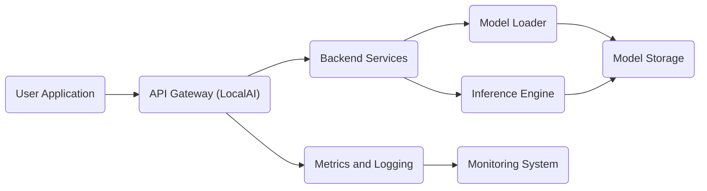
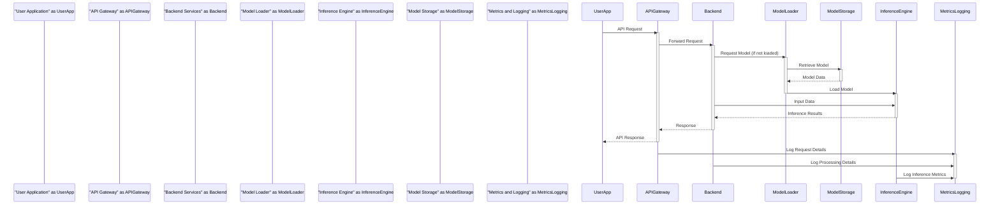

# Project Design Document: LocalAI

**Version:** 1.1
**Date:** October 26, 2023
**Author:** AI Architecture Expert

## 1. Introduction

This document provides a detailed design overview of the LocalAI project, an open-source, self-hosted alternative to cloud-based AI APIs. This document aims to provide a comprehensive understanding of the system's architecture, components, and data flow, which will serve as the foundation for subsequent threat modeling activities. This revision includes more detail on component responsibilities and potential security considerations.

## 2. Goals and Objectives

The primary goals of LocalAI are:

*   Provide a simple and easy-to-use interface for running Large Language Models (LLMs) and other AI models locally or on-premise.
*   Offer a privacy-focused alternative to cloud-based AI services by keeping data and model execution within the user's control.
*   Support a wide range of hardware and operating systems, including resource-constrained environments.
*   Enable experimentation and development with AI models without reliance on external services or internet connectivity.
*   Foster a community-driven approach to AI accessibility and customization.

## 3. High-Level Architecture

The following diagram illustrates the high-level architecture of LocalAI:

**Components:**

*   **User Application:** Any application, script, or client (e.g., a web browser, a command-line tool, another software application) that interacts with the LocalAI API to perform AI tasks.
*   **API Gateway (LocalAI):** The single entry point for all external requests to the LocalAI service. It acts as a reverse proxy, handling routing of requests to the appropriate backend services. It may also be responsible for tasks like request authentication and rate limiting.
*   **Backend Services:** The core business logic layer of LocalAI. These services handle the processing of API requests, manage the lifecycle of AI models, and orchestrate the interaction between the Model Loader and the Inference Engine.
*   **Model Loader:**  A specialized component responsible for retrieving AI model files from the configured Model Storage, preparing them for use by the Inference Engine, and potentially managing model caching.
*   **Inference Engine:** The component that performs the actual execution of the loaded AI models to generate predictions, responses, or embeddings based on the input data provided.
*   **Model Storage:** The persistent storage location for AI model files. This can range from a local filesystem directory to a network-attached storage (NAS) or a cloud storage bucket.
*   **Metrics and Logging:**  A component responsible for collecting and storing operational data about LocalAI, including API request logs, performance metrics (e.g., latency, throughput), and error logs. This data is crucial for monitoring and debugging.
*   **Monitoring System:** An external system or set of tools (e.g., Prometheus, Grafana, ELK stack) that consumes the metrics and logs produced by the Metrics and Logging component to provide real-time monitoring, alerting, and historical analysis of LocalAI's health and performance.

## 4. Component Breakdown

This section provides a more detailed description of each component, including their responsibilities and potential implementation details:

*   **API Gateway (LocalAI):**
    *   Listens for incoming HTTP/HTTPS requests on a configurable port.
    *   Handles API routing based on request paths (e.g., `/v1/completions`, `/v1/embeddings`, `/v1/models`).
    *   May implement authentication mechanisms (e.g., API keys, JWT) to verify the identity of the requester.
    *   Can enforce authorization policies to control access to specific API endpoints or resources.
    *   Performs request validation to ensure the incoming data conforms to the expected schema and data types.
    *   Sanitizes input data to prevent common web vulnerabilities like cross-site scripting (XSS) or injection attacks.
    *   Formats responses in a consistent manner (e.g., JSON) and handles error responses with appropriate status codes and messages.
    *   May implement rate limiting to protect the service from abuse or overload.
    *   Could provide features like request logging and tracing for debugging and auditing.

*   **Backend Services:**
    *   Receives validated and authenticated requests from the API Gateway.
    *   Manages the lifecycle of AI models, including loading, unloading, and potentially updating models.
    *   Orchestrates the inference process by selecting the appropriate model, invoking the Model Loader if necessary, and interacting with the Inference Engine.
    *   Handles request queuing and concurrency management to ensure efficient resource utilization and prevent overload.
    *   Provides APIs for model management, allowing users to list available models, upload new models, or delete existing ones.
    *   Implements the core business logic for different API endpoints, such as text generation, embeddings creation, and other AI-related tasks.
    *   May implement caching mechanisms for frequently accessed data or inference results to improve performance.

*   **Model Loader:**
    *   Responsible for retrieving AI model files from the configured Model Storage location.
    *   Handles different model formats (e.g., `.bin`, `.safetensors`, `.pt`) and loading mechanisms specific to each format.
    *   May perform model validation checks to ensure the integrity and compatibility of the loaded models.
    *   Provides an interface for the Backend Services to access loaded models, potentially abstracting away the underlying model format and loading details.
    *   Potentially implements caching of loaded models in memory to reduce loading times for subsequent requests.
    *   May handle model updates or reloading when new versions are available in Model Storage.

*   **Inference Engine:**
    *   The core component responsible for executing the loaded AI models to perform inference.
    *   Supports various AI model frameworks (e.g., TensorFlow, PyTorch, ONNX Runtime, GGML/GGUF).
    *   Optimizes model execution for performance, potentially leveraging hardware acceleration (e.g., GPUs, TPUs) if available.
    *   Receives input data from the Backend Services in a format suitable for the loaded model.
    *   Returns the inference results (e.g., generated text, embeddings, classifications) to the Backend Services.
    *   May manage the allocation and utilization of hardware resources for model execution.

*   **Model Storage:**
    *   Stores the actual AI model files persistently.
    *   Can be a local directory on the server's filesystem, a network file system (e.g., NFS, SMB), or a cloud storage service (e.g., AWS S3, Google Cloud Storage).
    *   Requires appropriate file system permissions or access control policies to ensure only authorized components (primarily the Model Loader) can access the model files.
    *   Considerations for storage include capacity, performance (read speeds), and security (access control, encryption at rest).

*   **Metrics and Logging:**
    *   Collects various metrics related to API requests (e.g., request count, latency, error rates), resource utilization (e.g., CPU usage, memory usage), and inference performance.
    *   Generates detailed logs for API requests, including timestamps, request paths, status codes, and potentially request/response bodies (with appropriate redaction for sensitive information).
    *   Logs errors and exceptions encountered during request processing or model execution, providing valuable information for debugging.
    *   May use standard logging formats (e.g., JSON) for easier parsing and analysis by monitoring systems.
    *   Provides an interface or mechanism for the Monitoring System to access the collected metrics and logs (e.g., exposing metrics via an HTTP endpoint, writing logs to a file or a dedicated logging service).

*   **Monitoring System:**
    *   An external system or platform used to visualize and analyze the metrics and logs collected by LocalAI.
    *   Provides dashboards to display real-time performance metrics and identify potential issues.
    *   Allows for setting up alerts based on predefined thresholds or anomalies in the metrics data.
    *   Enables historical analysis of performance trends and identification of bottlenecks.
    *   Examples include Prometheus for metrics collection and Grafana for visualization, or the ELK stack (Elasticsearch, Logstash, Kibana) for log aggregation and analysis.

## 5. Data Flow

The following outlines the typical data flow for processing an API request, providing more detail on the interactions between components:

1. A **User Application** sends an API request (e.g., for text generation) to the **API Gateway**. This request typically includes input data and parameters.
2. The **API Gateway** receives the request, performs initial validation (e.g., checking for required parameters), and potentially authenticates the request.
3. The **API Gateway** routes the validated request to the appropriate **Backend Service** based on the API endpoint.
4. The **Backend Service** receives the request and identifies the required AI model based on the request parameters or configuration.
5. If the model is not already loaded in the **Inference Engine**, the **Backend Service** requests the **Model Loader** to load the model from **Model Storage**.
6. The **Model Loader** retrieves the model file from **Model Storage** and loads it into the **Inference Engine**, making it ready for execution.
7. The **Backend Service** prepares the input data from the API request into a format suitable for the loaded model and sends it to the **Inference Engine**.
8. The **Inference Engine** executes the model using the provided input data and generates the inference results (e.g., generated text).
9. The **Inference Engine** returns the inference results to the **Backend Service**.
10. The **Backend Service** formats the inference results into a standard API response (e.g., JSON) and sends it back to the **API Gateway**.
11. The **API Gateway** receives the formatted response and sends it back to the **User Application**.
12. Throughout the process, the **Metrics and Logging** component collects data about the request, including timestamps, latency, and any errors encountered. This data is then available for the **Monitoring System** to consume and analyze.

## 6. Technology Stack

The following are potential technologies used in LocalAI, with more specific examples:

*   **Programming Language:** Go (primarily for core components and API), potentially Python for model execution or specific model loading utilities.
*   **API Framework:** Likely a lightweight and efficient Go web framework such as Gin, Echo, or Fiber.
*   **Model Serving Frameworks:**  Potentially leveraging existing frameworks like ONNX Runtime, TensorFlow Serving (via gRPC or REST), PyTorch Serve (TorchServe), or libraries for directly loading and running models (e.g., `transformers` library in Python, GGML/llama.cpp for certain models).
*   **Containerization:** Docker for packaging and distributing LocalAI as container images, simplifying deployment and ensuring consistency across environments.
*   **Orchestration:** Potentially Kubernetes for managing deployments at scale, providing features like auto-scaling, load balancing, and self-healing. Docker Compose for simpler multi-container deployments.
*   **Logging:** Standard Go logging libraries (`log` package), potentially integrated with structured logging libraries (e.g., `zap`, `logrus`) for easier parsing.
*   **Metrics:**  Potentially Prometheus client libraries in Go to expose metrics in a format that Prometheus can scrape.
*   **Configuration Management:**  Libraries for reading configuration files (e.g., YAML, JSON) or environment variables.

## 7. Deployment Model

LocalAI offers flexibility in deployment options:

*   **Standalone Binary:**  A single executable file that can be run directly on the host operating system without external dependencies (assuming necessary model dependencies are present). Suitable for simple setups and development.
*   **Docker Container:**  Packaged as a Docker container image, providing a consistent and isolated environment for running LocalAI. This simplifies deployment across different operating systems and environments.
*   **Docker Compose:**  For managing multi-container deployments, potentially including LocalAI alongside other supporting services like a monitoring stack (e.g., Prometheus and Grafana).
*   **Kubernetes:**  Deployed as a set of pods and services within a Kubernetes cluster, enabling scalability, high availability, and automated management of LocalAI deployments in complex environments.

## 8. Security Considerations (Initial)

This section outlines initial security considerations that will be further explored during threat modeling, providing more specific examples of potential threats and mitigation strategies:

*   **Authentication and Authorization:**
    *   **Threats:** Unauthorized access to the API, data breaches, malicious use of AI models.
    *   **Considerations:** Implementing API key-based authentication, OAuth 2.0 for more complex scenarios, role-based access control (RBAC) to restrict access to specific API endpoints or models.
*   **Input Validation:**
    *   **Threats:** Injection attacks (e.g., prompt injection), denial-of-service through malformed input.
    *   **Considerations:**  Strictly validating all user-provided input against expected schemas and data types, sanitizing input to remove potentially harmful characters or code.
*   **Model Security:**
    *   **Threats:** Unauthorized access to model files, tampering with model weights, use of malicious models.
    *   **Considerations:**  Restricting access to Model Storage using appropriate file system permissions or cloud storage access controls, verifying the integrity of model files using checksums or signatures, implementing a model vetting process.
*   **API Security:**
    *   **Threats:** Man-in-the-middle attacks, eavesdropping on API communication.
    *   **Considerations:** Enforcing HTTPS for all API communication using TLS certificates, implementing security headers (e.g., HSTS, Content-Security-Policy).
*   **Access Control:**
    *   **Threats:** Unauthorized access to the underlying system, containers, or virtual machines.
    *   **Considerations:**  Following the principle of least privilege when granting permissions to users and processes, securing the host operating system and container runtime environment.
*   **Logging and Monitoring:**
    *   **Threats:**  Lack of visibility into security incidents, delayed detection of attacks.
    *   **Considerations:**  Logging all significant security-related events (e.g., authentication attempts, authorization failures), regularly monitoring logs for suspicious activity, setting up alerts for security events.
*   **Dependency Management:**
    *   **Threats:** Vulnerabilities in third-party libraries and dependencies.
    *   **Considerations:**  Regularly scanning dependencies for known vulnerabilities, keeping dependencies up-to-date with security patches.
*   **Rate Limiting:**
    *   **Threats:** Denial-of-service attacks, resource exhaustion.
    *   **Considerations:**  Implementing rate limiting on API endpoints to restrict the number of requests from a single source within a given time period.
*   **Data Privacy:**
    *   **Threats:** Exposure of sensitive data used as input to the models.
    *   **Considerations:**  Avoiding logging sensitive input data, implementing data masking or anonymization techniques if necessary, ensuring compliance with relevant data privacy regulations.

## 9. Future Considerations

Potential future enhancements and considerations for LocalAI include:

*   Support for a wider range of AI model types and frameworks, including multimodal models and specialized models for tasks like image generation or audio processing.
*   Advanced model management features, such as model versioning, A/B testing of models, and support for fine-tuning models within LocalAI.
*   Improved scalability and performance optimizations, including techniques like model parallelism and distributed inference.
*   Enhanced security features, such as more granular access control policies, integration with security information and event management (SIEM) systems, and vulnerability scanning tools.
*   Integration with other tools and platforms, such as workflow orchestration engines or data science platforms.
*   A more comprehensive user interface (UI) or command-line interface (CLI) for managing models, monitoring performance, and interacting with the API.
*   Support for model marketplaces or registries to facilitate the discovery and sharing of AI models.
*   Features for monitoring and managing resource utilization (CPU, memory, GPU) at a more granular level.

This document provides a comprehensive and detailed understanding of the LocalAI project's design. It will serve as a valuable resource for identifying potential threats and vulnerabilities during the subsequent threat modeling process.