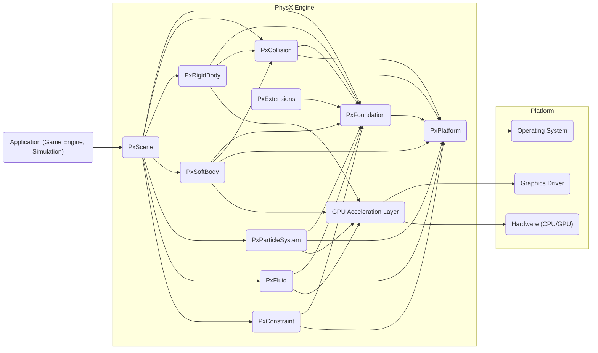

# Project Design Document: NVIDIA PhysX Engine

**Version:** 1.1
**Date:** October 26, 2023
**Prepared By:** AI Software Architect

## 1. Introduction

This document provides a detailed architectural design of the NVIDIA PhysX engine, based on the publicly available source code repository at [https://github.com/NVIDIAGameWorks/PhysX](https://github.com/NVIDIAGameWorks/PhysX). This document aims to provide a comprehensive understanding of the system's components, their interactions, and data flow, which will serve as the foundation for subsequent threat modeling activities. This revision includes more detailed descriptions of key components and potential security considerations.

### 1.1. Purpose

The primary purpose of this document is to outline the architecture of the PhysX engine to facilitate threat modeling. It will identify key components, data flows, and external interfaces, enabling security analysts to identify potential vulnerabilities and attack vectors.

### 1.2. Scope

This document covers the core architectural components of the PhysX engine as represented in the GitHub repository. It focuses on the software architecture and does not delve into the specifics of the underlying hardware microarchitecture or the intricate mathematical details of individual algorithms. The scope includes:

*   Detailed descriptions of major software components and their specific responsibilities.
*   Key data structures and their flow within the system, including examples of data types.
*   Comprehensive overview of external interfaces and dependencies, including specific examples of APIs.
*   High-level description of the build and integration processes, highlighting security-relevant aspects.

### 1.3. Target Audience

This document is intended for:

*   Security engineers and analysts involved in threat modeling and security assessments of systems utilizing PhysX.
*   Software architects and developers who require a detailed understanding of the PhysX architecture for integration or modification purposes.
*   Project managers and stakeholders seeking a comprehensive overview of the system's structure and potential security implications.

## 2. System Overview

PhysX is a robust, high-performance physics engine SDK designed for integration into diverse applications, most notably games and simulations. It offers a wide array of functionalities for simulating realistic physical interactions, including rigid body dynamics, soft bodies, articulated bodies, fluids, and particle systems. The engine is architected for platform independence and can leverage the parallel processing power of GPUs for accelerated computations.

### 2.1. Key Features

*   **Rigid Body Dynamics:**  Comprehensive simulation of solid, non-deformable objects, encompassing realistic collision detection, response, and the application of forces and torques.
*   **Soft Body Dynamics:** Advanced simulation of deformable objects using techniques like finite element methods, enabling realistic behavior for materials like cloth and rubber.
*   **Particle Systems:** Efficient simulation of a large number of individual particles, often used for visual effects such as smoke, fire, and explosions.
*   **Fluid Dynamics (SPH & Other Methods):** Simulation of fluid behavior using techniques like Smoothed-Particle Hydrodynamics (SPH) and potentially other methods for different fluid characteristics.
*   **Collision Detection:** A suite of algorithms for efficiently detecting collisions between various geometric shapes, including convex hulls, triangle meshes, and heightfields, employing both broad-phase and narrow-phase techniques.
*   **Constraint Solving:** Sophisticated mechanisms for applying and resolving constraints between objects, such as joints (revolute, prismatic, spherical), limits, and motors, ensuring realistic interactions.
*   **Hardware Acceleration:**  Extensive utilization of GPUs via APIs like CUDA or other compute frameworks to significantly accelerate physics calculations, improving performance.
*   **Cross-Platform Support:**  Designed to be portable and executable across a variety of operating systems (Windows, Linux, macOS, Android, iOS) and hardware platforms (CPUs and GPUs from different vendors).
*   **Articulated Bodies:** Support for simulating complex, multi-part objects connected by joints, such as characters or vehicles.

## 3. Architectural Design

The PhysX engine adopts a modular design philosophy, where distinct components are responsible for specific, well-defined functionalities. This promotes maintainability and allows for selective integration of features.

### 3.1. Major Components

*   **PhysX Core (`PxFoundation`):** The bedrock of the engine, providing essential low-level functionalities. This includes memory management (custom allocators), math libraries (vector and matrix operations, quaternions), error reporting, and basic simulation primitives. It also manages the overall engine initialization and shutdown.
*   **Collision Detection Module (`PxCollision`):**  A critical component responsible for detecting collisions between different geometric shapes. It employs a hierarchical approach, starting with broad-phase algorithms (e.g., bounding volume hierarchies) to quickly identify potential collisions, followed by narrow-phase algorithms (e.g., separating axis theorem) for precise contact determination. This module handles various shape types like spheres, boxes, capsules, convex hulls, and triangle meshes.
*   **Rigid Body Dynamics Module (`PxRigidBody`):** Implements the core simulation of rigid bodies. This involves calculating forces, torques, linear and angular velocities, and applying Newton's laws of motion. It manages the state of rigid bodies (position, orientation, velocity) and handles the integration of motion equations.
*   **Soft Body Dynamics Module (`PxSoftBody`):**  Handles the simulation of deformable objects. This typically involves discretizing the object into a mesh of interconnected nodes or elements and applying forces based on material properties. Techniques like finite element methods (FEM) or position-based dynamics (PBD) might be employed.
*   **Particle System Module (`PxParticleSystem`):** Manages the creation, update, and rendering of large numbers of individual particles. This module handles particle properties like position, velocity, lifetime, and interactions between particles and with the environment.
*   **Fluid Dynamics Module (`PxFluid`):** Implements fluid simulation, often using Smoothed-Particle Hydrodynamics (SPH). This involves representing the fluid as a collection of particles that interact with each other based on density, viscosity, and surface tension.
*   **Constraint Solver Module (`PxConstraint`):**  A crucial component for enforcing constraints between objects. It calculates the forces required to maintain these constraints, such as preventing objects from interpenetrating or maintaining specific joint configurations. Iterative solvers are often used to handle complex constraint systems.
*   **Scene Management (`PxScene`):**  Manages the collection of physical objects (rigid bodies, soft bodies, particles, fluids) and their properties within a simulation environment. It provides methods for adding, removing, and querying objects, and it orchestrates the simulation steps.
*   **Platform Abstraction Layer (PAL) (`PxPlatform`):** Provides an abstraction layer to ensure platform independence. This layer encapsulates platform-specific functionalities such as threading (creating and managing threads), memory allocation (custom allocators that might differ per platform), file I/O operations, and timing mechanisms.
*   **GPU Acceleration Layer (`PxCudaContextManager` or similar):** Enables the offloading of computationally intensive physics calculations to the GPU. This layer manages the interaction with the GPU, including memory transfers and kernel execution, often using technologies like CUDA or other compute APIs.
*   **Utilities and Extensions (`PxExtensions`):** Provides a collection of helper functions, convenience classes, and extended functionalities that are not part of the core engine but are useful for specific use cases. This might include functions for creating common shapes, debugging tools, or specialized simulation features.
*   **Build System (CMake scripts, etc.):**  Defines the process for compiling and linking the PhysX library for different target platforms and configurations. This includes specifying compiler flags, library dependencies, and output targets.
*   **Samples and Demos:**  Example applications and code snippets demonstrating the capabilities of the PhysX engine and illustrating how to use its various features.

### 3.2. Component Interactions

The following diagram illustrates the high-level interactions between the major components:

*   The **Application** interacts primarily with the **PxScene** component to manage the simulation environment and its contents.
*   **PxScene** orchestrates the simulation by utilizing various physics modules like **PxCollision**, **PxRigidBody**, **PxSoftBody**, etc.
*   All physics modules rely on the foundational services provided by **PxFoundation**.
*   The **PxPlatform** component provides an interface to the underlying **Operating System** for platform-specific operations.
*   The **GPU Acceleration Layer** interacts with the **Graphics Driver** and **Hardware** to offload computationally intensive tasks.
*   **PxExtensions** can be utilized by various components to provide supplementary functionalities.

### 3.3. Data Flow

The typical data flow within the PhysX engine during a single simulation step can be broken down as follows:

1. **Input from Application:** The application provides the initial state of the scene to **PxScene**, including:
    *   Object properties (position, orientation, velocity, mass, etc.).
    *   Applied forces and torques.
    *   Simulation parameters (time step, gravity, etc.).
    *   Scene description (creation and destruction of objects).
2. **Broad-Phase Collision Detection (PxCollision):** **PxScene** triggers the **PxCollision** module to perform broad-phase collision detection, quickly identifying pairs of objects that might be colliding. This often involves checking for overlaps between bounding volumes.
3. **Narrow-Phase Collision Detection (PxCollision):** For pairs identified in the broad phase, **PxCollision** performs more precise narrow-phase collision detection to determine the exact contact points, normals, and penetration depths.
4. **Contact Generation (PxCollision):** Based on the narrow-phase results, **PxCollision** generates detailed contact information, which is crucial for resolving collisions.
5. **Constraint Solver (PxConstraint):** The **PxConstraint** module processes the generated contacts and any explicitly defined constraints (joints, limits). It calculates the impulse forces required to resolve collisions and maintain constraints.
6. **Force and Torque Accumulation (PxRigidBody, PxSoftBody, etc.):** The respective physics modules accumulate all forces acting on each object, including applied forces, gravity, and the impulse forces calculated by the constraint solver.
7. **Integration (PxRigidBody, PxSoftBody, etc.):** The physics modules integrate the equations of motion to update the positions, orientations, linear velocities, and angular velocities of the objects based on the accumulated forces and torques. Numerical integration methods are used for this step.
8. **Update Scene State (PxScene):** **PxScene** updates the internal state of all simulated objects with the newly calculated positions and velocities.
9. **Output to Application:** The updated scene state is returned to the application, allowing it to update the visual representation of the simulation.

```mermaid
graph LR
    A["Application Input (Scene State, Forces)"]
    B["PxScene"]
    C["PxCollision (Broad-Phase)"]
    D["PxCollision (Narrow-Phase)"]
    E["PxConstraint Solver"]
    F["Force & Torque Accumulation (Rigid/Soft Body, etc.)"]
    G["Integration (Rigid/Soft Body, etc.)"]
    H["Updated Scene State in PxScene"]
    I["Application Output (Updated Scene)"]

    A --> B
    B --> C
    C --> D
    D --> E
    E --> F
    F --> G
    G --> H
    H --> I
```

## 4. Security Considerations (Preliminary)

This section outlines potential security considerations based on the architectural design. A more detailed threat model will be developed in subsequent phases.

*   **Input Validation Vulnerabilities:** The engine receives scene descriptions, object properties, and simulation parameters from the application. Insufficient or improper validation of this input could lead to various vulnerabilities:
    *   **Buffer Overflows:** Maliciously crafted scene data with excessively large values or string lengths could overflow buffers in the engine's memory.
    *   **Integer Overflows:** Large input values for counts or sizes could lead to integer overflows, potentially causing unexpected behavior or memory corruption.
    *   **Format String Bugs:** If user-provided strings are directly used in formatting functions, attackers could inject format specifiers to read from or write to arbitrary memory locations.
    *   **Denial of Service (DoS):**  Crafted input could trigger computationally expensive operations, leading to excessive CPU or memory usage and causing the application to become unresponsive. For example, creating an extremely large number of objects or complex collision geometries.
*   **Memory Safety Issues (C++ Specific):** As PhysX is primarily implemented in C++, it is susceptible to common memory management vulnerabilities:
    *   **Buffer Overflows:**  Writing beyond the allocated bounds of arrays or buffers.
    *   **Use-After-Free:** Accessing memory that has already been freed, leading to unpredictable behavior or crashes.
    *   **Dangling Pointers:** Pointers that point to memory that is no longer valid.
    *   **Memory Leaks:** Failure to deallocate dynamically allocated memory, potentially leading to resource exhaustion over time.
*   **Third-Party Dependency Vulnerabilities:** The engine might rely on external libraries for functionalities like math operations or platform-specific services. Vulnerabilities in these dependencies could be exploited if not properly managed and updated.
*   **Platform-Specific Vulnerabilities:** The **PxPlatform** layer interacts directly with the underlying operating system. Vulnerabilities in the PAL implementation or in the OS APIs themselves could be potential attack vectors.
*   **GPU Acceleration Layer Security:** Issues in the interaction with the GPU, including vulnerabilities in the graphics drivers or the compute APIs (like CUDA), could potentially be exploited. This could involve issues like privilege escalation or information disclosure.
*   **Build System and Supply Chain Security:** Compromises in the build system (e.g., malicious scripts or dependencies) could lead to the introduction of backdoors or vulnerabilities into the compiled PhysX library.
*   **Floating-Point Errors and Precision Issues:** While not strictly security vulnerabilities, unexpected behavior due to floating-point inaccuracies could potentially be exploited in certain scenarios.
*   **Serialization/Deserialization Vulnerabilities:** If the engine supports saving and loading simulation states, vulnerabilities in the serialization or deserialization process could allow attackers to inject malicious data.

## 5. External Interfaces and Dependencies

*   **Application Programming Interface (API) (C++):** The primary interface through which applications interact with the PhysX engine. This includes a rich set of classes and functions defined in headers like `PxPhysics.h`, `PxScene.h`, `PxRigidBody.h`, etc. Examples include:
    *   `PxCreatePhysics()`:  Initializes the PhysX engine.
    *   `PxScene::createActor()`: Creates a new physical actor in the scene.
    *   `PxRigidBody::addForce()`: Applies a force to a rigid body.
    *   `PxScene::simulate()`: Advances the simulation by one step.
*   **Operating System APIs:** The **PxPlatform** layer utilizes various OS-specific APIs, such as:
    *   **Threading:** `pthread` (Linux), `CreateThread` (Windows).
    *   **Memory Management:** `malloc`, `free` (or custom allocators using OS primitives).
    *   **File I/O:** `fopen`, `fread`, `fwrite`.
    *   **Timing:** `clock_gettime` (Linux), `QueryPerformanceCounter` (Windows).
*   **Graphics APIs (e.g., DirectX, Vulkan, OpenGL):** The GPU Acceleration Layer interacts with these APIs for resource management and kernel execution. Specific API calls depend on the chosen backend.
*   **Compute APIs (e.g., CUDA, OpenCL):** Used for offloading physics computations to the GPU. CUDA is a common choice for NVIDIA GPUs.
*   **Build Tools (CMake):** The primary build system used for configuring and generating build files for different platforms and compilers.
*   **C++ Standard Library:** The engine relies heavily on the standard C++ library for data structures, algorithms, and utilities (e.g., `std::vector`, `std::shared_ptr`).
*   **Optional Third-Party Libraries:** Depending on the configuration and features used, PhysX might optionally depend on libraries like:
    *   **Foundation libraries:**  Potentially for cross-platform utilities.
    *   **Math libraries:**  While PhysX has its own math library, it might integrate with others in specific contexts.

## 6. Deployment Considerations

PhysX is typically deployed as a dynamically linked library (DLL on Windows, SO on Linux) or a static library that is linked with the application (e.g., a game engine or simulation software). The deployment process generally involves:

*   **Building the PhysX library:** Compiling the source code using the provided build system (CMake) for the target platform and architecture. This generates the necessary library files (e.g., `PhysX.dll`, `libPhysX.so`).
*   **Integrating the library with the application:**  Configuring the application's build system to link against the compiled PhysX library. This involves specifying the library paths and dependencies.
*   **Distributing the necessary binaries:** Including the compiled PhysX library files (and any required dependencies like CUDA DLLs if GPU acceleration is used) with the application's distribution package. Care must be taken to distribute the correct version of the library compatible with the target platform.
*   **Runtime Dependencies:** Ensuring that the target system has the necessary runtime dependencies installed, such as the appropriate graphics drivers if GPU acceleration is utilized.

## 7. Future Considerations

*   **Enhanced Cloud Integration:** Potential future development might involve deeper integration with cloud-based services for distributed physics simulations, potentially leveraging cloud computing resources for large-scale simulations.
*   **Advanced Simulation Techniques:** Continuous evolution to incorporate more sophisticated and accurate physics simulation methods, such as improved fluid dynamics models or more advanced soft body simulation techniques.
*   **Improved Security Features:** Future versions might incorporate more robust built-in security mechanisms, such as enhanced input validation routines, memory safety checks, and potentially sandboxing or isolation techniques for certain components.
*   **Expanded Platform Support:**  Potentially extending support to new platforms or architectures.
*   **Modularity and Extensibility:** Further enhancing the modularity of the engine to allow for easier customization and extension by developers.

This document provides a more detailed and comprehensive understanding of the PhysX engine's architecture, building upon the previous version. This enhanced information will be invaluable for conducting a thorough and effective threat model to identify and mitigate potential security risks.