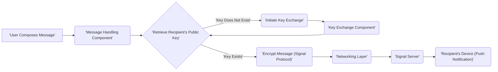
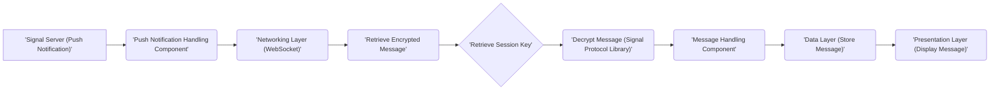
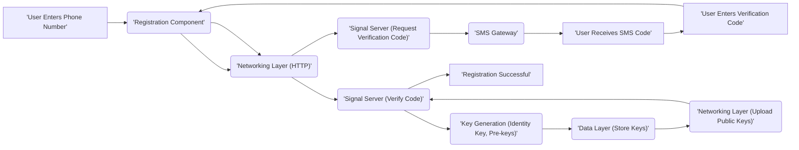
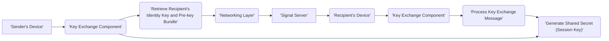
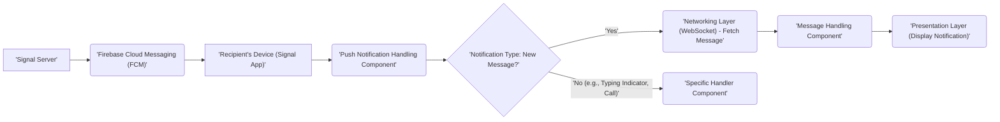

# Project Design Document: Signal-Android Application

**Version:** 1.1
**Date:** October 26, 2023
**Prepared By:** AI Software Architect

## 1. Project Overview

This document outlines the detailed design of the Signal-Android application, an open-source messaging application prioritizing privacy and security. This design document is intended to be used as the foundation for subsequent threat modeling activities. It provides a comprehensive description of the key components, data flows, and interactions within the application.

## 2. Goals

* Provide a detailed and unambiguous overview of the Signal-Android application's architecture.
* Clearly identify key components and their specific responsibilities within the system.
* Accurately illustrate the primary data flows for critical functionalities within the application.
* Establish a robust and shared understanding of the system's inner workings for effective threat modeling.
* Serve as a definitive reference point for security analysis, vulnerability assessment, and design improvements.

## 3. Target Audience

* Security Engineers involved in threat modeling and security assessments.
* Software Developers working on the Signal-Android application.
* Threat Modeling Team members responsible for identifying and mitigating potential risks.
* Security Auditors evaluating the application's security posture.

## 4. Scope

This document focuses on the design of the Signal-Android application running on user devices. It encompasses:

* Core messaging functionalities: sending and receiving text, audio, video, and file attachments.
* User lifecycle management: registration, account management, and profile settings.
* Contact management: discovery, storage, synchronization, and interaction with contacts.
* Cryptographic key management: generation, storage, exchange, and rotation of encryption keys.
* Handling of push notifications for incoming messages and events.
* Local data persistence and management, including message storage and caching.
* Backup and restore mechanisms for user data.

This document explicitly excludes:

* The Signal server-side infrastructure and its components.
* The design and functionality of the Signal Desktop application.
* The implementation details of the Signal iOS application.
* Low-level implementation specifics of individual classes, functions, or UI elements unless directly relevant to security.

## 5. System Architecture

The Signal-Android application is structured into distinct layers and components, each with specific responsibilities:

* **Presentation Layer (User Interface):**
    * Activities: Represent individual screens or user workflows within the application (e.g., chat screen, contact list).
    * Fragments: Reusable UI components within Activities, facilitating modularity and code reuse.
    * ViewModels: Manage UI-related data and business logic, surviving configuration changes and providing data to the UI.
    * Adapters: Bridge the gap between data sources and UI elements like RecyclerViews for displaying lists of data.
    * Custom Views and UI Components: Specialized UI elements tailored for specific functionalities within the application.
    * User Input Handling: Manages user interactions like button presses, text input, and gestures.

* **Business Logic Layer (Application Core):**
    * **Message Handling Component:**
        * Message Composition: Handling the creation of new messages.
        * Encryption: Utilizing the Signal Protocol to encrypt outgoing messages.
        * Decryption: Utilizing the Signal Protocol to decrypt incoming messages.
        * Message Storage: Persisting messages in the local database.
        * Message Sending: Transmitting encrypted messages via the Networking Layer.
        * Message Receiving: Processing incoming encrypted messages from the Networking Layer.
    * **Contact Management Component:**
        * Contact Discovery: Identifying other Signal users based on phone numbers or identifiers.
        * Contact Storage: Managing the local storage of contact information.
        * Contact Synchronization: Updating contact information from the server or the user's address book.
        * Contact Blocking/Unblocking: Managing user-defined contact restrictions.
    * **Key Management Component:**
        * Key Generation: Generating cryptographic keys (identity keys, pre-keys, session keys).
        * Key Storage: Securely storing cryptographic keys on the device.
        * Key Exchange: Implementing the Signal Protocol's key exchange mechanisms.
        * Key Rotation: Managing the process of updating cryptographic keys.
    * **Session Management Component:**
        * Session Establishment: Setting up secure communication sessions with other users.
        * Session Maintenance: Managing the state of active communication sessions.
        * Session Termination: Handling the closure of communication sessions.
    * **Media Handling Component:**
        * Media Capture: Handling the capture of images, audio, and video.
        * Media Encryption/Decryption: Encrypting and decrypting media files.
        * Media Storage: Managing the local storage of media files.
        * Media Display: Rendering media content within the application.
    * **Group Management Component:**
        * Group Creation: Facilitating the creation of new group chats.
        * Group Membership Management: Adding and removing members from groups.
        * Group Metadata Handling: Managing group names, avatars, and settings.
    * **Push Notification Handling Component:**
        * Registration with FCM: Registering the device for push notifications.
        * Processing Incoming Notifications: Handling notifications received from FCM.
        * Triggering Actions: Initiating actions based on received notifications (e.g., displaying a new message).
    * **Backup and Restore Component:**
        * Backup Creation: Generating encrypted backups of user data.
        * Backup Storage: Managing the storage of backups (local or cloud).
        * Backup Restoration: Restoring user data from a backup.

* **Data Layer (Persistence):**
    * Local Database (SQLite): Stores persistent application data, including messages, contacts, keys, and settings.
    * File System: Stores media files (images, audio, video) and potentially other application-specific files.
    * SharedPreferences/DataStore: Stores application preferences and small amounts of key-value data.

* **Networking Layer (Communication):**
    * Signal Protocol Library (libsignal-client): Implements the core cryptographic protocol for end-to-end encryption and secure communication.
    * WebSocket Connection: Establishes and maintains a persistent, bidirectional communication channel with the Signal server for real-time messaging.
    * HTTP Client (e.g., OkHttp): Used for various API calls to the Signal server, such as registration, contact discovery, and fetching profile information.

* **System Services Integration:**
    * Android OS APIs: Utilizes various Android system services for functionalities like camera access, microphone access, location services (optional), background task execution, and accessing device sensors.
    * Google Play Services (Firebase Cloud Messaging - FCM): Used for receiving push notifications from the Signal server.

## 6. Data Flow Diagrams

### 6.1. Sending a Message

### 6.2. Receiving a Message

### 6.3. User Registration

### 6.4. Key Exchange (Detailed)

### 6.5. Push Notification Handling (Message)

## 7. Key Technologies

* **Primary Programming Language:** Kotlin
* **Android SDK:** Provides access to Android platform APIs and functionalities.
* **Signal Protocol (via libsignal-client):**  The core cryptographic protocol providing end-to-end encryption, forward secrecy, and future secrecy.
* **SQLite (Android SDK):**  Embedded relational database used for local data persistence.
* **OkHttp:** Efficient HTTP client for making network requests.
* **Retrofit:** Type-safe HTTP client for Android and Java, built on top of OkHttp.
* **WebSocket (implementation likely within libsignal-client or a related library):** For maintaining a persistent, bidirectional connection to the Signal server.
* **Firebase Cloud Messaging (FCM):** Google's cross-platform messaging solution used for push notifications.
* **Protocol Buffers (protobuf):** Language-neutral, platform-neutral extensible mechanism for serializing structured data.
* **Room Persistence Library:** Provides an abstraction layer over SQLite for easier database access and management.
* **Coroutines:** For managing asynchronous operations in a more readable and efficient way.
* **Dependency Injection (e.g., Dagger/Hilt):** For managing dependencies and improving code maintainability.

## 8. Security Considerations (Detailed)

This section outlines key security considerations relevant to the Signal-Android application's design, which will be further analyzed during threat modeling:

* **End-to-End Encryption (Signal Protocol):**
    * Ensures that only the sender and recipient can decrypt message content.
    * Provides forward secrecy, meaning past communications remain secure even if keys are compromised in the future.
    * Provides future secrecy (or post-compromise security), meaning that even if a key is compromised, subsequent communications remain secure.
* **Cryptographic Key Management:**
    * Secure Generation: Ensuring the randomness and unpredictability of generated cryptographic keys.
    * Secure Storage: Protecting private keys from unauthorized access on the device (e.g., using Android Keystore).
    * Secure Exchange: Utilizing the Signal Protocol's key exchange mechanisms to establish secure communication channels.
    * Key Rotation: Regularly rotating cryptographic keys to limit the impact of potential compromises.
* **Local Data Security:**
    * Encryption at Rest: Encrypting the local database and media files to protect data when the device is at rest.
    * Secure File Handling: Implementing secure practices for storing and accessing files.
    * Protection against Rooting/Jailbreaking: Mitigating risks associated with compromised device operating systems.
* **Authentication and Authorization:**
    * User Authentication: Verifying the identity of users during registration and subsequent sessions.
    * Account Takeover Prevention: Implementing measures to prevent unauthorized access to user accounts.
    * Authorization: Controlling access to specific functionalities and data within the application.
* **Push Notification Security:**
    * Preventing Information Leakage: Ensuring that push notifications do not contain sensitive message content.
    * Protecting against Push Notification Spoofing: Verifying the authenticity of push notifications.
* **Code Security:**
    * Input Validation: Validating user inputs to prevent injection attacks.
    * Memory Safety: Avoiding memory-related vulnerabilities (e.g., buffer overflows).
    * Secure Coding Practices: Adhering to secure coding guidelines to minimize vulnerabilities.
    * Regular Security Audits and Penetration Testing: Identifying and addressing potential security flaws.
* **Dependency Management:**
    * Using Trusted Libraries: Relying on well-vetted and secure third-party libraries.
    * Vulnerability Scanning: Regularly scanning dependencies for known vulnerabilities.
    * Keeping Dependencies Up-to-Date: Applying security patches and updates to dependencies.
* **Privacy:**
    * Minimizing Data Collection: Collecting only necessary user data.
    * Data Minimization: Storing data for the shortest possible time.
    * Transparency: Being transparent about data collection and usage practices.
* **Side-Channel Attack Mitigation:**
    * Considering potential information leaks through observable system behavior (e.g., timing attacks).
* **Physical Security:**
    * Encouraging users to secure their devices with strong passwords or biometric authentication.
    * Providing features like screen lock and remote wipe (through OS capabilities).

## 9. Assumptions and Constraints

* The Signal server infrastructure is assumed to be a trusted and secure component.
* Users are assumed to have a valid phone number for initial registration.
* The underlying Android operating system provides a base level of security, but vulnerabilities may exist.
* Network connectivity is required for most core functionalities, including sending and receiving messages.
* Users are expected to grant necessary permissions for the application to function as intended.
* The security of the application is dependent on the correct implementation and maintenance of the Signal Protocol.
* This design document reflects the current understanding of the application's architecture and may evolve over time.

This document provides a detailed design overview of the Signal-Android application, intended to facilitate thorough threat modeling and security analysis. It serves as a crucial resource for understanding the system's components, data flows, and security considerations.