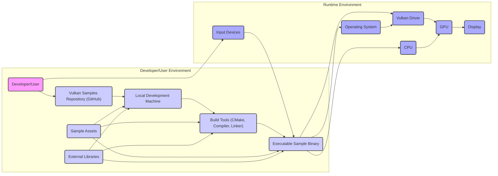

# Project Design Document: Vulkan Samples

**Version:** 1.1
**Date:** October 26, 2023
**Prepared By:** Gemini (AI Language Model)

## 1. Introduction

This document outlines the design of the Vulkan Samples project hosted on GitHub ([https://github.com/KhronosGroup/Vulkan-Samples](https://github.com/KhronosGroup/Vulkan-Samples)). This document serves as a reference for understanding the project's architecture, components, and data flow, which is crucial for subsequent threat modeling activities.

The Vulkan Samples project is a curated collection of practical examples demonstrating the effective use of the Vulkan graphics and compute API. These samples cover a wide range of Vulkan features, from basic setup to advanced rendering techniques and compute shaders, providing developers with working code to learn from, adapt, and extend.

## 2. Goals

The primary goals of the Vulkan Samples project are:

* **Comprehensive Education:** To provide clear, well-commented, and diverse examples that facilitate a deep understanding of the Vulkan API for developers of varying skill levels.
* **Feature Demonstration:** To explicitly showcase various Vulkan features, extensions, and recommended best practices in real-world scenarios.
* **Practical Reference:** To serve as a readily accessible and reliable reference for implementing specific Vulkan functionalities and solving common development challenges.
* **Community Enablement:** To foster a collaborative environment within the Vulkan community, encouraging contributions, knowledge sharing, and the adoption of best practices.
* **Platform Portability Guidance:** To offer examples that demonstrate cross-platform compatibility and highlight platform-specific considerations when using Vulkan.

## 3. Architecture Overview

The Vulkan Samples project is fundamentally a repository of client-side application examples. It does not involve a centralized server or backend infrastructure managed by the project itself. The architecture can be analyzed from two perspectives: the organization of the project repository and the runtime environment of individual samples.

**Project Repository Structure:**

The GitHub repository is logically structured into directories, with each directory typically containing one or more self-contained sample applications or demonstrations. Key elements of the repository structure include:

* **`samples/` Directory:** The primary location for individual sample projects, often categorized by Vulkan feature or rendering technique.
* **Source Code Files (`.cpp`, `.hpp`):** C++ source files implementing the core logic of each sample, including Vulkan API interactions.
* **Build System Files (`CMakeLists.txt`):** CMake configuration files used to define the build process for each sample and manage dependencies.
* **Asset Directories (`assets/`, `data/`):** Folders containing necessary resources such as textures, 3D models, shaders (GLSL or SPIR-V), and configuration files required by the samples.
* **External Dependency Definitions:** Files or instructions specifying the external libraries required to build and run the samples.
* **Documentation (`README.md`):** Markdown files providing instructions on how to build, run, and understand each sample, along with explanations of the demonstrated Vulkan concepts.
* **Utility/Helper Code:** Common code modules or libraries shared across multiple samples to simplify common tasks.

**Sample Execution Environment:**

When a specific sample is built and executed, the following components interact:

* **Target Operating System (OS):** The specific operating system on which the sample is being executed (e.g., Windows, Linux, macOS, Android, iOS).
* **Vulkan Implementation (Driver):** The platform-specific implementation of the Vulkan API provided by the GPU vendor or a software emulation layer.
* **Central Processing Unit (CPU):** Executes the application's primary logic, including Vulkan API calls and general-purpose computations.
* **Graphics Processing Unit (GPU):** Performs the computationally intensive graphics and compute operations as directed by the Vulkan API calls.
* **Display Subsystem:** The hardware and software responsible for presenting the rendered output to the user.
* **User Input Devices:** Hardware devices such as keyboards, mice, touchscreens, and game controllers used for interacting with the running sample.
* **System Memory (RAM):** Used to store application code, data, and resources.

## 4. Component Details

This section provides a more detailed description of the key components involved in the Vulkan Samples project ecosystem.

* **Source Code (C++):**
    * Contains the fundamental logic of each sample, encompassing Vulkan API calls for device initialization, memory allocation, resource creation (buffers, images, etc.), command buffer recording and submission, synchronization, and rendering or compute dispatch.
    * May implement specific rendering algorithms, compute kernels, or techniques to demonstrate particular Vulkan features.
    * Represents a potential attack surface if vulnerabilities such as buffer overflows, use-after-free errors, or incorrect synchronization primitives are present.

* **Build System (CMake):**
    * Automates the process of compiling and linking the source code, managing dependencies, and generating platform-specific build files (e.g., Makefiles, Visual Studio project files).
    * Defines compiler flags, linker options, and the structure of the resulting executables.
    * Potential security risks include malicious modifications to CMake files that could inject malicious code or alter the build process to create compromised binaries.

* **Assets (Textures, Models, Shaders):**
    * Provide the visual and data content for the samples.
        * **Textures:** Image files (e.g., `.png`, `.jpg`, `.ktx`) used for surface details, environment maps, and other visual effects.
        * **Models:** 3D geometry data (often in formats like `.obj`, `.gltf`) representing objects in the scene.
        * **Shaders:** Programs written in shading languages (typically GLSL or pre-compiled SPIR-V) that are executed on the GPU to perform rendering calculations (vertex shaders, fragment shaders, compute shaders).
    * Maliciously crafted assets could potentially exploit vulnerabilities in image loaders, model parsers, or shader compilers within the Vulkan driver or the sample code. For instance, excessively large or malformed assets could lead to buffer overflows or denial-of-service conditions.

* **External Dependencies (e.g., GLFW, GLM, stb_image):**
    * Third-party libraries used to simplify common tasks such as window creation and input handling (GLFW), mathematical operations (GLM), and image loading (stb_image).
    * Vulnerabilities in these external libraries could be indirectly exploited through the Vulkan Samples if the samples utilize the vulnerable components of these libraries. It's crucial to track and update these dependencies.

* **Operating System (OS):**
    * Provides the foundational platform upon which the samples execute, managing system resources, providing APIs for interacting with hardware, and enforcing security policies.
    * OS vulnerabilities could be exploited by malicious samples or through interactions with the operating system's services.

* **Vulkan Driver (Implementation):**
    * A software component, typically provided by the GPU vendor, that implements the Vulkan API specification for a specific GPU architecture.
    * Translates generic Vulkan API calls into GPU-specific instructions and manages the interaction between the application and the GPU hardware.
    * Driver bugs or security flaws could be triggered by specific sequences of Vulkan API calls or by providing specially crafted data, potentially leading to crashes, incorrect rendering, or even security breaches.

* **Central Processing Unit (CPU):**
    * Executes the main application thread, including the logic for setting up the Vulkan environment, managing resources, and issuing commands to the GPU.
    * Responsible for general-purpose computations and orchestrating the application's lifecycle.

* **Graphics Processing Unit (GPU):**
    * A specialized electronic circuit designed to rapidly manipulate and alter memory to accelerate the creation of images in a frame buffer intended for output to a display device.
    * Executes shaders and performs the heavy lifting of rendering and compute operations as instructed by the Vulkan driver.

* **Display Subsystem:**
    * Encompasses the hardware and software components responsible for presenting the rendered output to the user, including the display device itself and the associated drivers and APIs.

* **User Input Devices (Keyboard, Mouse, Touchscreen, etc.):**
    * Allow users to interact with the running samples, providing input that can affect the application's state and behavior.
    * Input handling logic within the samples could be vulnerable to unexpected or malicious input if not properly validated and sanitized.

## 5. Data Flow Diagram

**Data Flow Description:**

* A "Developer/User" interacts with the "Vulkan Samples Repository (GitHub)" to download the source code, assets, and potentially dependency information.
* The downloaded content is stored on the "Local Development Machine".
* "Build Tools (CMake, Compiler, Linker)" on the local machine process the source code, "Sample Assets", and "External Libraries" to create an "Executable Sample Binary".
* When the "Executable Sample Binary" is run, the "Developer/User" can provide input via "Input Devices".
* The "Executable Sample Binary" interacts with the "Operating System" and the "Vulkan Driver".
* The "CPU" executes the application logic, making calls to the Vulkan API.
* The "Vulkan Driver" translates these API calls into instructions for the "GPU".
* The "GPU" performs the rendering or compute operations.
* The rendered output is displayed on the "Display".
* The "Operating System" also interacts with the "Vulkan Driver" to manage resources and communication.

## 6. Security Considerations

While the primary purpose of the Vulkan Samples project is educational, security considerations are paramount, especially when considering potential unintended uses or vulnerabilities.

* **Code Vulnerabilities in Samples:**  Bugs or logical flaws within the C++ source code of the samples could be exploited. This includes, but is not limited to:
    * Buffer overflows and underflows.
    * Out-of-bounds memory access.
    * Use-after-free errors.
    * Integer overflows.
    * Incorrect synchronization primitives leading to race conditions or deadlocks.
    * Improper handling of error conditions.
* **Vulnerabilities in External Dependencies:**  Security flaws present in the third-party libraries used by the samples (e.g., GLFW, GLM, stb_image) could be exploited if the samples utilize the vulnerable functionality. This necessitates regular dependency scanning and updates.
* **Maliciously Crafted Assets:**   специально crafted assets (textures, models, shaders) could potentially exploit vulnerabilities in:
    * **Image Loaders:**  Exploiting flaws in libraries used to load texture files.
    * **Model Parsers:**  Triggering vulnerabilities in code that parses 3D model data.
    * **Shader Compilers (within the Driver):**  Crafted shader code could potentially trigger bugs or security issues within the GPU driver's shader compiler.
* **Build System Security:**  Malicious actors could attempt to inject malicious code or alter the build process by modifying the `CMakeLists.txt` files or introducing compromised build tools. This could lead to the creation of backdoored or otherwise compromised executables.
* **Vulkan Driver Vulnerabilities:**  Bugs or security flaws within the Vulkan driver itself could be triggered by specific sequences of API calls or data patterns within the samples. Exploiting driver vulnerabilities could lead to system instability, crashes, or even privilege escalation.
* **Operating System Security:**  The samples operate within the security context of the underlying operating system. Vulnerabilities in the OS could be exploited by malicious samples or through interactions with OS services.
* **Input Handling Vulnerabilities:**  If samples process user input (e.g., for camera control or interaction), vulnerabilities in the input handling logic (e.g., lack of input validation) could lead to crashes, unexpected behavior, or potentially more serious security issues.

## 7. Deployment Model

The Vulkan Samples project does not follow a traditional deployment model for applications or services. Instead, its deployment is characterized by:

* **Open Source Availability:** The complete source code, assets, and build scripts are publicly accessible on GitHub under an open-source license.
* **Local Build and Execution:** Developers and users are expected to download the project repository and build the individual samples locally on their own machines using the provided build system (CMake).
* **No Centralized Infrastructure:** There is no central server or infrastructure maintained by the Vulkan Samples project itself for hosting or running the samples.
* **Decentralized Usage:** Each user independently builds and executes the samples within their own development or testing environment.

## 8. Assumptions and Constraints

* **Trust in the Source:**  It is generally assumed that the code and assets provided by the Khronos Group are not intentionally malicious. However, the possibility of unintentional bugs and vulnerabilities remains.
* **User Responsibility:** Users are responsible for ensuring their development and execution environments are secure and for understanding the potential risks associated with building and running software from external sources.
* **Platform Dependence:** The behavior and potential vulnerabilities of the samples can vary depending on the specific operating system, GPU hardware, and Vulkan driver version being used.
* **Project Evolution:** The Vulkan Samples project is actively maintained and updated. This means the codebase is subject to change, which may introduce new features, bug fixes, and potentially new vulnerabilities.
* **Build Toolchain Security:** The security of the build process relies on the integrity of the user's local build toolchain (CMake, compiler, linker).

## 9. Future Considerations

* **Automated Static Analysis:** Integrating automated static analysis tools into the development workflow could help proactively identify potential code vulnerabilities before they are committed to the repository.
* **Dependency Vulnerability Scanning:** Implementing automated scanning of external dependencies for known vulnerabilities and providing guidance on updating them is crucial.
* **Regular Security Audits:** Conducting periodic security audits of the codebase by security experts could help identify and address potential security weaknesses.
* **Clear Security Guidelines for Contributors:** Providing clear guidelines for contributors on secure coding practices and vulnerability reporting would enhance the project's overall security posture.
* **Sample Sandboxing/Isolation:** Exploring techniques to run individual samples in isolated or sandboxed environments could mitigate the impact of potential vulnerabilities.
* **Continuous Integration Security Checks:** Incorporating security checks into the continuous integration pipeline could help ensure that new code changes do not introduce new vulnerabilities.

This revised document provides a more detailed and structured overview of the Vulkan Samples project's design, incorporating improvements to clarity, component descriptions, and security considerations. This enhanced documentation will serve as a more robust foundation for subsequent threat modeling activities.