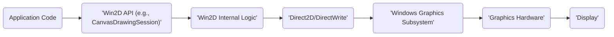

# Project Design Document: Win2D

**Version:** 1.1
**Date:** October 26, 2023
**Author:** AI Software Architect

## 1. Introduction

This document provides an enhanced design overview of the Win2D project, an immediate-mode 2D graphics API for Windows. This revised document aims to provide even greater clarity and detail regarding the system's architecture, components, and data flow, making it a more robust foundation for subsequent threat modeling activities.

## 2. Project Overview

Win2D is a modern Windows Runtime API designed to deliver high-performance 2D graphics rendering capabilities. Built upon the robust foundation of Direct2D and DirectWrite, it offers a more developer-friendly and efficient interface for creating visually rich applications across various Windows platforms, including Universal Windows Platform (UWP), .NET (WinUI 3), and native C++ applications.

## 3. Goals and Objectives

*   To establish a contemporary and efficient 2D graphics API for the Windows ecosystem, providing a superior alternative to legacy GDI-based solutions.
*   To maximize rendering performance by leveraging hardware acceleration through the underlying Direct2D framework.
*   To equip developers with a comprehensive suite of drawing primitives and effects, enabling the creation of sophisticated and visually engaging graphics.
*   To facilitate seamless integration with various image formats and provide robust image manipulation capabilities, including loading, saving, and processing.
*   To ensure smooth interoperability within the broader Windows ecosystem, fostering compatibility with other Windows APIs and UI frameworks.
*   To deliver a consistent and unified API experience across diverse Windows platforms, simplifying development efforts.

## 4. Architecture and Design

Win2D employs a layered architecture, abstracting the complexities of the underlying graphics system while providing a user-friendly interface. The key layers are:

*   **Application Layer:** This represents the developer's application code, which utilizes the Win2D API to initiate and manage drawing operations.
*   **Win2D API Layer:** This layer exposes both managed (.NET) and native (C++) interfaces, providing developers with the tools to interact with the graphics engine. It handles crucial tasks such as parameter validation, resource management, and marshaling between different environments.
*   **Direct2D/DirectWrite Abstraction Layer:** Internally, Win2D relies on Direct2D for core rendering tasks and DirectWrite for advanced text rendering. This layer acts as an intermediary, managing the communication and interaction with these fundamental DirectX components.
*   **Windows Graphics Subsystem:** This is a core component of the Windows operating system, responsible for the management of graphics resources, including memory and device contexts, and for orchestrating the interaction with the underlying graphics hardware.
*   **Graphics Hardware:** The physical Graphics Processing Unit (GPU) is responsible for the actual execution of rendering commands, performing the computationally intensive tasks required for displaying graphics.

## 5. Components

The Win2D project is composed of several essential components, each serving a specific purpose:

*   **`CanvasDevice`:** This object represents the underlying Direct2D device. It serves as the primary factory for creating other Win2D resources and is the entry point for interacting with the graphics subsystem.
*   **`CanvasRenderTarget`:** An off-screen drawing surface that allows for pre-rendering and composition of graphics. This is useful for complex scenes or effects that benefit from being rendered in stages.
*   **`CanvasSwapChain`:** This component facilitates the integration of Win2D rendering with the application's UI framework, enabling the presentation of rendered content directly onto the screen. It manages the buffer swapping process for smooth animation.
*   **Drawing Primitives:**
    *   `CanvasPathBuilder`: A tool for constructing intricate vector paths composed of lines, curves, and arcs.
    *   `CanvasGeometry`: Represents defined geometric shapes, which can be used for drawing or as clipping masks.
    *   `CanvasSolidColorBrush`: Used to fill areas with a uniform, single color.
    *   `CanvasLinearGradientBrush`: Fills areas with a smooth transition between two or more colors along a straight line.
    *   `CanvasRadialGradientBrush`: Fills areas with a smooth transition between colors emanating from a central point.
    *   `CanvasImageBrush`: Fills areas by tiling or stretching an image.
*   **Text Rendering:**
    *   `CanvasTextFormat`: Defines the characteristics of text, such as font family, size, style (bold, italic), and alignment.
    *   `CanvasTextLayout`: Represents a formatted block of text, taking into account line breaks, wrapping, and other layout properties.
*   **Image Handling:**
    *   `CanvasBitmap`: Represents a bitmap image loaded into memory, suitable for drawing and manipulation.
    *   `CanvasVirtualBitmap`: An optimized way to handle very large images by loading and managing only the visible portions, conserving memory.
*   **Effects:**
    *   A library of built-in effects (e.g., blur, color adjustments, convolution filters) that can be applied to various drawing operations to enhance visuals.
    *   Support for custom pixel shaders, allowing developers to implement highly specialized and unique visual effects by writing code that runs directly on the GPU.
*   **Interoperability:**
    *   APIs that enable seamless interaction with Direct3D surfaces, allowing for the integration of 2D and 3D rendering within the same application.
    *   APIs that provide access to the underlying Direct2D device context, offering advanced developers greater control and flexibility for specialized rendering scenarios.

## 6. Data Flow

The process of rendering graphics with Win2D involves a well-defined flow of data and commands.

Detailed breakdown of the drawing operation data flow:

*   **Application Code:** The developer's application initiates drawing actions by calling methods within the Win2D API, such as `DrawRectangle`, `DrawText`, or `FillEllipse`.
*   **Win2D API:** The API layer receives these drawing commands. It performs essential tasks like validating the input parameters to ensure they are within acceptable ranges and in the correct format.
*   **Win2D Internal Logic:** This component acts as a translator, converting the high-level Win2D commands into the corresponding lower-level instructions understood by Direct2D and DirectWrite. It also manages the creation and allocation of necessary graphics resources and maintains the current rendering state.
*   **Direct2D/DirectWrite:** These core DirectX components receive the translated drawing instructions. Direct2D handles the rendering of 2D primitives and effects, while DirectWrite is responsible for the layout and rendering of text.
*   **Windows Graphics Subsystem:** This system component plays a crucial role in managing the interaction between the software and the graphics hardware. It schedules rendering tasks, manages memory allocation for graphics resources, and interacts with the graphics driver.
*   **Graphics Hardware:** The GPU takes over at this stage, performing the actual rasterization process, which involves converting the vector-based drawing instructions into pixels that can be displayed on the screen.
*   **Display:** Finally, the rendered output, now in pixel format, is sent to the display device, making the visual content visible to the user.

The process of loading an image into Win2D follows a different data flow:

Detailed breakdown of the image loading data flow:

*   **Application Code:** The application initiates the image loading process by calling methods in the Win2D API, typically using `CanvasBitmap.LoadAsync` to load an image asynchronously.
*   **Win2D API:** The Win2D API receives the request to load an image and initiates the necessary steps.
*   **Image Decoder (WIC):** Win2D typically leverages the Windows Imaging Component (WIC) for decoding a wide variety of image formats (e.g., JPEG, PNG, BMP). WIC provides a standardized way to handle different image encoding schemes.
*   **File System / Network:** The image data is retrieved from the specified source, which could be a local file on the file system or a resource accessed over a network connection.
*   **Image Decoder:** WIC decodes the raw image data from its encoded format into a raw pixel format that can be understood by Win2D.
*   **Win2D API:** The decoded pixel data is then used by the Win2D API to create a `CanvasBitmap` object in memory, making the image ready for use in drawing operations.
*   **Application Code:** The `CanvasBitmap` object is now available to the application, allowing it to be drawn onto a canvas or manipulated using other Win2D features.

## 7. Security Considerations

A thorough understanding of potential security implications is paramount for effective threat modeling. Key areas of concern include:

*   **Input Validation:**
    *   All drawing parameters provided by the application (e.g., coordinates, dimensions, color values) must undergo rigorous validation to prevent issues such as out-of-bounds memory access or unexpected program behavior.
    *   Image data loaded from external sources should be thoroughly validated to protect against malformed or intentionally malicious files that could lead to crashes, buffer overflows, or other vulnerabilities.
    *   When utilizing custom shader code, extreme caution is necessary, as this code executes directly on the GPU and could potentially be exploited if not carefully vetted.
*   **Resource Management:**
    *   Improper management of graphics resources, such as memory leaks or excessive allocation of GPU memory, can lead to denial-of-service conditions, where the application or even the entire system becomes unresponsive.
    *   Enforcing limits on resource usage is crucial to prevent malicious applications from consuming excessive resources and impacting system stability.
*   **Interoperability with Native Code:**
    *   When Win2D interacts with underlying native APIs like Direct2D/DirectWrite or integrates with custom native code components, vulnerabilities present in those components could potentially affect the security of Win2D.
    *   The risk of buffer overflows, memory corruption, or other memory-related issues in native code needs careful consideration.
*   **Privilege Escalation:** While Win2D operates within the security context of the application, potential vulnerabilities in Win2D or the underlying Windows graphics subsystem could theoretically be exploited to gain elevated privileges, although this is generally considered a lower-probability risk for a library like Win2D.
*   **Denial of Service:**
    *   Maliciously crafted drawing commands or specially designed image data could potentially trigger crashes within the application or even destabilize the graphics driver.
    *   Submitting an excessive number of rendering operations or requests for large resources could overwhelm the GPU, leading to performance degradation or system instability, effectively causing a denial of service.
*   **Information Disclosure:** While less likely than other threats, vulnerabilities in Win2D could potentially lead to the unintentional disclosure of sensitive information through rendering artifacts, memory leaks, or other unintended side effects.

## 8. Deployment

Win2D is typically distributed and deployed as a NuGet package. Developers integrate this package into their Windows application projects. The necessary Win2D runtime libraries are then included as part of the application's deployment package. The specific deployment process can vary slightly depending on the target platform (UWP, WinUI 3, etc.) and the chosen packaging method.

## 9. Future Considerations

*   **Continued Performance Optimizations:** Ongoing efforts to leverage the latest DirectX features and advancements in graphics hardware to further enhance rendering performance and efficiency.
*   **Expansion of Effects and Rendering Features:**  Adding more sophisticated and advanced visual effects, rendering techniques, and capabilities to empower developers with greater creative control.
*   **Enhancements to Debugging and Diagnostics Tools:**  Improving the tools and resources available to developers for troubleshooting Win2D-related issues, making the development process smoother and more efficient.
*   **Exploration of Broader Platform Support:** While currently focused on the Windows ecosystem, future considerations might include exploring the feasibility of extending support to other operating systems, although this is not an immediate priority.

This enhanced design document provides a more detailed and comprehensive understanding of the Win2D project's architecture and functionality. This improved clarity will be beneficial for conducting thorough and effective threat modeling activities, enabling security experts to identify potential risks and recommend appropriate mitigation strategies with greater precision.
