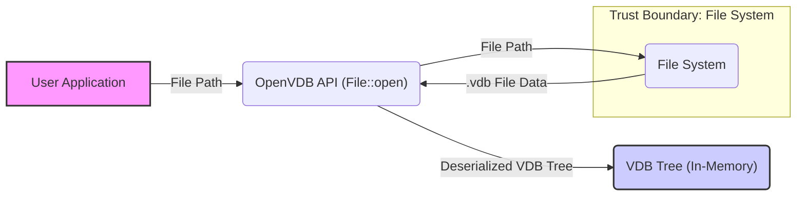
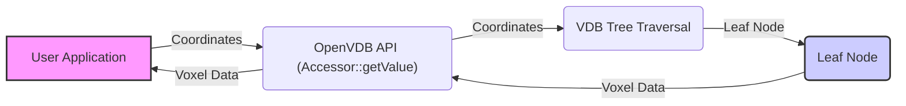
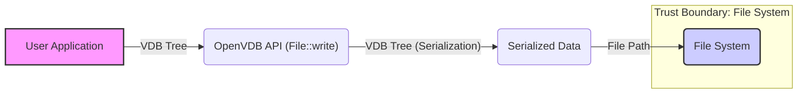

# Project Design Document: OpenVDB

**Version:** 1.1
**Date:** October 26, 2023
**Author:** AI Software Architect

## 1. Introduction

This document provides a detailed design overview of the OpenVDB project, an open-source C++ library for storing and manipulating sparse volumetric data. This document is intended to serve as a foundation for subsequent threat modeling activities. It outlines the key components, architecture, data flow, and external interactions of the OpenVDB library, with a focus on aspects relevant to security analysis.

## 2. Goals and Objectives

The primary goals of the OpenVDB project are:

* **Efficient Storage:** Provide a memory-efficient representation for sparse volumetric data, minimizing memory footprint for large, sparse datasets.
* **Fast Access:** Enable rapid access and manipulation of individual voxel data and performant iteration over active voxels.
* **Flexibility:** Support various data types (scalars, vectors, matrices) and grid structures (uniform, staggered).
* **Interoperability:** Facilitate seamless integration with other software packages in the visual effects (VFX), animation, and scientific computing domains through standard file formats and APIs.
* **Extensibility:** Allow users to extend the library with custom algorithms, node types, and data structures through a well-defined plugin mechanism.

## 3. Architecture Overview

OpenVDB is primarily a C++ library with bindings for other languages like Python. Its core architecture revolves around a hierarchical data structure called a "VDB tree." This tree efficiently represents sparse volumes by only storing data where it exists, using a tree-like structure to index and access voxel data.

The key architectural components are:

* **Core Library (C++):** This is the foundational layer of OpenVDB, providing the fundamental data structures (trees, nodes, voxels), algorithms for manipulating VDBs, and core API.
* **VDB Tree:** The central data structure, a hierarchical tree that organizes voxel data spatially. It consists of:
    * **Root Node:** The top-level node of the tree, acting as the entry point for traversal.
    * **Internal Nodes:** Nodes that contain pointers to child nodes, subdividing the spatial domain.
    * **Leaf Nodes:** Terminal nodes that directly store voxel data in dense blocks or potentially through further indirection.
* **Accessor Classes:** Provide a controlled and efficient way to access and modify voxel data within the VDB tree, abstracting away the underlying tree structure.
* **File I/O:** Mechanisms for reading and writing VDB data to and from persistent storage. This includes support for the standardized `.vdb` file format and potentially other formats.
* **Tools and Utilities:** Command-line tools and utility functions built on top of the core library for common VDB operations (e.g., inspection, conversion, manipulation).
* **API Bindings (e.g., Python):** Wrappers that allow users to interact with the OpenVDB library from other programming languages, often simplifying common tasks.
* **Plugin System:** A mechanism for extending OpenVDB's functionality by loading dynamically linked libraries containing custom node types or algorithms.

## 4. Component Details

This section provides a more detailed description of the key components, highlighting aspects relevant to security.

### 4.1. Core Library (C++)

* **Responsibilities:**
    * Implementation of the core VDB tree data structure and its associated algorithms (traversal, modification, topology queries).
    * Management of dynamic memory allocation and deallocation for VDB nodes and voxel data, a critical area for potential vulnerabilities.
    * Implementation of core algorithms for VDB manipulation (e.g., value access, iteration, modification, resampling, filtering).
    * Definition of the core C++ API, which forms the basis for all interactions with the library.
    * Handling error conditions and exceptions.
* **Security Considerations:**
    * Memory safety vulnerabilities (buffer overflows, use-after-free) within core algorithms could lead to crashes or arbitrary code execution.
    * Integer overflows in calculations related to tree structure or voxel indexing could lead to unexpected behavior or memory corruption.
    * Improper handling of error conditions could lead to exploitable states.

### 4.2. VDB Tree

* **Responsibilities:**
    * Efficiently storing sparse volumetric data by only allocating memory for active regions.
    * Providing a hierarchical structure for organizing voxels, enabling efficient spatial queries.
    * Enabling fast lookups and modifications of voxel data based on coordinates.
* **Structure:**
    * The tree is typically an N-ary tree (often an octree or similar), where each node subdivides space into smaller regions.
    * Each node covers a specific spatial region defined by its bounding box.
    * Empty regions (without active voxels) are not explicitly stored, contributing to memory efficiency.
    * Leaf nodes contain the actual voxel data, which can be stored densely or through further levels of indirection.
* **Security Considerations:**
    * Maliciously crafted tree structures (e.g., deeply nested trees, excessively large bounding boxes) could lead to denial-of-service by consuming excessive memory or CPU resources during traversal.
    * Inconsistencies in the tree structure could lead to crashes or incorrect data access.

### 4.3. Accessor Classes

* **Responsibilities:**
    * Providing a type-safe and user-friendly interface for interacting with the VDB tree.
    * Handling the traversal of the tree to locate specific voxels based on their coordinates.
    * Offering methods for getting and setting voxel values, potentially with bounds checking.
    * Potentially providing optimized access patterns for common operations (e.g., iterating over neighbors).
* **Types:**
    * `TypedAccessor`: Accessor specialized for a specific voxel data type, providing type safety.
    * `ConstAccessor`: Provides read-only access to voxel data, enforcing immutability.
* **Security Considerations:**
    * Lack of proper bounds checking in accessor methods could lead to out-of-bounds reads or writes, causing crashes or memory corruption.
    * Incorrect handling of coordinate transformations could lead to accessing unintended memory locations.

### 4.4. File I/O

* **Responsibilities:**
    * Reading VDB data from files stored on disk, interpreting the `.vdb` file format.
    * Writing VDB data to files on disk, adhering to the `.vdb` file format specification.
    * Handling the serialization and deserialization of the VDB tree structure, node metadata, and voxel data.
    * Supporting potential compression and decompression of data within the file format.
* **Key Components:**
    * `File`: Class for handling file opening, closing, and seeking operations.
    * `Stream`: Abstraction for reading and writing raw byte streams from/to files.
    * Serialization/Deserialization logic for different node types, data types, and metadata.
    * Code for handling compression algorithms (e.g., zlib).
* **Security Considerations:**
    * **File Format Vulnerabilities:** Maliciously crafted `.vdb` files could exploit vulnerabilities in the parsing logic (e.g., buffer overflows, integer overflows, format string bugs) leading to crashes, denial of service, or arbitrary code execution.
    * **Deserialization Attacks:**  Exploiting vulnerabilities during the deserialization process to inject malicious code or manipulate program state.
    * **Path Traversal:** If file paths are not properly sanitized, attackers could potentially read or write files outside the intended directory.
    * **Compression/Decompression Vulnerabilities:** Issues in the underlying compression libraries could be exploited.

### 4.5. Tools and Utilities

* **Responsibilities:**
    * Providing command-line tools for common VDB operations, such as inspecting file contents, converting between formats, and performing basic manipulations.
    * Offering utility functions for tasks like format conversion, data manipulation, and potentially visualization.
* **Examples:**
    * `vdb_print`: Tool to print information about a VDB file's structure and contents.
    * `vdb_convert`: Tool to convert between different VDB formats or data types.
    * Other utilities for operations like merging, splitting, or modifying VDBs.
* **Security Considerations:**
    * Command-line injection vulnerabilities if user-supplied input is not properly sanitized before being passed to shell commands.
    * Vulnerabilities in the parsing of command-line arguments could lead to unexpected behavior.
    * If tools operate on untrusted files, they are susceptible to the same file format vulnerabilities as the core library's file I/O.

### 4.6. API Bindings (e.g., Python)

* **Responsibilities:**
    * Exposing the functionality of the core C++ library to other programming languages, enabling wider adoption and easier integration.
    * Providing a more convenient and high-level interface for users in those languages, often abstracting away low-level details.
    * Handling the translation between data types and function calls between the C++ library and the target language.
* **Implementation:**
    * Typically implemented using libraries like Boost.Python or Pybind11, which handle the complexities of interoperability.
* **Security Considerations:**
    * Vulnerabilities in the binding layer itself could expose the underlying C++ library to security risks.
    * Incorrect handling of object lifetimes or memory management in the bindings could lead to memory leaks or crashes.
    * If the bindings allow direct access to raw pointers or memory, this could introduce security vulnerabilities if not used carefully.

### 4.7. Plugin System

* **Responsibilities:**
    * Allowing users to extend OpenVDB's functionality by creating and loading custom node types, algorithms, or file format handlers.
    * Providing a mechanism for dynamically linking and loading these extensions at runtime.
* **Security Considerations:**
    * **Malicious Plugins:** If the plugin loading mechanism does not enforce sufficient security measures, malicious plugins could be loaded and executed, potentially compromising the application using OpenVDB.
    * **Lack of Sandboxing:** If plugins are not executed in a sandboxed environment, they have full access to the application's resources and memory.
    * **API Abuse:** Vulnerabilities in the plugin API could be exploited by malicious plugins to gain unauthorized access or cause harm.
    * **Supply Chain Attacks:** If plugins are sourced from untrusted locations, they could contain malware.

## 5. Data Flow

The following outlines the typical data flow scenarios within the OpenVDB library, highlighting potential trust boundaries.

### 5.1. Reading a VDB File

* **Description:**
    1. The user application provides a file path to the OpenVDB API to read a VDB file.
    2. The OpenVDB File I/O component interacts with the file system to read the `.vdb` file data.
    3. The data from the file is deserialized and used to reconstruct the VDB tree in memory.
    4. The user application can then access and manipulate the in-memory VDB tree.
* **Threats:** Maliciously crafted `.vdb` files could exploit parsing vulnerabilities.

### 5.2. Accessing Voxel Data

* **Description:**
    1. The user application requests access to a specific voxel using the OpenVDB Accessor API, providing voxel coordinates.
    2. The Accessor traverses the VDB tree based on the provided coordinates.
    3. The traversal leads to the relevant leaf node containing the voxel data.
    4. The voxel data is retrieved from the leaf node and returned to the user application.
* **Threats:** Out-of-bounds access if coordinates are not validated.

### 5.3. Writing a VDB File

* **Description:**
    1. The user application calls a function in the OpenVDB API to write the current in-memory VDB tree to a file, providing a file path.
    2. The OpenVDB File I/O component serializes the VDB tree structure and voxel data.
    3. The serialized data is written to a `.vdb` file in the file system.
* **Threats:** Path traversal vulnerabilities if the file path is not sanitized.

## 6. External Interactions

OpenVDB interacts with the external environment in the following ways, which represent potential attack surfaces:

* **File System:** For reading and writing `.vdb` files, representing a significant trust boundary.
* **Memory:** For dynamic memory allocation and management, a critical area for potential vulnerabilities.
* **CPU:** For executing algorithms and manipulating VDB data. Excessive CPU usage could indicate a denial-of-service attack.
* **Other Libraries (Dependencies):** OpenVDB depends on external libraries, which could introduce vulnerabilities if they are compromised or have known security flaws. Examples include:
    * **Boost:** For general-purpose utilities and data structures.
    * **TBB (Threading Building Blocks):** For parallel processing.
    * **Zlib:** For data compression.
    * **Python (if using bindings):** For the Python interpreter and related libraries.
* **User Applications:** Applications that utilize the OpenVDB library, which could provide malicious input or misuse the API.
* **Plugin Libraries:** Dynamically loaded libraries that extend OpenVDB's functionality, representing a significant trust boundary if not handled carefully.

## 7. Security Considerations (Detailed)

This section provides a more detailed overview of potential security considerations, categorized by component and interaction.

* **Core Library:**
    * Memory corruption due to buffer overflows, use-after-free, or double-free vulnerabilities in core algorithms.
    * Integer overflows in calculations related to tree structure or voxel indexing.
    * Denial of service due to excessive memory allocation or infinite loops in algorithms.
* **VDB Tree:**
    * Denial of service attacks by providing input that creates excessively deep or wide trees, consuming excessive memory or CPU during traversal.
    * Inconsistencies in tree structure leading to crashes or incorrect data access.
* **Accessor Classes:**
    * Out-of-bounds reads or writes due to lack of proper bounds checking.
    * Incorrect handling of coordinate transformations leading to access of unintended memory locations.
* **File I/O:**
    * **File Format Vulnerabilities:** Buffer overflows, integer overflows, format string bugs, and other parsing vulnerabilities in the `.vdb` file format parsing logic.
    * **Deserialization Attacks:** Exploiting vulnerabilities during deserialization to inject malicious code or manipulate program state.
    * **Path Traversal:** Reading or writing files outside of intended directories due to insufficient path sanitization.
    * **Compression/Decompression Vulnerabilities:** Exploiting vulnerabilities in the underlying compression libraries (e.g., zlib).
* **Tools and Utilities:**
    * Command injection vulnerabilities if user-supplied input is not properly sanitized.
    * Vulnerabilities in command-line argument parsing.
    * Susceptibility to file format vulnerabilities when operating on untrusted files.
* **API Bindings:**
    * Memory leaks or crashes due to incorrect object lifetime management in the bindings.
    * Exposure of raw pointers or memory, leading to potential vulnerabilities if misused.
* **Plugin System:**
    * Execution of arbitrary code from malicious plugins.
    * Lack of sandboxing allowing plugins to access sensitive resources.
    * API vulnerabilities that could be exploited by malicious plugins.
    * Supply chain attacks through compromised plugin libraries.

## 8. Assumptions and Constraints

* **Trusted User:** It is generally assumed that the user interacting with the OpenVDB API is not intentionally malicious, but may make mistakes.
* **Untrusted Input:** Input data from files or external sources should be treated as untrusted and validated.
* **Platform Dependence:** Security considerations may vary depending on the operating system and compiler used.
* **Dependency Security:** The security of OpenVDB is partially dependent on the security of its external dependencies. It is assumed that these dependencies are regularly updated and patched.
* **No Built-in Security Features:** OpenVDB itself does not implement advanced security features like encryption or authentication. These would need to be handled by the applications using OpenVDB.

## 9. Threat Model Scope

The subsequent threat modeling exercise will focus on the following aspects of OpenVDB:

* **File I/O:** Specifically the parsing and deserialization of the `.vdb` file format.
* **Core Library Algorithms:** Focus on algorithms that involve memory manipulation and are exposed through the public API.
* **API Bindings:**  Consider the potential for vulnerabilities introduced in the binding layer.
* **Plugin System:** Analyze the security implications of loading and executing external plugins.

The threat model will exclude:

* **Security of the underlying operating system or hardware.**
* **Vulnerabilities in the compilers or build tools used to create OpenVDB.**
* **Denial-of-service attacks that rely on overwhelming system resources outside of OpenVDB's control.**

## 10. Future Considerations

* **Enhanced Security Features:** Exploring options for adding security features like data integrity checks (e.g., checksums in the file format) or optional encryption for sensitive data.
* **Sandboxing for Plugins:** Investigating the feasibility of running plugins in a sandboxed environment to limit their access to system resources.
* **Static Analysis:** Incorporating static analysis tools into the development process to identify potential security vulnerabilities early on.
* **Fuzzing:** Utilizing fuzzing techniques to test the robustness of file parsing and other critical components against malformed input.

This improved document provides a more detailed and security-focused design overview of the OpenVDB project, providing a solid foundation for a comprehensive threat modeling exercise. The enhanced component descriptions, refined data flow diagrams, and expanded security considerations offer a clearer picture of potential vulnerabilities and attack surfaces.