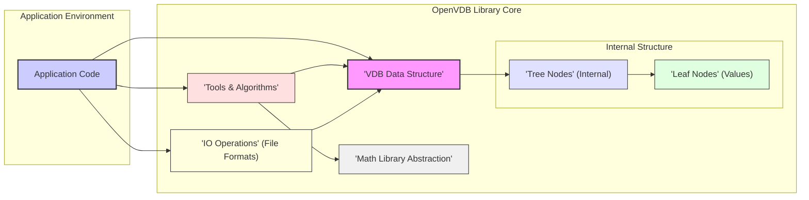
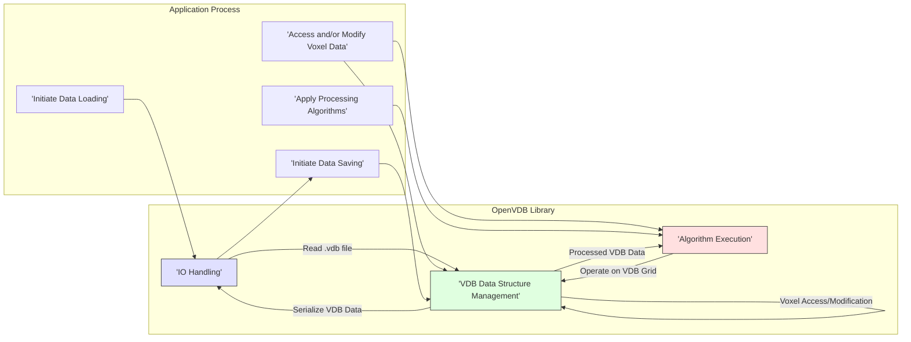

## Project Design Document: OpenVDB

**Project Link:** https://github.com/academysoftwarefoundation/openvdb

**Document Version:** 1.1
**Date:** October 26, 2023
**Author:** AI Software Architect

### 1. Introduction

This document provides an enhanced design overview of the OpenVDB library, a foundational open-source C++ library originating from DreamWorks Animation. OpenVDB is specifically engineered for the efficient storage, manipulation, and rendering of sparse volumetric data. Its widespread adoption spans across diverse fields including visual effects (VFX), animation production, scientific simulations, and data analysis. This document aims to deliver a more in-depth understanding of OpenVDB's architectural design, its constituent components, and the flow of data within the library. This detailed overview is crucial for effective threat modeling, security assessments, and informed development practices.

### 2. Goals and Objectives

The primary goals of this document are to:

*   Present a detailed and unambiguous description of the OpenVDB system architecture, highlighting key interactions.
*   Thoroughly identify the core components of the library, delineating their specific functionalities and responsibilities.
*   Clearly outline the pathways and transformations of data as it flows through the OpenVDB system.
*   Establish a robust foundation for conducting comprehensive threat modeling and security analysis of systems incorporating OpenVDB.
*   Serve as a valuable resource for new developers, security analysts, and architects seeking a comprehensive understanding of OpenVDB's internal workings.

### 3. Target Audience

This document is primarily intended for:

*   Security engineers and analysts tasked with performing threat modeling and vulnerability assessments on systems that utilize the OpenVDB library.
*   Software developers actively working with, extending, or integrating the OpenVDB library into other software projects.
*   Cloud architects responsible for designing and deploying cloud-based solutions that incorporate OpenVDB for data processing or rendering.
*   Technical personnel seeking a profound understanding of the OpenVDB architecture, its design principles, and internal mechanisms.

### 4. System Architecture

OpenVDB is fundamentally a high-performance C++ library, meticulously designed for both speed and adaptability in handling volumetric data. Its architecture is centered around a hierarchical, tree-based data structure optimized for representing sparse volumes efficiently.

#### 4.1 High-Level Architecture

*   **Application Code:** Represents the external software or system that integrates and utilizes the OpenVDB library for its specific needs.
*   **OpenVDB Library Core:** The central part of the system, encapsulating all the core functionalities for managing and processing volumetric data.
    *   **VDB Data Structure:** The fundamental data structure for representing sparse volumetric data, organized as a hierarchical tree.
        *   **Tree Nodes (Internal):**  Intermediate nodes within the VDB tree structure responsible for managing the hierarchy and efficiently directing access to leaf nodes.
        *   **Leaf Nodes (Values):** The terminal nodes of the VDB tree, directly storing the actual volumetric data values (voxels).
    *   **Tools & Algorithms:** A comprehensive suite of functions and algorithms for manipulating, analyzing, and processing VDB grids.
    *   **IO Operations (File Formats):**  Handles the reading and writing of VDB data to and from persistent storage, supporting various file formats.
    *   **Math Library Abstraction:** Provides an abstraction layer over underlying mathematical functions, potentially using optimized external libraries.

#### 4.2 Component Breakdown

*   **VDB Data Structure:**
    *   A core component representing volumetric data in a hierarchical tree structure.
    *   Designed for optimal storage and retrieval of sparse data, minimizing memory footprint.
    *   Composed of internal nodes that manage the tree structure and leaf nodes that hold the actual voxel data.
    *   Supports various data types for voxel values, including floats, doubles, and custom types.
    *   Provides efficient iterators for traversing the grid and accessing voxel data.
    *   Key functionalities include:
        *   Insertion and removal of voxel data.
        *   Efficient random access to voxel values.
        *   Support for different tree topologies and node configurations.
*   **Tree Nodes (Internal):**
    *   Form the non-leaf levels of the VDB tree, organizing the hierarchy.
    *   Contain pointers or references to child nodes, guiding the search for specific voxels.
    *   Play a crucial role in the efficient traversal and manipulation of the VDB.
    *   Contribute to the sparse representation by only allocating nodes where data exists.
*   **Leaf Nodes (Values):**
    *   Reside at the bottom level of the VDB tree, directly storing the voxel data.
    *   Employ various storage strategies for efficiency, such as dense arrays or tile-based storage.
    *   Can be templated to hold different data types for the voxel values.
*   **Tools & Algorithms:**
    *   Offers a rich set of algorithms for processing and analyzing VDB grids.
    *   Examples include:
        *   **Filtering:** Applying operations like Gaussian blur, Laplacian smoothing, and median filters to the volumetric data.
        *   **Level Set Operations:**  Extracting isosurfaces, computing signed distance fields, and performing morphological operations.
        *   **Boolean Operations:** Combining multiple VDB grids using operations like union, intersection, and difference.
        *   **Sampling and Interpolation:**  Retrieving voxel values at arbitrary locations using various interpolation techniques (e.g., linear, trilinear).
        *   **Point-to-Grid Conversion:**  Creating VDB grids from point cloud data.
        *   **Grid Analysis:**  Calculating properties like gradients, curvature, and divergence.
*   **IO Operations (File Formats):**
    *   Manages the persistence of VDB data by reading from and writing to files.
    *   Primarily supports the native `.vdb` file format, which is optimized for storing VDB data.
    *   May offer support for other volumetric data formats through plugins or conversion tools.
    *   Involves serialization and deserialization of the VDB data structure, including tree topology and voxel values.
    *   Often incorporates compression techniques (e.g., Blosc, ZLIB) to reduce file size.
*   **Math Library Abstraction:**
    *   Provides a consistent interface for mathematical operations used throughout the library.
    *   Allows for the use of different underlying math libraries (e.g., the library's internal math functions or external libraries like Eigen) without requiring changes to the core OpenVDB code.
    *   Ensures portability and potential performance optimization by leveraging specialized math libraries.

#### 4.3 Data Flow

The typical data flow within an application utilizing OpenVDB can be broken down into the following stages:

*   **Initiate Data Loading:** The application starts the process of loading volumetric data, typically from a `.vdb` file.
*   **IO Handling:** The OpenVDB library's IO component takes over, reading the data from the specified file, potentially decompressing it.
*   **VDB Data Structure Management:** The loaded data is parsed and populated into the internal VDB data structure, reconstructing the tree hierarchy and voxel values.
*   **Access and/or Modify Voxel Data:** The application can directly interact with the VDB data structure to read or modify individual voxel values based on its needs.
*   **Apply Processing Algorithms:** The application can invoke various algorithms provided by OpenVDB to process the volumetric data (e.g., filtering, level set extraction).
*   **Algorithm Execution:** The selected algorithm operates on the VDB data structure, performing the requested transformations or analysis.
*   **Initiate Data Saving:** When required, the application initiates the process of saving the modified or newly created VDB data.
*   **IO Handling:** The IO component serializes the VDB data structure back into a file format (typically `.vdb`), potentially applying compression.

#### 4.4 External Dependencies

OpenVDB relies on a set of external libraries and tools to provide its full functionality and build environment:

*   **C++ Compiler (e.g., GCC, Clang, MSVC):** Essential for compiling the C++ source code of the OpenVDB library into executable code.
*   **CMake:** A cross-platform build system generator used to manage the build process, dependencies, and platform-specific configurations.
*   **TBB (Threading Building Blocks):**  Provides a high-level abstraction for parallel programming, enabling efficient utilization of multi-core processors for performance-critical operations within OpenVDB.
*   **Boost Libraries:** A collection of peer-reviewed, portable C++ source libraries providing a wide range of utilities, including smart pointers, data structures, and algorithms that enhance OpenVDB's functionality.
*   **Blosc (Optional):** A high-performance compressor optimized for binary data, allowing for significant reduction in the size of VDB files, especially beneficial for large datasets.
*   **ZLIB:** A widely used lossless data compression library, often used as an alternative or complementary compression method to Blosc for VDB files.
*   **Half:** Provides support for half-precision (16-bit) floating-point numbers, which can be used to reduce memory usage and improve performance in certain applications.
*   **Doxygen:** A documentation generator used to create API documentation from the source code, aiding developers in understanding and using the OpenVDB library.

### 5. Security Considerations (Initial)

This section outlines initial security considerations relevant to the OpenVDB library. These points will serve as a starting point for a more in-depth threat modeling exercise.

*   **VDB File Parsing Vulnerabilities:**  Improper or insufficient validation of data read from VDB files could lead to vulnerabilities such as buffer overflows, integer overflows, or format string bugs. Maliciously crafted VDB files could exploit weaknesses in the parsing logic to execute arbitrary code or cause denial-of-service.
*   **Memory Management Errors:** As a C++ library, OpenVDB is susceptible to common memory management issues if not handled meticulously. These include buffer overflows, use-after-free errors, and memory leaks, which could be exploited by attackers.
*   **Serialization and Deserialization Risks:**  Vulnerabilities within the serialization and deserialization logic could allow for the injection of malicious data or code during the process of reading VDB files. This could potentially lead to remote code execution if a vulnerable application processes an untrusted VDB file.
*   **Third-Party Library Vulnerabilities:** Security vulnerabilities present in the external dependencies (e.g., TBB, Boost, ZLIB, Blosc) could indirectly impact the security of OpenVDB. Keeping these dependencies updated is crucial.
*   **Integer Overflow in Grid Operations:** Operations involving large grids or specific data types might be susceptible to integer overflows, leading to unexpected behavior or potential security exploits.
*   **Concurrency and Parallelism Issues:**  Bugs in the parallel processing components (utilizing TBB) could introduce race conditions or other concurrency-related vulnerabilities, potentially leading to data corruption or denial-of-service.
*   **Lack of Input Sanitization in Algorithms:** If algorithms operating on VDB data do not properly sanitize or validate input parameters, they could be vulnerable to attacks that exploit unexpected or malicious input.

### 6. Deployment Model

OpenVDB is primarily deployed as a software library that is integrated into other applications. Common deployment scenarios include:

*   **Integrated into Desktop VFX and Animation Software:**  Widely used within commercial and open-source applications for visual effects, animation, and 3D modeling, providing core volumetric data handling capabilities.
*   **Cloud-Based Rendering and Simulation Services:** Deployed within cloud environments to power rendering pipelines, scientific simulations, and data processing services that require efficient handling of large volumetric datasets.
*   **High-Performance Computing (HPC) Environments:** Utilized in HPC clusters for large-scale scientific simulations, data analysis, and visualization tasks involving volumetric data.
*   **Game Development Engines:** Integrated into game engines to handle effects like smoke, fire, and clouds, leveraging its efficient sparse data representation.
*   **Scientific Visualization Tools:** Used in applications for visualizing scientific data, such as medical imaging, fluid dynamics simulations, and geological surveys.

### 7. Technologies Used

*   **Primary Programming Language:** C++
*   **Build System:** CMake
*   **Parallel Processing Library:** TBB (Threading Building Blocks)
*   **Core Utility Libraries:** Boost Libraries
*   **Optional Compression Libraries:** Blosc, ZLIB
*   **Floating-Point Support:** Half
*   **Documentation Tool:** Doxygen

### 8. Future Considerations

Potential future developments for OpenVDB that could have implications for its design and security include:

*   **Enhanced Support for New Volumetric Data Formats:** Expanding the library's ability to read and write a wider range of volumetric data formats used in different industries.
*   **Deeper Integration with GPU Computing:** Further leveraging the power of GPUs for accelerating computationally intensive operations through technologies like CUDA or OpenCL.
*   **Improved Cloud Integration and Scalability:** Developing features that facilitate easier deployment and scaling of OpenVDB-based applications in cloud environments.
*   **Formal Security Audits and Penetration Testing:** Conducting regular security assessments by external experts to proactively identify and address potential vulnerabilities.
*   **Standardized Security Best Practices Documentation:** Creating and maintaining comprehensive documentation outlining secure coding practices and guidelines for developers working with OpenVDB.

### 9. Glossary

*   **VDB (Volumetric Data Block):** The fundamental data structure in OpenVDB, a hierarchical tree optimized for storing sparse volumetric data.
*   **Voxel:** A volumetric pixel, representing a single point in 3D space with an associated data value (e.g., density, temperature).
*   **Sparse Data:** Data where a significant portion of the values are zero or a default value, allowing for efficient storage by only representing the non-zero values.
*   **Level Set:** A method of representing surfaces implicitly as the zero level set of a scalar function defined over a volumetric domain.
*   **Isosurface:** A surface of constant value within a volumetric dataset, often extracted from a level set representation.
*   **Serialization:** The process of converting a data structure or object into a format that can be stored or transmitted.
*   **Deserialization:** The reverse process of reconstructing a data structure or object from its serialized representation.
